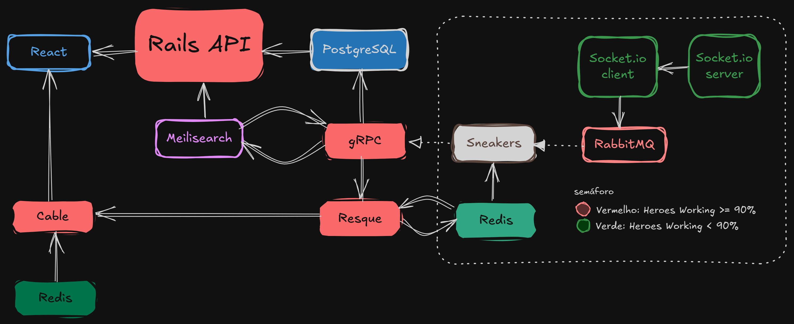

# Simulador de batalhas

## [Leia o enunciado](https://zrp.github.io/challenges/dev/)

`Docker` `Git` `Visual Studio Code`

[`Rails`](http://localhost:3000/rails/info/routes) [`Resque`](http://localhost:3000/jobs) `Sneakers` `gRPC`

[`React`](http://localhost:5600) [`MeiliSearch`](http://localhost:7700) `Socket.io`

`Redis` [`Rabbitmq`](http://localhost:15672) `PostgreSQL` [`Swagger`](http://localhost:3000/api-docs)
##
### pelo prompt :zap:

1. Faça o clone do repositório e dentro da raiz do projeto rode

    `bin/build`
2. Acesse o shell do container `zrp.api` e rode

    `run`
##
### pelo vscode :rocket:

1. Rode o comando no Visual Code e dê ___Enter___.
    - `> Dev Containers: Clone Repository in Container Volume...`
2. Informe o _URL_ do repositório e dê ___Enter___
    - `https://github.com/leandrolasnor/zrp`
3. :hourglass_flowing_sand: Aguarde o ambiente ser construído

4. Abra o terminal integrado e rode

    `run`
