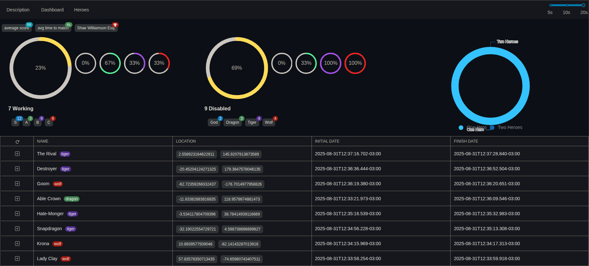

This file is a merged representation of the entire codebase, combined into a single document by Repomix.

# File Summary

## Purpose
This file contains a packed representation of the entire repository's contents.
It is designed to be easily consumable by AI systems for analysis, code review,
or other automated processes.

## File Format
The content is organized as follows:
1. This summary section
2. Repository information
3. Directory structure
4. Repository files (if enabled)
5. Multiple file entries, each consisting of:
  a. A header with the file path (## File: path/to/file)
  b. The full contents of the file in a code block

## Usage Guidelines
- This file should be treated as read-only. Any changes should be made to the
  original repository files, not this packed version.
- When processing this file, use the file path to distinguish
  between different files in the repository.
- Be aware that this file may contain sensitive information. Handle it with
  the same level of security as you would the original repository.

## Notes
- Some files may have been excluded based on .gitignore rules and Repomix's configuration
- Binary files are not included in this packed representation. Please refer to the Repository Structure section for a complete list of file paths, including binary files
- Files matching patterns in .gitignore are excluded
- Files matching default ignore patterns are excluded
- Files are sorted by Git change count (files with more changes are at the bottom)

# Directory Structure
```
.devcontainer/
  .env
  .p10k.zsh
  boot
  devcontainer.json
  docker-compose.yml
  Dockerfile
  prometheus.yml
  start
app/
  channels/
    application_cable/
      channel.rb
      connection.rb
    notification_channel.rb
  controllers/
    concerns/
      .keep
    api_controller.rb
    application_controller.rb
    base_controller.rb
    heroes_controller.rb
    threats_controller.rb
  events/
    UN/
      alert_received.rb
    hero_removed_from_index.rb
    insufficient_resource.rb
    resource_allocated.rb
    resource_deallocated.rb
    resource_not_allocated.rb
  gruf/
    alert_receives_controller.rb
  jobs/
    allocate_resource/
      job.rb
    dashboard/
      widgets/
        average_score/
          job.rb
        average_time_to_match/
          job.rb
        battles_lineup/
          job.rb
        heroes_distribution/
          job.rb
        heroes_working/
          job.rb
        super_hero/
          job.rb
        threats_disabled/
          job.rb
        threats_distribution/
          job.rb
    deallocate_resource/
      job.rb
    remove_from_index/
      job.rb
    application_job.rb
  mailers/
    application_mailer.rb
  models/
    concerns/
      enums/
        hero/
          aasm.rb
          rank.rb
          status.rb
        threat/
          aasm.rb
          rank.rb
          status.rb
      indexes/
        battle/
          meilisearch.rb
        hero/
          meilisearch.rb
        threat/
          meilisearch.rb
      scopes/
        battle/
          fresh.rb
        hero/
          allocatable.rb
        threat/
          fresh.rb
      .keep
    application_record.rb
  services/
    http/
      create_hero/
        listener.rb
        serializer.rb
        service.rb
      dashboard/
        service.rb
      destroy_hero/
        contract.rb
        listener.rb
        serializer.rb
        service.rb
      edit_hero/
        listener.rb
        serializer.rb
        service.rb
      search_heroes/
        contract.rb
        service.rb
      show_hero/
        serializer.rb
        service.rb
      threats_history/
        contract.rb
        serializer.rb
        service.rb
      application_service.rb
    rpc/
      alert_receives/
        UN/
          service.rb
      application_service.rb
  use_cases/
    alert_receives/
      un/
        model/
          threat.rb
        container.rb
        contract.rb
        transaction.rb
    allocate_resource/
      domain_service/
        calculator/
          battle.rb
      model/
        battle.rb
        hero.rb
        threat.rb
      container.rb
      transaction.rb
    create/
      hero/
        models/
          hero.rb
        container.rb
        contract.rb
      transaction.rb
    dashboard/
      model/
        battle.rb
        hero.rb
        threat.rb
      widgets/
        average_score/
          monad.rb
        average_time_to_match/
          monad.rb
        battles_lineup/
          monad.rb
        heroes_distribution/
          monad.rb
        heroes_working/
          monad.rb
        super_hero/
          monad.rb
        threats_disabled/
          monad.rb
        threats_distribution/
          monad.rb
      monad.rb
    deallocate_resource/
      model/
        battle.rb
        hero.rb
        threat.rb
      monad.rb
    delete/
      hero/
        models/
          hero.rb
        container.rb
      transaction.rb
    read/
      hero/
        model/
          hero.rb
      monad.rb
    remove_from_index/
      monad.rb
    search_heroes/
      model/
        hero.rb
      monad.rb
    threats_history/
      model/
        battle.rb
        hero.rb
        threat.rb
      monad.rb
    update/
      hero/
        models/
          hero.rb
        container.rb
        contract.rb
      transaction.rb
  views/
    layouts/
      mailer.html.erb
      mailer.text.erb
bin/
  bundle
  gruf
  ihero
  overmind
  parallel_cucumber
  parallel_rspec
  parallel_spinach
  parallel_test
  puma
  pumactl
  rails
  rails-mcp-server
  rails-mcp-server-download-resources
  rails-mcp-setup-claude
  rake
  rspec
  ruby-lsp
  ruby-lsp-check
  ruby-lsp-launcher
  ruby-lsp-test-exec
  sneakers
cable/
  config.ru
config/
  environments/
    development.rb
    production.rb
    test.rb
  initializers/
    active_job_uniqueness.rb
    clear_tests_log.rb
    console.rb
    cors.rb
    dry_events.rb
    dry_types.rb
    dry_validation.rb
    filter_parameter_logging.rb
    finisher.rb
    geocoder.rb
    gruf.rb
    inflections.rb
    meilisearch.rb
    prometheus.rb
    rails_event_store.rb
    redis.rb
    resque.rb
    rswag_api.rb
    rswag_ui.rb
  locales/
    en.yml
  application.rb
  boot.rb
  cable.yml
  database.yml
  environment.rb
  puma.rb
  routes.rb
  storage.yml
db/
  initdb/
    01_create_test_db.sql
  migrate/
    20230922200336_create_heroes.rb
    20230922201358_create_threats.rb
    20230927110750_create_battle.rb
    20231002064944_add_deleted_at_to_heroes.rb
    20250913005548_create_event_store_events.rb
    20251025152201_add_lock_version.rb
  schema.rb
  seeds.rb
lib/
  rpc/
    UN/
      service.rb
  tasks/
    .keep
    kill_pg_connections.rake
    metric.rake
    rabbitmq.rake
    redis.rake
    resque.rake
    setup.rake
  rpc.rb
log/
  .keep
public/
  robots.txt
rails-mcp/
  projects.yml
react/
  public/
    favicon.ico
    index.html
    logo192.png
    logo512.png
    manifest.json
    robots.txt
  src/
    __tests__/
      App.test.js
      handle_errors.test.js
    dashboard/
      actions.js
      average_score.js
      average_time_to_match.js
      battles_charts.js
      component.js
      heroes_distribution.js
      heroes_working.js
      historical_threats.js
      reducer.js
      super_hero.js
      threats_disabled.js
      threats_distribution.js
    heroes/
      __tests__/
        actions.test.js
        Filter.test.js
        Paginate.test.js
        reducer.test.js
        Searcher.test.js
      actions.js
      component.js
      filter.js
      hero_form.js
      list.js
      paginate.js
      reducer.js
      searcher.js
    navbar/
      component.js
      insurgency_slider.js
    App.js
    handle_errors.js
    index.css
    index.js
    logo.svg
    reducers.js
    reportWebVitals.js
    routes.js
    setupTests.js
    ws_action_types.js
  .env.development
  package.json
  README.md
sneakers/
  .env
  config.rb
  processor.rb
socket.io/
  client/
    .env
    index.js
    package.json
  server/
    .env
    index.js
    package.json
spec/
  channels/
    application_cable/
      connection_spec.rb
    notification_channel_spec.rb
  factories/
    models/
      battle.rb
      hero.rb
      threat.rb
    battle.rb
    hero.rb
    threat.rb
  jobs/
    allocate_resource/
      job_spec.rb
  requests/
    heroes_controller_spec.rb
    threats_controller_spec.rb
  rpc/
    alert_receives_controller_spec.rb
  services/
    rpc/
      alert_receives/
        un/
          service_spec.rb
  sneakers/
    processor_spec.rb
  support/
    factory_bot/
      factory_bot_helper.rb
    json/
      helper.rb
  use_cases/
    alert_receives/
      un/
        model/
          threat_spec.rb
        transaction_spec.rb
    allocate_resource/
      domain_service/
        calculator/
          battle_spec.rb
      model/
        battle_spec.rb
        hero_spec.rb
        threat_spec.rb
      container_spec.rb
    create/
      hero/
        models/
          hero_spec.rb
        container_spec.rb
    deallocate_resource/
      model/
        battle_spec.rb
        hero_spec.rb
        threat_spec.rb
      monad_spec.rb
    delete/
      hero/
        models/
          hero_spec.rb
        container_spec.rb
    remove_from_index/
      monad_spec.rb
    search_heroes/
      model/
        hero_spec.rb
      monad_spec.rb
    threats_history/
      model/
        battle_spec.rb
        hero_spec.rb
        threat_spec.rb
      monad_spec.rb
    update/
      hero/
        models/
          hero_spec.rb
        container_spec.rb
  rails_helper.rb
  spec_helper.rb
  swagger_helper.rb
storage/
  .keep
swagger/
  v1/
    swagger.yaml
.editorconfig
.gitattributes
.gitignore
.rspec
.rubocop.yml
.ruby-version
.yarnrc.yml
config.ru
Gemfile
LICENSE
Makefile
package.json
print-screen.png
Procfile
Rakefile
README.md
TODO.md
```

# Files

## File: .devcontainer/.p10k.zsh
````zsh
# Generated by Powerlevel10k configuration wizard on 2024-02-07 at 18:12 UTC.
# Based on romkatv/powerlevel10k/config/p10k-rainbow.zsh, checksum 04117.
# Wizard options: nerdfont-complete + powerline, small icons, rainbow, unicode,
# 24h time, round separators, round heads, round tails, 2 lines, disconnected, no frame,
# sparse, few icons, fluent, transient_prompt, instant_prompt=verbose.
# Type `p10k configure` to generate another config.
#
# Config for Powerlevel10k with powerline prompt style with colorful background.
# Type `p10k configure` to generate your own config based on it.
#
# Tip: Looking for a nice color? Here's a one-liner to print colormap.
#
#   for i in {0..255}; do print -Pn "%K{$i}  %k%F{$i}${(l:3::0:)i}%f " ${${(M)$((i%6)):#3}:+$'\n'}; done

# Temporarily change options.
'builtin' 'local' '-a' 'p10k_config_opts'
[[ ! -o 'aliases'         ]] || p10k_config_opts+=('aliases')
[[ ! -o 'sh_glob'         ]] || p10k_config_opts+=('sh_glob')
[[ ! -o 'no_brace_expand' ]] || p10k_config_opts+=('no_brace_expand')
'builtin' 'setopt' 'no_aliases' 'no_sh_glob' 'brace_expand'

() {
  emulate -L zsh -o extended_glob

  # Unset all configuration options. This allows you to apply configuration changes without
  # restarting zsh. Edit ~/.p10k.zsh and type `source ~/.p10k.zsh`.
  unset -m '(POWERLEVEL9K_*|DEFAULT_USER)~POWERLEVEL9K_GITSTATUS_DIR'

  # Zsh >= 5.1 is required.
  [[ $ZSH_VERSION == (5.<1->*|<6->.*) ]] || return

  # The list of segments shown on the left. Fill it with the most important segments.
  typeset -g POWERLEVEL9K_LEFT_PROMPT_ELEMENTS=(
    # =========================[ Line #1 ]=========================
    # os_icon               # os identifier
    dir                     # current directory
    vcs                     # git status
    # =========================[ Line #2 ]=========================
    newline                 # \n
    prompt_char             # prompt symbol
  )

  # The list of segments shown on the right. Fill it with less important segments.
  # Right prompt on the last prompt line (where you are typing your commands) gets
  # automatically hidden when the input line reaches it. Right prompt above the
  # last prompt line gets hidden if it would overlap with left prompt.
  typeset -g POWERLEVEL9K_RIGHT_PROMPT_ELEMENTS=(
    # =========================[ Line #1 ]=========================
    status                  # exit code of the last command
    command_execution_time  # duration of the last command
    background_jobs         # presence of background jobs
    direnv                  # direnv status (https://direnv.net/)
    asdf                    # asdf version manager (https://github.com/asdf-vm/asdf)
    virtualenv              # python virtual environment (https://docs.python.org/3/library/venv.html)
    anaconda                # conda environment (https://conda.io/)
    pyenv                   # python environment (https://github.com/pyenv/pyenv)
    goenv                   # go environment (https://github.com/syndbg/goenv)
    nodenv                  # node.js version from nodenv (https://github.com/nodenv/nodenv)
    nvm                     # node.js version from nvm (https://github.com/nvm-sh/nvm)
    nodeenv                 # node.js environment (https://github.com/ekalinin/nodeenv)
    # node_version          # node.js version
    # go_version            # go version (https://golang.org)
    # rust_version          # rustc version (https://www.rust-lang.org)
    # dotnet_version        # .NET version (https://dotnet.microsoft.com)
    # php_version           # php version (https://www.php.net/)
    # laravel_version       # laravel php framework version (https://laravel.com/)
    # java_version          # java version (https://www.java.com/)
    # package               # name@version from package.json (https://docs.npmjs.com/files/package.json)
    rbenv                   # ruby version from rbenv (https://github.com/rbenv/rbenv)
    rvm                     # ruby version from rvm (https://rvm.io)
    fvm                     # flutter version management (https://github.com/leoafarias/fvm)
    luaenv                  # lua version from luaenv (https://github.com/cehoffman/luaenv)
    jenv                    # java version from jenv (https://github.com/jenv/jenv)
    plenv                   # perl version from plenv (https://github.com/tokuhirom/plenv)
    perlbrew                # perl version from perlbrew (https://github.com/gugod/App-perlbrew)
    phpenv                  # php version from phpenv (https://github.com/phpenv/phpenv)
    scalaenv                # scala version from scalaenv (https://github.com/scalaenv/scalaenv)
    haskell_stack           # haskell version from stack (https://haskellstack.org/)
    kubecontext             # current kubernetes context (https://kubernetes.io/)
    terraform               # terraform workspace (https://www.terraform.io)
    # terraform_version     # terraform version (https://www.terraform.io)
    aws                     # aws profile (https://docs.aws.amazon.com/cli/latest/userguide/cli-configure-profiles.html)
    aws_eb_env              # aws elastic beanstalk environment (https://aws.amazon.com/elasticbeanstalk/)
    azure                   # azure account name (https://docs.microsoft.com/en-us/cli/azure)
    gcloud                  # google cloud cli account and project (https://cloud.google.com/)
    google_app_cred         # google application credentials (https://cloud.google.com/docs/authentication/production)
    toolbox                 # toolbox name (https://github.com/containers/toolbox)
    context                 # user@hostname
    nordvpn                 # nordvpn connection status, linux only (https://nordvpn.com/)
    ranger                  # ranger shell (https://github.com/ranger/ranger)
    nnn                     # nnn shell (https://github.com/jarun/nnn)
    lf                      # lf shell (https://github.com/gokcehan/lf)
    xplr                    # xplr shell (https://github.com/sayanarijit/xplr)
    vim_shell               # vim shell indicator (:sh)
    midnight_commander      # midnight commander shell (https://midnight-commander.org/)
    nix_shell               # nix shell (https://nixos.org/nixos/nix-pills/developing-with-nix-shell.html)
    chezmoi_shell           # chezmoi shell (https://www.chezmoi.io/)
    # vi_mode               # vi mode (you don't need this if you've enabled prompt_char)
    # vpn_ip                # virtual private network indicator
    # load                  # CPU load
    # disk_usage            # disk usage
    # ram                   # free RAM
    # swap                  # used swap
    todo                    # todo items (https://github.com/todotxt/todo.txt-cli)
    timewarrior             # timewarrior tracking status (https://timewarrior.net/)
    taskwarrior             # taskwarrior task count (https://taskwarrior.org/)
    per_directory_history   # Oh My Zsh per-directory-history local/global indicator
    # cpu_arch              # CPU architecture
    time                    # current time
    # =========================[ Line #2 ]=========================
    newline
    # ip                    # ip address and bandwidth usage for a specified network interface
    # public_ip             # public IP address
    # proxy                 # system-wide http/https/ftp proxy
    # battery               # internal battery
    # wifi                  # wifi speed
    # example               # example user-defined segment (see prompt_example function below)
  )

  # Defines character set used by powerlevel10k. It's best to let `p10k configure` set it for you.
  typeset -g POWERLEVEL9K_MODE=nerdfont-complete
  # When set to `moderate`, some icons will have an extra space after them. This is meant to avoid
  # icon overlap when using non-monospace fonts. When set to `none`, spaces are not added.
  typeset -g POWERLEVEL9K_ICON_PADDING=none

  # When set to true, icons appear before content on both sides of the prompt. When set
  # to false, icons go after content. If empty or not set, icons go before content in the left
  # prompt and after content in the right prompt.
  #
  # You can also override it for a specific segment:
  #
  #   POWERLEVEL9K_STATUS_ICON_BEFORE_CONTENT=false
  #
  # Or for a specific segment in specific state:
  #
  #   POWERLEVEL9K_DIR_NOT_WRITABLE_ICON_BEFORE_CONTENT=false
  typeset -g POWERLEVEL9K_ICON_BEFORE_CONTENT=

  # Add an empty line before each prompt.
  typeset -g POWERLEVEL9K_PROMPT_ADD_NEWLINE=true

  # Connect left prompt lines with these symbols. You'll probably want to use the same color
  # as POWERLEVEL9K_MULTILINE_FIRST_PROMPT_GAP_FOREGROUND below.
  typeset -g POWERLEVEL9K_MULTILINE_FIRST_PROMPT_PREFIX=
  typeset -g POWERLEVEL9K_MULTILINE_NEWLINE_PROMPT_PREFIX=
  typeset -g POWERLEVEL9K_MULTILINE_LAST_PROMPT_PREFIX=
  # Connect right prompt lines with these symbols.
  typeset -g POWERLEVEL9K_MULTILINE_FIRST_PROMPT_SUFFIX=
  typeset -g POWERLEVEL9K_MULTILINE_NEWLINE_PROMPT_SUFFIX=
  typeset -g POWERLEVEL9K_MULTILINE_LAST_PROMPT_SUFFIX=

  # Filler between left and right prompt on the first prompt line. You can set it to ' ', '·' or
  # '─'. The last two make it easier to see the alignment between left and right prompt and to
  # separate prompt from command output. You might want to set POWERLEVEL9K_PROMPT_ADD_NEWLINE=false
  # for more compact prompt if using this option.
  typeset -g POWERLEVEL9K_MULTILINE_FIRST_PROMPT_GAP_CHAR=' '
  typeset -g POWERLEVEL9K_MULTILINE_FIRST_PROMPT_GAP_BACKGROUND=
  typeset -g POWERLEVEL9K_MULTILINE_NEWLINE_PROMPT_GAP_BACKGROUND=
  if [[ $POWERLEVEL9K_MULTILINE_FIRST_PROMPT_GAP_CHAR != ' ' ]]; then
    # The color of the filler. You'll probably want to match the color of POWERLEVEL9K_MULTILINE
    # ornaments defined above.
    typeset -g POWERLEVEL9K_MULTILINE_FIRST_PROMPT_GAP_FOREGROUND=242
    # Start filler from the edge of the screen if there are no left segments on the first line.
    typeset -g POWERLEVEL9K_EMPTY_LINE_LEFT_PROMPT_FIRST_SEGMENT_END_SYMBOL='%{%}'
    # End filler on the edge of the screen if there are no right segments on the first line.
    typeset -g POWERLEVEL9K_EMPTY_LINE_RIGHT_PROMPT_FIRST_SEGMENT_START_SYMBOL='%{%}'
  fi

  # Separator between same-color segments on the left.
  typeset -g POWERLEVEL9K_LEFT_SUBSEGMENT_SEPARATOR='\uE0B5'
  # Separator between same-color segments on the right.
  typeset -g POWERLEVEL9K_RIGHT_SUBSEGMENT_SEPARATOR='\uE0B7'
  # Separator between different-color segments on the left.
  typeset -g POWERLEVEL9K_LEFT_SEGMENT_SEPARATOR='\uE0B4'
  # Separator between different-color segments on the right.
  typeset -g POWERLEVEL9K_RIGHT_SEGMENT_SEPARATOR='\uE0B6'
  # To remove a separator between two segments, add "_joined" to the second segment name.
  # For example: POWERLEVEL9K_RIGHT_PROMPT_ELEMENTS=(os_icon context_joined)

  # The right end of left prompt.
  typeset -g POWERLEVEL9K_LEFT_PROMPT_LAST_SEGMENT_END_SYMBOL='\uE0B4'
  # The left end of right prompt.
  typeset -g POWERLEVEL9K_RIGHT_PROMPT_FIRST_SEGMENT_START_SYMBOL='\uE0B6'
  # The left end of left prompt.
  typeset -g POWERLEVEL9K_LEFT_PROMPT_FIRST_SEGMENT_START_SYMBOL='\uE0B6'
  # The right end of right prompt.
  typeset -g POWERLEVEL9K_RIGHT_PROMPT_LAST_SEGMENT_END_SYMBOL='\uE0B4'
  # Left prompt terminator for lines without any segments.
  typeset -g POWERLEVEL9K_EMPTY_LINE_LEFT_PROMPT_LAST_SEGMENT_END_SYMBOL=

  #################################[ os_icon: os identifier ]##################################
  # OS identifier color.
  typeset -g POWERLEVEL9K_OS_ICON_FOREGROUND=232
  typeset -g POWERLEVEL9K_OS_ICON_BACKGROUND=7
  # Custom icon.
  # typeset -g POWERLEVEL9K_OS_ICON_CONTENT_EXPANSION='⭐'

  ################################[ prompt_char: prompt symbol ]################################
  # Transparent background.
  typeset -g POWERLEVEL9K_PROMPT_CHAR_BACKGROUND=
  # Green prompt symbol if the last command succeeded.
  typeset -g POWERLEVEL9K_PROMPT_CHAR_OK_{VIINS,VICMD,VIVIS,VIOWR}_FOREGROUND=76
  # Red prompt symbol if the last command failed.
  typeset -g POWERLEVEL9K_PROMPT_CHAR_ERROR_{VIINS,VICMD,VIVIS,VIOWR}_FOREGROUND=196
  # Default prompt symbol.
  typeset -g POWERLEVEL9K_PROMPT_CHAR_{OK,ERROR}_VIINS_CONTENT_EXPANSION='❯'
  # Prompt symbol in command vi mode.
  typeset -g POWERLEVEL9K_PROMPT_CHAR_{OK,ERROR}_VICMD_CONTENT_EXPANSION='❮'
  # Prompt symbol in visual vi mode.
  typeset -g POWERLEVEL9K_PROMPT_CHAR_{OK,ERROR}_VIVIS_CONTENT_EXPANSION='V'
  # Prompt symbol in overwrite vi mode.
  typeset -g POWERLEVEL9K_PROMPT_CHAR_{OK,ERROR}_VIOWR_CONTENT_EXPANSION='▶'
  typeset -g POWERLEVEL9K_PROMPT_CHAR_OVERWRITE_STATE=true
  # No line terminator if prompt_char is the last segment.
  typeset -g POWERLEVEL9K_PROMPT_CHAR_LEFT_PROMPT_LAST_SEGMENT_END_SYMBOL=
  # No line introducer if prompt_char is the first segment.
  typeset -g POWERLEVEL9K_PROMPT_CHAR_LEFT_PROMPT_FIRST_SEGMENT_START_SYMBOL=
  # No surrounding whitespace.
  typeset -g POWERLEVEL9K_PROMPT_CHAR_LEFT_{LEFT,RIGHT}_WHITESPACE=

  ##################################[ dir: current directory ]##################################
  # Current directory background color.
  typeset -g POWERLEVEL9K_DIR_BACKGROUND=4
  # Default current directory foreground color.
  typeset -g POWERLEVEL9K_DIR_FOREGROUND=254
  # If directory is too long, shorten some of its segments to the shortest possible unique
  # prefix. The shortened directory can be tab-completed to the original.
  typeset -g POWERLEVEL9K_SHORTEN_STRATEGY=truncate_to_unique
  # Replace removed segment suffixes with this symbol.
  typeset -g POWERLEVEL9K_SHORTEN_DELIMITER=
  # Color of the shortened directory segments.
  typeset -g POWERLEVEL9K_DIR_SHORTENED_FOREGROUND=250
  # Color of the anchor directory segments. Anchor segments are never shortened. The first
  # segment is always an anchor.
  typeset -g POWERLEVEL9K_DIR_ANCHOR_FOREGROUND=255
  # Display anchor directory segments in bold.
  typeset -g POWERLEVEL9K_DIR_ANCHOR_BOLD=true
  # Don't shorten directories that contain any of these files. They are anchors.
  local anchor_files=(
    .bzr
    .citc
    .git
    .hg
    .node-version
    .python-version
    .go-version
    .ruby-version
    .lua-version
    .java-version
    .perl-version
    .php-version
    .tool-versions
    .shorten_folder_marker
    .svn
    .terraform
    CVS
    Cargo.toml
    composer.json
    go.mod
    package.json
    stack.yaml
  )
  typeset -g POWERLEVEL9K_SHORTEN_FOLDER_MARKER="(${(j:|:)anchor_files})"
  # If set to "first" ("last"), remove everything before the first (last) subdirectory that contains
  # files matching $POWERLEVEL9K_SHORTEN_FOLDER_MARKER. For example, when the current directory is
  # /foo/bar/git_repo/nested_git_repo/baz, prompt will display git_repo/nested_git_repo/baz (first)
  # or nested_git_repo/baz (last). This assumes that git_repo and nested_git_repo contain markers
  # and other directories don't.
  #
  # Optionally, "first" and "last" can be followed by ":<offset>" where <offset> is an integer.
  # This moves the truncation point to the right (positive offset) or to the left (negative offset)
  # relative to the marker. Plain "first" and "last" are equivalent to "first:0" and "last:0"
  # respectively.
  typeset -g POWERLEVEL9K_DIR_TRUNCATE_BEFORE_MARKER=false
  # Don't shorten this many last directory segments. They are anchors.
  typeset -g POWERLEVEL9K_SHORTEN_DIR_LENGTH=1
  # Shorten directory if it's longer than this even if there is space for it. The value can
  # be either absolute (e.g., '80') or a percentage of terminal width (e.g, '50%'). If empty,
  # directory will be shortened only when prompt doesn't fit or when other parameters demand it
  # (see POWERLEVEL9K_DIR_MIN_COMMAND_COLUMNS and POWERLEVEL9K_DIR_MIN_COMMAND_COLUMNS_PCT below).
  # If set to `0`, directory will always be shortened to its minimum length.
  typeset -g POWERLEVEL9K_DIR_MAX_LENGTH=80
  # When `dir` segment is on the last prompt line, try to shorten it enough to leave at least this
  # many columns for typing commands.
  typeset -g POWERLEVEL9K_DIR_MIN_COMMAND_COLUMNS=40
  # When `dir` segment is on the last prompt line, try to shorten it enough to leave at least
  # COLUMNS * POWERLEVEL9K_DIR_MIN_COMMAND_COLUMNS_PCT * 0.01 columns for typing commands.
  typeset -g POWERLEVEL9K_DIR_MIN_COMMAND_COLUMNS_PCT=50
  # If set to true, embed a hyperlink into the directory. Useful for quickly
  # opening a directory in the file manager simply by clicking the link.
  # Can also be handy when the directory is shortened, as it allows you to see
  # the full directory that was used in previous commands.
  typeset -g POWERLEVEL9K_DIR_HYPERLINK=false

  # Enable special styling for non-writable and non-existent directories. See POWERLEVEL9K_LOCK_ICON
  # and POWERLEVEL9K_DIR_CLASSES below.
  typeset -g POWERLEVEL9K_DIR_SHOW_WRITABLE=v3

  # The default icon shown next to non-writable and non-existent directories when
  # POWERLEVEL9K_DIR_SHOW_WRITABLE is set to v3.
  # typeset -g POWERLEVEL9K_LOCK_ICON='⭐'

  # POWERLEVEL9K_DIR_CLASSES allows you to specify custom icons and colors for different
  # directories. It must be an array with 3 * N elements. Each triplet consists of:
  #
  #   1. A pattern against which the current directory ($PWD) is matched. Matching is done with
  #      extended_glob option enabled.
  #   2. Directory class for the purpose of styling.
  #   3. An empty string.
  #
  # Triplets are tried in order. The first triplet whose pattern matches $PWD wins.
  #
  # If POWERLEVEL9K_DIR_SHOW_WRITABLE is set to v3, non-writable and non-existent directories
  # acquire class suffix _NOT_WRITABLE and NON_EXISTENT respectively.
  #
  # For example, given these settings:
  #
  #   typeset -g POWERLEVEL9K_DIR_CLASSES=(
  #     '~/work(|/*)'  WORK     ''
  #     '~(|/*)'       HOME     ''
  #     '*'            DEFAULT  '')
  #
  # Whenever the current directory is ~/work or a subdirectory of ~/work, it gets styled with one
  # of the following classes depending on its writability and existence: WORK, WORK_NOT_WRITABLE or
  # WORK_NON_EXISTENT.
  #
  # Simply assigning classes to directories doesn't have any visible effects. It merely gives you an
  # option to define custom colors and icons for different directory classes.
  #
  #   # Styling for WORK.
  #   typeset -g POWERLEVEL9K_DIR_WORK_VISUAL_IDENTIFIER_EXPANSION='⭐'
  #   typeset -g POWERLEVEL9K_DIR_WORK_BACKGROUND=4
  #   typeset -g POWERLEVEL9K_DIR_WORK_FOREGROUND=254
  #   typeset -g POWERLEVEL9K_DIR_WORK_SHORTENED_FOREGROUND=250
  #   typeset -g POWERLEVEL9K_DIR_WORK_ANCHOR_FOREGROUND=255
  #
  #   # Styling for WORK_NOT_WRITABLE.
  #   typeset -g POWERLEVEL9K_DIR_WORK_NOT_WRITABLE_VISUAL_IDENTIFIER_EXPANSION='⭐'
  #   typeset -g POWERLEVEL9K_DIR_WORK_NOT_WRITABLE_BACKGROUND=4
  #   typeset -g POWERLEVEL9K_DIR_WORK_NOT_WRITABLE_FOREGROUND=254
  #   typeset -g POWERLEVEL9K_DIR_WORK_NOT_WRITABLE_SHORTENED_FOREGROUND=250
  #   typeset -g POWERLEVEL9K_DIR_WORK_NOT_WRITABLE_ANCHOR_FOREGROUND=255
  #
  #   # Styling for WORK_NON_EXISTENT.
  #   typeset -g POWERLEVEL9K_DIR_WORK_NON_EXISTENT_VISUAL_IDENTIFIER_EXPANSION='⭐'
  #   typeset -g POWERLEVEL9K_DIR_WORK_NON_EXISTENT_BACKGROUND=4
  #   typeset -g POWERLEVEL9K_DIR_WORK_NON_EXISTENT_FOREGROUND=254
  #   typeset -g POWERLEVEL9K_DIR_WORK_NON_EXISTENT_SHORTENED_FOREGROUND=250
  #   typeset -g POWERLEVEL9K_DIR_WORK_NON_EXISTENT_ANCHOR_FOREGROUND=255
  #
  # If a styling parameter isn't explicitly defined for some class, it falls back to the classless
  # parameter. For example, if POWERLEVEL9K_DIR_WORK_NOT_WRITABLE_FOREGROUND is not set, it falls
  # back to POWERLEVEL9K_DIR_FOREGROUND.
  #
  typeset -g POWERLEVEL9K_DIR_CLASSES=()

  # Custom prefix.
  # typeset -g POWERLEVEL9K_DIR_PREFIX='in '

  #####################################[ vcs: git status ]######################################
  # Version control background colors.
  typeset -g POWERLEVEL9K_VCS_CLEAN_BACKGROUND=2
  typeset -g POWERLEVEL9K_VCS_MODIFIED_BACKGROUND=3
  typeset -g POWERLEVEL9K_VCS_UNTRACKED_BACKGROUND=2
  typeset -g POWERLEVEL9K_VCS_CONFLICTED_BACKGROUND=3
  typeset -g POWERLEVEL9K_VCS_LOADING_BACKGROUND=8

  # Branch icon. Set this parameter to '\UE0A0 ' for the popular Powerline branch icon.
  typeset -g POWERLEVEL9K_VCS_BRANCH_ICON=

  # Untracked files icon. It's really a question mark, your font isn't broken.
  # Change the value of this parameter to show a different icon.
  typeset -g POWERLEVEL9K_VCS_UNTRACKED_ICON='?'

  # Formatter for Git status.
  #
  # Example output: master wip ⇣42⇡42 *42 merge ~42 +42 !42 ?42.
  #
  # You can edit the function to customize how Git status looks.
  #
  # VCS_STATUS_* parameters are set by gitstatus plugin. See reference:
  # https://github.com/romkatv/gitstatus/blob/master/gitstatus.plugin.zsh.
  function my_git_formatter() {
    emulate -L zsh

    if [[ -n $P9K_CONTENT ]]; then
      # If P9K_CONTENT is not empty, use it. It's either "loading" or from vcs_info (not from
      # gitstatus plugin). VCS_STATUS_* parameters are not available in this case.
      typeset -g my_git_format=$P9K_CONTENT
      return
    fi

    # Styling for different parts of Git status.
    local       meta='%7F' # white foreground
    local      clean='%0F' # black foreground
    local   modified='%0F' # black foreground
    local  untracked='%0F' # black foreground
    local conflicted='%1F' # red foreground

    local res

    if [[ -n $VCS_STATUS_LOCAL_BRANCH ]]; then
      local branch=${(V)VCS_STATUS_LOCAL_BRANCH}
      # If local branch name is at most 32 characters long, show it in full.
      # Otherwise show the first 12 … the last 12.
      # Tip: To always show local branch name in full without truncation, delete the next line.
      (( $#branch > 32 )) && branch[13,-13]="…"  # <-- this line
      res+="${clean}${(g::)POWERLEVEL9K_VCS_BRANCH_ICON}${branch//\%/%%}"
    fi

    if [[ -n $VCS_STATUS_TAG
          # Show tag only if not on a branch.
          # Tip: To always show tag, delete the next line.
          && -z $VCS_STATUS_LOCAL_BRANCH  # <-- this line
        ]]; then
      local tag=${(V)VCS_STATUS_TAG}
      # If tag name is at most 32 characters long, show it in full.
      # Otherwise show the first 12 … the last 12.
      # Tip: To always show tag name in full without truncation, delete the next line.
      (( $#tag > 32 )) && tag[13,-13]="…"  # <-- this line
      res+="${meta}#${clean}${tag//\%/%%}"
    fi

    # Display the current Git commit if there is no branch and no tag.
    # Tip: To always display the current Git commit, delete the next line.
    [[ -z $VCS_STATUS_LOCAL_BRANCH && -z $VCS_STATUS_TAG ]] &&  # <-- this line
      res+="${meta}@${clean}${VCS_STATUS_COMMIT[1,8]}"

    # Show tracking branch name if it differs from local branch.
    if [[ -n ${VCS_STATUS_REMOTE_BRANCH:#$VCS_STATUS_LOCAL_BRANCH} ]]; then
      res+="${meta}:${clean}${(V)VCS_STATUS_REMOTE_BRANCH//\%/%%}"
    fi

    # Display "wip" if the latest commit's summary contains "wip" or "WIP".
    if [[ $VCS_STATUS_COMMIT_SUMMARY == (|*[^[:alnum:]])(wip|WIP)(|[^[:alnum:]]*) ]]; then
      res+=" ${modified}wip"
    fi

    if (( VCS_STATUS_COMMITS_AHEAD || VCS_STATUS_COMMITS_BEHIND )); then
      # ⇣42 if behind the remote.
      (( VCS_STATUS_COMMITS_BEHIND )) && res+=" ${clean}⇣${VCS_STATUS_COMMITS_BEHIND}"
      # ⇡42 if ahead of the remote; no leading space if also behind the remote: ⇣42⇡42.
      (( VCS_STATUS_COMMITS_AHEAD && !VCS_STATUS_COMMITS_BEHIND )) && res+=" "
      (( VCS_STATUS_COMMITS_AHEAD  )) && res+="${clean}⇡${VCS_STATUS_COMMITS_AHEAD}"
    elif [[ -n $VCS_STATUS_REMOTE_BRANCH ]]; then
      # Tip: Uncomment the next line to display '=' if up to date with the remote.
      # res+=" ${clean}="
    fi

    # ⇠42 if behind the push remote.
    (( VCS_STATUS_PUSH_COMMITS_BEHIND )) && res+=" ${clean}⇠${VCS_STATUS_PUSH_COMMITS_BEHIND}"
    (( VCS_STATUS_PUSH_COMMITS_AHEAD && !VCS_STATUS_PUSH_COMMITS_BEHIND )) && res+=" "
    # ⇢42 if ahead of the push remote; no leading space if also behind: ⇠42⇢42.
    (( VCS_STATUS_PUSH_COMMITS_AHEAD  )) && res+="${clean}⇢${VCS_STATUS_PUSH_COMMITS_AHEAD}"
    # *42 if have stashes.
    (( VCS_STATUS_STASHES        )) && res+=" ${clean}*${VCS_STATUS_STASHES}"
    # 'merge' if the repo is in an unusual state.
    [[ -n $VCS_STATUS_ACTION     ]] && res+=" ${conflicted}${VCS_STATUS_ACTION}"
    # ~42 if have merge conflicts.
    (( VCS_STATUS_NUM_CONFLICTED )) && res+=" ${conflicted}~${VCS_STATUS_NUM_CONFLICTED}"
    # +42 if have staged changes.
    (( VCS_STATUS_NUM_STAGED     )) && res+=" ${modified}+${VCS_STATUS_NUM_STAGED}"
    # !42 if have unstaged changes.
    (( VCS_STATUS_NUM_UNSTAGED   )) && res+=" ${modified}!${VCS_STATUS_NUM_UNSTAGED}"
    # ?42 if have untracked files. It's really a question mark, your font isn't broken.
    # See POWERLEVEL9K_VCS_UNTRACKED_ICON above if you want to use a different icon.
    # Remove the next line if you don't want to see untracked files at all.
    (( VCS_STATUS_NUM_UNTRACKED  )) && res+=" ${untracked}${(g::)POWERLEVEL9K_VCS_UNTRACKED_ICON}${VCS_STATUS_NUM_UNTRACKED}"
    # "─" if the number of unstaged files is unknown. This can happen due to
    # POWERLEVEL9K_VCS_MAX_INDEX_SIZE_DIRTY (see below) being set to a non-negative number lower
    # than the number of files in the Git index, or due to bash.showDirtyState being set to false
    # in the repository config. The number of staged and untracked files may also be unknown
    # in this case.
    (( VCS_STATUS_HAS_UNSTAGED == -1 )) && res+=" ${modified}─"

    typeset -g my_git_format=$res
  }
  functions -M my_git_formatter 2>/dev/null

  # Don't count the number of unstaged, untracked and conflicted files in Git repositories with
  # more than this many files in the index. Negative value means infinity.
  #
  # If you are working in Git repositories with tens of millions of files and seeing performance
  # sagging, try setting POWERLEVEL9K_VCS_MAX_INDEX_SIZE_DIRTY to a number lower than the output
  # of `git ls-files | wc -l`. Alternatively, add `bash.showDirtyState = false` to the repository's
  # config: `git config bash.showDirtyState false`.
  typeset -g POWERLEVEL9K_VCS_MAX_INDEX_SIZE_DIRTY=-1

  # Don't show Git status in prompt for repositories whose workdir matches this pattern.
  # For example, if set to '~', the Git repository at $HOME/.git will be ignored.
  # Multiple patterns can be combined with '|': '~(|/foo)|/bar/baz/*'.
  typeset -g POWERLEVEL9K_VCS_DISABLED_WORKDIR_PATTERN='~'

  # Disable the default Git status formatting.
  typeset -g POWERLEVEL9K_VCS_DISABLE_GITSTATUS_FORMATTING=true
  # Install our own Git status formatter.
  typeset -g POWERLEVEL9K_VCS_CONTENT_EXPANSION='${$((my_git_formatter()))+${my_git_format}}'
  # Enable counters for staged, unstaged, etc.
  typeset -g POWERLEVEL9K_VCS_{STAGED,UNSTAGED,UNTRACKED,CONFLICTED,COMMITS_AHEAD,COMMITS_BEHIND}_MAX_NUM=-1

  # Custom icon.
  typeset -g POWERLEVEL9K_VCS_VISUAL_IDENTIFIER_EXPANSION=
  # Custom prefix.
  typeset -g POWERLEVEL9K_VCS_PREFIX='on '

  # Show status of repositories of these types. You can add svn and/or hg if you are
  # using them. If you do, your prompt may become slow even when your current directory
  # isn't in an svn or hg repository.
  typeset -g POWERLEVEL9K_VCS_BACKENDS=(git)

  ##########################[ status: exit code of the last command ]###########################
  # Enable OK_PIPE, ERROR_PIPE and ERROR_SIGNAL status states to allow us to enable, disable and
  # style them independently from the regular OK and ERROR state.
  typeset -g POWERLEVEL9K_STATUS_EXTENDED_STATES=true

  # Status on success. No content, just an icon. No need to show it if prompt_char is enabled as
  # it will signify success by turning green.
  typeset -g POWERLEVEL9K_STATUS_OK=false
  typeset -g POWERLEVEL9K_STATUS_OK_VISUAL_IDENTIFIER_EXPANSION='✔'
  typeset -g POWERLEVEL9K_STATUS_OK_FOREGROUND=2
  typeset -g POWERLEVEL9K_STATUS_OK_BACKGROUND=0

  # Status when some part of a pipe command fails but the overall exit status is zero. It may look
  # like this: 1|0.
  typeset -g POWERLEVEL9K_STATUS_OK_PIPE=true
  typeset -g POWERLEVEL9K_STATUS_OK_PIPE_VISUAL_IDENTIFIER_EXPANSION='✔'
  typeset -g POWERLEVEL9K_STATUS_OK_PIPE_FOREGROUND=2
  typeset -g POWERLEVEL9K_STATUS_OK_PIPE_BACKGROUND=0

  # Status when it's just an error code (e.g., '1'). No need to show it if prompt_char is enabled as
  # it will signify error by turning red.
  typeset -g POWERLEVEL9K_STATUS_ERROR=false
  typeset -g POWERLEVEL9K_STATUS_ERROR_VISUAL_IDENTIFIER_EXPANSION='✘'
  typeset -g POWERLEVEL9K_STATUS_ERROR_FOREGROUND=3
  typeset -g POWERLEVEL9K_STATUS_ERROR_BACKGROUND=1

  # Status when the last command was terminated by a signal.
  typeset -g POWERLEVEL9K_STATUS_ERROR_SIGNAL=true
  # Use terse signal names: "INT" instead of "SIGINT(2)".
  typeset -g POWERLEVEL9K_STATUS_VERBOSE_SIGNAME=false
  typeset -g POWERLEVEL9K_STATUS_ERROR_SIGNAL_VISUAL_IDENTIFIER_EXPANSION='✘'
  typeset -g POWERLEVEL9K_STATUS_ERROR_SIGNAL_FOREGROUND=3
  typeset -g POWERLEVEL9K_STATUS_ERROR_SIGNAL_BACKGROUND=1

  # Status when some part of a pipe command fails and the overall exit status is also non-zero.
  # It may look like this: 1|0.
  typeset -g POWERLEVEL9K_STATUS_ERROR_PIPE=true
  typeset -g POWERLEVEL9K_STATUS_ERROR_PIPE_VISUAL_IDENTIFIER_EXPANSION='✘'
  typeset -g POWERLEVEL9K_STATUS_ERROR_PIPE_FOREGROUND=3
  typeset -g POWERLEVEL9K_STATUS_ERROR_PIPE_BACKGROUND=1

  ###################[ command_execution_time: duration of the last command ]###################
  # Execution time color.
  typeset -g POWERLEVEL9K_COMMAND_EXECUTION_TIME_FOREGROUND=0
  typeset -g POWERLEVEL9K_COMMAND_EXECUTION_TIME_BACKGROUND=3
  # Show duration of the last command if takes at least this many seconds.
  typeset -g POWERLEVEL9K_COMMAND_EXECUTION_TIME_THRESHOLD=3
  # Show this many fractional digits. Zero means round to seconds.
  typeset -g POWERLEVEL9K_COMMAND_EXECUTION_TIME_PRECISION=0
  # Duration format: 1d 2h 3m 4s.
  typeset -g POWERLEVEL9K_COMMAND_EXECUTION_TIME_FORMAT='d h m s'
  # Custom icon.
  typeset -g POWERLEVEL9K_COMMAND_EXECUTION_TIME_VISUAL_IDENTIFIER_EXPANSION=
  # Custom prefix.
  typeset -g POWERLEVEL9K_COMMAND_EXECUTION_TIME_PREFIX='took '

  #######################[ background_jobs: presence of background jobs ]#######################
  # Background jobs color.
  typeset -g POWERLEVEL9K_BACKGROUND_JOBS_FOREGROUND=6
  typeset -g POWERLEVEL9K_BACKGROUND_JOBS_BACKGROUND=0
  # Don't show the number of background jobs.
  typeset -g POWERLEVEL9K_BACKGROUND_JOBS_VERBOSE=false
  # Custom icon.
  # typeset -g POWERLEVEL9K_BACKGROUND_JOBS_VISUAL_IDENTIFIER_EXPANSION='⭐'

  #######################[ direnv: direnv status (https://direnv.net/) ]########################
  # Direnv color.
  typeset -g POWERLEVEL9K_DIRENV_FOREGROUND=3
  typeset -g POWERLEVEL9K_DIRENV_BACKGROUND=0
  # Custom icon.
  # typeset -g POWERLEVEL9K_DIRENV_VISUAL_IDENTIFIER_EXPANSION='⭐'

  ###############[ asdf: asdf version manager (https://github.com/asdf-vm/asdf) ]###############
  # Default asdf color. Only used to display tools for which there is no color override (see below).
  # Tip:  Override these parameters for ${TOOL} with POWERLEVEL9K_ASDF_${TOOL}_FOREGROUND and
  # POWERLEVEL9K_ASDF_${TOOL}_BACKGROUND.
  typeset -g POWERLEVEL9K_ASDF_FOREGROUND=0
  typeset -g POWERLEVEL9K_ASDF_BACKGROUND=7

  # There are four parameters that can be used to hide asdf tools. Each parameter describes
  # conditions under which a tool gets hidden. Parameters can hide tools but not unhide them. If at
  # least one parameter decides to hide a tool, that tool gets hidden. If no parameter decides to
  # hide a tool, it gets shown.
  #
  # Special note on the difference between POWERLEVEL9K_ASDF_SOURCES and
  # POWERLEVEL9K_ASDF_PROMPT_ALWAYS_SHOW. Consider the effect of the following commands:
  #
  #   asdf local  python 3.8.1
  #   asdf global python 3.8.1
  #
  # After running both commands the current python version is 3.8.1 and its source is "local" as
  # it takes precedence over "global". If POWERLEVEL9K_ASDF_PROMPT_ALWAYS_SHOW is set to false,
  # it'll hide python version in this case because 3.8.1 is the same as the global version.
  # POWERLEVEL9K_ASDF_SOURCES will hide python version only if the value of this parameter doesn't
  # contain "local".

  # Hide tool versions that don't come from one of these sources.
  #
  # Available sources:
  #
  # - shell   `asdf current` says "set by ASDF_${TOOL}_VERSION environment variable"
  # - local   `asdf current` says "set by /some/not/home/directory/file"
  # - global  `asdf current` says "set by /home/username/file"
  #
  # Note: If this parameter is set to (shell local global), it won't hide tools.
  # Tip:  Override this parameter for ${TOOL} with POWERLEVEL9K_ASDF_${TOOL}_SOURCES.
  typeset -g POWERLEVEL9K_ASDF_SOURCES=(shell local global)

  # If set to false, hide tool versions that are the same as global.
  #
  # Note: The name of this parameter doesn't reflect its meaning at all.
  # Note: If this parameter is set to true, it won't hide tools.
  # Tip:  Override this parameter for ${TOOL} with POWERLEVEL9K_ASDF_${TOOL}_PROMPT_ALWAYS_SHOW.
  typeset -g POWERLEVEL9K_ASDF_PROMPT_ALWAYS_SHOW=false

  # If set to false, hide tool versions that are equal to "system".
  #
  # Note: If this parameter is set to true, it won't hide tools.
  # Tip: Override this parameter for ${TOOL} with POWERLEVEL9K_ASDF_${TOOL}_SHOW_SYSTEM.
  typeset -g POWERLEVEL9K_ASDF_SHOW_SYSTEM=true

  # If set to non-empty value, hide tools unless there is a file matching the specified file pattern
  # in the current directory, or its parent directory, or its grandparent directory, and so on.
  #
  # Note: If this parameter is set to empty value, it won't hide tools.
  # Note: SHOW_ON_UPGLOB isn't specific to asdf. It works with all prompt segments.
  # Tip: Override this parameter for ${TOOL} with POWERLEVEL9K_ASDF_${TOOL}_SHOW_ON_UPGLOB.
  #
  # Example: Hide nodejs version when there is no package.json and no *.js files in the current
  # directory, in `..`, in `../..` and so on.
  #
  #   typeset -g POWERLEVEL9K_ASDF_NODEJS_SHOW_ON_UPGLOB='*.js|package.json'
  typeset -g POWERLEVEL9K_ASDF_SHOW_ON_UPGLOB=

  # Ruby version from asdf.
  typeset -g POWERLEVEL9K_ASDF_RUBY_FOREGROUND=0
  typeset -g POWERLEVEL9K_ASDF_RUBY_BACKGROUND=1
  # typeset -g POWERLEVEL9K_ASDF_RUBY_VISUAL_IDENTIFIER_EXPANSION='⭐'
  # typeset -g POWERLEVEL9K_ASDF_RUBY_SHOW_ON_UPGLOB='*.foo|*.bar'

  # Python version from asdf.
  typeset -g POWERLEVEL9K_ASDF_PYTHON_FOREGROUND=0
  typeset -g POWERLEVEL9K_ASDF_PYTHON_BACKGROUND=4
  # typeset -g POWERLEVEL9K_ASDF_PYTHON_VISUAL_IDENTIFIER_EXPANSION='⭐'
  # typeset -g POWERLEVEL9K_ASDF_PYTHON_SHOW_ON_UPGLOB='*.foo|*.bar'

  # Go version from asdf.
  typeset -g POWERLEVEL9K_ASDF_GOLANG_FOREGROUND=0
  typeset -g POWERLEVEL9K_ASDF_GOLANG_BACKGROUND=4
  # typeset -g POWERLEVEL9K_ASDF_GOLANG_VISUAL_IDENTIFIER_EXPANSION='⭐'
  # typeset -g POWERLEVEL9K_ASDF_GOLANG_SHOW_ON_UPGLOB='*.foo|*.bar'

  # Node.js version from asdf.
  typeset -g POWERLEVEL9K_ASDF_NODEJS_FOREGROUND=0
  typeset -g POWERLEVEL9K_ASDF_NODEJS_BACKGROUND=2
  # typeset -g POWERLEVEL9K_ASDF_NODEJS_VISUAL_IDENTIFIER_EXPANSION='⭐'
  # typeset -g POWERLEVEL9K_ASDF_NODEJS_SHOW_ON_UPGLOB='*.foo|*.bar'

  # Rust version from asdf.
  typeset -g POWERLEVEL9K_ASDF_RUST_FOREGROUND=0
  typeset -g POWERLEVEL9K_ASDF_RUST_BACKGROUND=208
  # typeset -g POWERLEVEL9K_ASDF_RUST_VISUAL_IDENTIFIER_EXPANSION='⭐'
  # typeset -g POWERLEVEL9K_ASDF_RUST_SHOW_ON_UPGLOB='*.foo|*.bar'

  # .NET Core version from asdf.
  typeset -g POWERLEVEL9K_ASDF_DOTNET_CORE_FOREGROUND=0
  typeset -g POWERLEVEL9K_ASDF_DOTNET_CORE_BACKGROUND=5
  # typeset -g POWERLEVEL9K_ASDF_DOTNET_CORE_VISUAL_IDENTIFIER_EXPANSION='⭐'
  # typeset -g POWERLEVEL9K_ASDF_DOTNET_CORE_SHOW_ON_UPGLOB='*.foo|*.bar'

  # Flutter version from asdf.
  typeset -g POWERLEVEL9K_ASDF_FLUTTER_FOREGROUND=0
  typeset -g POWERLEVEL9K_ASDF_FLUTTER_BACKGROUND=4
  # typeset -g POWERLEVEL9K_ASDF_FLUTTER_VISUAL_IDENTIFIER_EXPANSION='⭐'
  # typeset -g POWERLEVEL9K_ASDF_FLUTTER_SHOW_ON_UPGLOB='*.foo|*.bar'

  # Lua version from asdf.
  typeset -g POWERLEVEL9K_ASDF_LUA_FOREGROUND=0
  typeset -g POWERLEVEL9K_ASDF_LUA_BACKGROUND=4
  # typeset -g POWERLEVEL9K_ASDF_LUA_VISUAL_IDENTIFIER_EXPANSION='⭐'
  # typeset -g POWERLEVEL9K_ASDF_LUA_SHOW_ON_UPGLOB='*.foo|*.bar'

  # Java version from asdf.
  typeset -g POWERLEVEL9K_ASDF_JAVA_FOREGROUND=1
  typeset -g POWERLEVEL9K_ASDF_JAVA_BACKGROUND=7
  # typeset -g POWERLEVEL9K_ASDF_JAVA_VISUAL_IDENTIFIER_EXPANSION='⭐'
  # typeset -g POWERLEVEL9K_ASDF_JAVA_SHOW_ON_UPGLOB='*.foo|*.bar'

  # Perl version from asdf.
  typeset -g POWERLEVEL9K_ASDF_PERL_FOREGROUND=0
  typeset -g POWERLEVEL9K_ASDF_PERL_BACKGROUND=4
  # typeset -g POWERLEVEL9K_ASDF_PERL_VISUAL_IDENTIFIER_EXPANSION='⭐'
  # typeset -g POWERLEVEL9K_ASDF_PERL_SHOW_ON_UPGLOB='*.foo|*.bar'

  # Erlang version from asdf.
  typeset -g POWERLEVEL9K_ASDF_ERLANG_FOREGROUND=0
  typeset -g POWERLEVEL9K_ASDF_ERLANG_BACKGROUND=1
  # typeset -g POWERLEVEL9K_ASDF_ERLANG_VISUAL_IDENTIFIER_EXPANSION='⭐'
  # typeset -g POWERLEVEL9K_ASDF_ERLANG_SHOW_ON_UPGLOB='*.foo|*.bar'

  # Elixir version from asdf.
  typeset -g POWERLEVEL9K_ASDF_ELIXIR_FOREGROUND=0
  typeset -g POWERLEVEL9K_ASDF_ELIXIR_BACKGROUND=5
  # typeset -g POWERLEVEL9K_ASDF_ELIXIR_VISUAL_IDENTIFIER_EXPANSION='⭐'
  # typeset -g POWERLEVEL9K_ASDF_ELIXIR_SHOW_ON_UPGLOB='*.foo|*.bar'

  # Postgres version from asdf.
  typeset -g POWERLEVEL9K_ASDF_POSTGRES_FOREGROUND=0
  typeset -g POWERLEVEL9K_ASDF_POSTGRES_BACKGROUND=6
  # typeset -g POWERLEVEL9K_ASDF_POSTGRES_VISUAL_IDENTIFIER_EXPANSION='⭐'
  # typeset -g POWERLEVEL9K_ASDF_POSTGRES_SHOW_ON_UPGLOB='*.foo|*.bar'

  # PHP version from asdf.
  typeset -g POWERLEVEL9K_ASDF_PHP_FOREGROUND=0
  typeset -g POWERLEVEL9K_ASDF_PHP_BACKGROUND=5
  # typeset -g POWERLEVEL9K_ASDF_PHP_VISUAL_IDENTIFIER_EXPANSION='⭐'
  # typeset -g POWERLEVEL9K_ASDF_PHP_SHOW_ON_UPGLOB='*.foo|*.bar'

  # Haskell version from asdf.
  typeset -g POWERLEVEL9K_ASDF_HASKELL_FOREGROUND=0
  typeset -g POWERLEVEL9K_ASDF_HASKELL_BACKGROUND=3
  # typeset -g POWERLEVEL9K_ASDF_HASKELL_VISUAL_IDENTIFIER_EXPANSION='⭐'
  # typeset -g POWERLEVEL9K_ASDF_HASKELL_SHOW_ON_UPGLOB='*.foo|*.bar'

  # Julia version from asdf.
  typeset -g POWERLEVEL9K_ASDF_JULIA_FOREGROUND=0
  typeset -g POWERLEVEL9K_ASDF_JULIA_BACKGROUND=2
  # typeset -g POWERLEVEL9K_ASDF_JULIA_VISUAL_IDENTIFIER_EXPANSION='⭐'
  # typeset -g POWERLEVEL9K_ASDF_JULIA_SHOW_ON_UPGLOB='*.foo|*.bar'

  ##########[ nordvpn: nordvpn connection status, linux only (https://nordvpn.com/) ]###########
  # NordVPN connection indicator color.
  typeset -g POWERLEVEL9K_NORDVPN_FOREGROUND=7
  typeset -g POWERLEVEL9K_NORDVPN_BACKGROUND=4
  # Hide NordVPN connection indicator when not connected.
  typeset -g POWERLEVEL9K_NORDVPN_{DISCONNECTED,CONNECTING,DISCONNECTING}_CONTENT_EXPANSION=
  typeset -g POWERLEVEL9K_NORDVPN_{DISCONNECTED,CONNECTING,DISCONNECTING}_VISUAL_IDENTIFIER_EXPANSION=
  # Custom icon.
  # typeset -g POWERLEVEL9K_NORDVPN_VISUAL_IDENTIFIER_EXPANSION='⭐'

  #################[ ranger: ranger shell (https://github.com/ranger/ranger) ]##################
  # Ranger shell color.
  typeset -g POWERLEVEL9K_RANGER_FOREGROUND=3
  typeset -g POWERLEVEL9K_RANGER_BACKGROUND=0
  # Custom icon.
  # typeset -g POWERLEVEL9K_RANGER_VISUAL_IDENTIFIER_EXPANSION='⭐'

  ######################[ nnn: nnn shell (https://github.com/jarun/nnn) ]#######################
  # Nnn shell color.
  typeset -g POWERLEVEL9K_NNN_FOREGROUND=0
  typeset -g POWERLEVEL9K_NNN_BACKGROUND=6
  # Custom icon.
  # typeset -g POWERLEVEL9K_NNN_VISUAL_IDENTIFIER_EXPANSION='⭐'

  ######################[ lf: lf shell (https://github.com/gokcehan/lf) ]#######################
  # lf shell color.
  typeset -g POWERLEVEL9K_LF_FOREGROUND=0
  typeset -g POWERLEVEL9K_LF_BACKGROUND=6
  # Custom icon.
  # typeset -g POWERLEVEL9K_LF_VISUAL_IDENTIFIER_EXPANSION='⭐'

  ##################[ xplr: xplr shell (https://github.com/sayanarijit/xplr) ]##################
  # xplr shell color.
  typeset -g POWERLEVEL9K_XPLR_FOREGROUND=0
  typeset -g POWERLEVEL9K_XPLR_BACKGROUND=6
  # Custom icon.
  # typeset -g POWERLEVEL9K_XPLR_VISUAL_IDENTIFIER_EXPANSION='⭐'

  ###########################[ vim_shell: vim shell indicator (:sh) ]###########################
  # Vim shell indicator color.
  typeset -g POWERLEVEL9K_VIM_SHELL_FOREGROUND=0
  typeset -g POWERLEVEL9K_VIM_SHELL_BACKGROUND=2
  # Custom icon.
  # typeset -g POWERLEVEL9K_VIM_SHELL_VISUAL_IDENTIFIER_EXPANSION='⭐'

  ######[ midnight_commander: midnight commander shell (https://midnight-commander.org/) ]######
  # Midnight Commander shell color.
  typeset -g POWERLEVEL9K_MIDNIGHT_COMMANDER_FOREGROUND=3
  typeset -g POWERLEVEL9K_MIDNIGHT_COMMANDER_BACKGROUND=0
  # Custom icon.
  # typeset -g POWERLEVEL9K_MIDNIGHT_COMMANDER_VISUAL_IDENTIFIER_EXPANSION='⭐'

  #[ nix_shell: nix shell (https://nixos.org/nixos/nix-pills/developing-with-nix-shell.html) ]##
  # Nix shell color.
  typeset -g POWERLEVEL9K_NIX_SHELL_FOREGROUND=0
  typeset -g POWERLEVEL9K_NIX_SHELL_BACKGROUND=4

  # Display the icon of nix_shell if PATH contains a subdirectory of /nix/store.
  # typeset -g POWERLEVEL9K_NIX_SHELL_INFER_FROM_PATH=false

  # Tip: If you want to see just the icon without "pure" and "impure", uncomment the next line.
  # typeset -g POWERLEVEL9K_NIX_SHELL_CONTENT_EXPANSION=

  # Custom icon.
  # typeset -g POWERLEVEL9K_NIX_SHELL_VISUAL_IDENTIFIER_EXPANSION='⭐'

  ##################[ chezmoi_shell: chezmoi shell (https://www.chezmoi.io/) ]##################
  # chezmoi shell color.
  typeset -g POWERLEVEL9K_CHEZMOI_SHELL_FOREGROUND=0
  typeset -g POWERLEVEL9K_CHEZMOI_SHELL_BACKGROUND=4
  # Custom icon.
  # typeset -g POWERLEVEL9K_CHEZMOI_SHELL_VISUAL_IDENTIFIER_EXPANSION='⭐'

  ##################################[ disk_usage: disk usage ]##################################
  # Colors for different levels of disk usage.
  typeset -g POWERLEVEL9K_DISK_USAGE_NORMAL_FOREGROUND=3
  typeset -g POWERLEVEL9K_DISK_USAGE_NORMAL_BACKGROUND=0
  typeset -g POWERLEVEL9K_DISK_USAGE_WARNING_FOREGROUND=0
  typeset -g POWERLEVEL9K_DISK_USAGE_WARNING_BACKGROUND=3
  typeset -g POWERLEVEL9K_DISK_USAGE_CRITICAL_FOREGROUND=7
  typeset -g POWERLEVEL9K_DISK_USAGE_CRITICAL_BACKGROUND=1
  # Thresholds for different levels of disk usage (percentage points).
  typeset -g POWERLEVEL9K_DISK_USAGE_WARNING_LEVEL=90
  typeset -g POWERLEVEL9K_DISK_USAGE_CRITICAL_LEVEL=95
  # If set to true, hide disk usage when below $POWERLEVEL9K_DISK_USAGE_WARNING_LEVEL percent.
  typeset -g POWERLEVEL9K_DISK_USAGE_ONLY_WARNING=false
  # Custom icon.
  # typeset -g POWERLEVEL9K_DISK_USAGE_VISUAL_IDENTIFIER_EXPANSION='⭐'

  ###########[ vi_mode: vi mode (you don't need this if you've enabled prompt_char) ]###########
  # Foreground color.
  typeset -g POWERLEVEL9K_VI_MODE_FOREGROUND=0
  # Text and color for normal (a.k.a. command) vi mode.
  typeset -g POWERLEVEL9K_VI_COMMAND_MODE_STRING=NORMAL
  typeset -g POWERLEVEL9K_VI_MODE_NORMAL_BACKGROUND=2
  # Text and color for visual vi mode.
  typeset -g POWERLEVEL9K_VI_VISUAL_MODE_STRING=VISUAL
  typeset -g POWERLEVEL9K_VI_MODE_VISUAL_BACKGROUND=4
  # Text and color for overtype (a.k.a. overwrite and replace) vi mode.
  typeset -g POWERLEVEL9K_VI_OVERWRITE_MODE_STRING=OVERTYPE
  typeset -g POWERLEVEL9K_VI_MODE_OVERWRITE_BACKGROUND=3
  # Text and color for insert vi mode.
  typeset -g POWERLEVEL9K_VI_INSERT_MODE_STRING=
  typeset -g POWERLEVEL9K_VI_MODE_INSERT_FOREGROUND=8

  ######################################[ ram: free RAM ]#######################################
  # RAM color.
  typeset -g POWERLEVEL9K_RAM_FOREGROUND=0
  typeset -g POWERLEVEL9K_RAM_BACKGROUND=3
  # Custom icon.
  # typeset -g POWERLEVEL9K_RAM_VISUAL_IDENTIFIER_EXPANSION='⭐'

  #####################################[ swap: used swap ]######################################
  # Swap color.
  typeset -g POWERLEVEL9K_SWAP_FOREGROUND=0
  typeset -g POWERLEVEL9K_SWAP_BACKGROUND=3
  # Custom icon.
  # typeset -g POWERLEVEL9K_SWAP_VISUAL_IDENTIFIER_EXPANSION='⭐'

  ######################################[ load: CPU load ]######################################
  # Show average CPU load over this many last minutes. Valid values are 1, 5 and 15.
  typeset -g POWERLEVEL9K_LOAD_WHICH=5
  # Load color when load is under 50%.
  typeset -g POWERLEVEL9K_LOAD_NORMAL_FOREGROUND=0
  typeset -g POWERLEVEL9K_LOAD_NORMAL_BACKGROUND=2
  # Load color when load is between 50% and 70%.
  typeset -g POWERLEVEL9K_LOAD_WARNING_FOREGROUND=0
  typeset -g POWERLEVEL9K_LOAD_WARNING_BACKGROUND=3
  # Load color when load is over 70%.
  typeset -g POWERLEVEL9K_LOAD_CRITICAL_FOREGROUND=0
  typeset -g POWERLEVEL9K_LOAD_CRITICAL_BACKGROUND=1
  # Custom icon.
  # typeset -g POWERLEVEL9K_LOAD_VISUAL_IDENTIFIER_EXPANSION='⭐'

  ################[ todo: todo items (https://github.com/todotxt/todo.txt-cli) ]################
  # Todo color.
  typeset -g POWERLEVEL9K_TODO_FOREGROUND=0
  typeset -g POWERLEVEL9K_TODO_BACKGROUND=8
  # Hide todo when the total number of tasks is zero.
  typeset -g POWERLEVEL9K_TODO_HIDE_ZERO_TOTAL=true
  # Hide todo when the number of tasks after filtering is zero.
  typeset -g POWERLEVEL9K_TODO_HIDE_ZERO_FILTERED=false

  # Todo format. The following parameters are available within the expansion.
  #
  # - P9K_TODO_TOTAL_TASK_COUNT     The total number of tasks.
  # - P9K_TODO_FILTERED_TASK_COUNT  The number of tasks after filtering.
  #
  # These variables correspond to the last line of the output of `todo.sh -p ls`:
  #
  #   TODO: 24 of 42 tasks shown
  #
  # Here 24 is P9K_TODO_FILTERED_TASK_COUNT and 42 is P9K_TODO_TOTAL_TASK_COUNT.
  #
  # typeset -g POWERLEVEL9K_TODO_CONTENT_EXPANSION='$P9K_TODO_FILTERED_TASK_COUNT'

  # Custom icon.
  # typeset -g POWERLEVEL9K_TODO_VISUAL_IDENTIFIER_EXPANSION='⭐'

  ###########[ timewarrior: timewarrior tracking status (https://timewarrior.net/) ]############
  # Timewarrior color.
  typeset -g POWERLEVEL9K_TIMEWARRIOR_FOREGROUND=255
  typeset -g POWERLEVEL9K_TIMEWARRIOR_BACKGROUND=8

  # If the tracked task is longer than 24 characters, truncate and append "…".
  # Tip: To always display tasks without truncation, delete the following parameter.
  # Tip: To hide task names and display just the icon when time tracking is enabled, set the
  # value of the following parameter to "".
  typeset -g POWERLEVEL9K_TIMEWARRIOR_CONTENT_EXPANSION='${P9K_CONTENT:0:24}${${P9K_CONTENT:24}:+…}'

  # Custom icon.
  # typeset -g POWERLEVEL9K_TIMEWARRIOR_VISUAL_IDENTIFIER_EXPANSION='⭐'

  ##############[ taskwarrior: taskwarrior task count (https://taskwarrior.org/) ]##############
  # Taskwarrior color.
  typeset -g POWERLEVEL9K_TASKWARRIOR_FOREGROUND=0
  typeset -g POWERLEVEL9K_TASKWARRIOR_BACKGROUND=6

  # Taskwarrior segment format. The following parameters are available within the expansion.
  #
  # - P9K_TASKWARRIOR_PENDING_COUNT   The number of pending tasks: `task +PENDING count`.
  # - P9K_TASKWARRIOR_OVERDUE_COUNT   The number of overdue tasks: `task +OVERDUE count`.
  #
  # Zero values are represented as empty parameters.
  #
  # The default format:
  #
  #   '${P9K_TASKWARRIOR_OVERDUE_COUNT:+"!$P9K_TASKWARRIOR_OVERDUE_COUNT/"}$P9K_TASKWARRIOR_PENDING_COUNT'
  #
  # typeset -g POWERLEVEL9K_TASKWARRIOR_CONTENT_EXPANSION='$P9K_TASKWARRIOR_PENDING_COUNT'

  # Custom icon.
  # typeset -g POWERLEVEL9K_TASKWARRIOR_VISUAL_IDENTIFIER_EXPANSION='⭐'

  ######[ per_directory_history: Oh My Zsh per-directory-history local/global indicator ]#######
  # Color when using local/global history.
  typeset -g POWERLEVEL9K_PER_DIRECTORY_HISTORY_LOCAL_FOREGROUND=0
  typeset -g POWERLEVEL9K_PER_DIRECTORY_HISTORY_LOCAL_BACKGROUND=5
  typeset -g POWERLEVEL9K_PER_DIRECTORY_HISTORY_GLOBAL_FOREGROUND=0
  typeset -g POWERLEVEL9K_PER_DIRECTORY_HISTORY_GLOBAL_BACKGROUND=3

  # Tip: Uncomment the next two lines to hide "local"/"global" text and leave just the icon.
  # typeset -g POWERLEVEL9K_PER_DIRECTORY_HISTORY_LOCAL_CONTENT_EXPANSION=''
  # typeset -g POWERLEVEL9K_PER_DIRECTORY_HISTORY_GLOBAL_CONTENT_EXPANSION=''

  # Custom icon.
  # typeset -g POWERLEVEL9K_PER_DIRECTORY_HISTORY_LOCAL_VISUAL_IDENTIFIER_EXPANSION='⭐'
  # typeset -g POWERLEVEL9K_PER_DIRECTORY_HISTORY_GLOBAL_VISUAL_IDENTIFIER_EXPANSION='⭐'

  ################################[ cpu_arch: CPU architecture ]################################
  # CPU architecture color.
  typeset -g POWERLEVEL9K_CPU_ARCH_FOREGROUND=0
  typeset -g POWERLEVEL9K_CPU_ARCH_BACKGROUND=3

  # Hide the segment when on a specific CPU architecture.
  # typeset -g POWERLEVEL9K_CPU_ARCH_X86_64_CONTENT_EXPANSION=
  # typeset -g POWERLEVEL9K_CPU_ARCH_X86_64_VISUAL_IDENTIFIER_EXPANSION=

  # Custom icon.
  # typeset -g POWERLEVEL9K_CPU_ARCH_VISUAL_IDENTIFIER_EXPANSION='⭐'

  ##################################[ context: user@hostname ]##################################
  # Context color when running with privileges.
  typeset -g POWERLEVEL9K_CONTEXT_ROOT_FOREGROUND=1
  typeset -g POWERLEVEL9K_CONTEXT_ROOT_BACKGROUND=0
  # Context color in SSH without privileges.
  typeset -g POWERLEVEL9K_CONTEXT_{REMOTE,REMOTE_SUDO}_FOREGROUND=3
  typeset -g POWERLEVEL9K_CONTEXT_{REMOTE,REMOTE_SUDO}_BACKGROUND=0
  # Default context color (no privileges, no SSH).
  typeset -g POWERLEVEL9K_CONTEXT_FOREGROUND=3
  typeset -g POWERLEVEL9K_CONTEXT_BACKGROUND=0

  # Context format when running with privileges: user@hostname.
  typeset -g POWERLEVEL9K_CONTEXT_ROOT_TEMPLATE='%n@%m'
  # Context format when in SSH without privileges: user@hostname.
  typeset -g POWERLEVEL9K_CONTEXT_{REMOTE,REMOTE_SUDO}_TEMPLATE='%n@%m'
  # Default context format (no privileges, no SSH): user@hostname.
  typeset -g POWERLEVEL9K_CONTEXT_TEMPLATE='%n@%m'

  # Don't show context unless running with privileges or in SSH.
  # Tip: Remove the next line to always show context.
  typeset -g POWERLEVEL9K_CONTEXT_{DEFAULT,SUDO}_{CONTENT,VISUAL_IDENTIFIER}_EXPANSION=

  # Custom icon.
  # typeset -g POWERLEVEL9K_CONTEXT_VISUAL_IDENTIFIER_EXPANSION='⭐'
  # Custom prefix.
  typeset -g POWERLEVEL9K_CONTEXT_PREFIX='with '

  ###[ virtualenv: python virtual environment (https://docs.python.org/3/library/venv.html) ]###
  # Python virtual environment color.
  typeset -g POWERLEVEL9K_VIRTUALENV_FOREGROUND=0
  typeset -g POWERLEVEL9K_VIRTUALENV_BACKGROUND=4
  # Don't show Python version next to the virtual environment name.
  typeset -g POWERLEVEL9K_VIRTUALENV_SHOW_PYTHON_VERSION=false
  # If set to "false", won't show virtualenv if pyenv is already shown.
  # If set to "if-different", won't show virtualenv if it's the same as pyenv.
  typeset -g POWERLEVEL9K_VIRTUALENV_SHOW_WITH_PYENV=false
  # Separate environment name from Python version only with a space.
  typeset -g POWERLEVEL9K_VIRTUALENV_{LEFT,RIGHT}_DELIMITER=
  # Custom icon.
  # typeset -g POWERLEVEL9K_VIRTUALENV_VISUAL_IDENTIFIER_EXPANSION='⭐'

  #####################[ anaconda: conda environment (https://conda.io/) ]######################
  # Anaconda environment color.
  typeset -g POWERLEVEL9K_ANACONDA_FOREGROUND=0
  typeset -g POWERLEVEL9K_ANACONDA_BACKGROUND=4

  # Anaconda segment format. The following parameters are available within the expansion.
  #
  # - CONDA_PREFIX                 Absolute path to the active Anaconda/Miniconda environment.
  # - CONDA_DEFAULT_ENV            Name of the active Anaconda/Miniconda environment.
  # - CONDA_PROMPT_MODIFIER        Configurable prompt modifier (see below).
  # - P9K_ANACONDA_PYTHON_VERSION  Current python version (python --version).
  #
  # CONDA_PROMPT_MODIFIER can be configured with the following command:
  #
  #   conda config --set env_prompt '({default_env}) '
  #
  # The last argument is a Python format string that can use the following variables:
  #
  # - prefix       The same as CONDA_PREFIX.
  # - default_env  The same as CONDA_DEFAULT_ENV.
  # - name         The last segment of CONDA_PREFIX.
  # - stacked_env  Comma-separated list of names in the environment stack. The first element is
  #                always the same as default_env.
  #
  # Note: '({default_env}) ' is the default value of env_prompt.
  #
  # The default value of POWERLEVEL9K_ANACONDA_CONTENT_EXPANSION expands to $CONDA_PROMPT_MODIFIER
  # without the surrounding parentheses, or to the last path component of CONDA_PREFIX if the former
  # is empty.
  typeset -g POWERLEVEL9K_ANACONDA_CONTENT_EXPANSION='${${${${CONDA_PROMPT_MODIFIER#\(}% }%\)}:-${CONDA_PREFIX:t}}'

  # Custom icon.
  # typeset -g POWERLEVEL9K_ANACONDA_VISUAL_IDENTIFIER_EXPANSION='⭐'

  ################[ pyenv: python environment (https://github.com/pyenv/pyenv) ]################
  # Pyenv color.
  typeset -g POWERLEVEL9K_PYENV_FOREGROUND=0
  typeset -g POWERLEVEL9K_PYENV_BACKGROUND=4
  # Hide python version if it doesn't come from one of these sources.
  typeset -g POWERLEVEL9K_PYENV_SOURCES=(shell local global)
  # If set to false, hide python version if it's the same as global:
  # $(pyenv version-name) == $(pyenv global).
  typeset -g POWERLEVEL9K_PYENV_PROMPT_ALWAYS_SHOW=false
  # If set to false, hide python version if it's equal to "system".
  typeset -g POWERLEVEL9K_PYENV_SHOW_SYSTEM=true

  # Pyenv segment format. The following parameters are available within the expansion.
  #
  # - P9K_CONTENT                Current pyenv environment (pyenv version-name).
  # - P9K_PYENV_PYTHON_VERSION   Current python version (python --version).
  #
  # The default format has the following logic:
  #
  # 1. Display just "$P9K_CONTENT" if it's equal to "$P9K_PYENV_PYTHON_VERSION" or
  #    starts with "$P9K_PYENV_PYTHON_VERSION/".
  # 2. Otherwise display "$P9K_CONTENT $P9K_PYENV_PYTHON_VERSION".
  typeset -g POWERLEVEL9K_PYENV_CONTENT_EXPANSION='${P9K_CONTENT}${${P9K_CONTENT:#$P9K_PYENV_PYTHON_VERSION(|/*)}:+ $P9K_PYENV_PYTHON_VERSION}'

  # Custom icon.
  # typeset -g POWERLEVEL9K_PYENV_VISUAL_IDENTIFIER_EXPANSION='⭐'

  ################[ goenv: go environment (https://github.com/syndbg/goenv) ]################
  # Goenv color.
  typeset -g POWERLEVEL9K_GOENV_FOREGROUND=0
  typeset -g POWERLEVEL9K_GOENV_BACKGROUND=4
  # Hide go version if it doesn't come from one of these sources.
  typeset -g POWERLEVEL9K_GOENV_SOURCES=(shell local global)
  # If set to false, hide go version if it's the same as global:
  # $(goenv version-name) == $(goenv global).
  typeset -g POWERLEVEL9K_GOENV_PROMPT_ALWAYS_SHOW=false
  # If set to false, hide go version if it's equal to "system".
  typeset -g POWERLEVEL9K_GOENV_SHOW_SYSTEM=true
  # Custom icon.
  # typeset -g POWERLEVEL9K_GOENV_VISUAL_IDENTIFIER_EXPANSION='⭐'

  ##########[ nodenv: node.js version from nodenv (https://github.com/nodenv/nodenv) ]##########
  # Nodenv color.
  typeset -g POWERLEVEL9K_NODENV_FOREGROUND=2
  typeset -g POWERLEVEL9K_NODENV_BACKGROUND=0
  # Hide node version if it doesn't come from one of these sources.
  typeset -g POWERLEVEL9K_NODENV_SOURCES=(shell local global)
  # If set to false, hide node version if it's the same as global:
  # $(nodenv version-name) == $(nodenv global).
  typeset -g POWERLEVEL9K_NODENV_PROMPT_ALWAYS_SHOW=false
  # If set to false, hide node version if it's equal to "system".
  typeset -g POWERLEVEL9K_NODENV_SHOW_SYSTEM=true
  # Custom icon.
  # typeset -g POWERLEVEL9K_NODENV_VISUAL_IDENTIFIER_EXPANSION='⭐'

  ##############[ nvm: node.js version from nvm (https://github.com/nvm-sh/nvm) ]###############
  # Nvm color.
  typeset -g POWERLEVEL9K_NVM_FOREGROUND=0
  typeset -g POWERLEVEL9K_NVM_BACKGROUND=5
  # If set to false, hide node version if it's the same as default:
  # $(nvm version current) == $(nvm version default).
  typeset -g POWERLEVEL9K_NVM_PROMPT_ALWAYS_SHOW=false
  # If set to false, hide node version if it's equal to "system".
  typeset -g POWERLEVEL9K_NVM_SHOW_SYSTEM=true
  # Custom icon.
  # typeset -g POWERLEVEL9K_NVM_VISUAL_IDENTIFIER_EXPANSION='⭐'

  ############[ nodeenv: node.js environment (https://github.com/ekalinin/nodeenv) ]############
  # Nodeenv color.
  typeset -g POWERLEVEL9K_NODEENV_FOREGROUND=2
  typeset -g POWERLEVEL9K_NODEENV_BACKGROUND=0
  # Don't show Node version next to the environment name.
  typeset -g POWERLEVEL9K_NODEENV_SHOW_NODE_VERSION=false
  # Separate environment name from Node version only with a space.
  typeset -g POWERLEVEL9K_NODEENV_{LEFT,RIGHT}_DELIMITER=
  # Custom icon.
  # typeset -g POWERLEVEL9K_NODEENV_VISUAL_IDENTIFIER_EXPANSION='⭐'

  ##############################[ node_version: node.js version ]###############################
  # Node version color.
  typeset -g POWERLEVEL9K_NODE_VERSION_FOREGROUND=7
  typeset -g POWERLEVEL9K_NODE_VERSION_BACKGROUND=2
  # Show node version only when in a directory tree containing package.json.
  typeset -g POWERLEVEL9K_NODE_VERSION_PROJECT_ONLY=true
  # Custom icon.
  # typeset -g POWERLEVEL9K_NODE_VERSION_VISUAL_IDENTIFIER_EXPANSION='⭐'

  #######################[ go_version: go version (https://golang.org) ]########################
  # Go version color.
  typeset -g POWERLEVEL9K_GO_VERSION_FOREGROUND=255
  typeset -g POWERLEVEL9K_GO_VERSION_BACKGROUND=2
  # Show go version only when in a go project subdirectory.
  typeset -g POWERLEVEL9K_GO_VERSION_PROJECT_ONLY=true
  # Custom icon.
  # typeset -g POWERLEVEL9K_GO_VERSION_VISUAL_IDENTIFIER_EXPANSION='⭐'

  #################[ rust_version: rustc version (https://www.rust-lang.org) ]##################
  # Rust version color.
  typeset -g POWERLEVEL9K_RUST_VERSION_FOREGROUND=0
  typeset -g POWERLEVEL9K_RUST_VERSION_BACKGROUND=208
  # Show rust version only when in a rust project subdirectory.
  typeset -g POWERLEVEL9K_RUST_VERSION_PROJECT_ONLY=true
  # Custom icon.
  # typeset -g POWERLEVEL9K_RUST_VERSION_VISUAL_IDENTIFIER_EXPANSION='⭐'

  ###############[ dotnet_version: .NET version (https://dotnet.microsoft.com) ]################
  # .NET version color.
  typeset -g POWERLEVEL9K_DOTNET_VERSION_FOREGROUND=7
  typeset -g POWERLEVEL9K_DOTNET_VERSION_BACKGROUND=5
  # Show .NET version only when in a .NET project subdirectory.
  typeset -g POWERLEVEL9K_DOTNET_VERSION_PROJECT_ONLY=true
  # Custom icon.
  # typeset -g POWERLEVEL9K_DOTNET_VERSION_VISUAL_IDENTIFIER_EXPANSION='⭐'

  #####################[ php_version: php version (https://www.php.net/) ]######################
  # PHP version color.
  typeset -g POWERLEVEL9K_PHP_VERSION_FOREGROUND=0
  typeset -g POWERLEVEL9K_PHP_VERSION_BACKGROUND=5
  # Show PHP version only when in a PHP project subdirectory.
  typeset -g POWERLEVEL9K_PHP_VERSION_PROJECT_ONLY=true
  # Custom icon.
  # typeset -g POWERLEVEL9K_PHP_VERSION_VISUAL_IDENTIFIER_EXPANSION='⭐'

  ##########[ laravel_version: laravel php framework version (https://laravel.com/) ]###########
  # Laravel version color.
  typeset -g POWERLEVEL9K_LARAVEL_VERSION_FOREGROUND=1
  typeset -g POWERLEVEL9K_LARAVEL_VERSION_BACKGROUND=7
  # Custom icon.
  # typeset -g POWERLEVEL9K_LARAVEL_VERSION_VISUAL_IDENTIFIER_EXPANSION='⭐'

  #############[ rbenv: ruby version from rbenv (https://github.com/rbenv/rbenv) ]##############
  # Rbenv color.
  typeset -g POWERLEVEL9K_RBENV_FOREGROUND=0
  typeset -g POWERLEVEL9K_RBENV_BACKGROUND=1
  # Hide ruby version if it doesn't come from one of these sources.
  typeset -g POWERLEVEL9K_RBENV_SOURCES=(shell local global)
  # If set to false, hide ruby version if it's the same as global:
  # $(rbenv version-name) == $(rbenv global).
  typeset -g POWERLEVEL9K_RBENV_PROMPT_ALWAYS_SHOW=false
  # If set to false, hide ruby version if it's equal to "system".
  typeset -g POWERLEVEL9K_RBENV_SHOW_SYSTEM=true
  # Custom icon.
  # typeset -g POWERLEVEL9K_RBENV_VISUAL_IDENTIFIER_EXPANSION='⭐'

  ####################[ java_version: java version (https://www.java.com/) ]####################
  # Java version color.
  typeset -g POWERLEVEL9K_JAVA_VERSION_FOREGROUND=1
  typeset -g POWERLEVEL9K_JAVA_VERSION_BACKGROUND=7
  # Show java version only when in a java project subdirectory.
  typeset -g POWERLEVEL9K_JAVA_VERSION_PROJECT_ONLY=true
  # Show brief version.
  typeset -g POWERLEVEL9K_JAVA_VERSION_FULL=false
  # Custom icon.
  # typeset -g POWERLEVEL9K_JAVA_VERSION_VISUAL_IDENTIFIER_EXPANSION='⭐'

  ###[ package: name@version from package.json (https://docs.npmjs.com/files/package.json) ]####
  # Package color.
  typeset -g POWERLEVEL9K_PACKAGE_FOREGROUND=0
  typeset -g POWERLEVEL9K_PACKAGE_BACKGROUND=6

  # Package format. The following parameters are available within the expansion.
  #
  # - P9K_PACKAGE_NAME     The value of `name` field in package.json.
  # - P9K_PACKAGE_VERSION  The value of `version` field in package.json.
  #
  # typeset -g POWERLEVEL9K_PACKAGE_CONTENT_EXPANSION='${P9K_PACKAGE_NAME//\%/%%}@${P9K_PACKAGE_VERSION//\%/%%}'

  # Custom icon.
  # typeset -g POWERLEVEL9K_PACKAGE_VISUAL_IDENTIFIER_EXPANSION='⭐'

  #######################[ rvm: ruby version from rvm (https://rvm.io) ]########################
  # Rvm color.
  typeset -g POWERLEVEL9K_RVM_FOREGROUND=0
  typeset -g POWERLEVEL9K_RVM_BACKGROUND=240
  # Don't show @gemset at the end.
  typeset -g POWERLEVEL9K_RVM_SHOW_GEMSET=false
  # Don't show ruby- at the front.
  typeset -g POWERLEVEL9K_RVM_SHOW_PREFIX=false
  # Custom icon.
  # typeset -g POWERLEVEL9K_RVM_VISUAL_IDENTIFIER_EXPANSION='⭐'

  ###########[ fvm: flutter version management (https://github.com/leoafarias/fvm) ]############
  # Fvm color.
  typeset -g POWERLEVEL9K_FVM_FOREGROUND=0
  typeset -g POWERLEVEL9K_FVM_BACKGROUND=4
  # Custom icon.
  # typeset -g POWERLEVEL9K_FVM_VISUAL_IDENTIFIER_EXPANSION='⭐'

  ##########[ luaenv: lua version from luaenv (https://github.com/cehoffman/luaenv) ]###########
  # Lua color.
  typeset -g POWERLEVEL9K_LUAENV_FOREGROUND=0
  typeset -g POWERLEVEL9K_LUAENV_BACKGROUND=4
  # Hide lua version if it doesn't come from one of these sources.
  typeset -g POWERLEVEL9K_LUAENV_SOURCES=(shell local global)
  # If set to false, hide lua version if it's the same as global:
  # $(luaenv version-name) == $(luaenv global).
  typeset -g POWERLEVEL9K_LUAENV_PROMPT_ALWAYS_SHOW=false
  # If set to false, hide lua version if it's equal to "system".
  typeset -g POWERLEVEL9K_LUAENV_SHOW_SYSTEM=true
  # Custom icon.
  # typeset -g POWERLEVEL9K_LUAENV_VISUAL_IDENTIFIER_EXPANSION='⭐'

  ###############[ jenv: java version from jenv (https://github.com/jenv/jenv) ]################
  # Java color.
  typeset -g POWERLEVEL9K_JENV_FOREGROUND=1
  typeset -g POWERLEVEL9K_JENV_BACKGROUND=7
  # Hide java version if it doesn't come from one of these sources.
  typeset -g POWERLEVEL9K_JENV_SOURCES=(shell local global)
  # If set to false, hide java version if it's the same as global:
  # $(jenv version-name) == $(jenv global).
  typeset -g POWERLEVEL9K_JENV_PROMPT_ALWAYS_SHOW=false
  # If set to false, hide java version if it's equal to "system".
  typeset -g POWERLEVEL9K_JENV_SHOW_SYSTEM=true
  # Custom icon.
  # typeset -g POWERLEVEL9K_JENV_VISUAL_IDENTIFIER_EXPANSION='⭐'

  ###########[ plenv: perl version from plenv (https://github.com/tokuhirom/plenv) ]############
  # Perl color.
  typeset -g POWERLEVEL9K_PLENV_FOREGROUND=0
  typeset -g POWERLEVEL9K_PLENV_BACKGROUND=4
  # Hide perl version if it doesn't come from one of these sources.
  typeset -g POWERLEVEL9K_PLENV_SOURCES=(shell local global)
  # If set to false, hide perl version if it's the same as global:
  # $(plenv version-name) == $(plenv global).
  typeset -g POWERLEVEL9K_PLENV_PROMPT_ALWAYS_SHOW=false
  # If set to false, hide perl version if it's equal to "system".
  typeset -g POWERLEVEL9K_PLENV_SHOW_SYSTEM=true
  # Custom icon.
  # typeset -g POWERLEVEL9K_PLENV_VISUAL_IDENTIFIER_EXPANSION='⭐'

  ###########[ perlbrew: perl version from perlbrew (https://github.com/gugod/App-perlbrew) ]############
  # Perlbrew color.
  typeset -g POWERLEVEL9K_PERLBREW_FOREGROUND=67
  # Show perlbrew version only when in a perl project subdirectory.
  typeset -g POWERLEVEL9K_PERLBREW_PROJECT_ONLY=true
  # Don't show "perl-" at the front.
  typeset -g POWERLEVEL9K_PERLBREW_SHOW_PREFIX=false
  # Custom icon.
  # typeset -g POWERLEVEL9K_PERLBREW_VISUAL_IDENTIFIER_EXPANSION='⭐'

  ############[ phpenv: php version from phpenv (https://github.com/phpenv/phpenv) ]############
  # PHP color.
  typeset -g POWERLEVEL9K_PHPENV_FOREGROUND=0
  typeset -g POWERLEVEL9K_PHPENV_BACKGROUND=5
  # Hide php version if it doesn't come from one of these sources.
  typeset -g POWERLEVEL9K_PHPENV_SOURCES=(shell local global)
  # If set to false, hide php version if it's the same as global:
  # $(phpenv version-name) == $(phpenv global).
  typeset -g POWERLEVEL9K_PHPENV_PROMPT_ALWAYS_SHOW=false
  # If set to false, hide PHP version if it's equal to "system".
  typeset -g POWERLEVEL9K_PHPENV_SHOW_SYSTEM=true
  # Custom icon.
  # typeset -g POWERLEVEL9K_PHPENV_VISUAL_IDENTIFIER_EXPANSION='⭐'

  #######[ scalaenv: scala version from scalaenv (https://github.com/scalaenv/scalaenv) ]#######
  # Scala color.
  typeset -g POWERLEVEL9K_SCALAENV_FOREGROUND=0
  typeset -g POWERLEVEL9K_SCALAENV_BACKGROUND=1
  # Hide scala version if it doesn't come from one of these sources.
  typeset -g POWERLEVEL9K_SCALAENV_SOURCES=(shell local global)
  # If set to false, hide scala version if it's the same as global:
  # $(scalaenv version-name) == $(scalaenv global).
  typeset -g POWERLEVEL9K_SCALAENV_PROMPT_ALWAYS_SHOW=false
  # If set to false, hide scala version if it's equal to "system".
  typeset -g POWERLEVEL9K_SCALAENV_SHOW_SYSTEM=true
  # Custom icon.
  # typeset -g POWERLEVEL9K_SCALAENV_VISUAL_IDENTIFIER_EXPANSION='⭐'

  ##########[ haskell_stack: haskell version from stack (https://haskellstack.org/) ]###########
  # Haskell color.
  typeset -g POWERLEVEL9K_HASKELL_STACK_FOREGROUND=0
  typeset -g POWERLEVEL9K_HASKELL_STACK_BACKGROUND=3

  # Hide haskell version if it doesn't come from one of these sources.
  #
  #   shell:  version is set by STACK_YAML
  #   local:  version is set by stack.yaml up the directory tree
  #   global: version is set by the implicit global project (~/.stack/global-project/stack.yaml)
  typeset -g POWERLEVEL9K_HASKELL_STACK_SOURCES=(shell local)
  # If set to false, hide haskell version if it's the same as in the implicit global project.
  typeset -g POWERLEVEL9K_HASKELL_STACK_ALWAYS_SHOW=true
  # Custom icon.
  # typeset -g POWERLEVEL9K_HASKELL_STACK_VISUAL_IDENTIFIER_EXPANSION='⭐'

  ################[ terraform: terraform workspace (https://www.terraform.io) ]#################
  # Don't show terraform workspace if it's literally "default".
  typeset -g POWERLEVEL9K_TERRAFORM_SHOW_DEFAULT=false
  # POWERLEVEL9K_TERRAFORM_CLASSES is an array with even number of elements. The first element
  # in each pair defines a pattern against which the current terraform workspace gets matched.
  # More specifically, it's P9K_CONTENT prior to the application of context expansion (see below)
  # that gets matched. If you unset all POWERLEVEL9K_TERRAFORM_*CONTENT_EXPANSION parameters,
  # you'll see this value in your prompt. The second element of each pair in
  # POWERLEVEL9K_TERRAFORM_CLASSES defines the workspace class. Patterns are tried in order. The
  # first match wins.
  #
  # For example, given these settings:
  #
  #   typeset -g POWERLEVEL9K_TERRAFORM_CLASSES=(
  #     '*prod*'  PROD
  #     '*test*'  TEST
  #     '*'       OTHER)
  #
  # If your current terraform workspace is "project_test", its class is TEST because "project_test"
  # doesn't match the pattern '*prod*' but does match '*test*'.
  #
  # You can define different colors, icons and content expansions for different classes:
  #
  #   typeset -g POWERLEVEL9K_TERRAFORM_TEST_FOREGROUND=2
  #   typeset -g POWERLEVEL9K_TERRAFORM_TEST_BACKGROUND=0
  #   typeset -g POWERLEVEL9K_TERRAFORM_TEST_VISUAL_IDENTIFIER_EXPANSION='⭐'
  #   typeset -g POWERLEVEL9K_TERRAFORM_TEST_CONTENT_EXPANSION='> ${P9K_CONTENT} <'
  typeset -g POWERLEVEL9K_TERRAFORM_CLASSES=(
      # '*prod*'  PROD    # These values are examples that are unlikely
      # '*test*'  TEST    # to match your needs. Customize them as needed.
      '*'         OTHER)
  typeset -g POWERLEVEL9K_TERRAFORM_OTHER_FOREGROUND=4
  typeset -g POWERLEVEL9K_TERRAFORM_OTHER_BACKGROUND=0
  # typeset -g POWERLEVEL9K_TERRAFORM_OTHER_VISUAL_IDENTIFIER_EXPANSION='⭐'

  #############[ terraform_version: terraform version (https://www.terraform.io) ]##############
  # Terraform version color.
  typeset -g POWERLEVEL9K_TERRAFORM_VERSION_FOREGROUND=4
  typeset -g POWERLEVEL9K_TERRAFORM_VERSION_BACKGROUND=0
  # Custom icon.
  # typeset -g POWERLEVEL9K_TERRAFORM_VERSION_VISUAL_IDENTIFIER_EXPANSION='⭐'

  ################[ terraform_version: It shows active terraform version (https://www.terraform.io) ]#################
  typeset -g POWERLEVEL9K_TERRAFORM_VERSION_SHOW_ON_COMMAND='terraform|tf'

  #############[ kubecontext: current kubernetes context (https://kubernetes.io/) ]#############
  # Show kubecontext only when the command you are typing invokes one of these tools.
  # Tip: Remove the next line to always show kubecontext.
  typeset -g POWERLEVEL9K_KUBECONTEXT_SHOW_ON_COMMAND='kubectl|helm|kubens|kubectx|oc|istioctl|kogito|k9s|helmfile|flux|fluxctl|stern|kubeseal|skaffold|kubent|kubecolor|cmctl|sparkctl'

  # Kubernetes context classes for the purpose of using different colors, icons and expansions with
  # different contexts.
  #
  # POWERLEVEL9K_KUBECONTEXT_CLASSES is an array with even number of elements. The first element
  # in each pair defines a pattern against which the current kubernetes context gets matched.
  # More specifically, it's P9K_CONTENT prior to the application of context expansion (see below)
  # that gets matched. If you unset all POWERLEVEL9K_KUBECONTEXT_*CONTENT_EXPANSION parameters,
  # you'll see this value in your prompt. The second element of each pair in
  # POWERLEVEL9K_KUBECONTEXT_CLASSES defines the context class. Patterns are tried in order. The
  # first match wins.
  #
  # For example, given these settings:
  #
  #   typeset -g POWERLEVEL9K_KUBECONTEXT_CLASSES=(
  #     '*prod*'  PROD
  #     '*test*'  TEST
  #     '*'       DEFAULT)
  #
  # If your current kubernetes context is "deathray-testing/default", its class is TEST
  # because "deathray-testing/default" doesn't match the pattern '*prod*' but does match '*test*'.
  #
  # You can define different colors, icons and content expansions for different classes:
  #
  #   typeset -g POWERLEVEL9K_KUBECONTEXT_TEST_FOREGROUND=0
  #   typeset -g POWERLEVEL9K_KUBECONTEXT_TEST_BACKGROUND=2
  #   typeset -g POWERLEVEL9K_KUBECONTEXT_TEST_VISUAL_IDENTIFIER_EXPANSION='⭐'
  #   typeset -g POWERLEVEL9K_KUBECONTEXT_TEST_CONTENT_EXPANSION='> ${P9K_CONTENT} <'
  typeset -g POWERLEVEL9K_KUBECONTEXT_CLASSES=(
      # '*prod*'  PROD    # These values are examples that are unlikely
      # '*test*'  TEST    # to match your needs. Customize them as needed.
      '*'       DEFAULT)
  typeset -g POWERLEVEL9K_KUBECONTEXT_DEFAULT_FOREGROUND=7
  typeset -g POWERLEVEL9K_KUBECONTEXT_DEFAULT_BACKGROUND=5
  # typeset -g POWERLEVEL9K_KUBECONTEXT_DEFAULT_VISUAL_IDENTIFIER_EXPANSION='⭐'

  # Use POWERLEVEL9K_KUBECONTEXT_CONTENT_EXPANSION to specify the content displayed by kubecontext
  # segment. Parameter expansions are very flexible and fast, too. See reference:
  # http://zsh.sourceforge.net/Doc/Release/Expansion.html#Parameter-Expansion.
  #
  # Within the expansion the following parameters are always available:
  #
  # - P9K_CONTENT                The content that would've been displayed if there was no content
  #                              expansion defined.
  # - P9K_KUBECONTEXT_NAME       The current context's name. Corresponds to column NAME in the
  #                              output of `kubectl config get-contexts`.
  # - P9K_KUBECONTEXT_CLUSTER    The current context's cluster. Corresponds to column CLUSTER in the
  #                              output of `kubectl config get-contexts`.
  # - P9K_KUBECONTEXT_NAMESPACE  The current context's namespace. Corresponds to column NAMESPACE
  #                              in the output of `kubectl config get-contexts`. If there is no
  #                              namespace, the parameter is set to "default".
  # - P9K_KUBECONTEXT_USER       The current context's user. Corresponds to column AUTHINFO in the
  #                              output of `kubectl config get-contexts`.
  #
  # If the context points to Google Kubernetes Engine (GKE) or Elastic Kubernetes Service (EKS),
  # the following extra parameters are available:
  #
  # - P9K_KUBECONTEXT_CLOUD_NAME     Either "gke" or "eks".
  # - P9K_KUBECONTEXT_CLOUD_ACCOUNT  Account/project ID.
  # - P9K_KUBECONTEXT_CLOUD_ZONE     Availability zone.
  # - P9K_KUBECONTEXT_CLOUD_CLUSTER  Cluster.
  #
  # P9K_KUBECONTEXT_CLOUD_* parameters are derived from P9K_KUBECONTEXT_CLUSTER. For example,
  # if P9K_KUBECONTEXT_CLUSTER is "gke_my-account_us-east1-a_my-cluster-01":
  #
  #   - P9K_KUBECONTEXT_CLOUD_NAME=gke
  #   - P9K_KUBECONTEXT_CLOUD_ACCOUNT=my-account
  #   - P9K_KUBECONTEXT_CLOUD_ZONE=us-east1-a
  #   - P9K_KUBECONTEXT_CLOUD_CLUSTER=my-cluster-01
  #
  # If P9K_KUBECONTEXT_CLUSTER is "arn:aws:eks:us-east-1:123456789012:cluster/my-cluster-01":
  #
  #   - P9K_KUBECONTEXT_CLOUD_NAME=eks
  #   - P9K_KUBECONTEXT_CLOUD_ACCOUNT=123456789012
  #   - P9K_KUBECONTEXT_CLOUD_ZONE=us-east-1
  #   - P9K_KUBECONTEXT_CLOUD_CLUSTER=my-cluster-01
  typeset -g POWERLEVEL9K_KUBECONTEXT_DEFAULT_CONTENT_EXPANSION=
  # Show P9K_KUBECONTEXT_CLOUD_CLUSTER if it's not empty and fall back to P9K_KUBECONTEXT_NAME.
  POWERLEVEL9K_KUBECONTEXT_DEFAULT_CONTENT_EXPANSION+='${P9K_KUBECONTEXT_CLOUD_CLUSTER:-${P9K_KUBECONTEXT_NAME}}'
  # Append the current context's namespace if it's not "default".
  POWERLEVEL9K_KUBECONTEXT_DEFAULT_CONTENT_EXPANSION+='${${:-/$P9K_KUBECONTEXT_NAMESPACE}:#/default}'

  # Custom prefix.
  typeset -g POWERLEVEL9K_KUBECONTEXT_PREFIX='at '

  #[ aws: aws profile (https://docs.aws.amazon.com/cli/latest/userguide/cli-configure-profiles.html) ]#
  # Show aws only when the command you are typing invokes one of these tools.
  # Tip: Remove the next line to always show aws.
  typeset -g POWERLEVEL9K_AWS_SHOW_ON_COMMAND='aws|awless|cdk|terraform|pulumi|terragrunt'

  # POWERLEVEL9K_AWS_CLASSES is an array with even number of elements. The first element
  # in each pair defines a pattern against which the current AWS profile gets matched.
  # More specifically, it's P9K_CONTENT prior to the application of context expansion (see below)
  # that gets matched. If you unset all POWERLEVEL9K_AWS_*CONTENT_EXPANSION parameters,
  # you'll see this value in your prompt. The second element of each pair in
  # POWERLEVEL9K_AWS_CLASSES defines the profile class. Patterns are tried in order. The
  # first match wins.
  #
  # For example, given these settings:
  #
  #   typeset -g POWERLEVEL9K_AWS_CLASSES=(
  #     '*prod*'  PROD
  #     '*test*'  TEST
  #     '*'       DEFAULT)
  #
  # If your current AWS profile is "company_test", its class is TEST
  # because "company_test" doesn't match the pattern '*prod*' but does match '*test*'.
  #
  # You can define different colors, icons and content expansions for different classes:
  #
  #   typeset -g POWERLEVEL9K_AWS_TEST_FOREGROUND=28
  #   typeset -g POWERLEVEL9K_AWS_TEST_VISUAL_IDENTIFIER_EXPANSION='⭐'
  #   typeset -g POWERLEVEL9K_AWS_TEST_CONTENT_EXPANSION='> ${P9K_CONTENT} <'
  typeset -g POWERLEVEL9K_AWS_CLASSES=(
      # '*prod*'  PROD    # These values are examples that are unlikely
      # '*test*'  TEST    # to match your needs. Customize them as needed.
      '*'       DEFAULT)
  typeset -g POWERLEVEL9K_AWS_DEFAULT_FOREGROUND=7
  typeset -g POWERLEVEL9K_AWS_DEFAULT_BACKGROUND=1
  # typeset -g POWERLEVEL9K_AWS_DEFAULT_VISUAL_IDENTIFIER_EXPANSION='⭐'

  # AWS segment format. The following parameters are available within the expansion.
  #
  # - P9K_AWS_PROFILE  The name of the current AWS profile.
  # - P9K_AWS_REGION   The region associated with the current AWS profile.
  typeset -g POWERLEVEL9K_AWS_CONTENT_EXPANSION='${P9K_AWS_PROFILE//\%/%%}${P9K_AWS_REGION:+ ${P9K_AWS_REGION//\%/%%}}'

  #[ aws_eb_env: aws elastic beanstalk environment (https://aws.amazon.com/elasticbeanstalk/) ]#
  # AWS Elastic Beanstalk environment color.
  typeset -g POWERLEVEL9K_AWS_EB_ENV_FOREGROUND=2
  typeset -g POWERLEVEL9K_AWS_EB_ENV_BACKGROUND=0
  # Custom icon.
  # typeset -g POWERLEVEL9K_AWS_EB_ENV_VISUAL_IDENTIFIER_EXPANSION='⭐'

  ##########[ azure: azure account name (https://docs.microsoft.com/en-us/cli/azure) ]##########
  # Show azure only when the command you are typing invokes one of these tools.
  # Tip: Remove the next line to always show azure.
  typeset -g POWERLEVEL9K_AZURE_SHOW_ON_COMMAND='az|terraform|pulumi|terragrunt'

  # POWERLEVEL9K_AZURE_CLASSES is an array with even number of elements. The first element
  # in each pair defines a pattern against which the current azure account name gets matched.
  # More specifically, it's P9K_CONTENT prior to the application of context expansion (see below)
  # that gets matched. If you unset all POWERLEVEL9K_AZURE_*CONTENT_EXPANSION parameters,
  # you'll see this value in your prompt. The second element of each pair in
  # POWERLEVEL9K_AZURE_CLASSES defines the account class. Patterns are tried in order. The
  # first match wins.
  #
  # For example, given these settings:
  #
  #   typeset -g POWERLEVEL9K_AZURE_CLASSES=(
  #     '*prod*'  PROD
  #     '*test*'  TEST
  #     '*'       OTHER)
  #
  # If your current azure account is "company_test", its class is TEST because "company_test"
  # doesn't match the pattern '*prod*' but does match '*test*'.
  #
  # You can define different colors, icons and content expansions for different classes:
  #
  #   typeset -g POWERLEVEL9K_AZURE_TEST_FOREGROUND=2
  #   typeset -g POWERLEVEL9K_AZURE_TEST_BACKGROUND=0
  #   typeset -g POWERLEVEL9K_AZURE_TEST_VISUAL_IDENTIFIER_EXPANSION='⭐'
  #   typeset -g POWERLEVEL9K_AZURE_TEST_CONTENT_EXPANSION='> ${P9K_CONTENT} <'
  typeset -g POWERLEVEL9K_AZURE_CLASSES=(
      # '*prod*'  PROD    # These values are examples that are unlikely
      # '*test*'  TEST    # to match your needs. Customize them as needed.
      '*'         OTHER)

  # Azure account name color.
  typeset -g POWERLEVEL9K_AZURE_OTHER_FOREGROUND=7
  typeset -g POWERLEVEL9K_AZURE_OTHER_BACKGROUND=4
  # Custom icon.
  # typeset -g POWERLEVEL9K_AZURE_OTHER_VISUAL_IDENTIFIER_EXPANSION='⭐'

  ##########[ gcloud: google cloud account and project (https://cloud.google.com/) ]###########
  # Show gcloud only when the command you are typing invokes one of these tools.
  # Tip: Remove the next line to always show gcloud.
  typeset -g POWERLEVEL9K_GCLOUD_SHOW_ON_COMMAND='gcloud|gcs|gsutil'
  # Google cloud color.
  typeset -g POWERLEVEL9K_GCLOUD_FOREGROUND=7
  typeset -g POWERLEVEL9K_GCLOUD_BACKGROUND=4

  # Google cloud format. Change the value of POWERLEVEL9K_GCLOUD_PARTIAL_CONTENT_EXPANSION and/or
  # POWERLEVEL9K_GCLOUD_COMPLETE_CONTENT_EXPANSION if the default is too verbose or not informative
  # enough. You can use the following parameters in the expansions. Each of them corresponds to the
  # output of `gcloud` tool.
  #
  #   Parameter                | Source
  #   -------------------------|--------------------------------------------------------------------
  #   P9K_GCLOUD_CONFIGURATION | gcloud config configurations list --format='value(name)'
  #   P9K_GCLOUD_ACCOUNT       | gcloud config get-value account
  #   P9K_GCLOUD_PROJECT_ID    | gcloud config get-value project
  #   P9K_GCLOUD_PROJECT_NAME  | gcloud projects describe $P9K_GCLOUD_PROJECT_ID --format='value(name)'
  #
  # Note: ${VARIABLE//\%/%%} expands to ${VARIABLE} with all occurrences of '%' replaced with '%%'.
  #
  # Obtaining project name requires sending a request to Google servers. This can take a long time
  # and even fail. When project name is unknown, P9K_GCLOUD_PROJECT_NAME is not set and gcloud
  # prompt segment is in state PARTIAL. When project name gets known, P9K_GCLOUD_PROJECT_NAME gets
  # set and gcloud prompt segment transitions to state COMPLETE.
  #
  # You can customize the format, icon and colors of gcloud segment separately for states PARTIAL
  # and COMPLETE. You can also hide gcloud in state PARTIAL by setting
  # POWERLEVEL9K_GCLOUD_PARTIAL_VISUAL_IDENTIFIER_EXPANSION and
  # POWERLEVEL9K_GCLOUD_PARTIAL_CONTENT_EXPANSION to empty.
  typeset -g POWERLEVEL9K_GCLOUD_PARTIAL_CONTENT_EXPANSION='${P9K_GCLOUD_PROJECT_ID//\%/%%}'
  typeset -g POWERLEVEL9K_GCLOUD_COMPLETE_CONTENT_EXPANSION='${P9K_GCLOUD_PROJECT_NAME//\%/%%}'

  # Send a request to Google (by means of `gcloud projects describe ...`) to obtain project name
  # this often. Negative value disables periodic polling. In this mode project name is retrieved
  # only when the current configuration, account or project id changes.
  typeset -g POWERLEVEL9K_GCLOUD_REFRESH_PROJECT_NAME_SECONDS=60

  # Custom icon.
  # typeset -g POWERLEVEL9K_GCLOUD_VISUAL_IDENTIFIER_EXPANSION='⭐'

  #[ google_app_cred: google application credentials (https://cloud.google.com/docs/authentication/production) ]#
  # Show google_app_cred only when the command you are typing invokes one of these tools.
  # Tip: Remove the next line to always show google_app_cred.
  typeset -g POWERLEVEL9K_GOOGLE_APP_CRED_SHOW_ON_COMMAND='terraform|pulumi|terragrunt'

  # Google application credentials classes for the purpose of using different colors, icons and
  # expansions with different credentials.
  #
  # POWERLEVEL9K_GOOGLE_APP_CRED_CLASSES is an array with even number of elements. The first
  # element in each pair defines a pattern against which the current kubernetes context gets
  # matched. More specifically, it's P9K_CONTENT prior to the application of context expansion
  # (see below) that gets matched. If you unset all POWERLEVEL9K_GOOGLE_APP_CRED_*CONTENT_EXPANSION
  # parameters, you'll see this value in your prompt. The second element of each pair in
  # POWERLEVEL9K_GOOGLE_APP_CRED_CLASSES defines the context class. Patterns are tried in order.
  # The first match wins.
  #
  # For example, given these settings:
  #
  #   typeset -g POWERLEVEL9K_GOOGLE_APP_CRED_CLASSES=(
  #     '*:*prod*:*'  PROD
  #     '*:*test*:*'  TEST
  #     '*'           DEFAULT)
  #
  # If your current Google application credentials is "service_account deathray-testing x@y.com",
  # its class is TEST because it doesn't match the pattern '* *prod* *' but does match '* *test* *'.
  #
  # You can define different colors, icons and content expansions for different classes:
  #
  #   typeset -g POWERLEVEL9K_GOOGLE_APP_CRED_TEST_FOREGROUND=28
  #   typeset -g POWERLEVEL9K_GOOGLE_APP_CRED_TEST_VISUAL_IDENTIFIER_EXPANSION='⭐'
  #   typeset -g POWERLEVEL9K_GOOGLE_APP_CRED_TEST_CONTENT_EXPANSION='$P9K_GOOGLE_APP_CRED_PROJECT_ID'
  typeset -g POWERLEVEL9K_GOOGLE_APP_CRED_CLASSES=(
      # '*:*prod*:*'  PROD    # These values are examples that are unlikely
      # '*:*test*:*'  TEST    # to match your needs. Customize them as needed.
      '*'             DEFAULT)
  typeset -g POWERLEVEL9K_GOOGLE_APP_CRED_DEFAULT_FOREGROUND=7
  typeset -g POWERLEVEL9K_GOOGLE_APP_CRED_DEFAULT_BACKGROUND=4
  # typeset -g POWERLEVEL9K_GOOGLE_APP_CRED_DEFAULT_VISUAL_IDENTIFIER_EXPANSION='⭐'

  # Use POWERLEVEL9K_GOOGLE_APP_CRED_CONTENT_EXPANSION to specify the content displayed by
  # google_app_cred segment. Parameter expansions are very flexible and fast, too. See reference:
  # http://zsh.sourceforge.net/Doc/Release/Expansion.html#Parameter-Expansion.
  #
  # You can use the following parameters in the expansion. Each of them corresponds to one of the
  # fields in the JSON file pointed to by GOOGLE_APPLICATION_CREDENTIALS.
  #
  #   Parameter                        | JSON key file field
  #   ---------------------------------+---------------
  #   P9K_GOOGLE_APP_CRED_TYPE         | type
  #   P9K_GOOGLE_APP_CRED_PROJECT_ID   | project_id
  #   P9K_GOOGLE_APP_CRED_CLIENT_EMAIL | client_email
  #
  # Note: ${VARIABLE//\%/%%} expands to ${VARIABLE} with all occurrences of '%' replaced by '%%'.
  typeset -g POWERLEVEL9K_GOOGLE_APP_CRED_DEFAULT_CONTENT_EXPANSION='${P9K_GOOGLE_APP_CRED_PROJECT_ID//\%/%%}'

  ##############[ toolbox: toolbox name (https://github.com/containers/toolbox) ]###############
  # Toolbox color.
  typeset -g POWERLEVEL9K_TOOLBOX_FOREGROUND=0
  typeset -g POWERLEVEL9K_TOOLBOX_BACKGROUND=3
  # Don't display the name of the toolbox if it matches fedora-toolbox-*.
  typeset -g POWERLEVEL9K_TOOLBOX_CONTENT_EXPANSION='${P9K_TOOLBOX_NAME:#fedora-toolbox-*}'
  # Custom icon.
  # typeset -g POWERLEVEL9K_TOOLBOX_VISUAL_IDENTIFIER_EXPANSION='⭐'
  # Custom prefix.
  typeset -g POWERLEVEL9K_TOOLBOX_PREFIX='in '

  ###############################[ public_ip: public IP address ]###############################
  # Public IP color.
  typeset -g POWERLEVEL9K_PUBLIC_IP_FOREGROUND=7
  typeset -g POWERLEVEL9K_PUBLIC_IP_BACKGROUND=0
  # Custom icon.
  # typeset -g POWERLEVEL9K_PUBLIC_IP_VISUAL_IDENTIFIER_EXPANSION='⭐'

  ########################[ vpn_ip: virtual private network indicator ]#########################
  # VPN IP color.
  typeset -g POWERLEVEL9K_VPN_IP_FOREGROUND=0
  typeset -g POWERLEVEL9K_VPN_IP_BACKGROUND=6
  # When on VPN, show just an icon without the IP address.
  # Tip: To display the private IP address when on VPN, remove the next line.
  typeset -g POWERLEVEL9K_VPN_IP_CONTENT_EXPANSION=
  # Regular expression for the VPN network interface. Run `ifconfig` or `ip -4 a show` while on VPN
  # to see the name of the interface.
  typeset -g POWERLEVEL9K_VPN_IP_INTERFACE='(gpd|wg|(.*tun)|tailscale)[0-9]*|(zt.*)'
  # If set to true, show one segment per matching network interface. If set to false, show only
  # one segment corresponding to the first matching network interface.
  # Tip: If you set it to true, you'll probably want to unset POWERLEVEL9K_VPN_IP_CONTENT_EXPANSION.
  typeset -g POWERLEVEL9K_VPN_IP_SHOW_ALL=false
  # Custom icon.
  # typeset -g POWERLEVEL9K_VPN_IP_VISUAL_IDENTIFIER_EXPANSION='⭐'

  ###########[ ip: ip address and bandwidth usage for a specified network interface ]###########
  # IP color.
  typeset -g POWERLEVEL9K_IP_BACKGROUND=4
  typeset -g POWERLEVEL9K_IP_FOREGROUND=0
  # The following parameters are accessible within the expansion:
  #
  #   Parameter             | Meaning
  #   ----------------------+-------------------------------------------
  #   P9K_IP_IP             | IP address
  #   P9K_IP_INTERFACE      | network interface
  #   P9K_IP_RX_BYTES       | total number of bytes received
  #   P9K_IP_TX_BYTES       | total number of bytes sent
  #   P9K_IP_RX_BYTES_DELTA | number of bytes received since last prompt
  #   P9K_IP_TX_BYTES_DELTA | number of bytes sent since last prompt
  #   P9K_IP_RX_RATE        | receive rate (since last prompt)
  #   P9K_IP_TX_RATE        | send rate (since last prompt)
  typeset -g POWERLEVEL9K_IP_CONTENT_EXPANSION='${P9K_IP_RX_RATE:+⇣$P9K_IP_RX_RATE }${P9K_IP_TX_RATE:+⇡$P9K_IP_TX_RATE }$P9K_IP_IP'
  # Show information for the first network interface whose name matches this regular expression.
  # Run `ifconfig` or `ip -4 a show` to see the names of all network interfaces.
  typeset -g POWERLEVEL9K_IP_INTERFACE='[ew].*'
  # Custom icon.
  # typeset -g POWERLEVEL9K_IP_VISUAL_IDENTIFIER_EXPANSION='⭐'

  #########################[ proxy: system-wide http/https/ftp proxy ]##########################
  # Proxy color.
  typeset -g POWERLEVEL9K_PROXY_FOREGROUND=4
  typeset -g POWERLEVEL9K_PROXY_BACKGROUND=0
  # Custom icon.
  # typeset -g POWERLEVEL9K_PROXY_VISUAL_IDENTIFIER_EXPANSION='⭐'

  ################################[ battery: internal battery ]#################################
  # Show battery in red when it's below this level and not connected to power supply.
  typeset -g POWERLEVEL9K_BATTERY_LOW_THRESHOLD=20
  typeset -g POWERLEVEL9K_BATTERY_LOW_FOREGROUND=1
  # Show battery in green when it's charging or fully charged.
  typeset -g POWERLEVEL9K_BATTERY_{CHARGING,CHARGED}_FOREGROUND=2
  # Show battery in yellow when it's discharging.
  typeset -g POWERLEVEL9K_BATTERY_DISCONNECTED_FOREGROUND=3
  # Battery pictograms going from low to high level of charge.
  typeset -g POWERLEVEL9K_BATTERY_STAGES='\uf58d\uf579\uf57a\uf57b\uf57c\uf57d\uf57e\uf57f\uf580\uf581\uf578'
  # Don't show the remaining time to charge/discharge.
  typeset -g POWERLEVEL9K_BATTERY_VERBOSE=false
  typeset -g POWERLEVEL9K_BATTERY_BACKGROUND=0

  #####################################[ wifi: wifi speed ]#####################################
  # WiFi color.
  typeset -g POWERLEVEL9K_WIFI_FOREGROUND=0
  typeset -g POWERLEVEL9K_WIFI_BACKGROUND=4
  # Custom icon.
  # typeset -g POWERLEVEL9K_WIFI_VISUAL_IDENTIFIER_EXPANSION='⭐'

  # Use different colors and icons depending on signal strength ($P9K_WIFI_BARS).
  #
  #   # Wifi colors and icons for different signal strength levels (low to high).
  #   typeset -g my_wifi_fg=(0 0 0 0 0)                                # <-- change these values
  #   typeset -g my_wifi_icon=('WiFi' 'WiFi' 'WiFi' 'WiFi' 'WiFi')     # <-- change these values
  #
  #   typeset -g POWERLEVEL9K_WIFI_CONTENT_EXPANSION='%F{${my_wifi_fg[P9K_WIFI_BARS+1]}}$P9K_WIFI_LAST_TX_RATE Mbps'
  #   typeset -g POWERLEVEL9K_WIFI_VISUAL_IDENTIFIER_EXPANSION='%F{${my_wifi_fg[P9K_WIFI_BARS+1]}}${my_wifi_icon[P9K_WIFI_BARS+1]}'
  #
  # The following parameters are accessible within the expansions:
  #
  #   Parameter             | Meaning
  #   ----------------------+---------------
  #   P9K_WIFI_SSID         | service set identifier, a.k.a. network name
  #   P9K_WIFI_LINK_AUTH    | authentication protocol such as "wpa2-psk" or "none"; empty if unknown
  #   P9K_WIFI_LAST_TX_RATE | wireless transmit rate in megabits per second
  #   P9K_WIFI_RSSI         | signal strength in dBm, from -120 to 0
  #   P9K_WIFI_NOISE        | noise in dBm, from -120 to 0
  #   P9K_WIFI_BARS         | signal strength in bars, from 0 to 4 (derived from P9K_WIFI_RSSI and P9K_WIFI_NOISE)

  ####################################[ time: current time ]####################################
  # Current time color.
  typeset -g POWERLEVEL9K_TIME_FOREGROUND=0
  typeset -g POWERLEVEL9K_TIME_BACKGROUND=7
  # Format for the current time: 09:51:02. See `man 3 strftime`.
  typeset -g POWERLEVEL9K_TIME_FORMAT='%D{%H:%M:%S}'
  # If set to true, time will update when you hit enter. This way prompts for the past
  # commands will contain the start times of their commands as opposed to the default
  # behavior where they contain the end times of their preceding commands.
  typeset -g POWERLEVEL9K_TIME_UPDATE_ON_COMMAND=false
  # Custom icon.
  typeset -g POWERLEVEL9K_TIME_VISUAL_IDENTIFIER_EXPANSION=
  # Custom prefix.
  typeset -g POWERLEVEL9K_TIME_PREFIX='at '

  # Example of a user-defined prompt segment. Function prompt_example will be called on every
  # prompt if `example` prompt segment is added to POWERLEVEL9K_LEFT_PROMPT_ELEMENTS or
  # POWERLEVEL9K_RIGHT_PROMPT_ELEMENTS. It displays an icon and yellow text on red background
  # greeting the user.
  #
  # Type `p10k help segment` for documentation and a more sophisticated example.
  function prompt_example() {
    p10k segment -b 1 -f 3 -i '⭐' -t 'hello, %n'
  }

  # User-defined prompt segments may optionally provide an instant_prompt_* function. Its job
  # is to generate the prompt segment for display in instant prompt. See
  # https://github.com/romkatv/powerlevel10k/blob/master/README.md#instant-prompt.
  #
  # Powerlevel10k will call instant_prompt_* at the same time as the regular prompt_* function
  # and will record all `p10k segment` calls it makes. When displaying instant prompt, Powerlevel10k
  # will replay these calls without actually calling instant_prompt_*. It is imperative that
  # instant_prompt_* always makes the same `p10k segment` calls regardless of environment. If this
  # rule is not observed, the content of instant prompt will be incorrect.
  #
  # Usually, you should either not define instant_prompt_* or simply call prompt_* from it. If
  # instant_prompt_* is not defined for a segment, the segment won't be shown in instant prompt.
  function instant_prompt_example() {
    # Since prompt_example always makes the same `p10k segment` calls, we can call it from
    # instant_prompt_example. This will give us the same `example` prompt segment in the instant
    # and regular prompts.
    prompt_example
  }

  # User-defined prompt segments can be customized the same way as built-in segments.
  typeset -g POWERLEVEL9K_EXAMPLE_FOREGROUND=3
  typeset -g POWERLEVEL9K_EXAMPLE_BACKGROUND=1
  # typeset -g POWERLEVEL9K_EXAMPLE_VISUAL_IDENTIFIER_EXPANSION='⭐'

  # Transient prompt works similarly to the builtin transient_rprompt option. It trims down prompt
  # when accepting a command line. Supported values:
  #
  #   - off:      Don't change prompt when accepting a command line.
  #   - always:   Trim down prompt when accepting a command line.
  #   - same-dir: Trim down prompt when accepting a command line unless this is the first command
  #               typed after changing current working directory.
  typeset -g POWERLEVEL9K_TRANSIENT_PROMPT=always

  # Instant prompt mode.
  #
  #   - off:     Disable instant prompt. Choose this if you've tried instant prompt and found
  #              it incompatible with your zsh configuration files.
  #   - quiet:   Enable instant prompt and don't print warnings when detecting console output
  #              during zsh initialization. Choose this if you've read and understood
  #              https://github.com/romkatv/powerlevel10k/blob/master/README.md#instant-prompt.
  #   - verbose: Enable instant prompt and print a warning when detecting console output during
  #              zsh initialization. Choose this if you've never tried instant prompt, haven't
  #              seen the warning, or if you are unsure what this all means.
  typeset -g POWERLEVEL9K_INSTANT_PROMPT=verbose

  # Hot reload allows you to change POWERLEVEL9K options after Powerlevel10k has been initialized.
  # For example, you can type POWERLEVEL9K_BACKGROUND=red and see your prompt turn red. Hot reload
  # can slow down prompt by 1-2 milliseconds, so it's better to keep it turned off unless you
  # really need it.
  typeset -g POWERLEVEL9K_DISABLE_HOT_RELOAD=true

  # If p10k is already loaded, reload configuration.
  # This works even with POWERLEVEL9K_DISABLE_HOT_RELOAD=true.
  (( ! $+functions[p10k] )) || p10k reload
}

# Tell `p10k configure` which file it should overwrite.
typeset -g POWERLEVEL9K_CONFIG_FILE=${${(%):-%x}:a}

(( ${#p10k_config_opts} )) && setopt ${p10k_config_opts[@]}
'builtin' 'unset' 'p10k_config_opts'
````

## File: app/channels/application_cable/channel.rb
````ruby
module ApplicationCable
  class Channel < ActionCable::Channel::Base
  end
end
````

## File: app/channels/application_cable/connection.rb
````ruby
module ApplicationCable
  class Connection < ActionCable::Connection::Base
    identified_by :token

    def connect
      self.token = 'token'
    end
  end
end
````

## File: app/channels/notification_channel.rb
````ruby
# frozen_string_literal: true

class NotificationChannel < ApplicationCable::Channel
  def subscribed
    reject if token.nil?
    stream_from(token)
  end
end
````

## File: app/controllers/concerns/.keep
````

````

## File: app/controllers/api_controller.rb
````ruby
# frozen_string_literal: true

class ApiController < ActionController::API
  rescue_from StandardError, with: :standard_error
  rescue_from ActionController::UnpermittedParameters, with: :unpermitted_parameters

  private

  def standard_error(e)
    Rails.logger.error(e)
    head :internal_server_error
  end

  def unpermitted_parameters(e)
    Rails.logger.error(e)
    render json: e.message, status: :unprocessable_entity
  end
end
````

## File: app/controllers/base_controller.rb
````ruby
# frozen_string_literal: true

class BaseController < ApplicationController
end
````

## File: app/mailers/application_mailer.rb
````ruby
class ApplicationMailer < ActionMailer::Base
  default from: "from@example.com"
  layout "mailer"
end
````

## File: app/models/concerns/enums/hero/rank.rb
````ruby
# frozen_string_literal: true

module Enums::Hero::Rank
  extend ActiveSupport::Concern

  included do
    enum :rank, [:c, :b, :a, :s]
  end
end
````

## File: app/models/concerns/enums/threat/status.rb
````ruby
# frozen_string_literal: true

module Enums::Threat::Status
  extend ActiveSupport::Concern

  included do
    enum :status, { problem: 0, enabled: 1, disabled: 2, working: 3 }
  end
end
````

## File: app/models/concerns/indexes/battle/meilisearch.rb
````ruby
# frozen_string_literal: true

module Indexes::Battle::Meilisearch
  extend ActiveSupport::Concern

  included do
    meilisearch index_uid: :battle do
      attribute :score
      attribute :finished_at do
        finished_at.to_time.to_i
      end
      attribute :hero do
        hero.name
      end
      attribute :threat do
        threat.name
      end
      attribute :lat do
        threat.lat
      end
      attribute :lng do
        threat.lng
      end
      attribute :time_to_match do
        self.created_at - threat.created_at
      end
      displayed_attributes [:id, :score, :hero, :threat, :lat, :lng, :time_to_match]
      searchable_attributes [:score, :hero, :threat]
      sortable_attributes [:score, :threat]
      filterable_attributes [:finished_at]
      pagination max_total_hits: 5000
    end
  end
end
````

## File: app/models/concerns/indexes/hero/meilisearch.rb
````ruby
# frozen_string_literal: true

module Indexes::Hero::Meilisearch
  extend ActiveSupport::Concern

  included do
    meilisearch index_uid: :hero do
      attribute :name
      attribute :rank
      attribute :status
      attribute :lat
      attribute :lng
      displayed_attributes [:id, :name, :rank, :status, :lat, :lng]
      searchable_attributes [:name, :rank, :status]
      sortable_attributes [:name, :rank, :status]
      filterable_attributes [:status, :rank]
    end
  end
end
````

## File: app/models/concerns/indexes/threat/meilisearch.rb
````ruby
# frozen_string_literal: true

module Indexes::Threat::Meilisearch
  extend ActiveSupport::Concern

  included do
    meilisearch index_uid: :threat do
      attribute :name
      attribute :rank
      attribute :status
      attribute :payload
      attribute :created_at do
        created_at.to_time.to_i
      end
      attribute :lineup do
        heroes.count rescue nil
      end
      displayed_attributes [:id, :name, :rank, :status, :payload]
      searchable_attributes [:name, :rank, :payload]
      sortable_attributes [:name, :rank, :status]
      filterable_attributes [:created_at, :status, :rank, :lineup]
      pagination max_total_hits: 5000
    end
  end
end
````

## File: app/models/concerns/scopes/battle/fresh.rb
````ruby
# frozen_string_literal: true

module Scopes::Battle::Fresh
  extend ActiveSupport::Concern

  included do
    scope :fresh, -> { where(created_at: 20.minutes.ago..::Time.zone.now) }
  end
end
````

## File: app/models/concerns/scopes/threat/fresh.rb
````ruby
# frozen_string_literal: true

module Scopes::Threat::Fresh
  extend ActiveSupport::Concern

  included do
    scope :fresh, -> { where(created_at: 20.minutes.ago..::Time.zone.now) }
  end
end
````

## File: app/models/concerns/.keep
````

````

## File: app/models/application_record.rb
````ruby
# frozen_string_literal: true

class ApplicationRecord < ActiveRecord::Base
  primary_abstract_class
end
````

## File: app/services/http/create_hero/serializer.rb
````ruby
# frozen_string_literal: true

class Http::CreateHero::Serializer < ActiveModel::Serializer
  attributes :id, :name, :status, :rank, :lat, :lng
end
````

## File: app/services/http/destroy_hero/serializer.rb
````ruby
# frozen_string_literal: true

class Http::DestroyHero::Serializer < ActiveModel::Serializer
  attributes :id, :name, :rank, :lat, :lng
end
````

## File: app/services/http/edit_hero/serializer.rb
````ruby
# frozen_string_literal: true

class Http::EditHero::Serializer < ActiveModel::Serializer
  attributes :id, :name, :status, :rank, :lat, :lng
end
````

## File: app/services/http/search_heroes/contract.rb
````ruby
# frozen_string_literal: true

class Http::SearchHeroes::Contract < ApplicationContract
  params do
    required(:query).value(:string)
    required(:filter).array(:str?)
    required(:page).filled(:integer)
    required(:per_page).filled(:integer)
    optional(:sort).array(:str?)
  end

  rule(:filter).each do
    key.failure(:filter_invalid) unless /^\s*([^\s=]+)\s*=\s*'([^']+)'\s*$/.match?(value)
  end
end
````

## File: app/services/http/show_hero/serializer.rb
````ruby
# frozen_string_literal: true

class Http::ShowHero::Serializer < ActiveModel::Serializer
  attributes :name, :rank, :lat, :lng
end
````

## File: app/use_cases/alert_receives/un/contract.rb
````ruby
# frozen_string_literal: true

module AlertReceives::UN
  class Contract < ApplicationContract
    params do
      required(:monsterName).filled(:string)
      required(:dangerLevel).filled(:string).value(included_in?: Model::Threat.ranks.keys.map(&:camelcase))
      required(:location).schema do
        required(:lat).filled(:float)
        required(:lng).filled(:float)
      end
    end

    rule do
      values[:payload] = values.data.to_json
    end

    rule :monsterName do
      values[:name] = values.delete :monsterName
    end

    rule :dangerLevel do
      values[:rank] = values.delete(:dangerLevel).downcase
    end

    rule location: [:lat, :lng] do
      values[:lat] = values[:location][:lat]
      values[:lng] = values[:location][:lng]
      values.delete :location
    end
  end
end
````

## File: app/use_cases/alert_receives/un/transaction.rb
````ruby
# frozen_string_literal: true

module AlertReceives::UN
  class Transaction
    include Dry::Transaction(container: Container)

    step :validate, with: 'steps.validate'
    map :create, with: 'steps.create'
    tee :notify, with: 'steps.notify'
  end
end
````

## File: app/use_cases/deallocate_resource/model/battle.rb
````ruby
# frozen_string_literal: true

class DeallocateResource::Model::Battle < ApplicationRecord
  belongs_to :threat
  belongs_to :hero
end
````

## File: app/use_cases/threats_history/model/battle.rb
````ruby
# frozen_string_literal: true

class ThreatsHistory::Model::Battle < ApplicationRecord
  belongs_to :threat
  belongs_to :hero
end
````

## File: app/use_cases/threats_history/model/hero.rb
````ruby
# frozen_string_literal: true

class ThreatsHistory::Model::Hero < ApplicationRecord
  include Enums::Hero::Rank
end
````

## File: app/use_cases/threats_history/model/threat.rb
````ruby
# frozen_string_literal: true

class ThreatsHistory::Model::Threat < ApplicationRecord
  include Enums::Threat::Rank
  include Enums::Threat::Status
  include Scopes::Threat::Fresh

  has_many :battles
  has_many :heroes, through: :battles
end
````

## File: app/views/layouts/mailer.html.erb
````erb
<!DOCTYPE html>
<html>
  <head>
    <meta http-equiv="Content-Type" content="text/html; charset=utf-8" />
    <style>
      /* Email styles need to be inline */
    </style>
  </head>

  <body>
    <%= yield %>
  </body>
</html>
````

## File: app/views/layouts/mailer.text.erb
````erb
<%= yield %>
````

## File: bin/bundle
````
#!/usr/bin/env ruby
# frozen_string_literal: true

#
# This file was generated by Bundler.
#
# The application 'bundle' is installed as part of a gem, and
# this file is here to facilitate running it.
#

require "rubygems"

m = Module.new do
  module_function

  def invoked_as_script?
    File.expand_path($0) == File.expand_path(__FILE__)
  end

  def env_var_version
    ENV["BUNDLER_VERSION"]
  end

  def cli_arg_version
    return unless invoked_as_script? # don't want to hijack other binstubs
    return unless "update".start_with?(ARGV.first || " ") # must be running `bundle update`
    bundler_version = nil
    update_index = nil
    ARGV.each_with_index do |a, i|
      if update_index && update_index.succ == i && a.match?(Gem::Version::ANCHORED_VERSION_PATTERN)
        bundler_version = a
      end
      next unless a =~ /\A--bundler(?:[= ](#{Gem::Version::VERSION_PATTERN}))?\z/
      bundler_version = $1
      update_index = i
    end
    bundler_version
  end

  def gemfile
    gemfile = ENV["BUNDLE_GEMFILE"]
    return gemfile if gemfile && !gemfile.empty?

    File.expand_path("../Gemfile", __dir__)
  end

  def lockfile
    lockfile =
      case File.basename(gemfile)
      when "gems.rb" then gemfile.sub(/\.rb$/, ".locked")
      else "#{gemfile}.lock"
      end
    File.expand_path(lockfile)
  end

  def lockfile_version
    return unless File.file?(lockfile)
    lockfile_contents = File.read(lockfile)
    return unless lockfile_contents =~ /\n\nBUNDLED WITH\n\s{2,}(#{Gem::Version::VERSION_PATTERN})\n/
    Regexp.last_match(1)
  end

  def bundler_requirement
    @bundler_requirement ||=
      env_var_version ||
      cli_arg_version ||
      bundler_requirement_for(lockfile_version)
  end

  def bundler_requirement_for(version)
    return "#{Gem::Requirement.default}.a" unless version

    bundler_gem_version = Gem::Version.new(version)

    bundler_gem_version.approximate_recommendation
  end

  def load_bundler!
    ENV["BUNDLE_GEMFILE"] ||= gemfile

    activate_bundler
  end

  def activate_bundler
    gem_error = activation_error_handling do
      gem "bundler", bundler_requirement
    end
    return if gem_error.nil?
    require_error = activation_error_handling do
      require "bundler/version"
    end
    return if require_error.nil? && Gem::Requirement.new(bundler_requirement).satisfied_by?(Gem::Version.new(Bundler::VERSION))
    warn "Activating bundler (#{bundler_requirement}) failed:\n#{gem_error.message}\n\nTo install the version of bundler this project requires, run `gem install bundler -v '#{bundler_requirement}'`"
    exit 42
  end

  def activation_error_handling
    yield
    nil
  rescue StandardError, LoadError => e
    e
  end
end

m.load_bundler!

if m.invoked_as_script?
  load Gem.bin_path("bundler", "bundle")
end
````

## File: bin/gruf
````
#!/usr/bin/env ruby
# frozen_string_literal: true

#
# This file was generated by Bundler.
#
# The application 'gruf' is installed as part of a gem, and
# this file is here to facilitate running it.
#

ENV["BUNDLE_GEMFILE"] ||= File.expand_path("../Gemfile", __dir__)

bundle_binstub = File.expand_path("bundle", __dir__)

if File.file?(bundle_binstub)
  if File.read(bundle_binstub, 300).include?("This file was generated by Bundler")
    load(bundle_binstub)
  else
    abort("Your `bin/bundle` was not generated by Bundler, so this binstub cannot run.
Replace `bin/bundle` by running `bundle binstubs bundler --force`, then run this command again.")
  end
end

require "rubygems"
require "bundler/setup"

load Gem.bin_path("gruf", "gruf")
````

## File: bin/overmind
````
#!/usr/bin/env ruby
# frozen_string_literal: true

#
# This file was generated by Bundler.
#
# The application 'overmind' is installed as part of a gem, and
# this file is here to facilitate running it.
#

ENV["BUNDLE_GEMFILE"] ||= File.expand_path("../Gemfile", __dir__)

bundle_binstub = File.expand_path("bundle", __dir__)

if File.file?(bundle_binstub)
  if File.read(bundle_binstub, 300).include?("This file was generated by Bundler")
    load(bundle_binstub)
  else
    abort("Your `bin/bundle` was not generated by Bundler, so this binstub cannot run.
Replace `bin/bundle` by running `bundle binstubs bundler --force`, then run this command again.")
  end
end

require "rubygems"
require "bundler/setup"

load Gem.bin_path("overmind", "overmind")
````

## File: bin/puma
````
#!/usr/bin/env ruby
# frozen_string_literal: true

#
# This file was generated by Bundler.
#
# The application 'puma' is installed as part of a gem, and
# this file is here to facilitate running it.
#

ENV["BUNDLE_GEMFILE"] ||= File.expand_path("../Gemfile", __dir__)

bundle_binstub = File.expand_path("bundle", __dir__)

if File.file?(bundle_binstub)
  if File.read(bundle_binstub, 300).include?("This file was generated by Bundler")
    load(bundle_binstub)
  else
    abort("Your `bin/bundle` was not generated by Bundler, so this binstub cannot run.
Replace `bin/bundle` by running `bundle binstubs bundler --force`, then run this command again.")
  end
end

require "rubygems"
require "bundler/setup"

load Gem.bin_path("puma", "puma")
````

## File: bin/pumactl
````
#!/usr/bin/env ruby
# frozen_string_literal: true

#
# This file was generated by Bundler.
#
# The application 'pumactl' is installed as part of a gem, and
# this file is here to facilitate running it.
#

ENV["BUNDLE_GEMFILE"] ||= File.expand_path("../Gemfile", __dir__)

bundle_binstub = File.expand_path("bundle", __dir__)

if File.file?(bundle_binstub)
  if File.read(bundle_binstub, 300).include?("This file was generated by Bundler")
    load(bundle_binstub)
  else
    abort("Your `bin/bundle` was not generated by Bundler, so this binstub cannot run.
Replace `bin/bundle` by running `bundle binstubs bundler --force`, then run this command again.")
  end
end

require "rubygems"
require "bundler/setup"

load Gem.bin_path("puma", "pumactl")
````

## File: bin/rails
````
#!/usr/bin/env ruby
APP_PATH = File.expand_path("../config/application", __dir__)
require_relative "../config/boot"
require "rails/commands"
````

## File: bin/rake
````
#!/usr/bin/env ruby
# frozen_string_literal: true

#
# This file was generated by Bundler.
#
# The application 'rake' is installed as part of a gem, and
# this file is here to facilitate running it.
#

ENV["BUNDLE_GEMFILE"] ||= File.expand_path("../Gemfile", __dir__)

bundle_binstub = File.expand_path("bundle", __dir__)

if File.file?(bundle_binstub)
  if File.read(bundle_binstub, 300).include?("This file was generated by Bundler")
    load(bundle_binstub)
  else
    abort("Your `bin/bundle` was not generated by Bundler, so this binstub cannot run.
Replace `bin/bundle` by running `bundle binstubs bundler --force`, then run this command again.")
  end
end

require "rubygems"
require "bundler/setup"

load Gem.bin_path("rake", "rake")
````

## File: bin/rspec
````
#!/usr/bin/env ruby
# frozen_string_literal: true

#
# This file was generated by Bundler.
#
# The application 'rspec' is installed as part of a gem, and
# this file is here to facilitate running it.
#

ENV["BUNDLE_GEMFILE"] ||= File.expand_path("../Gemfile", __dir__)

bundle_binstub = File.expand_path("bundle", __dir__)

if File.file?(bundle_binstub)
  if File.read(bundle_binstub, 300).include?("This file was generated by Bundler")
    load(bundle_binstub)
  else
    abort("Your `bin/bundle` was not generated by Bundler, so this binstub cannot run.
Replace `bin/bundle` by running `bundle binstubs bundler --force`, then run this command again.")
  end
end

require "rubygems"
require "bundler/setup"

load Gem.bin_path("rspec-core", "rspec")
````

## File: bin/sneakers
````
#!/usr/bin/env ruby
# frozen_string_literal: true

#
# This file was generated by Bundler.
#
# The application 'sneakers' is installed as part of a gem, and
# this file is here to facilitate running it.
#

ENV["BUNDLE_GEMFILE"] ||= File.expand_path("../Gemfile", __dir__)

bundle_binstub = File.expand_path("bundle", __dir__)

if File.file?(bundle_binstub)
  if File.read(bundle_binstub, 300).include?("This file was generated by Bundler")
    load(bundle_binstub)
  else
    abort("Your `bin/bundle` was not generated by Bundler, so this binstub cannot run.
Replace `bin/bundle` by running `bundle binstubs bundler --force`, then run this command again.")
  end
end

require "rubygems"
require "bundler/setup"

load Gem.bin_path("sneakers", "sneakers")
````

## File: cable/config.ru
````
# frozen_string_literal: true

require_relative '../config/environment'
Rails.application.eager_load!

run ActionCable.server
````

## File: config/environments/production.rb
````ruby
require "active_support/core_ext/integer/time"

Rails.application.configure do
  # Settings specified here will take precedence over those in config/application.rb.

  # Code is not reloaded between requests.
  config.enable_reloading = false

  # Eager load code on boot for better performance and memory savings (ignored by Rake tasks).
  config.eager_load = true

  # Full error reports are disabled.
  config.consider_all_requests_local = false

  # Cache assets for far-future expiry since they are all digest stamped.
  config.public_file_server.headers = { "cache-control" => "public, max-age=#{1.year.to_i}" }

  # Enable serving of images, stylesheets, and JavaScripts from an asset server.
  # config.asset_host = "http://assets.example.com"

  # Store uploaded files on the local file system (see config/storage.yml for options).
  config.active_storage.service = :local

  # Assume all access to the app is happening through a SSL-terminating reverse proxy.
  config.assume_ssl = true

  # Force all access to the app over SSL, use Strict-Transport-Security, and use secure cookies.
  config.force_ssl = true

  # Skip http-to-https redirect for the default health check endpoint.
  # config.ssl_options = { redirect: { exclude: ->(request) { request.path == "/up" } } }

  # Log to STDOUT with the current request id as a default log tag.
  config.log_tags = [ :request_id ]
  config.logger   = ActiveSupport::TaggedLogging.logger(STDOUT)

  # Change to "debug" to log everything (including potentially personally-identifiable information!)
  config.log_level = ENV.fetch("RAILS_LOG_LEVEL", "info")

  # Prevent health checks from clogging up the logs.
  config.silence_healthcheck_path = "/up"

  # Don't log any deprecations.
  config.active_support.report_deprecations = false

  # Replace the default in-process memory cache store with a durable alternative.
  # config.cache_store = :mem_cache_store

  # Replace the default in-process and non-durable queuing backend for Active Job.
  # config.active_job.queue_adapter = :resque

  # Ignore bad email addresses and do not raise email delivery errors.
  # Set this to true and configure the email server for immediate delivery to raise delivery errors.
  # config.action_mailer.raise_delivery_errors = false

  # Set host to be used by links generated in mailer templates.
  config.action_mailer.default_url_options = { host: "example.com" }

  # Specify outgoing SMTP server. Remember to add smtp/* credentials via rails credentials:edit.
  # config.action_mailer.smtp_settings = {
  #   user_name: Rails.application.credentials.dig(:smtp, :user_name),
  #   password: Rails.application.credentials.dig(:smtp, :password),
  #   address: "smtp.example.com",
  #   port: 587,
  #   authentication: :plain
  # }

  # Enable locale fallbacks for I18n (makes lookups for any locale fall back to
  # the I18n.default_locale when a translation cannot be found).
  config.i18n.fallbacks = true

  # Do not dump schema after migrations.
  config.active_record.dump_schema_after_migration = false

  # Only use :id for inspections in production.
  config.active_record.attributes_for_inspect = [ :id ]

  # Enable DNS rebinding protection and other `Host` header attacks.
  # config.hosts = [
  #   "example.com",     # Allow requests from example.com
  #   /.*\.example\.com/ # Allow requests from subdomains like `www.example.com`
  # ]
  #
  # Skip DNS rebinding protection for the default health check endpoint.
  # config.host_authorization = { exclude: ->(request) { request.path == "/up" } }
end
````

## File: config/initializers/clear_tests_log.rb
````ruby
# frozen_string_literal: true

require 'rails/tasks'
Rake::Task['log:clear'].invoke if Rails.env.test?
````

## File: config/initializers/finisher.rb
````ruby
# frozen_string_literal: true

FINISHER = {
  'god' => proc { rand(5.minutes.from_now..10.minutes.from_now) },
  'dragon' => proc { rand(2.minutes.from_now..5.minutes.from_now) },
  'tiger' => proc { rand(10.seconds.from_now..20.seconds.from_now) },
  'wolf' => proc { rand(1.second.from_now..2.seconds.from_now) }
}.freeze
````

## File: config/initializers/geocoder.rb
````ruby
# frozen_string_literal: true

Geocoder.configure(units: :km)
````

## File: config/initializers/inflections.rb
````ruby
# frozen_string_literal: true

# Be sure to restart your server when you modify this file.

# Add new inflection rules using the following format. Inflections
# are locale specific, and you may define rules for as many different
# locales as you wish. All of these examples are active by default:
ActiveSupport::Inflector.inflections(:en) do |inflect|
  #   inflect.plural /^(ox)$/i, "\\1en"
  #   inflect.singular /^(ox)en/i, "\\1"
  #   inflect.irregular "person", "people"
  inflect.irregular "hero", "heroes"
  inflect.acronym "UN"
  inflect.acronym "CRUD"
  inflect.acronym "AASM"
  #   inflect.uncountable %w( fish sheep )
end

# These inflection rules are supported but not enabled by default:
# ActiveSupport::Inflector.inflections(:en) do |inflect|
#   inflect.acronym "RESTful"
# end
````

## File: config/boot.rb
````ruby
ENV["BUNDLE_GEMFILE"] ||= File.expand_path("../Gemfile", __dir__)

require "bundler/setup" # Set up gems listed in the Gemfile.
require "bootsnap/setup" # Speed up boot time by caching expensive operations.
````

## File: config/cable.yml
````yaml
development:
  adapter: redis
  url: <%= ENV.fetch("REDIS_URL") { "redis://localhost:6379/2" } %>
  channel_prefix: api_development

test:
  adapter: test

production:
  adapter: redis
  url: <%= ENV.fetch("REDIS_URL") { "redis://localhost:6379/2" } %>
  channel_prefix: app_production
````

## File: config/environment.rb
````ruby
# Load the Rails application.
require_relative "application"

# Initialize the Rails application.
Rails.application.initialize!
````

## File: config/storage.yml
````yaml
test:
  service: Disk
  root: <%= Rails.root.join("tmp/storage") %>

local:
  service: Disk
  root: <%= Rails.root.join("storage") %>

# Use bin/rails credentials:edit to set the AWS secrets (as aws:access_key_id|secret_access_key)
# amazon:
#   service: S3
#   access_key_id: <%= Rails.application.credentials.dig(:aws, :access_key_id) %>
#   secret_access_key: <%= Rails.application.credentials.dig(:aws, :secret_access_key) %>
#   region: us-east-1
#   bucket: your_own_bucket-<%= Rails.env %>

# Remember not to checkin your GCS keyfile to a repository
# google:
#   service: GCS
#   project: your_project
#   credentials: <%= Rails.root.join("path/to/gcs.keyfile") %>
#   bucket: your_own_bucket-<%= Rails.env %>

# Use bin/rails credentials:edit to set the Azure Storage secret (as azure_storage:storage_access_key)
# microsoft:
#   service: AzureStorage
#   storage_account_name: your_account_name
#   storage_access_key: <%= Rails.application.credentials.dig(:azure_storage, :storage_access_key) %>
#   container: your_container_name-<%= Rails.env %>

# mirror:
#   service: Mirror
#   primary: local
#   mirrors: [ amazon, google, microsoft ]
````

## File: db/migrate/20230922200336_create_heroes.rb
````ruby
class CreateHeroes < ActiveRecord::Migration[7.0]
  def change
    create_table :heroes do |t|
      t.string :name, null: false
      t.integer :rank, null: false
      t.integer :status, default: 1, null: false
      t.decimal :lat, precision: 18, scale: 15, null: true
      t.decimal :lng, precision: 18, scale: 15, null: true

      t.timestamps
    end
  end
end
````

## File: db/migrate/20230922201358_create_threats.rb
````ruby
class CreateThreats < ActiveRecord::Migration[7.0]
  def change
    create_table :threats do |t|
      t.string :name, null: true
      t.integer :rank, null: true
      t.integer :status, default: 1
      t.decimal :lat, precision: 18, scale: 15, null: true
      t.decimal :lng, precision: 18, scale: 15, null: true
      t.text :payload, null: false

      t.timestamps
    end
  end
end
````

## File: db/migrate/20230927110750_create_battle.rb
````ruby
class CreateBattle < ActiveRecord::Migration[7.0]
  def change
    create_table :battles do |t|
      t.integer :score
      t.integer :hero_id, null: false
      t.integer :threat_id, null: false
      t.datetime :finished_at, null: false

      t.timestamps
    end
    add_foreign_key :battles, :heroes, column: :hero_id
    add_foreign_key :battles, :threats, column: :threat_id
    add_index :battles, :score
  end
end
````

## File: db/migrate/20231002064944_add_deleted_at_to_heroes.rb
````ruby
class AddDeletedAtToHeroes < ActiveRecord::Migration[7.0]
  def change
    add_column :heroes, :deleted_at, :datetime
    add_index :heroes, :deleted_at
  end
end
````

## File: lib/rpc/UN/service.rb
````ruby
# Generated by the protocol buffer compiler.  DO NOT EDIT!
# Source: un.proto for package 'rpc'

require 'grpc'
require './lib/rpc'

module Rpc
  module UN
    class Service
      include ::GRPC::GenericService

      self.marshal_class_method = :encode
      self.unmarshal_class_method = :decode
      self.service_name = 'rpc.UN'

      rpc :Alert, ::Rpc::Occurrence, ::Rpc::Threat
    end

    Stub = Service.rpc_stub_class
  end
end
````

## File: lib/tasks/.keep
````

````

## File: lib/tasks/metric.rake
````
# frozen_string_literal: true

namespace :metric do
  desc "Show some metrics"
  task show: :environment do
    res = Dashboard::Monad.new.()

    puts JSON.pretty_generate(res.value!)
  end
end
````

## File: lib/tasks/rabbitmq.rake
````
# frozen_string_literal: true

namespace :rabbitmq do
  desc "Declara DLX exchange, fila de retry e bindings do sneakers"
  task setup: :environment do
    conn = Bunny.new(ENV.fetch('AMQP_SERVER'))
    conn.start
    channel = conn.create_channel

    channel.exchange('un.dlx', type: :direct, durable: true)

    channel.queue('un.retry',
      durable: true,
      arguments: {
        'x-message-ttl' => 5000,
        'x-dead-letter-exchange' => '',
        'x-dead-letter-routing-key' => 'un'
      })

    channel.queue('un.retry').bind('un.dlx', routing_key: 'un')

    conn.close
    puts "Done"
  end
end
````

## File: lib/tasks/resque.rake
````
# frozen_string_literal: true

desc "Clear pending tasks"
task "resque:clear" => :environment do
  queues = Resque.queues
  queues.each do |queue_name|
    puts "Clearing #{queue_name}..."
    Resque.redis.del "queue:#{queue_name}"
  end

  puts "Clearing delayed..." # in case of scheduler - doesn't break if no scheduler module is installed
  Resque.redis.keys("delayed:*").each do |key|
    Resque.redis.del "#{key}"
  end
  Resque.redis.del "delayed_queue_schedule"

  puts "Clearing stats..."
  Resque.redis.set "stat:failed", 0
  Resque.redis.set "stat:processed", 0
end
````

## File: lib/rpc.rb
````ruby
# frozen_string_literal: true

# Generated by the protocol buffer compiler.  DO NOT EDIT!
# source: un.proto

require 'google/protobuf'

descriptor_data = "\n\x08un.proto\x12\x03rpc\"W\n\nOccurrence\x12\x13\n\x0bmonsterName\x18\x01 \x01(\t\x12\x13\n\x0b\x64\x61ngerLevel\x18\x02 \x01(\t\x12\x1f\n\x08location\x18\x03 \x01(\x0b\x32\r.rpc.Location\"$\n\x08Location\x12\x0b\n\x03lat\x18\x01 \x01(\x01\x12\x0b\n\x03lng\x18\x02 \x01(\x01\"N\n\x06Threat\x12\x0c\n\x04name\x18\x01 \x01(\t\x12\x0c\n\x04rank\x18\x02 \x01(\t\x12\x0e\n\x06status\x18\x03 \x01(\t\x12\x0b\n\x03lat\x18\x04 \x01(\x01\x12\x0b\n\x03lng\x18\x05 \x01(\x01\x32+\n\x02UN\x12%\n\x05\x41lert\x12\x0f.rpc.Occurrence\x1a\x0b.rpc.Threatb\x06proto3"

pool = Google::Protobuf::DescriptorPool.generated_pool
pool.add_serialized_file(descriptor_data)

module Rpc
  Occurrence = ::Google::Protobuf::DescriptorPool.generated_pool.lookup("rpc.Occurrence").msgclass
  Location = ::Google::Protobuf::DescriptorPool.generated_pool.lookup("rpc.Location").msgclass
  Threat = ::Google::Protobuf::DescriptorPool.generated_pool.lookup("rpc.Threat").msgclass
end
````

## File: log/.keep
````

````

## File: public/robots.txt
````
# See https://www.robotstxt.org/robotstxt.html for documentation on how to use the robots.txt file
````

## File: react/public/index.html
````html
<!DOCTYPE html>
<html lang="en">
  <head>
    <meta charset="utf-8" />
    <link rel="icon" href="%PUBLIC_URL%/favicon.ico" />
    <meta name="viewport" content="width=device-width, initial-scale=1" />
    <meta name="theme-color" content="#000000" />
    <meta
      name="description"
      content="Web site created using create-react-app"
    />
    <link rel="apple-touch-icon" href="%PUBLIC_URL%/logo192.png" />
    <!--
      manifest.json provides metadata used when your web app is installed on a
      user's mobile device or desktop. See https://developers.google.com/web/fundamentals/web-app-manifest/
    -->
    <link rel="manifest" href="%PUBLIC_URL%/manifest.json" />
    <!--
      Notice the use of %PUBLIC_URL% in the tags above.
      It will be replaced with the URL of the `public` folder during the build.
      Only files inside the `public` folder can be referenced from the HTML.

      Unlike "/favicon.ico" or "favicon.ico", "%PUBLIC_URL%/favicon.ico" will
      work correctly both with client-side routing and a non-root public URL.
      Learn how to configure a non-root public URL by running `npm run build`.
    -->
    <title>React App</title>
  </head>
  <body>
    <noscript>You need to enable JavaScript to run this app.</noscript>
    <div id="root"></div>
    <!--
      This HTML file is a template.
      If you open it directly in the browser, you will see an empty page.

      You can add webfonts, meta tags, or analytics to this file.
      The build step will place the bundled scripts into the <body> tag.

      To begin the development, run `npm start` or `yarn start`.
      To create a production bundle, use `npm run build` or `yarn build`.
    -->
  </body>
</html>
````

## File: react/public/manifest.json
````json
{
  "short_name": "React App",
  "name": "Create React App Sample",
  "icons": [
    {
      "src": "favicon.ico",
      "sizes": "64x64 32x32 24x24 16x16",
      "type": "image/x-icon"
    },
    {
      "src": "logo192.png",
      "type": "image/png",
      "sizes": "192x192"
    },
    {
      "src": "logo512.png",
      "type": "image/png",
      "sizes": "512x512"
    }
  ],
  "start_url": ".",
  "display": "standalone",
  "theme_color": "#000000",
  "background_color": "#ffffff"
}
````

## File: react/public/robots.txt
````
# https://www.robotstxt.org/robotstxt.html
User-agent: *
Disallow:
````

## File: react/src/__tests__/App.test.js
````javascript
import { render, screen } from '@testing-library/react'
import { Provider } from 'react-redux'
import { configureStore } from '@reduxjs/toolkit'
import App from '../App'
import reducer from '../heroes/reducer'

jest.mock('../navbar/component.js', () => () => <div data-testid="navbar">NavBar</div>)
jest.mock('../routes', () => () => <div data-testid="routes">Routes</div>)
jest.mock('react-actioncable-provider', () => ({
  ActionCableConsumer: ({ onReceived }) => <div data-testid="action-cable" />
}))
jest.mock('event-source-polyfill', () => ({ EventSourcePolyfill: class {} }))
jest.mock('../ws_action_types', () => ({ default: new Set(), has: () => false }))

const renderApp = () => {
  const store = configureStore({ reducer: { heroes: reducer } })
  return render(<Provider store={store}><App /></Provider>)
}

describe('App', () => {
  it('renders navbar and routes', () => {
    renderApp()
    expect(screen.getByTestId('navbar')).toBeInTheDocument()
    expect(screen.getByTestId('routes')).toBeInTheDocument()
  })

  it('renders ActionCable consumer', () => {
    renderApp()
    expect(screen.getByTestId('action-cable')).toBeInTheDocument()
  })
})
````

## File: react/src/__tests__/handle_errors.test.js
````javascript
import handle_errors from '../handle_errors'

jest.mock('react-redux-toastr', () => ({
  toastr: { error: jest.fn() }
}))

const { toastr } = require('react-redux-toastr')

describe('handle_errors', () => {
  afterEach(() => {
    jest.clearAllMocks()
  })

  describe('with response.data array', () => {
    it('calls toastr for each entry', () => {
      const e = { response: { data: [['name', ["can't be blank"]]] } }
      handle_errors(e)
      expect(toastr.error).toHaveBeenCalled()
    })
  })

  describe('with response.data string', () => {
    it('shows the string as error', () => {
      const e = { response: { data: 'Internal server error' } }
      handle_errors(e)
      expect(toastr.error).toHaveBeenCalledWith('Error', 'Internal server error')
    })
  })

  describe('with response but no data', () => {
    it('shows status code and text', () => {
      const e = { response: { status: 404, statusText: 'Not Found' } }
      handle_errors(e)
      expect(toastr.error).toHaveBeenCalledWith('404', 'Not Found')
    })
  })

  describe('Network Error', () => {
    it('shows network error message', () => {
      const e = { message: 'Network Error' }
      handle_errors(e)
      expect(toastr.error).toHaveBeenCalledWith('API', 'Network Error')
    })
  })

  describe('unknown error', () => {
    it('falls back to error message', () => {
      const e = { message: 'something broke' }
      handle_errors(e)
      expect(toastr.error).toHaveBeenCalledWith('Error', 'something broke')
    })

    it('falls back to unknown error', () => {
      const e = {}
      handle_errors(e)
      expect(toastr.error).toHaveBeenCalledWith('Error', 'unknown error')
    })
  })
})
````

## File: react/src/dashboard/average_score.js
````javascript
import { Tag, Badge } from 'rsuite'
import { useSelector } from 'react-redux'

const AverageScore = () => {
  const { average_score } = useSelector(state => state.metrics)

  if (average_score) return <Tag><Badge color="cyan" content={average_score}>average score</Badge></Tag>
}
export default AverageScore
````

## File: react/src/dashboard/average_time_to_match.js
````javascript
import { Tag, Badge } from 'rsuite'
import { useSelector } from 'react-redux'

const AverageTimeToMatch = () => {
  const { average_time_to_match: { hours, minutes, seconds } } = useSelector(state => state.metrics)

  let result = ''
  if (hours) result = `${Number(hours).toFixed(0)}h`
  if (minutes) result = `${result}${Number(minutes).toFixed(0)}min`
  if (seconds) result = `${result}${Number(seconds).toFixed(0)}s`

  if (result) return <Tag><Badge color="green" content={result}>avg time to match</Badge></Tag>
}

export default AverageTimeToMatch
````

## File: react/src/dashboard/battles_charts.js
````javascript
import { Row, Col, Panel } from 'rsuite'
import { PieChart } from '@rsuite/charts'
import { useSelector } from 'react-redux'

const colors = ['#34c3ff', '#1464ac']
const BattlesCharts = props => {
  const { battles_lineup } = useSelector(state => state.metrics)

  return (
    <Panel bodyFill>
      <Row>
        <Col sm={24}>
          <PieChart data={battles_lineup} donut color={colors} />
        </Col>
      </Row>
    </Panel>
  )
}

export default BattlesCharts
````

## File: react/src/dashboard/heroes_distribution.js
````javascript
import { useSelector } from 'react-redux'
import { Tag, Col, Badge } from 'rsuite'
const _ = require('lodash');

const HeroesDistribution = () => {
  const { heroes_distribution } = useSelector(state => state.metrics)
  const colors = {
    s: 'blue',
    a: 'green',
    b: 'violet',
    c: 'red'
  }

  if (heroes_distribution) return (
    <Col>
      {
        Object.entries(colors).map(([rank, color], i) => {
          return (
            <Col key={i}>
              <Badge color={color} content={heroes_distribution[rank.toLowerCase()]}>
                <Tag>{rank.toUpperCase()}</Tag>
              </Badge>
            </Col>
          )})
      }
    </Col>
  )
}

export default HeroesDistribution
````

## File: react/src/dashboard/historical_threats.js
````javascript
import { useEffect, useState } from 'react'
import { useDispatch, useSelector } from 'react-redux'
import { Icon } from '@rsuite/icons'
import { Table, IconButton, Row, Col, Badge, Tag, TagGroup } from 'rsuite'
import CollaspedOutlineIcon from '@rsuite/icons/CollaspedOutline';
import ExpandOutlineIcon from '@rsuite/icons/ExpandOutline';
import { historical_threats as historical } from './actions.js'
import { FaArrowRotateRight } from 'react-icons/fa6'

const { Column, HeaderCell, Cell } = Table;
const rowKey = 'id';
const ExpandCell = ({ rowData, dataKey, expandedRowKeys, onChange, ...props }) => (
  <Cell {...props} style={{ padding: 5 }}>
    <IconButton
      appearance="subtle"
      onClick={() => {
        onChange(rowData);
      }}
      icon={
        expandedRowKeys.some(key => key === rowData[rowKey]) ? (
          <CollaspedOutlineIcon />
        ) : (
          <ExpandOutlineIcon />
        )
      }
    />
  </Cell>
)

const Duration = props => {
  const { duration } = props

  return (
    `
      ${~~Number(duration.hours).toFixed(0) || '0'}h
      ${~~Number(duration.minutes).toFixed(2) || '0'}min
      ${~~Number(duration.seconds).toFixed(2) || '0'}sec
    `
  )
}

const NameCell = ({ rowData, dataKey, ...props }) => {
  const colors = {
    god: 'blue',
    dragon: 'green',
    tiger: 'violet',
    wolf: 'red'
  }

  return (
    <Cell {...props}>
      <Row>
        <Col>
          {rowData[dataKey]}
        </Col>
        <Col>
          <Badge color={colors[rowData.rank]} content={rowData.rank} />
        </Col>
      </Row>
    </Cell>
  );
}

const CreatedAtCell = ({ rowData, dataKey, ...props }) => {
  const { battle } = rowData
  return <Cell {...props}>{battle.created_at}</Cell>
}

const FinishedAtCell = ({ rowData, dataKey, ...props }) => {
  const { battle } = rowData
  return <Cell {...props}>{battle.finished_at}</Cell>
}

const Heroes = props => {
  const { heroes } = props
  const colors = {
    s: 'blue',
    a: 'green',
    b: 'violet',
    c: 'red'
  }
  if (heroes.length === 1) return <Badge color={colors[heroes[0].rank]} content={heroes[0].rank}>{heroes[0].name}</Badge>
  return (
    <>
      <Tag>
        <Badge color={colors[heroes[0].rank]} content={heroes[0].rank}>{heroes[0].name}</Badge>
      </Tag>
      <Tag>
        <Badge color={colors[heroes[1].rank]} content={heroes[1].rank}>{heroes[1].name}</Badge>
      </Tag>
    </>
  )

}

const renderRowExpanded = rowData => {
  const { battle } = rowData
  const { heroes } = battle

  return (
    <Row className="mt-1">
      <TagGroup>
        <Tag>{battle.score}</Tag>
        <Tag><Heroes heroes={heroes} /></Tag>
        <Tag><Duration duration={battle.duration} /></Tag>
      </TagGroup>
    </Row>
  );
};

const HistoricalThreats = () => {
  const { historical_threats, threats_disabled: { count } } = useSelector(state => state.metrics)
  const dispatch = useDispatch()

  useEffect(() => {
    dispatch(historical({ page: 1, per_page: 50 }))
  }, [count, dispatch])

  const [expandedRowKeys, setExpandedRowKeys] = useState([]);

  const handleExpanded = (rowData, dataKey) => {
    let open = false;
    const nextExpandedRowKeys = [];

    expandedRowKeys.forEach(key => {
      if (key === rowData[rowKey]) {
        open = true;
      } else {
        nextExpandedRowKeys.push(key);
      }
    });

    if (!open) {
      nextExpandedRowKeys.push(rowData[rowKey]);
    }

    setExpandedRowKeys(nextExpandedRowKeys);
  };

  return (
    <div style={{ position: 'relative' }}>
      <Table
        shouldUpdateScroll={false} // Prevent the scrollbar from scrolling to the top after the table content area height changes.
        autoHeight={true}
        data={historical_threats}
        rowKey={rowKey}
        expandedRowKeys={expandedRowKeys}
        renderRowExpanded={renderRowExpanded}
        bordered={true}
        cellBordered={true}
        headerHeight={30}
      >
        <Column align="center" flexGrow={0}>
          <HeaderCell style={{ padding: 0 }}>
            <Row className='mt-1'>
              <IconButton onClick={() => dispatch(historical({ page: 1, per_page: 50 }))} appearance='subtle' circle size="xs" icon={<Icon as={FaArrowRotateRight} />} />
            </Row>
          </HeaderCell>
          <ExpandCell dataKey="battle" expandedRowKeys={expandedRowKeys} onChange={handleExpanded} />
        </Column>
        <Column flexGrow={1}>
          <HeaderCell>NAME</HeaderCell>
          <NameCell dataKey="name" />
        </Column>
        <Column flexGrow={1}>
          <HeaderCell>LOCATION</HeaderCell>
          <Cell>
            {row => {
              return (
                <TagGroup>
                  <Tag>{row.lat}</Tag>
                  <Tag>{row.lng}</Tag>
                </TagGroup>
              )
            }
            }
          </Cell>
        </Column>
        <Column flexGrow={1}>
          <HeaderCell>INITIAL DATE</HeaderCell>
          <CreatedAtCell dataKey="created_at" />
        </Column>
        <Column flexGrow={1}>
          <HeaderCell>FINISH DATE</HeaderCell>
          <FinishedAtCell dataKey="finished_at" />
        </Column>
      </Table>
    </div>
  );
};

export default HistoricalThreats
````

## File: react/src/dashboard/reducer.js
````javascript
const INITIAL_STATE = {
  super_hero: null,
  historical_threats: [],
  average_score: 0,
  average_time_to_match: { hours: 0, minutes: 0, seconds: 0 },
  heroes_working: { global: 0, s: 0, a: 0, b: 0, c: 0, count: 0 },
  threats_disabled: { global: 0, god: 0, dragon: 0, tiger: 0, wolf: 0, count: 0 },
  heroes_distribution: null,
  threats_distribution: null,
  battles_lineup: [
    ['One Hero', 0],
    ['Two Heroes', 0]
  ]
}

var reducer = (state = INITIAL_STATE, action) => {
  switch (action.type) {
    case "METRICS_FETCHED":
      return {
        ...state,
        ...action.payload
      }
    case "HISTORICAL_THREATS_FETCHED":
      return {
        ...state,
        historical_threats: action.payload
      }
    case "WIDGET_HEROES_WORKING_FETCHED":
      return {
        ...state,
        heroes_working: action.payload
      }
    case "WIDGET_THREATS_DISABLED_FETCHED":
      return {
        ...state,
        threats_disabled: action.payload
      }
    case "WIDGET_BATTLES_LINEUP_FETCHED":
      return {
        ...state,
        battles_lineup: action.payload
      }
    case "WIDGET_AVERAGE_SCORE_FETCHED":
      return {
        ...state,
        average_score: action.payload
      }
    case "WIDGET_AVERAGE_TIME_TO_MATCH_FETCHED":
      return {
        ...state,
        average_time_to_match: action.payload
      }
    case "WIDGET_SUPER_HERO_FETCHED":
      return {
        ...state,
        super_hero: action.payload
      }
    case "WIDGET_THREATS_DISTRIBUTION_FETCHED":
      return {
        ...state,
        threats_distribution: action.payload
      }
    case "WIDGET_HEROES_DISTRIBUTION_FETCHED":
      return {
        ...state,
        heroes_distribution: action.payload
      }
    default:
      return state
  }
}

export default reducer
````

## File: react/src/dashboard/super_hero.js
````javascript
import { useSelector } from 'react-redux'
import { Tag, Badge } from 'rsuite'
import { Icon } from '@rsuite/icons'
import { FaTrophy } from 'react-icons/fa6'

const SuperHero = () => {
  const { super_hero } = useSelector(state => state.metrics)
  const colors = {
    s: 'blue',
    a: 'green',
    b: 'violet',
    c: 'red'
  }

  if (super_hero) return (
    <Tag>
      <Badge color={colors[super_hero.rank]} content={<Icon as={FaTrophy} />}>
        {super_hero.name}
      </Badge>
    </Tag>
  )
}

export default SuperHero
````

## File: react/src/dashboard/threats_distribution.js
````javascript
import { useSelector } from 'react-redux'
import { Tag, Col, Badge } from 'rsuite'

var _ = require('lodash');

const ThreatsDistribution = () => {
  const { threats_distribution } = useSelector(state => state.metrics)
  const colors = {
    god: 'blue',
    dragon: 'green',
    tiger: 'violet',
    wolf: 'red'
  }

  if (threats_distribution) return (
    <Col>
      {
        Object.entries(colors).map(([rank, color], i) => {
          return (
            <Col key={i}>
              <Badge color={color} content={threats_distribution[rank.toLowerCase()]}>
                <Tag>{_.capitalize(rank)}</Tag>
              </Badge>
            </Col>
          )
        })
      }
    </Col>
  )
}

export default ThreatsDistribution
````

## File: react/src/heroes/__tests__/actions.test.js
````javascript
import axios from 'axios'
import { search, create_hero, update_hero, destroy_hero, get_ranks, get_statuses } from '../actions'

jest.mock('axios')

const mockDispatch = jest.fn()

describe('heroes actions', () => {
  afterEach(() => {
    jest.clearAllMocks()
  })

  describe('search', () => {
    it('dispatches HEROES_FETCHED on success', async () => {
      const resp = { data: { hits: [{ id: 1 }], totalHits: 1 } }
      axios.get.mockResolvedValue(resp)

      await search('test', { page: 1, per_page: 30 }, [], ['name:asc'])(mockDispatch)

      expect(axios.get).toHaveBeenCalledWith('/v1/heroes/search', expect.objectContaining({
        params: expect.objectContaining({ query: 'test', page: 1, per_page: 30 })
      }))
      expect(mockDispatch).toHaveBeenCalledWith({ type: 'HEROES_FETCHED', payload: resp.data })
    })

    it('does not dispatch on API error', async () => {
      axios.get.mockRejectedValue(new Error('Network Error'))

      await search('test', { page: 1, per_page: 30 }, [], [])(mockDispatch)

      expect(mockDispatch).not.toHaveBeenCalled()
    })
  })

  describe('create_hero', () => {
    it('dispatches HERO_CREATED on success', async () => {
      const hero = { id: 1, name: 'New Hero' }
      axios.post.mockResolvedValue({ data: hero })

      await create_hero({ name: 'New Hero' })(mockDispatch)

      expect(axios.post).toHaveBeenCalledWith('/v1/heroes', { name: 'New Hero' })
      expect(mockDispatch).toHaveBeenCalledWith({ type: 'HERO_CREATED', payload: hero })
    })
  })

  describe('update_hero', () => {
    it('dispatches HERO_UPDATED on success', async () => {
      const hero = { id: 1, name: 'Updated' }
      axios.patch.mockResolvedValue({ data: hero })

      await update_hero(hero)(mockDispatch)

      expect(axios.patch).toHaveBeenCalledWith('/v1/heroes/1', hero)
      expect(mockDispatch).toHaveBeenCalledWith({ type: 'HERO_UPDATED', payload: hero })
    })
  })

  describe('destroy_hero', () => {
    it('dispatches HERO_DESTROYED on success', async () => {
      const hero = { id: 1, name: 'To Delete' }
      axios.delete.mockResolvedValue({ data: hero })

      await destroy_hero(hero)(mockDispatch)

      expect(axios.delete).toHaveBeenCalledWith('/v1/heroes/1')
      expect(mockDispatch).toHaveBeenCalledWith({ type: 'HERO_DESTROYED', payload: hero })
    })
  })

  describe('get_ranks', () => {
    it('dispatches RANKS_FETCHED on success', async () => {
      const ranks = ['s', 'a', 'b']
      axios.get.mockResolvedValue({ data: ranks })

      await get_ranks()(mockDispatch)

      expect(axios.get).toHaveBeenCalledWith('/v1/heroes/ranks')
      expect(mockDispatch).toHaveBeenCalledWith({ type: 'RANKS_FETCHED', payload: ranks })
    })
  })

  describe('get_statuses', () => {
    it('dispatches STATUSES_FETCHED on success', async () => {
      const statuses = ['active', 'inactive']
      axios.get.mockResolvedValue({ data: statuses })

      await get_statuses()(mockDispatch)

      expect(axios.get).toHaveBeenCalledWith('/v1/heroes/statuses')
      expect(mockDispatch).toHaveBeenCalledWith({ type: 'STATUSES_FETCHED', payload: statuses })
    })
  })
})
````

## File: react/src/heroes/__tests__/Filter.test.js
````javascript
import { render, screen } from '@testing-library/react'
import { Provider } from 'react-redux'
import { configureStore } from '@reduxjs/toolkit'
import Filter from '../filter'
import reducer from '../reducer'

jest.mock('react-icons/fa', () => ({ FaAngleDoubleDown: 'FaAngleDoubleDown' }))
jest.mock('../actions', () => ({
  get_ranks: jest.fn(() => () => {}),
  get_statuses: jest.fn(() => () => {})
}))

const renderFilter = (state) => {
  const store = configureStore({
    reducer: { heroes: reducer },
    preloadedState: { heroes: state }
  })
  return render(<Provider store={store}><Filter /></Provider>)
}

const baseState = {
  ranks: ['s', 'a'],
  statuses: ['active'],
  search: { hits: [], query: '', totalHits: 0, page: 1, hitsPerPage: 30, filter: [], sort: ['name:asc'] }
}

describe('Filter', () => {
  it('renders filter accordion', () => {
    renderFilter(baseState)
    expect(screen.getByText('Filter')).toBeInTheDocument()
  })

  it('renders with active filter', () => {
    renderFilter({ ...baseState, search: { ...baseState.search, filter: ["rank = 's'"] } })
    expect(screen.getByText('Filter')).toBeInTheDocument()
  })
})
````

## File: react/src/heroes/__tests__/Paginate.test.js
````javascript
import { render, screen } from '@testing-library/react'
import Paginate from '../paginate'

jest.mock('react-redux', () => ({
  useDispatch: () => jest.fn(),
  useSelector: () => ({
    ranks: [],
    statuses: [],
    search: { hits: [], query: '', totalHits: 50, page: 1, hitsPerPage: 30, filter: [], sort: ['name:asc'] }
  })
}))

jest.mock('../actions', () => ({ search: () => () => {} }))

describe('Paginate', () => {
  it('renders pagination', () => {
    render(<Paginate />)
    expect(screen.getByText('50')).toBeInTheDocument()
  })
})
````

## File: react/src/heroes/__tests__/reducer.test.js
````javascript
import reducer from '../reducer'

const INITIAL_STATE = {
  ranks: [],
  statuses: [],
  search: {
    hits: [],
    query: '',
    totalHits: 0,
    page: 1,
    hitsPerPage: 30,
    filter: [],
    sort: ['name:asc']
  }
}

describe('heroes reducer', () => {
  it('returns initial state', () => {
    expect(reducer(undefined, {})).toEqual(INITIAL_STATE)
  })

  describe('SET_SORT', () => {
    it('sets sort column and type', () => {
      const state = reducer(undefined, { type: 'SET_SORT', payload: { sortColumn: 'rank', sortType: 'desc' } })
      expect(state.search.sort).toEqual(['rank:desc'])
    })

    it('preserves other search fields', () => {
      const state = reducer(undefined, { type: 'SET_SORT', payload: { sortColumn: 'name', sortType: 'desc' } })
      expect(state.search.query).toBe('')
      expect(state.search.page).toBe(1)
    })
  })

  describe('SET_FILTER', () => {
    it('sets filter array', () => {
      const state = reducer(undefined, { type: 'SET_FILTER', payload: ["rank = 's'"] })
      expect(state.search.filter).toEqual(["rank = 's'"])
    })
  })

  describe('CLEAR_FILTER', () => {
    it('clears filter to empty array', () => {
      const state = reducer({ search: { filter: ["rank = 's'"] } }, { type: 'CLEAR_FILTER' })
      expect(state.search.filter).toEqual([])
    })
  })

  describe('RANKS_FETCHED', () => {
    it('sets ranks', () => {
      const state = reducer(undefined, { type: 'RANKS_FETCHED', payload: ['s', 'a', 'b'] })
      expect(state.ranks).toEqual(['s', 'a', 'b'])
    })
  })

  describe('STATUSES_FETCHED', () => {
    it('sets statuses', () => {
      const state = reducer(undefined, { type: 'STATUSES_FETCHED', payload: ['active', 'inactive'] })
      expect(state.statuses).toEqual(['active', 'inactive'])
    })
  })

  describe('HEROES_FETCHED', () => {
    it('merges payload into search', () => {
      const payload = { hits: [{ id: 1, name: 'Test' }], totalHits: 1, page: 1, hitsPerPage: 30 }
      const state = reducer(undefined, { type: 'HEROES_FETCHED', payload })
      expect(state.search.hits).toEqual([{ id: 1, name: 'Test' }])
      expect(state.search.totalHits).toBe(1)
    })
  })

  describe('HERO_CREATED', () => {
    it('prepends hero to hits', () => {
      const state = reducer(
        { search: { hits: [{ id: 1 }] } },
        { type: 'HERO_CREATED', payload: { id: 2, name: 'New' } }
      )
      expect(state.search.hits).toEqual([{ id: 2, name: 'New' }, { id: 1 }])
    })
  })

  describe('HERO_UPDATED', () => {
    it('replaces matching hero in hits', () => {
      const state = reducer(
        { search: { hits: [{ id: 1, name: 'Old' }, { id: 2, name: 'Other' }] } },
        { type: 'HERO_UPDATED', payload: { id: 1, name: 'Updated' } }
      )
      expect(state.search.hits).toEqual([{ id: 1, name: 'Updated' }, { id: 2, name: 'Other' }])
    })
  })

  describe('HERO_DESTROYED', () => {
    it('removes matching hero from hits', () => {
      const state = reducer(
        { search: { hits: [{ id: 1 }, { id: 2 }, { id: 3 }] } },
        { type: 'HERO_DESTROYED', payload: { id: 2 } }
      )
      expect(state.search.hits).toEqual([{ id: 1 }, { id: 3 }])
    })
  })

  describe('QUERY_CHANGED', () => {
    it('sets query string', () => {
      const state = reducer(undefined, { type: 'QUERY_CHANGED', payload: 'hero name' })
      expect(state.search.query).toBe('hero name')
    })
  })

  describe('unknown action', () => {
    it('returns current state', () => {
      const state = { custom: true }
      expect(reducer(state, { type: 'UNKNOWN' })).toBe(state)
    })
  })
})
````

## File: react/src/heroes/__tests__/Searcher.test.js
````javascript
import { render, screen } from '@testing-library/react'
import userEvent from '@testing-library/user-event'
import { Provider } from 'react-redux'
import { configureStore } from '@reduxjs/toolkit'
import Searcher from '../searcher'
import reducer from '../reducer'

const renderSearcher = (state) => {
  const store = configureStore({ reducer: { heroes: reducer }, preloadedState: { heroes: state } })
  return render(<Provider store={store}><Searcher /></Provider>)
}

describe('Searcher', () => {
  const baseState = {
    ranks: [],
    statuses: [],
    search: { hits: [], query: '', totalHits: 0, page: 1, hitsPerPage: 30, filter: [], sort: ['name:asc'] }
  }

  it('renders search input and hero button', () => {
    renderSearcher(baseState)
    expect(screen.getByPlaceholderText('Search')).toBeInTheDocument()
    expect(screen.getByText('Hero')).toBeInTheDocument()
  })

  it('renders with existing query', () => {
    renderSearcher({ ...baseState, search: { ...baseState.search, query: 'hero' } })
    const input = screen.getByPlaceholderText('Search')
    expect(input).toBeInTheDocument()
  })
})
````

## File: react/src/heroes/actions.js
````javascript
import axios from 'axios'
import handle_errors from '../handle_errors'
import { toastr } from 'react-redux-toastr'

const qs = require('qs');
const _ = require('lodash')

export const search = (query, pagination, filter, sort) => {
  return dispatch => {
    axios.get('/v1/heroes/search', {
      params: { ...pagination, filter: filter, query: query, sort: sort },
      paramsSerializer: params => qs.stringify(params, { arrayFormat: 'brackets' }),
    }).then(resp => {
      dispatch({ type: "HEROES_FETCHED", payload: resp.data })
    }).catch(e => handle_errors(e))
  }
}

export const create_hero = data => {
  return dispatch => {
    return axios.post('/v1/heroes', data).then(resp => {
      dispatch({ type: 'HERO_CREATED', payload: resp.data })
      toastr.success('New Hero', _.get(resp, 'data.name', ''))
    }).catch(e => {
      handle_errors(e)
      throw e
    })
  }
}

export const update_hero = data => {
  const { id } = data
  return dispatch => {
    return axios.patch(`/v1/heroes/${id}`, data).then(resp => {
      dispatch({ type: 'HERO_UPDATED', payload: resp.data })
      toastr.success('Hero updated!', _.get(resp, 'data.name', ''))
    }).catch(e => {
      handle_errors(e)
      throw e
    })
  }
}

export const destroy_hero = data => {
  return dispatch => {
    axios.delete(`/v1/heroes/${data.id}`).then(resp => {
      dispatch({ type: 'HERO_DESTROYED', payload: resp.data })
      toastr.success('Hero destroyed!', _.get(resp, 'data.name', ''))
    }).catch(e => handle_errors(e))
  }
}

export const get_ranks = () => {
  return dispatch => {
    axios.get('/v1/heroes/ranks').then(resp => {
      dispatch({ type: 'RANKS_FETCHED', payload: resp.data })
    }).catch(e => handle_errors(e))
  }
}

export const get_statuses = () => {
  return dispatch => {
    axios.get('/v1/heroes/statuses').then(resp => {
      dispatch({ type: 'STATUSES_FETCHED', payload: resp.data })
    }).catch(e => handle_errors(e))
  }
}
````

## File: react/src/heroes/component.js
````javascript
import { Grid } from 'rsuite'
import Filter from './filter.js'
import Searcher from './searcher.js'
import List from './list.js'
import Paginate from './paginate.js'

const Heroes = () => {

  return (
    <Grid fluid>
      <Filter />
      <Searcher />
      <Paginate />
      <List />
    </Grid>
  )
}

export default Heroes
````

## File: react/src/heroes/filter.js
````javascript
import { useState, useEffect, useMemo } from 'react'
import { useDispatch, useSelector } from 'react-redux'
import { IconButton, Accordion, Tag, Col, Row, InputPicker, Stack } from 'rsuite'
import Funnel from '@rsuite/icons/Funnel'
import { FaAngleDoubleDown } from 'react-icons/fa';
import { get_statuses, get_ranks } from './actions'

const Filter = () => {
  const [activeKey, setActiveKey] = useState(0)
  const [rankFilter, setRankFilter] = useState(false)
  const [statusFilter, setStatusFilter] = useState(false)
  const { ranks, statuses, search: { filter } } = useSelector(state => state.heroes)
  const dispatch = useDispatch()

  useEffect(() => { if (ranks?.length === 0) dispatch(get_ranks()) }, [ranks, dispatch])
  useEffect(() => { if (statuses?.length === 0) dispatch(get_statuses()) }, [statuses, dispatch])


  const colors = {
    s: 'blue',
    a: 'green',
    b: 'violet',
    c: 'red'
  }

  const ranksData = useMemo(() =>
    ranks.map((r) => ({ label: <Tag size='sm' color={colors[r]}>{r}</Tag>, value: r })).reverse(),
    [ranks]
  )
  const statusesData = useMemo(() =>
    statuses.map((s) => ({ label: <Tag size='sm'>{s}</Tag>, value: s })).reverse(),
    [statuses]
  )

  const applyFilter = () => {
    let filter = []
    if (rankFilter) filter.push(`rank = '${rankFilter}'`)
    if (statusFilter) filter.push(`status = '${statusFilter}'`)
    dispatch({ type: 'SET_FILTER', payload: filter })
  }

  const handleAccordionSelect = (key, event) => {
    setActiveKey(key)
    if (event.currentTarget.ariaExpanded === 'true') {
      setStatusFilter(false)
      setRankFilter(false)
      if (filter.length) dispatch({ type: 'CLEAR_FILTER' })
    }
  }

  return (
    <Row className='mt-3'>
      <Accordion activeKey={activeKey} onSelect={handleAccordionSelect}>
        <Accordion.Panel eventKey={1} header="Filter" caretAs={FaAngleDoubleDown} >
          <Row className='mt-2'>
            <Col md={4}>
              <InputPicker placeholder="Rank" key='rank' value={rankFilter} autoFocus data={ranksData} onChange={setRankFilter} />
            </Col >
            <Col md={4}>
              <InputPicker placeholder="Status" key='status' value={statusFilter} data={statusesData} onChange={setStatusFilter} />
            </Col>
            <Col md={16}>
              <Stack justifyContent="flex-end"><IconButton onClick={applyFilter} icon={<Funnel />}>Apply</IconButton></Stack>
            </Col>
          </Row>
        </Accordion.Panel>
      </Accordion>
    </Row>
  )
}

export default Filter
````

## File: react/src/heroes/hero_form.js
````javascript
import { useRef, useState, forwardRef, useEffect, useMemo } from 'react'
import { useDispatch, useSelector } from 'react-redux'
import { Modal, Button, Schema, Form, InputPicker, Tag } from 'rsuite'
import { create_hero, get_ranks, update_hero } from './actions.js'

const _ = require('lodash')

const TextField = forwardRef((props, ref) => {
  const { name, label, accepter, ...rest } = props;
  return (
    <Form.Group ref={ref}>
      <Form.ControlLabel>{label} </Form.ControlLabel>
      <Form.Control name={name} accepter={accepter} {...rest} />
    </Form.Group>
  )
})

const model = Schema.Model({
  name: Schema.Types.StringType().isRequired('This field is required.'),
  rank: Schema.Types.StringType().isRequired('This field is required.'),
  lat: Schema.Types.StringType().isRequired('This field is required.'),
  lng: Schema.Types.StringType().isRequired('This field is required.')
})

const HeroForm = props => {
  const { size, open, handleClose, textButton, title, data } = props
  const dispatch = useDispatch()
  const { ranks } = useSelector(state => state.heroes)
  const formRef = useRef()
  const INITIAL_VALUES = () => {
    const values = {
      name: _.get(data, 'name', ''),
      rank: _.get(data, 'rank', ''),
      lat: _.get(data, 'lat', ''),
      lng: _.get(data, 'lng', '')
    }
    if (_.get(data, 'id', false)) values.id = data.id
    return values
  }
  const [formValue, setFormValue] = useState(INITIAL_VALUES)
  const close = () => {
    setFormValue({})
    handleClose()
  }
  const handleSubmit = () => {
    if (formRef.current.check()) {
      const action = _.get(data, 'id', false) ? update_hero(formValue) : create_hero(formValue)
      dispatch(action).then(close).catch(() => {})
    }
  }
  const colors = {
    s: 'blue',
    a: 'green',
    b: 'violet',
    c: 'red'
  }
  const selectData = useMemo(() =>
    ranks.map((rank) => ({
      label: <Tag size='sm' color={colors[rank]}>{rank}</Tag>,
      value: rank
    })).reverse(),
    [ranks]
  )

  useEffect(() => { if (ranks?.length === 0) dispatch(get_ranks()) }, [ranks, dispatch])
  useEffect(() => { setFormValue(INITIAL_VALUES) }, [data])

  return (
    <Form
      layout="horizontal"
      ref={formRef}
      onChange={setFormValue}
      formValue={formValue}
      model={model}
    >
      <Modal autoFocus size={size} open={open} onClose={close}>
        <Modal.Header>
          <Modal.Title>{title}</Modal.Title>
        </Modal.Header>
        <Modal.Body>
          <TextField autoFocus name='name' label="Name" />
          <TextField name='rank' label="Rank" accepter={InputPicker} data={selectData} />
          <TextField name='lat' label="Latitude" />
          <TextField name='lng' label="Longitude" />
        </Modal.Body>
        <Modal.Footer>
          <Button onClick={close} appearance="subtle">Cancel</Button>
          <Button onClick={handleSubmit} appearance='primary'>{textButton || 'Ok'}</Button>
        </Modal.Footer>
      </Modal>
    </Form>
  )
}

export default HeroForm
````

## File: react/src/heroes/list.js
````javascript
import { useState, useEffect } from 'react'
import { useDispatch, useSelector } from 'react-redux'
import { Table, Row, Col, Button, Badge, TagGroup, Tag, IconButton } from 'rsuite'
import { Icon } from '@rsuite/icons'
import { FaTrashCan, FaFilePen, FaTrophy, FaClipboardCheck } from 'react-icons/fa6'
import HeroForm from './hero_form'
import { destroy_hero } from './actions'

const _ = require('lodash')

const { Column, HeaderCell, Cell } = Table
const rowKey = 'id'

const List = () => {
  const dispatch = useDispatch()
  const { search: { hits, query, filter } } = useSelector(state => state.heroes)
  const { super_hero } = useSelector(state => state.metrics)
  const [openUpdateHeroForm, setOpenUpdateHeroForm] = useState(false)
  const [dataHeroForm, setDataHeroForm] = useState({})
  const [sortColumn, setSortColumn] = useState();
  const [sortType, setSortType] = useState();

  useEffect(() => { setOpenUpdateHeroForm(Object.keys(dataHeroForm).length > 0) }, [dataHeroForm])
  useEffect(() => { setSortColumn(''); setSortType(''); }, [query, filter])

  const handleSortColumn = (sortColumn, sortType) => {
    setSortColumn(sortColumn);
    setSortType(sortType);
    dispatch({ type: 'SET_SORT', payload: { sortColumn: sortColumn, sortType: sortType } })
  };

  const statusColors = {
    enabled: 'green',
    working: 'red',
    disable: 'violet'
  }
  const rankColors = {
    s: 'cyan',
    a: 'green',
    b: 'violet',
    c: 'red'
  }

  const NameCell = ({ rowData, dataKey, ...props }) => {
    return (
      <Cell {...props}>
        <Row>
          <Col>
            {_.get(super_hero, 'name', '') === rowData.name ? <Badge color='orange' content={<Icon as={FaTrophy} />}>{rowData[dataKey]}</Badge> : rowData[dataKey]}
          </Col>
        </Row>
      </Cell>
    );
  }

  return (
    <Row>
      <Col xs={24} className="mt-3">
        <div style={{ position: 'relative' }}>
          <Table
            onSortColumn={handleSortColumn}
            sortColumn={sortColumn}
            sortType={sortType || 'desc'}
            shouldUpdateScroll={false}
            autoHeight={true}
            data={hits}
            rowKey={rowKey}
            bordered={true}
            cellBordered={true}
            headerHeight={30}
          >
            <Column fixed="right" align='center'>
              <HeaderCell>...</HeaderCell>

              <Cell style={{ padding: '6px' }}>
                {
                  row => {
                    return (
                      <>
                        <Button appearance="link" onClick={() => setDataHeroForm(row)}><Icon as={FaFilePen} /></Button>
                        <Button appearance="link" onClick={() => dispatch(destroy_hero(row))}><Icon as={FaTrashCan} /></Button>
                      </>
                    )
                  }
                }
              </Cell>
            </Column>
            <Column align='center' sortable>
              <HeaderCell>RANK</HeaderCell>
              <Cell dataKey='rank'>
                {row => <Tag color={rankColors[row.rank]}>{row.rank}</Tag>}
              </Cell>
            </Column>
            <Column align='center' sortable>
              <HeaderCell>STATUS</HeaderCell>
              <Cell dataKey='status'>
                {row => <Col><Badge color={statusColors[row.status]} content={row.status} /></Col>}
              </Cell>
            </Column>
            <Column width={250} align='center' sortable>
              <HeaderCell>NAME</HeaderCell>
              <NameCell dataKey='name' />
            </Column>
            <Column flexGrow={1}>
              <HeaderCell>LOCATION</HeaderCell>
              <Cell>
                {row => {
                  return (
                    <TagGroup>
                      <Tag>{row.lat}</Tag>
                      <Tag>{row.lng}</Tag>
                      <IconButton
                        onClick={() => { navigator.clipboard.writeText(`${row.lat} ${row.lng}`) }}
                        appearance='subtle'
                        circle size="xs"
                        icon={<Icon as={FaClipboardCheck} />}
                      />
                    </TagGroup>
                  )
                }
                }
              </Cell>
            </Column>
          </Table>
        </div>
      </Col>
      <HeroForm size='xs' open={openUpdateHeroForm} textButton='Update' title='Update Hero' data={dataHeroForm} handleClose={() => setDataHeroForm({})} />
    </Row>
  )
}

export default List
````

## File: react/src/heroes/paginate.js
````javascript
import { useEffect } from 'react'
import { useDispatch, useSelector } from 'react-redux'
import { Row, Col, Pagination } from 'rsuite'
import { search } from './actions.js'

const Paginate = () => {
  const dispatch = useDispatch()
  const { search: { query, totalHits, page, hitsPerPage, filter, sort } } = useSelector(state => state.heroes)
  const layout = ['total', '-', 'limit', '|', 'pager', 'skip']
  const limitOptions = [30, 50, 100]
  const handleChangePerPage = per_page => dispatch(search(query, { per_page: per_page, page: 1 }, filter, sort))
  const handleChangePage = page => dispatch(search(query, { per_page: hitsPerPage || limitOptions[0], page: page }, filter, sort))

  useEffect(() => {
    dispatch(search(query, { page: 1, per_page: hitsPerPage || limitOptions[0] }, filter, sort || []))
  }, [query, filter, sort])

  return (
    <Row className='mt-3'>
      <Col xs={24}>
        <Pagination
          layout={layout}
          size="xs"
          prev={true}
          next={true}
          first={true}
          last={true}
          ellipsis={true}
          boundaryLinks={true}
          total={totalHits}
          limit={hitsPerPage || limitOptions[0]}
          limitOptions={limitOptions}
          maxButtons={5}
          activePage={page || 1}
          onChangePage={handleChangePage}
          onChangeLimit={handleChangePerPage}
        />
      </Col>
    </Row>
  )
}

export default Paginate
````

## File: react/src/heroes/reducer.js
````javascript
const INITIAL_STATE = {
  ranks: [],
  statuses: [],
  search: {
    hits: [],
    query: '',
    totalHits: 0,
    page: 1,
    hitsPerPage: 30,
    filter: [],
    sort: ['name:asc']
  }
}

var reducer = (state = INITIAL_STATE, action) => {
  switch (action.type) {
    case 'SET_SORT':
      return {
        ...state,
        search: {
          ...state.search,
          sort: [`${action.payload.sortColumn}:${action.payload.sortType}`]
        }
      }
    case 'SET_FILTER':
      return {
        ...state,
        search: {
          ...state.search,
          filter: action.payload
        }
      }
    case 'CLEAR_FILTER':
      return {
        ...state,
        search: {
          ...state.search,
          filter: []
        }
      }
    case 'RANKS_FETCHED':
      return {
        ...state,
        ranks: action.payload
      }
    case 'STATUSES_FETCHED':
      return {
        ...state,
        statuses: action.payload
      }
    case 'HERO_UPDATED':
      return {
        ...state,
        search: {
          ...state.search,
          hits: state.search.hits.map(hit => hit.id == action.payload.id ? action.payload : hit)
        }
      }
    case 'HERO_DESTROYED':
      return {
        ...state,
        search: {
          ...state.search,
          hits: state.search.hits.filter(hit => hit.id != action.payload.id)
        }
      }
    case 'HERO_CREATED':
      return {
        ...state,
        search: {
          ...state.search,
          hits: [action.payload, ...state.search.hits]
        }
      }
    case 'HEROES_FETCHED':
      return {
        ...state,
        search: { ...state.search, ...action.payload }
      }
    case 'QUERY_CHANGED':
      return {
        ...state,
        search: {
          ...state.search,
          query: action.payload
        }
      }
    default:
      return state
  }
}

export default reducer
````

## File: react/src/heroes/searcher.js
````javascript
import { useEffect, useRef, useState } from 'react'
import { useDispatch, useSelector } from 'react-redux'
import { Input, InputGroup, IconButton, Row, Col } from 'rsuite'
import HeroForm from './hero_form.js'
import SearchIcon from '@rsuite/icons/Search'
import PlusIcon from '@rsuite/icons/Plus'

const Searcher = () => {
  const { search: { query } } = useSelector(state => state.heroes)
  const searchRef = useRef(null)
  const dispatch = useDispatch()
  const [openCreateHeroForm, setOpenCreateHeroForm] = useState(false)
  const keyDownSearchHandler = event => {
    if (event.key === 'Escape') {
      event.preventDefault()
      searchRef.current.value = ''
      dispatch({ type: 'QUERY_CHANGED', payload: searchRef.current.value })
    } else if (event.key === 'Enter') {
      event.preventDefault()
      dispatch({ type: 'QUERY_CHANGED', payload: searchRef.current.value })
    }
  }

  const CustomInputGroupWidthButton = ({ placeholder, ...props }) => (
    <InputGroup {...props} inside>
      <Input placeholder={placeholder} autoFocus onKeyDown={keyDownSearchHandler} ref={searchRef} />
      <InputGroup.Button onClick={() => dispatch({ type: 'QUERY_CHANGED', payload: searchRef.current.value })}>
        <SearchIcon />
      </InputGroup.Button>
    </InputGroup>
  )

  useEffect(() => { searchRef.current.value = query }, [query])
  return (
    <Row className='mt-3'>
      <Col md={22}>
        <CustomInputGroupWidthButton placeholder="Search" />
      </Col>
      <Col md={2}>
        <IconButton onClick={() => setOpenCreateHeroForm(true)} icon={<PlusIcon />}>Hero</IconButton>
      </Col>
      <HeroForm size='xs' open={openCreateHeroForm} textButton='Save' title='New Hero' handleClose={() => setOpenCreateHeroForm(false)} />
    </Row>
  )
}

export default Searcher
````

## File: react/src/navbar/component.js
````javascript
import { Navbar, Nav, Slider } from 'rsuite'
import InsurgencySlider from './insurgency_slider'

const NavBar = () => {
  return (
    <Navbar variant='pills'>
      <Navbar.Brand href="https://zrp.github.io/challenges/dev/" target='_blank'>Description</Navbar.Brand>
      <Nav>
        <Nav.Item href='/#'>Dashboard</Nav.Item>
        <Nav.Item href='#heroes'>Heroes</Nav.Item>
      </Nav>
      <Nav pullRight>
        <Nav.Item>
          <InsurgencySlider />
        </Nav.Item>
      </Nav>
    </Navbar>
  )
}

export default NavBar
````

## File: react/src/navbar/insurgency_slider.js
````javascript
import { useEffect, useState } from 'react'
import { useDispatch } from 'react-redux'
import { Slider } from 'rsuite'
import { set_insurgency } from '../dashboard/actions.js'

const InsurgencySlider = () => {
  const dispatch = useDispatch()
  const data = { '5s': 5, '10s': 10, '20s': 20 }
  const [insurgency, setInsurgency] = useState(Object.keys(data).length - 1)
  useEffect(() => {
    const timer = setTimeout(() => dispatch(set_insurgency(Object.values(data)[insurgency])), 1000)
    return () => clearTimeout(timer)
  }, [insurgency])
  return (
    <Slider
      progress
      graduated
      min={0}
      max={Object.keys(data).length - 1}
      style={{ width: 100 }}
      value={insurgency}
      onChange={setInsurgency}
      renderMark={i => Object.keys(data)[i]}
    />
  )
}

export default InsurgencySlider
````

## File: react/src/handle_errors.js
````javascript
import { toastr } from 'react-redux-toastr'

var _ = require('lodash')

const handle_errors = e => {
  if (_.get(e, 'response.data', false)) {
    if (Array.isArray(e.response.data)) {
      Object.entries(e.response.data).forEach(error => {
        const [key, value] = error
        if (Array.isArray(value)) return toastr.error(_.capitalize(key), value.join(' '));
        const message = typeof value === 'string' ? value : JSON.stringify(value, null, 2)
        toastr.error(_.capitalize(key), message)
      })
    } else if (typeof e.response.data === 'string') {
      toastr.error('Error', e.response.data)
    }
  } else if (_.get(e, 'response', false)) {
    toastr.error(String(e.response.status), e.response.statusText)
  } else if (_.get(e, 'message', false) === 'Network Error') {
    toastr.error('API', e.message)
  } else {
    toastr.error('Error', _.get(e, 'message', 'unknown error'))
  }
}

export default handle_errors
````

## File: react/src/index.css
````css
iframe#webpack-dev-server-client-overlay{display:none!important}
````

## File: react/src/logo.svg
````xml
<svg xmlns="http://www.w3.org/2000/svg" viewBox="0 0 841.9 595.3"><g fill="#61DAFB"><path d="M666.3 296.5c0-32.5-40.7-63.3-103.1-82.4 14.4-63.6 8-114.2-20.2-130.4-6.5-3.8-14.1-5.6-22.4-5.6v22.3c4.6 0 8.3.9 11.4 2.6 13.6 7.8 19.5 37.5 14.9 75.7-1.1 9.4-2.9 19.3-5.1 29.4-19.6-4.8-41-8.5-63.5-10.9-13.5-18.5-27.5-35.3-41.6-50 32.6-30.3 63.2-46.9 84-46.9V78c-27.5 0-63.5 19.6-99.9 53.6-36.4-33.8-72.4-53.2-99.9-53.2v22.3c20.7 0 51.4 16.5 84 46.6-14 14.7-28 31.4-41.3 49.9-22.6 2.4-44 6.1-63.6 11-2.3-10-4-19.7-5.2-29-4.7-38.2 1.1-67.9 14.6-75.8 3-1.8 6.9-2.6 11.5-2.6V78.5c-8.4 0-16 1.8-22.6 5.6-28.1 16.2-34.4 66.7-19.9 130.1-62.2 19.2-102.7 49.9-102.7 82.3 0 32.5 40.7 63.3 103.1 82.4-14.4 63.6-8 114.2 20.2 130.4 6.5 3.8 14.1 5.6 22.5 5.6 27.5 0 63.5-19.6 99.9-53.6 36.4 33.8 72.4 53.2 99.9 53.2 8.4 0 16-1.8 22.6-5.6 28.1-16.2 34.4-66.7 19.9-130.1 62-19.1 102.5-49.9 102.5-82.3zm-130.2-66.7c-3.7 12.9-8.3 26.2-13.5 39.5-4.1-8-8.4-16-13.1-24-4.6-8-9.5-15.8-14.4-23.4 14.2 2.1 27.9 4.7 41 7.9zm-45.8 106.5c-7.8 13.5-15.8 26.3-24.1 38.2-14.9 1.3-30 2-45.2 2-15.1 0-30.2-.7-45-1.9-8.3-11.9-16.4-24.6-24.2-38-7.6-13.1-14.5-26.4-20.8-39.8 6.2-13.4 13.2-26.8 20.7-39.9 7.8-13.5 15.8-26.3 24.1-38.2 14.9-1.3 30-2 45.2-2 15.1 0 30.2.7 45 1.9 8.3 11.9 16.4 24.6 24.2 38 7.6 13.1 14.5 26.4 20.8 39.8-6.3 13.4-13.2 26.8-20.7 39.9zm32.3-13c5.4 13.4 10 26.8 13.8 39.8-13.1 3.2-26.9 5.9-41.2 8 4.9-7.7 9.8-15.6 14.4-23.7 4.6-8 8.9-16.1 13-24.1zM421.2 430c-9.3-9.6-18.6-20.3-27.8-32 9 .4 18.2.7 27.5.7 9.4 0 18.7-.2 27.8-.7-9 11.7-18.3 22.4-27.5 32zm-74.4-58.9c-14.2-2.1-27.9-4.7-41-7.9 3.7-12.9 8.3-26.2 13.5-39.5 4.1 8 8.4 16 13.1 24 4.7 8 9.5 15.8 14.4 23.4zM420.7 163c9.3 9.6 18.6 20.3 27.8 32-9-.4-18.2-.7-27.5-.7-9.4 0-18.7.2-27.8.7 9-11.7 18.3-22.4 27.5-32zm-74 58.9c-4.9 7.7-9.8 15.6-14.4 23.7-4.6 8-8.9 16-13 24-5.4-13.4-10-26.8-13.8-39.8 13.1-3.1 26.9-5.8 41.2-7.9zm-90.5 125.2c-35.4-15.1-58.3-34.9-58.3-50.6 0-15.7 22.9-35.6 58.3-50.6 8.6-3.7 18-7 27.7-10.1 5.7 19.6 13.2 40 22.5 60.9-9.2 20.8-16.6 41.1-22.2 60.6-9.9-3.1-19.3-6.5-28-10.2zM310 490c-13.6-7.8-19.5-37.5-14.9-75.7 1.1-9.4 2.9-19.3 5.1-29.4 19.6 4.8 41 8.5 63.5 10.9 13.5 18.5 27.5 35.3 41.6 50-32.6 30.3-63.2 46.9-84 46.9-4.5-.1-8.3-1-11.3-2.7zm237.2-76.2c4.7 38.2-1.1 67.9-14.6 75.8-3 1.8-6.9 2.6-11.5 2.6-20.7 0-51.4-16.5-84-46.6 14-14.7 28-31.4 41.3-49.9 22.6-2.4 44-6.1 63.6-11 2.3 10.1 4.1 19.8 5.2 29.1zm38.5-66.7c-8.6 3.7-18 7-27.7 10.1-5.7-19.6-13.2-40-22.5-60.9 9.2-20.8 16.6-41.1 22.2-60.6 9.9 3.1 19.3 6.5 28.1 10.2 35.4 15.1 58.3 34.9 58.3 50.6-.1 15.7-23 35.6-58.4 50.6zM320.8 78.4z"/><circle cx="420.9" cy="296.5" r="45.7"/><path d="M520.5 78.1z"/></g></svg>
````

## File: react/src/reducers.js
````javascript
import { combineReducers } from 'redux'
import metrics from './dashboard/reducer'
import heroes from './heroes/reducer'
import {reducer as toastr} from 'react-redux-toastr'

const rootReducer = combineReducers({
  metrics,
  heroes,
  toastr
})

export default rootReducer
````

## File: react/src/reportWebVitals.js
````javascript
const reportWebVitals = onPerfEntry => {
  if (onPerfEntry && onPerfEntry instanceof Function) {
    import('web-vitals').then(({ getCLS, getFID, getFCP, getLCP, getTTFB }) => {
      getCLS(onPerfEntry);
      getFID(onPerfEntry);
      getFCP(onPerfEntry);
      getLCP(onPerfEntry);
      getTTFB(onPerfEntry);
    });
  }
};

export default reportWebVitals;
````

## File: react/src/setupTests.js
````javascript
// jest-dom adds custom jest matchers for asserting on DOM nodes.
// allows you to do things like:
// expect(element).toHaveTextContent(/react/i)
// learn more: https://github.com/testing-library/jest-dom
import '@testing-library/jest-dom';
````

## File: react/.env.development
````
CHOKIDAR_USEPOLLING = true
SKIP_PREFLIGHT_CHECK = true
REACT_APP_API_URL = http://localhost:3000
REACT_APP_CABLE_URL = ws://localhost:28080
REACT_APP_APPLICATION_NAME = zrp.react
````

## File: react/README.md
````markdown
# Getting Started with Create React App

This project was bootstrapped with [Create React App](https://github.com/facebook/create-react-app).

## Available Scripts

In the project directory, you can run:

### `yarn start`

Runs the app in the development mode.\
Open [http://localhost:3000](http://localhost:3000) to view it in your browser.

The page will reload when you make changes.\
You may also see any lint errors in the console.

### `yarn test`

Launches the test runner in the interactive watch mode.\
See the section about [running tests](https://facebook.github.io/create-react-app/docs/running-tests) for more information.

### `yarn build`

Builds the app for production to the `build` folder.\
It correctly bundles React in production mode and optimizes the build for the best performance.

The build is minified and the filenames include the hashes.\
Your app is ready to be deployed!

See the section about [deployment](https://facebook.github.io/create-react-app/docs/deployment) for more information.

### `yarn eject`

**Note: this is a one-way operation. Once you `eject`, you can't go back!**

If you aren't satisfied with the build tool and configuration choices, you can `eject` at any time. This command will remove the single build dependency from your project.

Instead, it will copy all the configuration files and the transitive dependencies (webpack, Babel, ESLint, etc) right into your project so you have full control over them. All of the commands except `eject` will still work, but they will point to the copied scripts so you can tweak them. At this point you're on your own.

You don't have to ever use `eject`. The curated feature set is suitable for small and middle deployments, and you shouldn't feel obligated to use this feature. However we understand that this tool wouldn't be useful if you couldn't customize it when you are ready for it.

## Learn More

You can learn more in the [Create React App documentation](https://facebook.github.io/create-react-app/docs/getting-started).

To learn React, check out the [React documentation](https://reactjs.org/).

### Code Splitting

This section has moved here: [https://facebook.github.io/create-react-app/docs/code-splitting](https://facebook.github.io/create-react-app/docs/code-splitting)

### Analyzing the Bundle Size

This section has moved here: [https://facebook.github.io/create-react-app/docs/analyzing-the-bundle-size](https://facebook.github.io/create-react-app/docs/analyzing-the-bundle-size)

### Making a Progressive Web App

This section has moved here: [https://facebook.github.io/create-react-app/docs/making-a-progressive-web-app](https://facebook.github.io/create-react-app/docs/making-a-progressive-web-app)

### Advanced Configuration

This section has moved here: [https://facebook.github.io/create-react-app/docs/advanced-configuration](https://facebook.github.io/create-react-app/docs/advanced-configuration)

### Deployment

This section has moved here: [https://facebook.github.io/create-react-app/docs/deployment](https://facebook.github.io/create-react-app/docs/deployment)

### `yarn build` fails to minify

This section has moved here: [https://facebook.github.io/create-react-app/docs/troubleshooting#npm-run-build-fails-to-minify](https://facebook.github.io/create-react-app/docs/troubleshooting#npm-run-build-fails-to-minify)
````

## File: sneakers/.env
````
GRUF_SERVER=localhost:50051
GRUF_AUTH_TOKEN=austin
````

## File: sneakers/config.rb
````ruby
# frozen_string_literal: true

require 'dotenv'
Dotenv.load('./sneakers/.env')
require './config/environment'

opts = {
  amqp: ENV.fetch('AMQP_SERVER'),
  username: ENV.fetch('RABBITMQ_USER', 'guest'),
  password: ENV.fetch('RABBITMQ_PASS', 'guest'),
  vhost: ENV.fetch('RABBITMQ_VHOST', '/'),
  exchange: 'sneakers',
  exchange_type: :direct,
  ack: true,
  workers: 1,
  prefetch: 10,
  heartbeat: 5
}

Sneakers.configure(opts)
Sneakers.logger.level = Logger::INFO
````

## File: socket.io/client/package.json
````json
{
  "name": "socket.io.client",
  "version": "1.0.0",
  "description": "socket.io-client",
  "type": "module",
  "main": "index.js",
  "author": "Leandro Lasnor",
  "license": "MIT",
  "private": true,
  "scripts": {
    "start": "node ./index.js"
  },
  "dependencies": {
    "amqplib": "^0.10.3",
    "dotenv": "^16.4.1",
    "socket.io-client": "^4.7.2"
  }
}
````

## File: socket.io/server/.env
````
INSURGENCY_TIME=20000
REDIS_URL=redis://redis:6379/0
````

## File: socket.io/server/index.js
````javascript
import { Server } from "socket.io"
import { random } from 'supervillains'
import _ from 'lodash'
import { config } from 'dotenv'
import { createClient } from 'redis'
config()

const redis = createClient({ url: process.env.REDIS_URL })
redis.on('error', err => console.log('Redis Client Error', err))
await redis.connect()
const insurgency_time = async () => await redis.get('INSURGENCY_TIME')
insurgency_time().then(async t => {
  if (Number(t) == 0) await redis.set('INSURGENCY_TIME', process.env.INSURGENCY_TIME)
})

const io = new Server({ /* options */ });
const occurrence = () => {
  return {
    "location": {
      "lat": Math.random() * (90 + 90) - 90,
      "lng": Math.random() * (180 + 180) - 180
    },
    "dangerLevel": _.sample(['God', 'Dragon', 'Tiger', 'Wolf']),
    "monsterName": random()
  }
}

const emitOccurrence = async socket => {
  let payload = occurrence()
  console.log(payload)
  insurgency_time().then(t => {
    socket.timeout(t).emit("occurrence", payload, (err) => {
      if (err) emitOccurrence(socket)
    })
  })
}

io.on("connection", (socket) => {
  emitOccurrence(socket)
});

io.listen(3003);
````

## File: socket.io/server/package.json
````json
{
  "name": "socket.io.server",
  "version": "1.0.0",
  "type": "module",
  "description": "socket.io-server",
  "main": "index.js",
  "author": "Leandro Lasnor",
  "license": "MIT",
  "private": true,
  "scripts": {
    "start": "node ./index.js"
  },
  "dependencies": {
    "dotenv": "^16.4.1",
    "http": "^0.0.1-security",
    "lodash": "^4.17.21",
    "redis": "^4.7.0",
    "socket.io": "^4.7.2",
    "supervillains": "^3.1.0"
  }
}
````

## File: spec/channels/application_cable/connection_spec.rb
````ruby
# frozen_string_literal: true

require 'rails_helper'

RSpec.describe ApplicationCable::Connection, type: [:channel, :request] do
  let(:connect_to) { connect(param) }

  context 'when connections param is correct' do
    let(:token) { 'token' }
    let(:param) { "/cable" }

    before do
      connect_to
    end

    it 'must be able to get successful connection' do
      expect(connection.token).to eq token
    end
  end
end
````

## File: spec/channels/notification_channel_spec.rb
````ruby
# frozen_string_literal: true

require 'rails_helper'

RSpec.describe NotificationChannel, type: [:channel, :request] do
  describe 'subscription' do
    let(:token) { 'token' }

    context 'when send correctly connect params' do
      before do
        stub_connection token: token
        subscribe
      end

      it { expect(subscription).to be_confirmed }
    end

    context 'when send invalid connect params' do
      before do
        stub_connection token: nil
        subscribe
      end

      it { expect(subscription).not_to be_confirmed }
    end
  end
end
````

## File: spec/factories/models/battle.rb
````ruby
# frozen_string_literal: true

class Battle < ApplicationRecord
end
````

## File: spec/factories/models/hero.rb
````ruby
# frozen_string_literal: true

class Hero < ApplicationRecord
  include Enums::Hero::Rank
end
````

## File: spec/factories/models/threat.rb
````ruby
# frozen_string_literal: true

class Threat < ApplicationRecord
  include Enums::Threat::Rank
end
````

## File: spec/factories/battle.rb
````ruby
# frozen_string_literal: true

FactoryBot.define do
  factory :battle do
    score { rand(40..60) }
    finished_at { 1.minute.from_now }

    trait :allocate_resource do
      hero factory: %i[hero allocate_resource]
      threat factory: %i[threat allocate_resource]
      initialize_with { AllocateResource::Model::Battle.new(attributes) }
    end

    trait :deallocate_resource do
      hero factory: %i[hero deallocate_resource]
      threat factory: %i[threat deallocate_resource]
      initialize_with { DeallocateResource::Model::Battle.new(attributes) }
    end

    trait :threats_history do
      hero factory: %i[hero threats_history]
      threat factory: %i[threat threats_history]
      initialize_with { ThreatsHistory::Model::Battle.new(attributes) }
    end
  end
end
````

## File: spec/factories/threat.rb
````ruby
# frozen_string_literal: true

FactoryBot.define do
  factory :threat do
    name { Faker::Name.unique.name }
    rank { rand(0..3) }
    status { 1 }
    lat { Faker::Address.latitude }
    lng { Faker::Address.longitude }
    payload do
      {
        location: { lat: lat, lng: lng },
        dangerLevel: rank,
        monsterName: name,
        monster: {
          name: name,
          url: 'https://photo.png',
          description: '...description'
        }
      }.to_json
    end

    trait :dashboard do
      initialize_with { Dashboard::Model::Threat.new(attributes) }
    end

    trait :allocate_resource do
      initialize_with { AllocateResource::Model::Threat.new(attributes) }
    end

    trait :deallocate_resource do
      status { :working }
      initialize_with { DeallocateResource::Model::Threat.new(attributes) }
    end

    trait :create_threat do
      initialize_with { CreateThreat::Model::Threat.new(attributes) }
    end

    trait :threats_history do
      initialize_with { ThreatsHistory::Model::Threat.new(attributes) }
    end
  end
end
````

## File: spec/support/factory_bot/factory_bot_helper.rb
````ruby
# frozen_string_literal: true

RSpec.configure do |config|
  config.include FactoryBot::Syntax::Methods
end
````

## File: spec/support/json/helper.rb
````ruby
# frozen_string_literal: true

module ::Json
  module Parse
    module Helper
      def parsed_body
        JSON.parse(response.body, symbolize_names: true) if response.body.presence
      end
    end
  end
end
````

## File: spec/use_cases/allocate_resource/domain_service/calculator/battle_spec.rb
````ruby
# frozen_string_literal: true

require 'rails_helper'
RSpec.describe AllocateResource::DomainService::Calculator::Battle do
  describe '.score!' do
    subject { described_class.new(build(:battle, :allocate_resource)) }

    it 'must be able to calculate battle score' do
      expect(subject.score!).to be_integer
    end
  end
end
````

## File: spec/use_cases/allocate_resource/model/battle_spec.rb
````ruby
# frozen_string_literal: true

require 'rails_helper'
RSpec.describe AllocateResource::Model::Battle, type: :model do
  it do
    expect(subject).to belong_to(:hero)
    expect(subject).to belong_to(:threat)
    expect(subject).to delegate_method(:score!).to(:calculator)
  end
end
````

## File: spec/use_cases/allocate_resource/model/hero_spec.rb
````ruby
# frozen_string_literal: true

require 'rails_helper'
RSpec.describe AllocateResource::Model::Hero, type: :model do
  describe 'Scope and Search Engine' do
    it do
      expect(described_class).to respond_to(:ms_raw_search)
      expect(described_class).to respond_to(:allocatable)
    end
  end

  describe 'Enums' do
    let(:enum_status) { [:disabled, :enabled, :working] }
    let(:enum_rank) { [:c, :b, :a, :s] }

    it do
      expect(subject).to define_enum_for(:status).with_values(enum_status)
      expect(subject).to define_enum_for(:rank).with_values(enum_rank)
    end
  end
end
````

## File: spec/use_cases/deallocate_resource/model/battle_spec.rb
````ruby
# frozen_string_literal: true

require 'rails_helper'
RSpec.describe DeallocateResource::Model::Battle, type: :model do
  describe 'Associations' do
    it { is_expected.to belong_to(:threat) }
    it { is_expected.to belong_to(:hero) }
  end
end
````

## File: spec/use_cases/deallocate_resource/model/hero_spec.rb
````ruby
# frozen_string_literal: true

require 'rails_helper'
RSpec.describe DeallocateResource::Model::Hero, type: :model do
  describe 'Enums' do
    let(:enum_status) { [:disabled, :enabled, :working] }
    let(:enum_rank) { [:c, :b, :a, :s] }

    it do
      expect(subject).to define_enum_for(:status).with_values(enum_status)
      expect(subject).to define_enum_for(:rank).with_values(enum_rank)
    end
  end

  describe 'MeiliSearch' do
    it { expect(described_class).to respond_to(:ms_raw_search) }
  end
end
````

## File: spec/use_cases/deallocate_resource/model/threat_spec.rb
````ruby
# frozen_string_literal: true

require 'rails_helper'
RSpec.describe DeallocateResource::Model::Threat, type: :model do
  describe 'Enums' do
    let(:enum_status) { [:problem, :enabled, :disabled, :working] }

    it { is_expected.to define_enum_for(:status).with_values(enum_status) }
  end

  describe 'MeiliSearch' do
    it { expect(described_class).to respond_to(:ms_raw_search) }
  end
end
````

## File: spec/use_cases/deallocate_resource/monad_spec.rb
````ruby
# frozen_string_literal: true

require 'rails_helper'
RSpec.describe DeallocateResource::Monad do
  describe '.call' do
    let(:call) { subject.(battle.threat.id) }

    context 'on Success' do
      let(:battle) { create(:battle, :deallocate_resource) }

      it 'must be able to disable the threat and to enable the hero' do
        expect(battle.threat).to be_working
        expect(battle.hero).to be_working
        call
        expect(battle.threat.reload).to be_disabled
        expect(battle.hero.reload).to be_enabled
      end
    end
  end
end
````

## File: spec/use_cases/search_heroes/model/hero_spec.rb
````ruby
# frozen_string_literal: true

require 'rails_helper'
RSpec.describe SearchHeroes::Model::Hero, type: :model do
  describe 'MeiliSearch' do
    it { expect(described_class).to respond_to(:ms_raw_search) }
  end
end
````

## File: spec/use_cases/threats_history/model/battle_spec.rb
````ruby
# frozen_string_literal: true

require 'rails_helper'
RSpec.describe ThreatsHistory::Model::Battle, type: :model do
  describe 'Associations' do
    it { expect(subject).to belong_to(:threat) }
    it { expect(subject).to belong_to(:hero) }
  end
end
````

## File: spec/use_cases/threats_history/model/hero_spec.rb
````ruby
# frozen_string_literal: true

require 'rails_helper'
RSpec.describe ThreatsHistory::Model::Hero, type: :model do
  describe 'Enums' do
    let(:enum_rank) { [:c, :b, :a, :s] }

    it { is_expected.to define_enum_for(:rank).with_values(enum_rank) }
  end
end
````

## File: spec/use_cases/threats_history/model/threat_spec.rb
````ruby
# frozen_string_literal: true

require 'rails_helper'
RSpec.describe ThreatsHistory::Model::Threat, type: :model do
  describe 'Associations' do
    it { expect(subject).to have_many(:battles) }
    it { expect(subject).to have_many(:heroes).through(:battles) }
  end

  describe 'Enums' do
    let(:enum_status) { [:problem, :enabled, :disabled, :working] }
    let(:enum_rank) { [:wolf, :tiger, :dragon, :god] }

    it do
      expect(subject).to define_enum_for(:status).with_values(enum_status)
      expect(subject).to define_enum_for(:rank).with_values(enum_rank)
    end
  end

  describe 'Scopes' do
    it { expect(described_class).to respond_to(:fresh) }
  end
end
````

## File: spec/spec_helper.rb
````ruby
# frozen_string_literal: true

ENV['RAILS_ENV'] = 'test'
# This file was generated by the `rails generate rspec:install` command. Conventionally, all
# specs live under a `spec` directory, which RSpec adds to the `$LOAD_PATH`.
# The generated `.rspec` file contains `--require spec_helper` which will cause
# this file to always be loaded, without a need to explicitly require it in any
# files.
#
# Given that it is always loaded, you are encouraged to keep this file as
# light-weight as possible. Requiring heavyweight dependencies from this file
# will add to the boot time of your test suite on EVERY test run, even for an
# individual file that may not need all of that loaded. Instead, consider making
# a separate helper file that requires the additional dependencies and performs
# the additional setup, and require it from the spec files that actually need
# it.
#
# See https://rubydoc.info/gems/rspec-core/RSpec/Core/Configuration
RSpec.configure do |config|
  # rspec-expectations config goes here. You can use an alternate
  # assertion/expectation library such as wrong or the stdlib/minitest
  # assertions if you prefer.
  config.expect_with :rspec do |expectations|
    # This option will default to `true` in RSpec 4. It makes the `description`
    # and `failure_message` of custom matchers include text for helper methods
    # defined using `chain`, e.g.:
    #     be_bigger_than(2).and_smaller_than(4).description
    #     # => "be bigger than 2 and smaller than 4"
    # ...rather than:
    #     # => "be bigger than 2"
    expectations.include_chain_clauses_in_custom_matcher_descriptions = true
  end

  # rspec-mocks config goes here. You can use an alternate test double
  # library (such as bogus or mocha) by changing the `mock_with` option here.
  config.mock_with :rspec do |mocks|
    # Prevents you from mocking or stubbing a method that does not exist on
    # a real object. This is generally recommended, and will default to
    # `true` in RSpec 4.
    mocks.verify_partial_doubles = true
  end

  # This option will default to `:apply_to_host_groups` in RSpec 4 (and will
  # have no way to turn it off -- the option exists only for backwards
  # compatibility in RSpec 3). It causes shared context metadata to be
  # inherited by the metadata hash of host groups and examples, rather than
  # triggering implicit auto-inclusion in groups with matching metadata.
  config.shared_context_metadata_behavior = :apply_to_host_groups

  # The settings below are suggested to provide a good initial experience
  # with RSpec, but feel free to customize to your heart's content.
  #   # This allows you to limit a spec run to individual examples or groups
  #   # you care about by tagging them with `:focus` metadata. When nothing
  #   # is tagged with `:focus`, all examples get run. RSpec also provides
  #   # aliases for `it`, `describe`, and `context` that include `:focus`
  #   # metadata: `fit`, `fdescribe` and `fcontext`, respectively.
  #   config.filter_run_when_matching :focus
  #
  #   # Allows RSpec to persist some state between runs in order to support
  #   # the `--only-failures` and `--next-failure` CLI options. We recommend
  #   # you configure your source control system to ignore this file.
  #   config.example_status_persistence_file_path = "spec/examples.txt"
  #
  #   # Limits the available syntax to the non-monkey patched syntax that is
  #   # recommended. For more details, see:
  #   # https://rspec.info/features/3-12/rspec-core/configuration/zero-monkey-patching-mode/
  #   config.disable_monkey_patching!
  #
  #   # Many RSpec users commonly either run the entire suite or an individual
  #   # file, and it's useful to allow more verbose output when running an
  #   # individual spec file.
  #   if config.files_to_run.one?
  #     # Use the documentation formatter for detailed output,
  #     # unless a formatter has already been configured
  #     # (e.g. via a command-line flag).
  #     config.default_formatter = "doc"
  #   end
  #
  #   # Print the 10 slowest examples and example groups at the
  #   # end of the spec run, to help surface which specs are running
  #   # particularly slow.
  #   config.profile_examples = 10
  #
  #   # Run specs in random order to surface order dependencies. If you find an
  #   # order dependency and want to debug it, you can fix the order by providing
  #   # the seed, which is printed after each run.
  #   #     --seed 1234
  #   config.order = :random
  #
  #   # Seed global randomization in this process using the `--seed` CLI option.
  #   # Setting this allows you to use `--seed` to deterministically reproduce
  #   # test failures related to randomization by passing the same `--seed` value
  #   # as the one that triggered the failure.
  #   Kernel.srand config.seed
  config.raise_errors_for_deprecations!
end
````

## File: spec/swagger_helper.rb
````ruby
# frozen_string_literal: true

require 'rails_helper'

RSpec.configure do |config|
  # Specify a root folder where Swagger JSON files are generated
  # NOTE: If you're using the rswag-api to serve API descriptions, you'll need
  # to ensure that it's configured to serve Swagger from the same folder
  config.openapi_root = Rails.root.join('swagger').to_s

  # Define one or more Swagger documents and provide global metadata for each one
  # When you run the 'rswag:specs:swaggerize' rake task, the complete Swagger will
  # be generated at the provided relative path under swagger_root
  # By default, the operations defined in spec files are added to the first
  # document below. You can override this behavior by adding a swagger_doc tag to the
  # the root example_group in your specs, e.g. describe '...', swagger_doc: 'v2/swagger.json'
  config.openapi_specs = {
    'v1/swagger.yaml' => {
      openapi: '3.0.1',
      info: {
        title: 'API V1',
        version: 'v1'
      },
      paths: {},
      servers: [
        {
          url: 'http://{defaultHost}',
          variables: {
            defaultHost: {
              default: 'localhost:3000'
            }
          }
        }
      ]
    }
  }

  # Specify the format of the output Swagger file when running 'rswag:specs:swaggerize'.
  # The swagger_docs configuration option has the filename including format in
  # the key, this may want to be changed to avoid putting yaml in json files.
  # Defaults to json. Accepts ':json' and ':yaml'.
  config.openapi_format = :yaml
end
````

## File: storage/.keep
````

````

## File: .editorconfig
````
# EditorConfig is awesome: https://EditorConfig.org

# top-most EditorConfig file
root = true

[*]
indent_style = space
indent_size = 2
end_of_line = lf
charset = utf-8
trim_trailing_whitespace = true
insert_final_newline = true

[makefile]
indent_style = tab
````

## File: .gitattributes
````
# See https://git-scm.com/docs/gitattributes for more about git attribute files.

# Mark the database schema as having been generated.
db/schema.rb linguist-generated

# Mark any vendored files as having been vendored.
vendor/* linguist-vendored
````

## File: .rspec
````
--require spec_helper
````

## File: .ruby-version
````
ruby-3.4.2
````

## File: LICENSE
````
Apache License
                           Version 2.0, January 2004
                        http://www.apache.org/licenses/

   TERMS AND CONDITIONS FOR USE, REPRODUCTION, AND DISTRIBUTION

   1. Definitions.

      "License" shall mean the terms and conditions for use, reproduction,
      and distribution as defined by Sections 1 through 9 of this document.

      "Licensor" shall mean the copyright owner or entity authorized by
      the copyright owner that is granting the License.

      "Legal Entity" shall mean the union of the acting entity and all
      other entities that control, are controlled by, or are under common
      control with that entity. For the purposes of this definition,
      "control" means (i) the power, direct or indirect, to cause the
      direction or management of such entity, whether by contract or
      otherwise, or (ii) ownership of fifty percent (50%) or more of the
      outstanding shares, or (iii) beneficial ownership of such entity.

      "You" (or "Your") shall mean an individual or Legal Entity
      exercising permissions granted by this License.

      "Source" form shall mean the preferred form for making modifications,
      including but not limited to software source code, documentation
      source, and configuration files.

      "Object" form shall mean any form resulting from mechanical
      transformation or translation of a Source form, including but
      not limited to compiled object code, generated documentation,
      and conversions to other media types.

      "Work" shall mean the work of authorship, whether in Source or
      Object form, made available under the License, as indicated by a
      copyright notice that is included in or attached to the work
      (an example is provided in the Appendix below).

      "Derivative Works" shall mean any work, whether in Source or Object
      form, that is based on (or derived from) the Work and for which the
      editorial revisions, annotations, elaborations, or other modifications
      represent, as a whole, an original work of authorship. For the purposes
      of this License, Derivative Works shall not include works that remain
      separable from, or merely link (or bind by name) to the interfaces of,
      the Work and Derivative Works thereof.

      "Contribution" shall mean any work of authorship, including
      the original version of the Work and any modifications or additions
      to that Work or Derivative Works thereof, that is intentionally
      submitted to Licensor for inclusion in the Work by the copyright owner
      or by an individual or Legal Entity authorized to submit on behalf of
      the copyright owner. For the purposes of this definition, "submitted"
      means any form of electronic, verbal, or written communication sent
      to the Licensor or its representatives, including but not limited to
      communication on electronic mailing lists, source code control systems,
      and issue tracking systems that are managed by, or on behalf of, the
      Licensor for the purpose of discussing and improving the Work, but
      excluding communication that is conspicuously marked or otherwise
      designated in writing by the copyright owner as "Not a Contribution."

      "Contributor" shall mean Licensor and any individual or Legal Entity
      on behalf of whom a Contribution has been received by Licensor and
      subsequently incorporated within the Work.

   2. Grant of Copyright License. Subject to the terms and conditions of
      this License, each Contributor hereby grants to You a perpetual,
      worldwide, non-exclusive, no-charge, royalty-free, irrevocable
      copyright license to reproduce, prepare Derivative Works of,
      publicly display, publicly perform, sublicense, and distribute the
      Work and such Derivative Works in Source or Object form.

   3. Grant of Patent License. Subject to the terms and conditions of
      this License, each Contributor hereby grants to You a perpetual,
      worldwide, non-exclusive, no-charge, royalty-free, irrevocable
      (except as stated in this section) patent license to make, have made,
      use, offer to sell, sell, import, and otherwise transfer the Work,
      where such license applies only to those patent claims licensable
      by such Contributor that are necessarily infringed by their
      Contribution(s) alone or by combination of their Contribution(s)
      with the Work to which such Contribution(s) was submitted. If You
      institute patent litigation against any entity (including a
      cross-claim or counterclaim in a lawsuit) alleging that the Work
      or a Contribution incorporated within the Work constitutes direct
      or contributory patent infringement, then any patent licenses
      granted to You under this License for that Work shall terminate
      as of the date such litigation is filed.

   4. Redistribution. You may reproduce and distribute copies of the
      Work or Derivative Works thereof in any medium, with or without
      modifications, and in Source or Object form, provided that You
      meet the following conditions:

      (a) You must give any other recipients of the Work or
          Derivative Works a copy of this License; and

      (b) You must cause any modified files to carry prominent notices
          stating that You changed the files; and

      (c) You must retain, in the Source form of any Derivative Works
          that You distribute, all copyright, patent, trademark, and
          attribution notices from the Source form of the Work,
          excluding those notices that do not pertain to any part of
          the Derivative Works; and

      (d) If the Work includes a "NOTICE" text file as part of its
          distribution, then any Derivative Works that You distribute must
          include a readable copy of the attribution notices contained
          within such NOTICE file, excluding those notices that do not
          pertain to any part of the Derivative Works, in at least one
          of the following places: within a NOTICE text file distributed
          as part of the Derivative Works; within the Source form or
          documentation, if provided along with the Derivative Works; or,
          within a display generated by the Derivative Works, if and
          wherever such third-party notices normally appear. The contents
          of the NOTICE file are for informational purposes only and
          do not modify the License. You may add Your own attribution
          notices within Derivative Works that You distribute, alongside
          or as an addendum to the NOTICE text from the Work, provided
          that such additional attribution notices cannot be construed
          as modifying the License.

      You may add Your own copyright statement to Your modifications and
      may provide additional or different license terms and conditions
      for use, reproduction, or distribution of Your modifications, or
      for any such Derivative Works as a whole, provided Your use,
      reproduction, and distribution of the Work otherwise complies with
      the conditions stated in this License.

   5. Submission of Contributions. Unless You explicitly state otherwise,
      any Contribution intentionally submitted for inclusion in the Work
      by You to the Licensor shall be under the terms and conditions of
      this License, without any additional terms or conditions.
      Notwithstanding the above, nothing herein shall supersede or modify
      the terms of any separate license agreement you may have executed
      with Licensor regarding such Contributions.

   6. Trademarks. This License does not grant permission to use the trade
      names, trademarks, service marks, or product names of the Licensor,
      except as required for reasonable and customary use in describing the
      origin of the Work and reproducing the content of the NOTICE file.

   7. Disclaimer of Warranty. Unless required by applicable law or
      agreed to in writing, Licensor provides the Work (and each
      Contributor provides its Contributions) on an "AS IS" BASIS,
      WITHOUT WARRANTIES OR CONDITIONS OF ANY KIND, either express or
      implied, including, without limitation, any warranties or conditions
      of TITLE, NON-INFRINGEMENT, MERCHANTABILITY, or FITNESS FOR A
      PARTICULAR PURPOSE. You are solely responsible for determining the
      appropriateness of using or redistributing the Work and assume any
      risks associated with Your exercise of permissions under this License.

   8. Limitation of Liability. In no event and under no legal theory,
      whether in tort (including negligence), contract, or otherwise,
      unless required by applicable law (such as deliberate and grossly
      negligent acts) or agreed to in writing, shall any Contributor be
      liable to You for damages, including any direct, indirect, special,
      incidental, or consequential damages of any character arising as a
      result of this License or out of the use or inability to use the
      Work (including but not limited to damages for loss of goodwill,
      work stoppage, computer failure or malfunction, or any and all
      other commercial damages or losses), even if such Contributor
      has been advised of the possibility of such damages.

   9. Accepting Warranty or Additional Liability. While redistributing
      the Work or Derivative Works thereof, You may choose to offer,
      and charge a fee for, acceptance of support, warranty, indemnity,
      or other liability obligations and/or rights consistent with this
      License. However, in accepting such obligations, You may act only
      on Your own behalf and on Your sole responsibility, not on behalf
      of any other Contributor, and only if You agree to indemnify,
      defend, and hold each Contributor harmless for any liability
      incurred by, or claims asserted against, such Contributor by reason
      of your accepting any such warranty or additional liability.

   END OF TERMS AND CONDITIONS

   APPENDIX: How to apply the Apache License to your work.

      To apply the Apache License to your work, attach the following
      boilerplate notice, with the fields enclosed by brackets "[]"
      replaced with your own identifying information. (Don't include
      the brackets!)  The text should be enclosed in the appropriate
      comment syntax for the file format. We also recommend that a
      file or class name and description of purpose be included on the
      same "printed page" as the copyright notice for easier
      identification within third-party archives.

   Copyright [yyyy] [name of copyright owner]

   Licensed under the Apache License, Version 2.0 (the "License");
   you may not use this file except in compliance with the License.
   You may obtain a copy of the License at

       http://www.apache.org/licenses/LICENSE-2.0

   Unless required by applicable law or agreed to in writing, software
   distributed under the License is distributed on an "AS IS" BASIS,
   WITHOUT WARRANTIES OR CONDITIONS OF ANY KIND, either express or implied.
   See the License for the specific language governing permissions and
   limitations under the License.
````

## File: Rakefile
````
# frozen_string_literal: true

# Add your own tasks in files placed in lib/tasks ending in .rake,
# for example lib/tasks/capistrano.rake, and they will automatically be available to Rake.

require_relative "config/application"
require 'sneakers/tasks'
require 'resque/tasks'
require 'resque/scheduler/tasks'

Rails.application.load_tasks
````

## File: .devcontainer/prometheus.yml
````yaml
global:
  scrape_interval: 15s
  evaluation_interval: 15s

scrape_configs:
  - job_name: 'prometheus'
    static_configs:
      - targets: ['localhost:9090']

  - job_name: 'redis'
    static_configs:
      - targets: ['redis-exporter:9121']
    metrics_path: '/metrics'

  - job_name: 'rabbitmq'
    static_configs:
      - targets: ['rabbitmq:15692']
    metrics_path: '/metrics'
    basic_auth:
      username: guest
      password: guest

  - job_name: 'postgresql'
    static_configs:
      - targets: ['db-exporter:9187']
    metrics_path: '/metrics'
    scrape_interval: 30s

  - job_name: 'rails_api'
    static_configs:
      - targets: ['api:3000']
    metrics_path: '/metrics'

  - job_name: 'meilisearch'
    static_configs:
      - targets: ['meilisearch:7700']
    metrics_path: '/metrics'
    authorization:
      type: Bearer
      credentials: JoC43qBdG5uVH0LdYXs1rNlg7GCuli-qwQv7kgh-fb0
    scrape_interval: 30s
````

## File: app/controllers/threats_controller.rb
````ruby
# frozen_string_literal: true

class ThreatsController < BaseController
  def historical
    status, content, serializer = Http::ThreatsHistory::Service.(threat_history_params)
    render json: content, status: status, each_serializer: serializer
  end

  def set_insurgency
    REDIS.with { it.set('INSURGENCY_TIME', set_insurgency_params[:insurgency].to_i * 1000) }
    head :ok
  end

  private

  def threat_history_params
    params.permit(:page, :per_page)
  end

  def set_insurgency_params
    params.permit(:insurgency, threat: {})
  end
end
````

## File: app/events/UN/alert_received.rb
````ruby
# frozen_string_literal: true

class UN::AlertReceived < RailsEventStore::Event; end
````

## File: app/events/hero_removed_from_index.rb
````ruby
# frozen_string_literal: true

class HeroRemovedFromIndex < RailsEventStore::Event; end
````

## File: app/events/insufficient_resource.rb
````ruby
# frozen_string_literal: true

class InsufficientResource < RailsEventStore::Event; end
````

## File: app/events/resource_allocated.rb
````ruby
# frozen_string_literal: true

class ResourceAllocated < RailsEventStore::Event; end
````

## File: app/events/resource_deallocated.rb
````ruby
# frozen_string_literal: true

class ResourceDeallocated < RailsEventStore::Event; end
````

## File: app/events/resource_not_allocated.rb
````ruby
# frozen_string_literal: true

class ResourceNotAllocated < RailsEventStore::Event; end
````

## File: app/gruf/alert_receives_controller.rb
````ruby
# frozen_string_literal: true

class AlertReceivesController < Gruf::Controllers::Base
  bind ::Rpc::UN::Service

  def alert
    Rpc::AlertReceives::UN::Service.(request.message)
  end
end
````

## File: app/jobs/application_job.rb
````ruby
# frozen_string_literal: true

class ApplicationJob < ActiveJob::Base
  # Automatically retry jobs that encountered a deadlock
  # retry_on ActiveRecord::Deadlocked

  # Most jobs are safe to ignore if the underlying records are no longer available
  # discard_on ActiveJob::DeserializationError
end
````

## File: app/models/concerns/enums/hero/aasm.rb
````ruby
# frozen_string_literal: true

module Enums::Hero::AASM
  extend ActiveSupport::Concern

  included do
    include AASM

    aasm column: :status do
      state :enabled, initial: true
      state :working, :disabled

      event :working do
        transitions from: %i[enabled working], to: :working
      end

      event :disabled do
        transitions from: %i[enabled working disabled], to: :disabled
      end

      event :enabled do
        transitions from: %i[enabled working disabled], to: :enabled
      end
    end

    include Enums::Hero::Status
  end
end
````

## File: app/models/concerns/enums/hero/status.rb
````ruby
# frozen_string_literal: true

module Enums::Hero::Status
  extend ActiveSupport::Concern

  included do
    enum :status, { disabled: 0, enabled: 1, working: 2 }
  end
end
````

## File: app/models/concerns/enums/threat/rank.rb
````ruby
# frozen_string_literal: true

module Enums::Threat::Rank
  extend ActiveSupport::Concern

  included do
    enum :rank, { wolf: 0, tiger: 1, dragon: 2, god: 3 }
  end
end
````

## File: app/models/concerns/scopes/hero/allocatable.rb
````ruby
# frozen_string_literal: true

module Scopes::Hero::Allocatable
  extend ActiveSupport::Concern

  included do
    scope :allocatable, -> (limit) do
      enabled.order(:updated_at).limit(limit).
        lock('FOR UPDATE SKIP LOCKED')
    end
  end
end
````

## File: app/services/http/dashboard/service.rb
````ruby
# frozen_string_literal: true

module Http::Dashboard
  class Service < Http::ApplicationService
    option :monad, type: Types::Interface(:call), default: -> { Dashboard::Monad.new }, reader: :private

    def call
      res = monad.call
      raise StandardError, res.exception if res.failure?

      [:ok, res.value!]
    end
  end
end
````

## File: app/services/http/destroy_hero/contract.rb
````ruby
# frozen_string_literal: true

module Http::DestroyHero
  class Contract < ApplicationContract
    params do
      required(:id).filled(:integer)
    end
  end
end
````

## File: app/services/http/threats_history/contract.rb
````ruby
# frozen_string_literal: true

module Http::ThreatsHistory
  class Contract < ApplicationContract
    params do
      required(:page).filled(:integer)
      optional(:per_page).filled(:integer)
    end
  end
end
````

## File: app/use_cases/alert_receives/un/container.rb
````ruby
# frozen_string_literal: true

module AlertReceives::UN
  class Container
    extend Dry::Container::Mixin

    register 'steps.validate',  -> { Steps::Validate.new }
    register 'steps.create',    -> { Steps::Create.new }
    register 'steps.notify',    -> { Steps::Notify.new }
  end

  module Steps
    class Validate
      extend Dry::Initializer

      option :contract, type: Types::Interface(:call), default: -> { Contract.new }, reader: :private
      def call(params) = contract.call(params).to_monad
    end

    class Create
      extend Dry::Initializer

      option :model, type: Types::Interface(:create), default: -> { Model::Threat }, reader: :private
      def call(res) = model.connection_pool.with_connection { model.create(res.to_h) }
    end

    class Notify
      def call(threat)
        AppEvents.publish('threat.created', threat:) if threat.enabled?
      end
    end
  end
end
````

## File: app/use_cases/allocate_resource/model/threat.rb
````ruby
# frozen_string_literal: true

class AllocateResource::Model::Threat < ApplicationRecord
  include Enums::Threat::Rank
  include Enums::Threat::AASM

  has_many :battles
  has_many :heroes, through: :battles
end
````

## File: app/use_cases/create/hero/contract.rb
````ruby
# frozen_string_literal: true

module Create::Hero
  class Contract < ApplicationContract
    params do
      required(:name).filled(:string)
      required(:rank).type(:string).value(max_size?: 1, included_in?: Models::Hero.ranks.keys)
      required(:lat).filled(:float).value(:float)
      required(:lng).filled(:float).value(:float)
    end
  end
end
````

## File: app/use_cases/dashboard/model/hero.rb
````ruby
# frozen_string_literal: true

class Dashboard::Model::Hero < ApplicationRecord
  include Enums::Hero::Rank
  include Enums::Hero::Status
  include Meilisearch::Rails
  include Indexes::Hero::Meilisearch

  has_many :battles
end
````

## File: app/use_cases/dashboard/model/threat.rb
````ruby
# frozen_string_literal: true

class Dashboard::Model::Threat < ApplicationRecord
  include Enums::Threat::Rank
  include Enums::Threat::Status
  include Scopes::Threat::Fresh
  include Meilisearch::Rails
  include Indexes::Threat::Meilisearch

  has_many :battles
end
````

## File: app/use_cases/dashboard/widgets/battles_lineup/monad.rb
````ruby
# frozen_string_literal: true

class Dashboard::Widgets::BattlesLineup::Monad
  include Dry::Monads[:try]
  extend Dry::Initializer

  option :model, type: Types::Interface(:ms_raw_search), default: -> { Dashboard::Model::Threat }, reader: :private

  def call
    Try do
      lineup = model.ms_raw_search(
        '',
        page: 0,
        facets: [:lineup],
        filter: [
          'status NOT IN [problem, enabled]',
          "created_at > #{20.minutes.ago.to_time.to_i}"
        ]
      )

      [
        ['One Hero', ((lineup['facetDistribution']['lineup']['1'].to_f / lineup['totalHits']) * 100).round(0)],
        ['Two Heroes', ((lineup['facetDistribution']['lineup']['2'].to_f / lineup['totalHits']) * 100).round(0)]
      ]
    end
  end
end
````

## File: app/use_cases/dashboard/widgets/super_hero/monad.rb
````ruby
# frozen_string_literal: true

class Dashboard::Widgets::SuperHero::Monad
  include Dry::Monads[:try]
  extend Dry::Initializer

  option :model, type: Types::Interface(:ms_raw_search), default: -> { Dashboard::Model::Hero }, reader: :private

  def call
    Try do
      name, rank = model.includes(:battles)
        .where('battles.finished_at': 20.minutes.ago...::Time.zone.now)
        .group(:name, :rank).sum(:score).max_by(&:second)&.first
      { name: name, rank: rank }
    end
  end
end
````

## File: app/use_cases/deallocate_resource/model/hero.rb
````ruby
# frozen_string_literal: true

class DeallocateResource::Model::Hero < ApplicationRecord
  include Enums::Hero::Status
  include Enums::Hero::Rank
  include Meilisearch::Rails
  include Indexes::Hero::Meilisearch
end
````

## File: app/use_cases/deallocate_resource/model/threat.rb
````ruby
# frozen_string_literal: true

class DeallocateResource::Model::Threat < ApplicationRecord
  include Enums::Threat::Status
  include Enums::Threat::Rank
  include Meilisearch::Rails
  include Indexes::Threat::Meilisearch

  has_many :battles
  has_many :heroes, through: :battles
end
````

## File: app/use_cases/read/hero/model/hero.rb
````ruby
# frozen_string_literal: true

class Read::Hero::Model::Hero < ApplicationRecord
  include Enums::Hero::Rank
  include Enums::Hero::Status
end
````

## File: app/use_cases/search_heroes/model/hero.rb
````ruby
# frozen_string_literal: true

class SearchHeroes::Model::Hero < ApplicationRecord
  include Meilisearch::Rails
  include Indexes::Hero::Meilisearch
end
````

## File: app/use_cases/update/hero/contract.rb
````ruby
# frozen_string_literal: true

module Update::Hero
  class Contract < ApplicationContract
    params do
      required(:id).filled(:integer)
      optional(:name).filled(:string)
      optional(:rank).type(:string).value(max_size?: 1, included_in?: Models::Hero.ranks.keys)
      optional(:lat).filled(:float)
      optional(:lng).filled(:float)
    end
  end
end
````

## File: bin/ihero
````
#!/usr/bin/env zsh
overmind start
````

## File: bin/parallel_cucumber
````
#!/usr/bin/env ruby
# frozen_string_literal: true

#
# This file was generated by Bundler.
#
# The application 'parallel_cucumber' is installed as part of a gem, and
# this file is here to facilitate running it.
#

ENV["BUNDLE_GEMFILE"] ||= File.expand_path("../Gemfile", __dir__)

bundle_binstub = File.expand_path("bundle", __dir__)

if File.file?(bundle_binstub)
  if File.read(bundle_binstub, 300).include?("This file was generated by Bundler")
    load(bundle_binstub)
  else
    abort("Your `bin/bundle` was not generated by Bundler, so this binstub cannot run.
Replace `bin/bundle` by running `bundle binstubs bundler --force`, then run this command again.")
  end
end

require "rubygems"
require "bundler/setup"

load Gem.bin_path("parallel_tests", "parallel_cucumber")
````

## File: bin/parallel_rspec
````
#!/usr/bin/env ruby
# frozen_string_literal: true

#
# This file was generated by Bundler.
#
# The application 'parallel_rspec' is installed as part of a gem, and
# this file is here to facilitate running it.
#

ENV["BUNDLE_GEMFILE"] ||= File.expand_path("../Gemfile", __dir__)

bundle_binstub = File.expand_path("bundle", __dir__)

if File.file?(bundle_binstub)
  if File.read(bundle_binstub, 300).include?("This file was generated by Bundler")
    load(bundle_binstub)
  else
    abort("Your `bin/bundle` was not generated by Bundler, so this binstub cannot run.
Replace `bin/bundle` by running `bundle binstubs bundler --force`, then run this command again.")
  end
end

require "rubygems"
require "bundler/setup"

load Gem.bin_path("parallel_tests", "parallel_rspec")
````

## File: bin/parallel_spinach
````
#!/usr/bin/env ruby
# frozen_string_literal: true

#
# This file was generated by Bundler.
#
# The application 'parallel_spinach' is installed as part of a gem, and
# this file is here to facilitate running it.
#

ENV["BUNDLE_GEMFILE"] ||= File.expand_path("../Gemfile", __dir__)

bundle_binstub = File.expand_path("bundle", __dir__)

if File.file?(bundle_binstub)
  if File.read(bundle_binstub, 300).include?("This file was generated by Bundler")
    load(bundle_binstub)
  else
    abort("Your `bin/bundle` was not generated by Bundler, so this binstub cannot run.
Replace `bin/bundle` by running `bundle binstubs bundler --force`, then run this command again.")
  end
end

require "rubygems"
require "bundler/setup"

load Gem.bin_path("parallel_tests", "parallel_spinach")
````

## File: bin/parallel_test
````
#!/usr/bin/env ruby
# frozen_string_literal: true

#
# This file was generated by Bundler.
#
# The application 'parallel_test' is installed as part of a gem, and
# this file is here to facilitate running it.
#

ENV["BUNDLE_GEMFILE"] ||= File.expand_path("../Gemfile", __dir__)

bundle_binstub = File.expand_path("bundle", __dir__)

if File.file?(bundle_binstub)
  if File.read(bundle_binstub, 300).include?("This file was generated by Bundler")
    load(bundle_binstub)
  else
    abort("Your `bin/bundle` was not generated by Bundler, so this binstub cannot run.
Replace `bin/bundle` by running `bundle binstubs bundler --force`, then run this command again.")
  end
end

require "rubygems"
require "bundler/setup"

load Gem.bin_path("parallel_tests", "parallel_test")
````

## File: bin/rails-mcp-server
````
#!/usr/bin/env ruby
# frozen_string_literal: true

#
# This file was generated by Bundler.
#
# The application 'rails-mcp-server' is installed as part of a gem, and
# this file is here to facilitate running it.
#

ENV["BUNDLE_GEMFILE"] ||= File.expand_path("../Gemfile", __dir__)

bundle_binstub = File.expand_path("bundle", __dir__)

if File.file?(bundle_binstub)
  if File.read(bundle_binstub, 300).include?("This file was generated by Bundler")
    load(bundle_binstub)
  else
    abort("Your `bin/bundle` was not generated by Bundler, so this binstub cannot run.
Replace `bin/bundle` by running `bundle binstubs bundler --force`, then run this command again.")
  end
end

require "rubygems"
require "bundler/setup"

load Gem.bin_path("rails-mcp-server", "rails-mcp-server")
````

## File: bin/rails-mcp-server-download-resources
````
#!/usr/bin/env ruby
# frozen_string_literal: true

#
# This file was generated by Bundler.
#
# The application 'rails-mcp-server-download-resources' is installed as part of a gem, and
# this file is here to facilitate running it.
#

ENV["BUNDLE_GEMFILE"] ||= File.expand_path("../Gemfile", __dir__)

bundle_binstub = File.expand_path("bundle", __dir__)

if File.file?(bundle_binstub)
  if File.read(bundle_binstub, 300).include?("This file was generated by Bundler")
    load(bundle_binstub)
  else
    abort("Your `bin/bundle` was not generated by Bundler, so this binstub cannot run.
Replace `bin/bundle` by running `bundle binstubs bundler --force`, then run this command again.")
  end
end

require "rubygems"
require "bundler/setup"

load Gem.bin_path("rails-mcp-server", "rails-mcp-server-download-resources")
````

## File: bin/rails-mcp-setup-claude
````
#!/usr/bin/env ruby
# frozen_string_literal: true

#
# This file was generated by Bundler.
#
# The application 'rails-mcp-setup-claude' is installed as part of a gem, and
# this file is here to facilitate running it.
#

ENV["BUNDLE_GEMFILE"] ||= File.expand_path("../Gemfile", __dir__)

bundle_binstub = File.expand_path("bundle", __dir__)

if File.file?(bundle_binstub)
  if File.read(bundle_binstub, 300).include?("This file was generated by Bundler")
    load(bundle_binstub)
  else
    abort("Your `bin/bundle` was not generated by Bundler, so this binstub cannot run.
Replace `bin/bundle` by running `bundle binstubs bundler --force`, then run this command again.")
  end
end

require "rubygems"
require "bundler/setup"

load Gem.bin_path("rails-mcp-server", "rails-mcp-setup-claude")
````

## File: bin/ruby-lsp
````
#!/usr/bin/env ruby
# frozen_string_literal: true

#
# This file was generated by Bundler.
#
# The application 'ruby-lsp' is installed as part of a gem, and
# this file is here to facilitate running it.
#

ENV["BUNDLE_GEMFILE"] ||= File.expand_path("../Gemfile", __dir__)

bundle_binstub = File.expand_path("bundle", __dir__)

if File.file?(bundle_binstub)
  if File.read(bundle_binstub, 300).include?("This file was generated by Bundler")
    load(bundle_binstub)
  else
    abort("Your `bin/bundle` was not generated by Bundler, so this binstub cannot run.
Replace `bin/bundle` by running `bundle binstubs bundler --force`, then run this command again.")
  end
end

require "rubygems"
require "bundler/setup"

load Gem.bin_path("ruby-lsp", "ruby-lsp")
````

## File: bin/ruby-lsp-check
````
#!/usr/bin/env ruby
# frozen_string_literal: true

#
# This file was generated by Bundler.
#
# The application 'ruby-lsp-check' is installed as part of a gem, and
# this file is here to facilitate running it.
#

ENV["BUNDLE_GEMFILE"] ||= File.expand_path("../Gemfile", __dir__)

bundle_binstub = File.expand_path("bundle", __dir__)

if File.file?(bundle_binstub)
  if File.read(bundle_binstub, 300).include?("This file was generated by Bundler")
    load(bundle_binstub)
  else
    abort("Your `bin/bundle` was not generated by Bundler, so this binstub cannot run.
Replace `bin/bundle` by running `bundle binstubs bundler --force`, then run this command again.")
  end
end

require "rubygems"
require "bundler/setup"

load Gem.bin_path("ruby-lsp", "ruby-lsp-check")
````

## File: bin/ruby-lsp-launcher
````
#!/usr/bin/env ruby
# frozen_string_literal: true

#
# This file was generated by Bundler.
#
# The application 'ruby-lsp-launcher' is installed as part of a gem, and
# this file is here to facilitate running it.
#

ENV["BUNDLE_GEMFILE"] ||= File.expand_path("../Gemfile", __dir__)

bundle_binstub = File.expand_path("bundle", __dir__)

if File.file?(bundle_binstub)
  if File.read(bundle_binstub, 300).include?("This file was generated by Bundler")
    load(bundle_binstub)
  else
    abort("Your `bin/bundle` was not generated by Bundler, so this binstub cannot run.
Replace `bin/bundle` by running `bundle binstubs bundler --force`, then run this command again.")
  end
end

require "rubygems"
require "bundler/setup"

load Gem.bin_path("ruby-lsp", "ruby-lsp-launcher")
````

## File: bin/ruby-lsp-test-exec
````
#!/usr/bin/env ruby
# frozen_string_literal: true

#
# This file was generated by Bundler.
#
# The application 'ruby-lsp-test-exec' is installed as part of a gem, and
# this file is here to facilitate running it.
#

ENV["BUNDLE_GEMFILE"] ||= File.expand_path("../Gemfile", __dir__)

bundle_binstub = File.expand_path("bundle", __dir__)

if File.file?(bundle_binstub)
  if File.read(bundle_binstub, 300).include?("This file was generated by Bundler")
    load(bundle_binstub)
  else
    abort("Your `bin/bundle` was not generated by Bundler, so this binstub cannot run.
Replace `bin/bundle` by running `bundle binstubs bundler --force`, then run this command again.")
  end
end

require "rubygems"
require "bundler/setup"

load Gem.bin_path("ruby-lsp", "ruby-lsp-test-exec")
````

## File: config/initializers/cors.rb
````ruby
# frozen_string_literal: true

# Be sure to restart your server when you modify this file.

# Avoid CORS issues when API is called from the frontend app.
# Handle Cross-Origin Resource Sharing (CORS) in order to accept cross-origin AJAX requests.

# Read more: https://github.com/cyu/rack-cors

Rails.application.config.middleware.insert_before 0, Rack::Cors do
  allow do
    origins "*"
    resource "*", headers: :any, methods: [
      :get, :post, :put, :patch,
      :delete, :options, :head
    ]
  end
end
````

## File: config/initializers/dry_types.rb
````ruby
# frozen_string_literal: true

module Types
  include Dry.Types()
end
````

## File: config/initializers/dry_validation.rb
````ruby
# frozen_string_literal: true

Dry::Validation.load_extensions :monads
Dry::Validation.load_extensions :predicates_as_macros

class ApplicationContract < Dry::Validation::Contract
  import_predicates_as_macros
  config.messages.backend = :i18n
end
````

## File: config/initializers/filter_parameter_logging.rb
````ruby
# frozen_string_literal: true

# Be sure to restart your server when you modify this file.

# Configure parameters to be filtered from the log file. Use this to limit dissemination of
# sensitive information. See the ActiveSupport::ParameterFilter documentation for supported
# notations and behaviors.
Rails.application.config.filter_parameters += [
  :passw, :email, :secret, :token,
  :_key, :crypt, :salt, :certificate,
  :otp, :ssn, :cvv, :cvc
]
````

## File: config/initializers/gruf.rb
````ruby
# frozen_string_literal: true

require 'gruf'
# It's typically best to generate your protobuf files in a separate, centralized repository across your architecture,
# and then generate gems to use internally to load them. For this demo repository, however, we'll just put them in
# lib/ and load them manually here.
# proto_dir = File.join(Rails.root, 'lib', 'proto', 'app', 'proto')
# $LOAD_PATH.unshift(proto_dir)
require './lib/rpc/UN/service'

Gruf.configure do |c|
  c.server_binding_url = '0.0.0.0:50051'
  c.interceptors.use(::Gruf::Interceptors::Instrumentation::RequestLogging::Interceptor, formatter: :logstash) # rubocop:disable Style/RedundantConstantBase
  c.error_serializer = Gruf::Serializers::Errors::Json

  unless Rails.env.test? # no need for auth in dev
    token = ::ENV.fetch('GRPC_AUTH_TOKEN', 'austin').to_s.strip # rubocop:disable Style/RedundantConstantBase
    c.interceptors.use(Gruf::Interceptors::Authentication::Basic, credentials: [{ password: token }]) if token.present?
  end
end
````

## File: config/initializers/meilisearch.rb
````ruby
# frozen_string_literal: true

Meilisearch::Rails.configuration = {
  meilisearch_url: ENV.fetch('MEILI_URL'),
  meilisearch_api_key: ENV.fetch('MEILI_MASTER_KEY'),
  pagination_backend: :kaminari,
  timeout: 2,
  max_retries: 1,
  active: !Rails.env.test?
}
````

## File: config/initializers/prometheus.rb
````ruby
require 'prometheus/middleware/collector'
require 'prometheus/middleware/exporter'

# O Collector coleta métricas padrão de requisições HTTP
Rails.application.middleware.use Prometheus::Middleware::Collector

# O Exporter expõe as métricas em um endpoint que o Prometheus irá "raspar"
Rails.application.middleware.use Prometheus::Middleware::Exporter
````

## File: config/initializers/rails_event_store.rb
````ruby
# frozen_string_literal: true

Rails.configuration.to_prepare do
  Rails.configuration.event_store = RailsEventStore::JSONClient.new
end

class RES
  include Singleton
  def self.client = self.instance.client
  def client = Rails.configuration.event_store
  def self.pub(...) = self.instance.pub(...)
  def pub(e, s, p = nil) = client.publish(e.new(data: p), stream_name: s)
end
````

## File: config/initializers/rswag_api.rb
````ruby
# frozen_string_literal: true

Rswag::Api.configure do |c|
  # Specify a root folder where Swagger JSON files are located
  # This is used by the Swagger middleware to serve requests for API descriptions
  # NOTE: If you're using rswag-specs to generate Swagger, you'll need to ensure
  # that it's configured to generate files in the same folder
  c.openapi_root = "#{Rails.root}/swagger"

  # Inject a lambda function to alter the returned Swagger prior to serialization
  # The function will have access to the rack env for the current request
  # For example, you could leverage this to dynamically assign the "host" property
  #
  # c.swagger_filter = lambda { |swagger, env| swagger['host'] = env['HTTP_HOST'] }
end
````

## File: config/initializers/rswag_ui.rb
````ruby
# frozen_string_literal: true

Rswag::Ui.configure do |c|
  # List the Swagger endpoints that you want to be documented through the
  # swagger-ui. The first parameter is the path (absolute or relative to the UI
  # host) to the corresponding endpoint and the second is a title that will be
  # displayed in the document selector.
  # NOTE: If you're using rspec-api to expose Swagger files
  # (under swagger_root) as JSON or YAML endpoints, then the list below should
  # correspond to the relative paths for those endpoints.

  c.openapi_endpoint '/api-docs/v1/swagger.yaml', 'API V1 Docs'

  # Add Basic Auth in case your API is private
  # c.basic_auth_enabled = true
  # c.basic_auth_credentials 'username', 'password'
end
````

## File: config/locales/en.yml
````yaml
# Files in the config/locales directory are used for internationalization
# and are automatically loaded by Rails. If you want to use locales other
# than English, add the necessary files in this directory.
#
# To use the locales, use `I18n.t`:
#
#     I18n.t "hello"
#
# In views, this is aliased to just `t`:
#
#     <%= t("hello") %>
#
# To use a different locale, set it with `I18n.locale`:
#
#     I18n.locale = :es
#
# This would use the information in config/locales/es.yml.
#
# The following keys must be escaped otherwise they will not be retrieved by
# the default I18n backend:
#
# true, false, on, off, yes, no
#
# Instead, surround them with single quotes.
#
# en:
#   "true": "foo"
#
# To learn more, please read the Rails Internationalization guide
# available at https://guides.rubyonrails.org/i18n.html.

en:
  hello: "Hello world"
  insufficient_resources: 'Insufficient resources'
  hero_working: "%{hero} is working"
  cannot_destroy_hero: "Cannot destroy the hero"
  dry_validation:
    errors:
      filter_invalid: "Filter invalid"
````

## File: config/application.rb
````ruby
# frozen_string_literal: true

require_relative "boot"

require "rails/all"

# Require the gems listed in Gemfile, including any gems
# you've limited to :test, :development, or :production.
Bundler.require(*Rails.groups)

module App
  class Application < Rails::Application
    # Initialize configuration defaults for originally generated Rails version.
    config.load_defaults 8.0
    config.active_support.to_time_preserves_timezone = :zone

    # Please, add to the `ignore` list any other `lib` subdirectories that do
    # not contain `.rb` files, or that should not be reloaded or eager loaded.
    # Common ones are `templates`, `generators`, or `middleware`, for example.
    config.autoload_lib(ignore: %w[assets tasks])

    # Configuration for the application, engines, and railties goes here.
    #
    # These settings can be overridden in specific environments using the files
    # in config/environments, which are processed later.
    #
    # config.time_zone = "Central Time (US & Canada)"
    # config.eager_load_paths << Rails.root.join("extras")

    # Only loads a smaller set of middleware suitable for API only apps.
    # Middleware like session, flash, cookies can be added back manually.
    # Skip views, helpers and assets when generating a new resource.
    config.api_only = true
  end
end
````

## File: config/puma.rb
````ruby
# frozen_string_literal: true

# This configuration file will be evaluated by Puma. The top-level methods that
# are invoked here are part of Puma's configuration DSL. For more information
# about methods provided by the DSL, see https://puma.io/puma/Puma/DSL.html.
#
# Puma starts a configurable number of processes (workers) and each process
# serves each request in a thread from an internal thread pool.
#
# You can control the number of workers using ENV["WEB_CONCURRENCY"]. You
# should only set this value when you want to run 2 or more workers. The
# default is already 1.
#
# The ideal number of threads per worker depends both on how much time the
# application spends waiting for IO operations and on how much you wish to
# prioritize throughput over latency.
#
# As a rule of thumb, increasing the number of threads will increase how much
# traffic a given process can handle (throughput), but due to CRuby's
# Global VM Lock (GVL) it has diminishing returns and will degrade the
# response time (latency) of the application.
#
# The default is set to 3 threads as it's deemed a decent compromise between
# throughput and latency for the average Rails application.
#
# Any libraries that use a connection pool or another resource pool should
# be configured to provide at least as many connections as the number of
# threads. This includes Active Record's `pool` parameter in `database.yml`.
threads_count = ENV.fetch("RAILS_MAX_THREADS", 3)
threads threads_count, threads_count

require 'logger'
stdout_log = Logger.new('log/puma.stdout.log', 5, 2 * 1024 * 1024)
stderr_log = Logger.new('log/puma.stderr.log', 5, 2 * 1024 * 1024)
stdout_redirect stdout_log.instance_variable_get(:@logdev).filename,
                stderr_log.instance_variable_get(:@logdev).filename,
                true

# stdout_redirect 'log/puma.stdout.log', 'log/puma.stderr.log', true

# Specifies the `port` that Puma will listen on to receive requests; default is 3000.
set_default_host "0.0.0.0"
port ENV.fetch("PORT", 3000)

# Allow puma to be restarted by `bin/rails restart` command.
plugin :tmp_restart

# Run the Solid Queue supervisor inside of Puma for single-server deployments
plugin :solid_queue if ENV["SOLID_QUEUE_IN_PUMA"]

# Specify the PID file. Defaults to tmp/pids/server.pid in development.
# In other environments, only set the PID file if requested.
pidfile ENV["PIDFILE"] if ENV["PIDFILE"]
````

## File: config/routes.rb
````ruby
# frozen_string_literal: true

Rails.application.routes.draw do
  mount Rswag::Ui::Engine => '/api-docs'
  mount Rswag::Api::Engine => '/api-docs'
  mount Resque::Server, at: '/jobs'

  scope '/v1' do
    resources :heroes, only: [:show, :create, :update, :destroy] do
      get :search, on: :collection
      get :ranks, on: :collection
      get :statuses, on: :collection
    end

    resources :threats, only: [] do
      get :historical, on: :collection
      post :set_insurgency, on: :collection
    end
  end

  get :up, to: "rails/health#show", as: :rails_health_check
  root to: "rails/health#show"
  match '*path', to: proc { [404, {}, []] }, via: :all
end
````

## File: db/migrate/20250913005548_create_event_store_events.rb
````ruby
# frozen_string_literal: true

class CreateEventStoreEvents < ActiveRecord::Migration[8.0]
  def change
    create_table(:event_store_events, id: :bigserial, force: false) do |t|
      t.references  :event,       null: false, type: :uuid, index: { unique: true }
      t.string      :event_type,  null: false, index: true
      t.jsonb      :metadata
      t.jsonb      :data, null: false
      t.datetime    :created_at,  null: false, type: :timestamp, precision: 6, index: true
      t.datetime    :valid_at,    null: true, type: :timestamp, precision: 6, index: true
    end

    create_table(:event_store_events_in_streams, id: :bigserial, force: false) do |t|
      t.string      :stream,      null: false
      t.integer     :position,    null: true
      t.references  :event,       null: false, type: :uuid, index: true, foreign_key: { to_table: :event_store_events, primary_key: :event_id }
      t.datetime    :created_at,  null: false, type: :timestamp, precision: 6, index: true

      t.index [:stream, :position], unique: true
      t.index [:stream, :event_id], unique: true
    end
  end
end
````

## File: db/migrate/20251025152201_add_lock_version.rb
````ruby
class AddLockVersion < ActiveRecord::Migration[8.0]
  def change
    add_column :heroes, :lock_version, :integer, default: 0, null: false
    add_column :threats, :lock_version, :integer, default: 0, null: false
  end
end
````

## File: db/seeds.rb
````ruby
# frozen_string_literal: true

# This file should contain all the record creation needed to seed the database with its default values.
# The data can then be loaded with the bin/rails db:seed command (or created alongside the database with db:setup).
#
# Examples:
#
#   movies = Movie.create([{ name: "Star Wars" }, { name: "Lord of the Rings" }])
#   Character.create(name: "Luke", movie: movies.first)

FactoryBot.create_list(:hero, 30, :create_hero)
````

## File: lib/tasks/kill_pg_connections.rake
````
# frozen_string_literal: true

namespace :db do
  desc "Kill PostgreSQL connections to current database"
  task kill_connections: :environment do
    db_name = ActiveRecord::Base.connection.current_database
    pid_column = 'pid'

    sql = <<-SQL.squish
      SELECT pg_terminate_backend(pg_stat_activity.#{pid_column})
      FROM pg_stat_activity
      WHERE datname='#{db_name}' AND pid <> pg_backend_pid();
    SQL

    ActiveRecord::Base.connection.execute(sql)
  end
end
````

## File: lib/tasks/redis.rake
````
# frozen_string_literal: true

namespace :redis do
  desc "Flush all Redis databases"
  task flushall: :environment do
    puts "Flushing all Redis data..."
    REDIS.with(&:flushall)
    puts "Done!"
  end
end
````

## File: lib/tasks/setup.rake
````
# frozen_string_literal: true

desc "Setup completo do ambiente de desenvolvimento"
task setup: :environment do
  puts "\n== REDIS FLUSHALL =="
  Rake::Task["redis:flushall"].invoke
  puts " Done"

  puts "\n== Clear Resque =="
  Rake::Task["resque:clear"].invoke
  puts " Done"

  puts "\n== Clear Logs =="
  Rake::Task["log:clear"].invoke
  puts " Done"

  puts "\n== Preparing database =="
  Rake::Task["meilisearch:clear_indexes"].invoke
  Rake::Task["db:kill_connections"].invoke
  Rake::Task["db:migrate:reset"].invoke
  puts " Done"

  puts "\n== RabbitMQ DLX =="
  Rake::Task["rabbitmq:setup"].invoke
  puts " Done"

  puts "\n== Building Swagger docs (http://localhost:3000/api-docs) =="
  Rake::Task["rswag:specs:swaggerize"].invoke
  puts " Done"
end
````

## File: rails-mcp/projects.yml
````yaml
zrp: /workspaces/zrp
````

## File: react/src/dashboard/actions.js
````javascript
import axios from 'axios'
import handle_errors from '../handle_errors'

export const historical_threats = pagination => {
  return dispatch => {
    axios.get('/v1/threats/historical', { params: {...pagination}}).then(resp =>{
      dispatch({ type: "HISTORICAL_THREATS_FETCHED", payload: resp.data })
    }).catch(e => handle_errors(e))
  }
}

export const set_insurgency = value => {
  return dispatch => {
    axios.post('/v1/threats/set_insurgency', { insurgency: value }).then(resp => {
      dispatch({ type: "SET_INSURGENCY", payload: resp.data })
    }).catch(e => handle_errors(e))
  }
}
````

## File: react/src/dashboard/heroes_working.js
````javascript
import { Row, Col, Panel, Tooltip, Whisper, Progress } from 'rsuite'
import { useSelector } from 'react-redux'
import HeroesDistribution from './heroes_distribution'

const _ = require('lodash')

const HeroesWorking = props => {
  const { heroes_working } = useSelector(state => state.metrics)

  return (
    <Panel bodyFill>
      <Row>
        <Col className='ms-4' sm={8}>
          <Progress.Circle percent={_.get(heroes_working, 'global', 0)} strokeColor="#ffdb58" />
        </Col>
        <Col className='mt-5' sm={3}>
          <Whisper placement="bottom" controlId="control-id-hover" trigger="hover" speaker={<Tooltip><i>S</i></Tooltip>}>
            <Progress.Circle percent={_.get(heroes_working, 's', 0)} status="active" strokeColor="#2986cc" />
          </Whisper>
        </Col>
        <Col className='mt-5' sm={3}>
          <Whisper placement="bottom" controlId="control-id-hover" trigger="hover" speaker={<Tooltip><i>A</i></Tooltip>}>
            <Progress.Circle percent={_.get(heroes_working, 'a', 0)} status="active" strokeColor="#0AB653" />
          </Whisper>
        </Col>
        <Col className='mt-5' sm={3}>
          <Whisper placement="bottom" controlId="control-id-hover" trigger="hover" speaker={<Tooltip><i>B</i></Tooltip>}>
            <Progress.Circle percent={_.get(heroes_working, 'b', 0)} status="active" strokeColor="#a442f5" />
          </Whisper>
        </Col>
        <Col className='mt-5' sm={3}>
          <Whisper placement="bottom" controlId="control-id-hover" trigger="hover" speaker={<Tooltip><i>C</i></Tooltip>}>
            <Progress.Circle percent={_.get(heroes_working, 'c', 0)} status="active" strokeColor="#ff0000" />
          </Whisper>
        </Col>
      </Row>
      <Panel header={`${_.get(heroes_working, 'count', 0)} Working`}>
        <HeroesDistribution />
      </Panel>
    </Panel>
  )
}


export default HeroesWorking
````

## File: react/src/dashboard/threats_disabled.js
````javascript
import { Tooltip, Whisper, Progress, Panel, Row, Col } from 'rsuite'
import { useSelector } from 'react-redux'
import ThreatsDistribution from './threats_distribution'

const _ = require('lodash')

const ThreatsDisabled = () => {
  const { threats_disabled } = useSelector(state => state.metrics)

  return (
    <Panel bodyFill>
      <Row>
        <Col className="ms-4" sm={8}>
          <Progress.Circle percent={_.get(threats_disabled, 'global', 0)} strokeColor="#ffdb58" />
        </Col>
        <Col className='mt-5' sm={3}>
          <Whisper placement="bottom" controlId="control-id-hover" trigger="hover" speaker={<Tooltip><i>God</i></Tooltip>}>
            <Progress.Circle percent={_.get(threats_disabled, 'god', 0)} status="active" strokeColor="#2986cc" />
          </Whisper>
        </Col>
        <Col className='mt-5' sm={3}>
          <Whisper placement="bottom" controlId="control-id-hover" trigger="hover" speaker={<Tooltip><i>Dragon</i></Tooltip>}>
            <Progress.Circle percent={_.get(threats_disabled, 'dragon', 0)} status="active" strokeColor="#0AB653" />
          </Whisper>
        </Col>
        <Col className='mt-5' sm={3}>
          <Whisper placement="bottom" controlId="control-id-hover" trigger="hover" speaker={<Tooltip><i>Tiger</i></Tooltip>}>
            <Progress.Circle percent={_.get(threats_disabled, 'tiger', 0)} status="active" strokeColor="#a442f5" />
          </Whisper>
        </Col>
        <Col className='mt-5' sm={3}>
          <Whisper placement="bottom" controlId="control-id-hover" trigger="hover" speaker={<Tooltip><i>Wolf</i></Tooltip>}>
            <Progress.Circle percent={_.get(threats_disabled, 'wolf', 0)} status="active" strokeColor="#ff0000" />
          </Whisper>
        </Col>
      </Row>
      <Panel header={`${_.get(threats_disabled, 'count', 0) } Disabled`}>
        <ThreatsDistribution />
      </Panel>
    </Panel>
  )
}

export default ThreatsDisabled
````

## File: react/src/App.js
````javascript
import { Container, Content, Header, CustomProvider } from 'rsuite'
import NavBar from './navbar/component.js'
import Routes from './routes'
import { ActionCableConsumer } from 'react-actioncable-provider'
import { EventSourcePolyfill } from 'event-source-polyfill'
import { useDispatch } from 'react-redux'
import WS_ACTION_TYPES from './ws_action_types'

global.EventSource = EventSourcePolyfill

const App = () => {
  const dispatch = useDispatch()

  const handleReceived = (msg) => {
    if (!msg || typeof msg !== 'object' || !msg.type) {
      console.warn('WebSocket: invalid message discarded', msg)
      return
    }
    if (!WS_ACTION_TYPES.has(msg.type)) {
      console.warn(`WebSocket: action type "${msg.type}" not in whitelist, discarded`)
      return
    }
    dispatch({ type: msg.type, payload: msg.payload })
  }

  return (
    <CustomProvider theme="dark">
      <Container>
        <Header>
          <NavBar />
        </Header>
        <Content>
          <Routes />
          <ActionCableConsumer
            channel="NotificationChannel"
            onReceived={handleReceived}
            onConnected={e => process.env.NODE_ENV === 'development' && console.log("Cable Online")}
            onDisconnected={e => process.env.NODE_ENV === 'development' && console.log("Cable Offline")}
            onInitialized={e => process.env.NODE_ENV === 'development' && console.log("Cable Initialized")}
            onRejected={e => process.env.NODE_ENV === 'development' && console.log("Cable Rejected")}
          />
        </Content>
      </Container>
    </CustomProvider>
  );
}

export default App
````

## File: react/src/index.js
````javascript
import React from 'react'
import ReactDOM from 'react-dom/client'
import { configureStore } from '@reduxjs/toolkit'
import { Provider } from 'react-redux'
import reducers from './reducers'
import ReduxToastr from 'react-redux-toastr'
import multi from 'redux-multi'
import thunk from 'redux-thunk'
import App from './App.js'
import axios from 'axios'
import { ActionCableProvider } from 'react-actioncable-provider';
import reportWebVitals from './reportWebVitals'
import 'react-redux-toastr/lib/css/react-redux-toastr.min.css'
import 'bootstrap/dist/css/bootstrap.min.css'
import 'rsuite/dist/rsuite.min.css'
import './index.css'

axios.defaults.baseURL = process.env.REACT_APP_API_URL
axios.defaults.headers.common['Content-type'] = 'application/json'

const store = configureStore({
  reducer: reducers,
  middleware: (getDefaultMiddleware) =>
    getDefaultMiddleware().concat(multi, thunk),
  devTools: process.env.NODE_ENV === 'development',
})
const root = ReactDOM.createRoot(document.getElementById('root'))
root.render(
  <React.StrictMode>
    <Provider store={store}>
      <ActionCableProvider url={process.env.REACT_APP_CABLE_URL}>
        <App />
      </ActionCableProvider>
      <ReduxToastr
        timeOut={3000}
        newestOnTop={true}
        preventDuplicates
        position='bottom-right'
        getState={(state) => state.toastr}
        transitionIn='fadeIn'
        transitionOut='fadeOut'
        progressBar />
    </Provider>
  </React.StrictMode>
)

// If you want to start measuring performance in your app, pass a function
// to log results (for example: reportWebVitals(console.log))
// or send to an analytics endpoint. Learn more: https://bit.ly/CRA-vitals
reportWebVitals()
````

## File: react/src/routes.js
````javascript
import React from 'react'
import { HashRouter, Routes as Switch, Route } from 'react-router-dom'
import Dashboard from './dashboard/component'
import Heroes from './heroes/component'

const routes = [
  { key: 1, exact: true, path: '/', element: <Dashboard /> },
  { key: 2, exact: true, path: '/heroes', element: <Heroes /> }
];


const Routes = () => (
  <HashRouter>
    <Switch>
      {routes.map(route => (
        <Route key={route.key} exact={route.exact} path={route.path} element={route.element} />
      ))}
    </Switch>
  </HashRouter>
);

export default Routes;
````

## File: react/src/ws_action_types.js
````javascript
const WS_ACTION_TYPES = new Set([
  'WIDGET_HEROES_WORKING_FETCHED',
  'WIDGET_THREATS_DISABLED_FETCHED',
  'WIDGET_BATTLES_LINEUP_FETCHED',
  'WIDGET_AVERAGE_SCORE_FETCHED',
  'WIDGET_AVERAGE_TIME_TO_MATCH_FETCHED',
  'WIDGET_SUPER_HERO_FETCHED',
  'WIDGET_THREATS_DISTRIBUTION_FETCHED',
  'WIDGET_HEROES_DISTRIBUTION_FETCHED',
])

export default WS_ACTION_TYPES
````

## File: sneakers/processor.rb
````ruby
# frozen_string_literal: true

require 'digest'
require_relative 'config'

class Processor
  include Sneakers::Worker

  MAX_RETRIES = 5
  RETRY_TTL = 3600

  from_queue :un,
             arguments: {
               'x-dead-letter-exchange' => 'un.dlx'
             }

  def work(message)
    return reject! if requeue?

    parsed = JSON.parse(message)
    occurrence = ::Rpc::Occurrence.new(parsed)
    result = client.(:Alert, occurrence)

    if result.message.is_a?(::Rpc::Threat)
      clear_retry_count(message)
      ack!
    else
      requeue!
    end
  rescue JSON::ParserError => error
    Sneakers.logger.error "Invalid JSON: #{error.message}"
    reject!
  rescue StandardError => error
    Sneakers.logger.error "#{error.message}\n#{error.backtrace&.first(5)&.join("\n")}"

    if retry_exhausted?(message)
      Sneakers.logger.error "Max retries reached, discarding message"
      reject!
    else
      increment_retry(message)
      requeue!
    end
  end

  private

  def requeue? = REDIS.with { it.get('SNEAKERS_REQUEUE') == 'true' }

  def retry_exhausted?(message)
    REDIS.with { it.get(retry_key(message)) }.to_i >= MAX_RETRIES
  end

  def increment_retry(message)
    REDIS.with do |r|
      r.incr(retry_key(message))
      r.expire(retry_key(message), RETRY_TTL)
    end
  end

  def clear_retry_count(message)
    REDIS.with { it.del(retry_key(message)) }
  end

  def retry_key(message)
    "sneakers:retry:#{Digest::SHA256.hexdigest(message)}"
  end

  def client
    @client ||=
      ::Gruf::Client.new(
        service: ::Rpc::UN,
        options: {
          hostname: ENV.fetch('GRUF_SERVER', nil),
          password: ENV.fetch('GRUF_AUTH_TOKEN', nil)
        },
        client_options: {
          timeout: 5
        }
      )
  end
end
````

## File: socket.io/client/.env
````
SOCKET_IO_SERVER = http://socket.io.server
SOCKET_IO_SERVER_PORT = 3003
AMQP_SERVER = amqp://rabbitmq:5672
````

## File: socket.io/client/index.js
````javascript
import { io } from "socket.io-client";
import amqp from "amqplib";
import { config } from 'dotenv'

config()

const queue = "un";

const send_event = async (data) => {
  let connection;
  try {
    connection = await amqp.connect(`${process.env.AMQP_SERVER}`);
    const channel = await connection.createChannel();

    await channel.assertQueue(queue, { durable: true });
    channel.sendToQueue(queue, Buffer.from(JSON.stringify(data)));
    console.log(data);
    await channel.close();
  } catch (err) {
    console.warn(err);
  } finally {
    if (connection) await connection.close();
  }
}

// const socket = io('https://zrp-challenges-dev-production.up.railway.app');
const socket = io(`${process.env.SOCKET_IO_SERVER}:${process.env.SOCKET_IO_SERVER_PORT}`);
socket.on("connect", () => {
  console.log('Server Connected');
});
socket.on("disconnect", () => {
  console.log("Server Disconnected");
});
socket.on("occurrence", (data) => {
  send_event(data)
});
````

## File: spec/factories/hero.rb
````ruby
# frozen_string_literal: true

FactoryBot.define do
  factory :hero do
    name { Faker::Name.unique.name }
    rank { rand(0..3) }
    lat { Faker::Address.latitude }
    lng { Faker::Address.longitude }

    trait :allocate_resource do
      initialize_with { AllocateResource::Model::Hero.new(attributes) }
    end

    trait :deallocate_resource do
      status { :working }
      initialize_with { DeallocateResource::Model::Hero.new(attributes) }
    end

    trait :dashboard do
      initialize_with { Dashboard::Model::Hero.new(attributes) }
    end

    trait :create_hero do
      initialize_with { Create::Hero::Models::Hero.new(attributes) }
    end

    trait :threats_history do
      initialize_with { ThreatsHistory::Model::Hero.new(attributes) }
    end

    trait :delete_hero do
      initialize_with { Delete::Hero::Models::Hero.new(attributes) }
    end
  end
end
````

## File: spec/jobs/allocate_resource/job_spec.rb
````ruby
# frozen_string_literal: true

require 'rails_helper'
RSpec.describe AllocateResource::Job do
  let(:perform) { described_class.new.perform(threat.id) }
  let(:threat) { create(:threat, :allocate_resource) }
  let(:job) { double }
  let(:redis_instance) { double }

  context 'on Failure' do
    context 'on matches step' do
      let(:error_message) { I18n.t(:insufficient_resources) }

      before do
        allow(AllocateResource::Model::Hero).to receive(:allocatable).with(5).and_return([])
        allow(Rails.logger).to receive(:error).with(error_message)
        allow(described_class).to receive(:set).with(wait: 1.minute).and_return(job)
        allow(job).to receive(:perform_later).with(threat.id)
        allow(REDIS).to receive(:with).and_yield(redis_instance)
        allow(redis_instance).to receive(:set).with('SNEAKERS_REQUEUE', true, ex: 60)
        perform
      end

      it 'must be able to write error on logger' do
        expect(Rails.logger).to have_received(:error).with(error_message)
        expect(job).to have_received(:perform_later).with(threat.id)
        expect(redis_instance).to have_received(:set).with('SNEAKERS_REQUEUE', true, ex: 60)
      end
    end

    context 'on find step' do
      let(:perform) { described_class.new.perform(0) }

      before do
        allow(Rails.logger).to receive(:error)
        perform
      end

      it 'must be able to write error on logger' do
        expect(Rails.logger).to have_received(:error)
      end
    end
  end

  context 'on Success' do
    let(:heroes) do
      hero1 = build(:hero, :allocate_resource)
      hero2 = build(:hero, :allocate_resource)

      hero1.rank = AlertReceives::UN::Model::Threat.ranks[threat.rank]
      hero1.lat = threat.lat
      hero1.lng = threat.lng
      hero2.lat = threat.lat
      hero2.lng = threat.lng

      hero1.save
      hero2.save

      [hero1, hero2]
    end

    before do
      allow(Dashboard::Widgets::HeroesWorking::Job).to receive(:perform_later)
      allow(Dashboard::Widgets::BattlesLineup::Job).to receive(:perform_later)
      allow(Dashboard::Widgets::AverageScore::Job).to receive(:perform_later)
      allow(Dashboard::Widgets::AverageTimeToMatch::Job).to receive(:perform_later)
      allow(Dashboard::Widgets::SuperHero::Job).to receive(:perform_later)
      allow(DeallocateResource::Job)
        .to receive(:set)
        .with(wait_until: duck_type(:to_time))
        .and_return(job)
      allow(job).to receive(:perform_later).with(threat.id)
      heroes
      perform
    end

    it 'must be able to create a threat and allocate heroes' do
      expect(Dashboard::Widgets::HeroesWorking::Job).to have_received(:perform_later)
      expect(Dashboard::Widgets::BattlesLineup::Job).to have_received(:perform_later)
      expect(Dashboard::Widgets::AverageScore::Job).to have_received(:perform_later)
      expect(Dashboard::Widgets::AverageTimeToMatch::Job).to have_received(:perform_later)
      expect(Dashboard::Widgets::SuperHero::Job).to have_received(:perform_later)
      expect(job).to have_received(:perform_later).with(threat.id)
    end
  end
end
````

## File: spec/requests/threats_controller_spec.rb
````ruby
# frozen_string_literal: true

require 'swagger_helper'

RSpec.describe ThreatsController do
  path('/v1/threats/set_insurgency') do
    post('set insurgency time') do
      tags 'Threats'
      parameter name: :insurgency, in: :body, type: :integer, description: 'insurgency time'
      response(200, 'successful') do
        schema type: :string, nullable: true, example: nil
        let(:insurgency) { 20 }
        run_test!
      end
    end
  end
  path '/v1/threats/historical' do
    get('threat history') do
      tags 'Threats'
      parameter name: :page, in: :query, type: :integer, description: 'pagination'
      parameter name: :per_page, in: :query, type: :integer, description: 'pagination'
      response(200, 'successful') do
        schema type: :array, items: {
          type: :object,
          properties: {
            id: { type: :numeric },
            name: { type: :string },
            rank: { type: :string },
            lat: { type: :string },
            lng: { type: :string },
            battle: {
              type: :object, properties: {
                heroes: {
                  type: :array, items: {
                    type: :object, properties: {
                      name: { type: :string },
                      rank: { type: :string },
                      lat: { type: :string },
                      lng: { type: :string }
                    }, required: %w[name rank lat lng]
                  }
                },
                score: { type: :numeric },
                duration: {
                  type: :object, properties: {
                    seconds: { type: :numeric },
                    minutes: { type: :numeric },
                    hours: { type: :numeric }
                  }, required: [:seconds]
                },
                finished_at: { type: :string },
                created_at: { type: :string }
              }, required: %w[heroes score duration finished_at created_at]
            }
          }, required: %w[id name rank lat lng battle]
        }
        let(:page) { 1 }
        let(:per_page) { 1 }
        let(:threat) do
          create(
            :threat,
            name: "Bestafera",
            rank: "tiger",
            lat: "53.61313754515246",
            lng: "-2.210253950317148",
            status: 2
          )
        end
        let(:hero) do
          create(
            :hero,
            name: "Hang Kreiger Esq.",
            rank: "b",
            lat: "43.89665042937807",
            lng: "-141.4968175370597"
          )
        end
        let(:battle) do
          create(
            :battle,
            hero_id: hero.id,
            threat_id: threat.id,
            score: 71,
            finished_at: 10.seconds.from_now
          )
        end

        before do
          battle
          submit_request(it.metadata)
        end

        run_test!
      end
    end
  end
end
````

## File: spec/rpc/alert_receives_controller_spec.rb
````ruby
# frozen_string_literal: true

require 'rails_helper'
RSpec.describe AlertReceivesController do
  subject { run_rpc(:Alert, Rpc::Occurrence.new(message), active_call_options: { metadata: metadata }) }

  let(:metadata) { { 'user_id' => 'axj42i' } }

  it { expect(grpc_bound_service).to eq Rpc::UN::Service }

  describe '#alert' do
    context 'on Success' do
      let(:message) do
        {
          monsterName: 'Joker',
          dangerLevel: 'God',
          location: {
            lat: -39.93849382083,
            lng: 21.287293837223
          }
        }
      end

      it 'must be able to get a successfull response' do
        expect(subject).to be_a_successful_rpc
        expect(subject).to be_a(Rpc::Threat)
        expect(subject.status).to eq 'enabled'
      end
    end

    context 'on Failure' do
      context 'on ArgumentError' do
        let(:message) do
          {
            monsterName: '',
            dangerLevel: '8234@#@KPJJ@C#',
            location: {
              latitude: '-39.93849382083',
              longitude: '21.287293837223'
            }
          }
        end

        it 'must be able to get a ArgumentError' do
          expect { subject }.to raise_rpc_error(ArgumentError)
        end
      end

      context 'on GRPC::Internal' do
        subject { run_rpc(:Alert, Rpc::Threat.new(message), active_call_options: { metadata: metadata }) }

        let(:message) do
          {
            name: 'Joker',
            rank: 'god',
            lat: -39.93849382083,
            lng: 21.287293837223,
            status: 'enabled'
          }
        end

        it 'must be able to get a GRPC::Internal' do
          expect { subject }.to raise_rpc_error(GRPC::Internal)
        end
      end
    end
  end
end
````

## File: spec/sneakers/processor_spec.rb
````ruby
# frozen_string_literal: true

require 'rails_helper'
require './sneakers/processor'

RSpec.describe Processor do
  describe '.work' do
    let(:work) { subject.work(message) }
    let(:message) { 'message' }

    context 'when need trigger message requeue' do
      let(:redis_instance) { double }

      before do
        allow(subject).to receive(:requeue!)
        allow(redis_instance).to receive(:get).with('SNEAKERS_REQUEUE').and_return('true')
        allow(REDIS).to receive(:with).and_yield(redis_instance)
        work
      end

      it 'must be able to requeue message' do
        expect(subject).to have_received(:requeue!)
      end
    end
  end
end
````

## File: spec/use_cases/allocate_resource/model/threat_spec.rb
````ruby
# frozen_string_literal: true

require 'rails_helper'
RSpec.describe AllocateResource::Model::Threat, type: :model do
  describe 'Associations' do
    it do
      expect(subject).to have_many(:battles)
      expect(subject).to have_many(:heroes).through(:battles)
    end
  end

  describe 'Enums' do
    let(:enum_status) { [:problem, :enabled, :disabled, :working] }
    let(:enum_rank) { [:wolf, :tiger, :dragon, :god] }

    it do
      expect(subject).to define_enum_for(:status).with_values(enum_status)
      expect(subject).to define_enum_for(:rank).with_values(enum_rank)
    end
  end

  describe 'AASM' do
    context 'on success' do
      it 'must be able to transitions from: %i[enabled working], to: :working' do
        expect(subject).to transition_from(:enabled).to(:working).on_event(:working)
        expect(subject).to transition_from(:working).to(:working).on_event(:working)
      end

      it 'must be able to transitions from: %i[working disabled], to: :disabled' do
        expect(subject).to transition_from(:working).to(:disabled).on_event(:disabled)
        expect(subject).to transition_from(:disabled).to(:disabled).on_event(:disabled)
      end

      it 'must be able to transitions from: %i[enabled disabled problem], to: :problem' do
        expect(subject).to transition_from(:enabled).to(:problem).on_event(:problem)
        expect(subject).to transition_from(:disabled).to(:problem).on_event(:problem)
        expect(subject).to transition_from(:problem).to(:problem).on_event(:problem)
      end
    end

    context 'on failure' do
      it 'must not be able to transactions from: :problem, to: :working' do
        expect(subject).not_to transition_from(:problem).to(:working).on_event(:working)
      end

      it 'must not be able to transactions from: :problem, to: :disabled' do
        expect(subject).not_to transition_from(:problem).to(:disabled).on_event(:disabled)
      end
    end
  end
end
````

## File: spec/use_cases/create/hero/models/hero_spec.rb
````ruby
# frozen_string_literal: true

require 'rails_helper'
RSpec.describe Create::Hero::Models::Hero, type: :model do
  describe 'Enums' do
    let(:enum_status) { [:disabled, :enabled, :working] }
    let(:enum_rank) { [:c, :b, :a, :s] }

    it do
      expect(subject).to define_enum_for(:status).with_values(enum_status)
      expect(subject).to define_enum_for(:rank).with_values(enum_rank)
    end
  end

  describe 'MeiliSearch' do
    it { expect(described_class).to respond_to(:ms_raw_search) }
  end
end
````

## File: spec/use_cases/create/hero/container_spec.rb
````ruby
# frozen_string_literal: true

require 'rails_helper'
RSpec.describe Create::Hero::Container do
  describe 'steps.validate.call' do
    let(:call) { described_class['steps.validate'].(params) }

    context 'on Success' do
      let(:params) do
        {
          name: 'Hero',
          rank: 'c',
          lat: 123.90,
          lng: -89.345
        }
      end

      it 'must be able to validate hero params' do
        expect(call).to be_success
      end
    end

    context 'on Failure' do
      let(:params) do
        {
          name: 1,
          rank: 'p',
          lat: 'hero',
          lng: 'rank'
        }
      end
      let(:expected_errors) do
        {
          name: ['must be a string'],
          rank: ['must be one of: c, b, a, s'],
          lat: ['must be a float'],
          lng: ['must be a float']
        }
      end

      it 'must be able to get errors from contract' do
        expect(call).to be_failure
        expect(call.failure.errors.to_h).to match(expected_errors)
      end
    end
  end

  describe 'steps.persist.call' do
    let(:call) { described_class['steps.persist'].(params) }
    let(:params) do
      {
        name: 'Hero',
        rank: 0,
        lat: 123.90,
        lng: -89.999233
      }
    end

    context 'on Success' do
      before { call }

      it 'must be able to create a hero' do
        expect(call.name).to eq('Hero')
        expect(call.rank).to eq('c')
        expect(call.lat).to eq(123.90)
        expect(call.lng).to eq(-89.999233)
      end
    end
  end
end
````

## File: spec/use_cases/delete/hero/models/hero_spec.rb
````ruby
# frozen_string_literal: true

require 'rails_helper'
RSpec.describe Delete::Hero::Models::Hero, type: :model do
  describe 'Enums' do
    let(:enum_status) { [:disabled, :enabled, :working] }
    let(:enum_rank) { [:c, :b, :a, :s] }

    it do
      expect(subject).to define_enum_for(:status).with_values(enum_status)
      expect(subject).to define_enum_for(:rank).with_values(enum_rank)
    end
  end

  describe 'MeiliSearch' do
    it { expect(described_class).to respond_to(:ms_raw_search) }
  end
end
````

## File: spec/use_cases/delete/hero/container_spec.rb
````ruby
# frozen_string_literal: true

require 'rails_helper'
RSpec.describe Delete::Hero::Container do
  describe 'steps.find.call' do
    subject { described_class['steps.find'].(**params) }

    let(:params) { { id: id } }

    context 'on Success' do
      context 'when hero found' do
        let(:hero) { create(:hero, :delete_hero) }
        let(:id) { hero.id }

        it { is_expected.to be_a(Delete::Hero::Models::Hero) }
      end

      context 'when hero not found' do
        let(:hero) { create(:hero, :delete_hero, status: :working) }
        let(:id) { hero.id }

        it { is_expected.to be_nil }
      end
    end
  end

  describe 'steps.destroy.call' do
    let(:call) { described_class['steps.destroy'].(subject) }

    context 'on Success' do
      subject { create(:hero, :delete_hero) }

      before { call }

      it { is_expected.to be_deleted }
    end

    context 'on Failure' do
      subject { nil }

      it { expect { call }.to raise_error(StandardError, I18n.t(:cannot_destroy_hero)) }
    end
  end
end
````

## File: spec/use_cases/remove_from_index/monad_spec.rb
````ruby
# frozen_string_literal: true

require 'rails_helper'
RSpec.describe RemoveFromIndex::Monad do
  let(:call) { described_class.new(id:, model:).() }

  describe '.call' do
    let(:id) { 20 }
    let(:model) { Delete::Hero::Models::Hero }

    it 'must be able to call and get a success' do
      expect(call.to_result).to be_success
    end
  end
end
````

## File: spec/use_cases/search_heroes/monad_spec.rb
````ruby
# frozen_string_literal: true

require 'rails_helper'
RSpec.describe SearchHeroes::Monad do
  let(:call) do
    described_class.new(
      query: query,
      page: page,
      per_page: per_page,
      sort: sort,
      filter: filter
    ).call
  end

  describe '.call' do
    let(:query) { 'oi' }
    let(:page) { 1 }
    let(:per_page) { 2 }
    let(:sort) { ['name:asc'] }
    let(:filter) { [] }

    before do
      allow(SearchHeroes::Model::Hero)
        .to receive(:ms_raw_search)
        .with(
          query,
          filter: [],
          page: page,
          hits_per_page: per_page,
          sort: sort
        )
      call
    end

    it 'must be able to call search method' do
      expect(SearchHeroes::Model::Hero).
        to have_received(:ms_raw_search).
        with(
          query,
          filter: [],
          page: page,
          hits_per_page: per_page,
          sort: sort
        )
    end
  end
end
````

## File: spec/use_cases/threats_history/monad_spec.rb
````ruby
# frozen_string_literal: true

require 'rails_helper'
RSpec.describe ThreatsHistory::Monad do
  let(:call) { described_class.new(page: page, per_page: per_page).call }

  describe '.call' do
    let(:page) { 1 }
    let(:per_page) { 25 }

    it 'must be able to get a successfully process result' do
      expect(call).to be_success
    end
  end
end
````

## File: spec/use_cases/update/hero/models/hero_spec.rb
````ruby
# frozen_string_literal: true

require 'rails_helper'
RSpec.describe Update::Hero::Models::Hero, type: :model do
  describe 'Enums' do
    let(:enum_status) { [:disabled, :enabled, :working] }
    let(:enum_rank) { [:c, :b, :a, :s] }

    it do
      expect(subject).to define_enum_for(:status).with_values(enum_status)
      expect(subject).to define_enum_for(:rank).with_values(enum_rank)
    end
  end

  describe 'MeiliSearch' do
    it { expect(described_class).to respond_to(:ms_raw_search) }
  end
end
````

## File: spec/use_cases/update/hero/container_spec.rb
````ruby
# frozen_string_literal: true

require 'rails_helper'
RSpec.describe Update::Hero::Container do
  describe 'steps.validate.call' do
    let(:call) { described_class['steps.validate'].(params) }

    context 'on Success' do
      let(:params) do
        {
          id: 0,
          name: 'Hero',
          rank: 'c',
          lat: 123.90,
          lng: -89.345
        }
      end

      it 'must be able to validate hero params' do
        expect(call).to be_success
      end
    end

    context 'on Failure' do
      let(:params) do
        {
          id: 'uuid',
          name: 1,
          rank: 't',
          lat: 'hero',
          lng: 'rank'
        }
      end
      let(:expected_errors) do
        {
          id: ['must be an integer'],
          name: ['must be a string'],
          rank: ['must be one of: c, b, a, s'],
          lat: ['must be a float'],
          lng: ['must be a float']
        }
      end

      it 'must be able to get errors from contract' do
        expect(call).to be_failure
        expect(call.failure.errors.to_h).to match(expected_errors)
      end
    end
  end

  describe 'steps.update.call' do
    let(:updated) { described_class['steps.update'].(record: hero, **params) }
    let(:hero) do
      create(
        :hero,
        :create_hero,
        name: ' Hero Name',
        rank: 0,
        status: 0
      )
    end

    context 'on Success' do
      let(:params) do
        {
          id: hero.id,
          name: 'Other hero name',
          rank: 1,
          status: 2
        }
      end

      it 'must be able to update hero' do
        expect(updated.name).to eq('Other hero name')
        expect(updated.rank).to eq('b')
        expect(updated.status).to eq('working')
        expect(updated.id).to eq(hero.id)
      end
    end
  end
end
````

## File: .rubocop.yml
````yaml
require:
  - rubocop-performance
  - rubocop-rails
  - rubocop-rspec
  - rubocop-rspec_rails

AllCops:
  TargetRubyVersion: 3.4.2
  TargetRailsVersion: 8.0

  NewCops: enable

  UseCache: false

  # Exclude:
  #   - config/**/*

Layout/TrailingWhitespace:
  Enabled: true
  Exclude:
    - db/migrate/**/*
    - db/schema.rb

Layout/EmptyLinesAroundBlockBody:
  Enabled: true
  Exclude:
    - db/schema.rb

Layout/DotPosition:
  Enabled: false

Layout/FirstArrayElementLineBreak:
  Enabled: true

Layout/FirstHashElementLineBreak:
  Enabled: true

Layout/FirstArrayElementIndentation:
  EnforcedStyle: consistent

Layout/FirstHashElementIndentation:
  EnforcedStyle: consistent

Layout/HashAlignment:
  Enabled: true
  AllowMultipleStyles: true
  EnforcedHashRocketStyle:
    - key
    - table
  EnforcedColonStyle:
    - key
    - table

Layout/MultilineAssignmentLayout:
  Enabled: true
  EnforcedStyle: same_line

Layout/MultilineMethodCallIndentation:
  EnforcedStyle: indented

Layout/SpaceInsideHashLiteralBraces:
  Enabled: true
  EnforcedStyle: space

Layout/LineLength:
  Enabled: true
  Max: 120
  Exclude:
    - spec/rails_helper.rb
    - spec/spec_helper.rb
    - test/test_helper.rb
    - db/schema.rb
    - db/migrate/**/*
    - config/**/*
    - bin/**/*
    - Rakefile
    - Gemfile

Lint/BooleanSymbol:
  Enabled: true

Lint/EmptyBlock:
  Enabled: false

Lint/MissingSuper:
  Enabled: false

Lint/NestedMethodDefinition:
  Enabled: true

Lint/RescueException:
  Enabled: true

Lint/SuppressedException:
  Enabled: true

Layout/SpaceInLambdaLiteral:
  EnforcedStyle: require_space

Metrics/AbcSize:
  Enabled: false

Metrics/BlockLength:
  Enabled: false

Metrics/BlockNesting:
  Enabled: false

Metrics/ClassLength:
  Enabled: false

Metrics/CyclomaticComplexity:
  Enabled: false

Metrics/MethodLength:
  Enabled: false

Metrics/ModuleLength:
  Enabled: false

Metrics/ParameterLists:
  Enabled: false

Metrics/PerceivedComplexity:
  Enabled: false

Naming/AccessorMethodName:
  Enabled: false

Naming/InclusiveLanguage:
  Enabled: false

Naming/PredicateName:
  Enabled: false

Naming/RescuedExceptionsVariableName:
  PreferredName: error

Naming/VariableNumber:
  Enabled: false

Naming/MethodParameterName:
  Enabled: false

Style/HashSyntax:
  Enabled: true
  Exclude:
    - db/migrate/**/*
    - db/schema.rb

Style/StringLiterals:
  Enabled: false

Style/AccessorGrouping:
  EnforcedStyle: separated

Style/CaseLikeIf:
  Enabled: false

Style/ClassAndModuleChildren:
  Enabled: false

Style/Documentation:
  Enabled: false

Style/EmptyMethod:
  Enabled: true

Style/ExponentialNotation:
  Enabled: false

Style/FormatString:
  Enabled: true

Style/FormatStringToken:
  Enabled: true

Style/GuardClause:
  Enabled: false

Style/HashAsLastArrayItem:
  Enabled: false

Style/IfUnlessModifier:
  Enabled: false

Style/Lambda:
  EnforcedStyle: literal

Style/NumericLiterals:
  Enabled: false

Style/OptionalBooleanParameter:
  Enabled: false

Style/FrozenStringLiteralComment:
  Enabled: true
  Exclude:
    - db/schema.rb
    - db/migrate/**/*
    - bin/**/*

Style/MethodCallWithArgsParentheses:
  Enabled: false

Style/LambdaCall:
  Enabled: false

Style/RaiseArgs:
  Enabled: false

Style/RedundantSelf:
  Enabled: false

Style/RescueModifier:
  Enabled: false

Style/SymbolArray:
  Enabled: false

Style/TrailingUnderscoreVariable:
  Enabled: false

Style/WordArray:
  Enabled: false

# Rails
Rails/CreateTableWithTimestamps:
  Enabled: true

Rails/Delegate:
  Enabled: false

Rails/DynamicFindBy:
  Enabled: true

Rails/FilePath:
  Enabled: false

Rails/NotNullColumn:
  Enabled: true

Rails/ReversibleMigration:
  Enabled: true

Rails/SkipsModelValidations:
  Enabled: true

Rails/UnknownEnv:
  Environments:
    - development
    - test
    - production
    - staging

# Rspec
RSpec/AnyInstance:
  Enabled: false

RSpec/ContextWording:
  Prefixes:
    - when
    - with
    - without
    - associations
    - validations
    - callbacks
    - scopes
    - and
    - "on"

RSpec/ExampleLength:
  Enabled: false

RSpec/MultipleExpectations:
  Enabled: false

RSpec/MultipleMemoizedHelpers:
  Enabled: false

RSpec/NamedSubject:
  Enabled: false

RSpec/NestedGroups:
  Enabled: false

RSpec/Rails/AvoidSetupHook:
  Enabled: true

RSpec/SubjectStub:
  Enabled: false
````

## File: config.ru
````
# frozen_string_literal: true

# This file is used by Rack-based servers to start the application.

require_relative "config/environment"

run Rails.application
Rails.application.load_server
````

## File: Makefile
````makefile
build:
	npm install -g @devcontainers/cli
	devcontainer up --workspace-folder .

exec: build
	docker exec -it zrp.api ihero

down:
	docker compose --file './.devcontainer/docker-compose.yml' --project-name 'zrp_devcontainer' down -v
````

## File: TODO.md
````markdown
# TODO - Análise e Melhorias do Projeto ZRP

Relatório gerado em: 05/06/2026

---

## Sumário

- [1. React Frontend](#1-react-frontend)
- [2. Rails API Backend](#2-rails-api-backend)
- [3. Servidor gRPC (Gruf)](#3-servidor-grpc-gruf)
- [4. Servidor WebSocket (Action Cable)](#4-servidor-websocket-action-cable)
- [5. RabbitMQ + Sneakers](#5-rabbitmq--sneakers)
- [6. Socket.io Server](#6-socketio-server)
- [7. Socket.io Client](#7-socketio-client)
- [8. Devcontainer + Infra](#8-devcontainer--infra)
- [Ações Imediatas](#ações-imediatas)

---

## 1. React Frontend

### CRÍTICO

- [x] **Corrigir store configuration do Redux Toolkit** (`react/src/index.js:23-31`)
  `applyMiddleware` + `configureStore` é incompatível. Usar API padrão do RTK:
  ```js
  const store = configureStore({
    reducer: reducers,
    middleware: (getDefaultMiddleware) =>
      getDefaultMiddleware().concat(thunk),
    devTools: process.env.NODE_ENV === 'development',
  });
  ```

- [x] **Validar eventos do WebSocket antes de despachar como ação Redux** (`react/src/App.js:21-22`)
  `onReceived={e => dispatch(e)}` dá controle total do store ao servidor. Implementar whitelist/validação.

### ALTO

- [x] **Remover console.log da Redis URL** (`react/src/index.js:32`)
  `console.log(process.env.REACT_APP_REDIS_URL)` vaza URL em produção.

- [x] **Consolidar useEffect duplicados** (`react/src/heroes/paginate.js:14-15`)
  Duas chamadas de API no mount. Unificar em um único effect.

- [x] **Adicionar page e hitsPerPage ao INITIAL_STATE** (`react/src/heroes/reducer.js:1-11`)
  Valores `undefined` no primeiro render causam comportamento imprevisível.

- [x] **Corrigir regex destrutiva em handle_errors** (`react/src/handle_errors.js:11`)
  Regex remove dígitos e pontuação de mensagens de erro. Implementar extração estruturada.

- [x] **Escrever testes significativos** (`react/src/App.test.js`)
  Único teste existente é boilerplate CRA. Testar componentes, reducers e actions.

### MÉDIO

- [x] **Proteger console.logs em produção** (`react/src/App.js:23-26`)
  Envolver em `if (process.env.NODE_ENV === 'development')` ou remover.

- [x] **Adicionar useMemo em dados computados** (`react/src/heroes/filter.js:51,54`, `react/src/heroes/hero_form.js:55`)
  `.reverse()` modifica array original a cada render. Usar `useMemo` + slice.

- [x] **Adicionar array de dependências no useEffect** (`react/src/heroes/searcher.js:33`)
  `useEffect` sem dependências executa em todo render.

- [x] **Debounce no slider de insurgency** (`react/src/navbar/insurgency_slider.js:10`)
  Dispara POST a cada movimento. Adicionar debounce de 300-500ms.

- [x] **Separar close() do dispatch assíncrono** (`react/src/heroes/hero_form.js:46`)
  Modal fecha antes da resposta da API. Mover `close()` para callback de sucesso.

- [x] **Trocar toLocaleLowerCase() por toLowerCase()** (`react/src/dashboard/threats_distribution.js:21`, `react/src/dashboard/heroes_distribution.js:20`)

### BAIXO

- [ ] Migrar `require('lodash')` para `import _ from 'lodash'`
- [ ] Adicionar PropTypes ou migrar para TypeScript
- [ ] Adicionar Error Boundaries
- [ ] Adicionar estados de loading e empty state
- [ ] Padronizar nome de arquivos (PascalCase para componentes)
- [ ] Padronizar uso de ponto e vírgula (ESLint + Prettier)
- [ ] Remover imports não utilizados (`useDispatch`, `useEffect`, `Slider`)
- [ ] Remover chaves numéricas em maps (usar `key` estável)
- [ ] Corrigir `reportWebVitals()` sem argumento (`react/src/index.js:56`)

---

## 2. Rails API Backend

### CRÍTICO

- [x] **Corrigir `render head:` inválido** (`app/controllers/application_controller.rb:9`)
  ```ruby
  # Errado:
  render head: :not_found
  # Correto:
  head :not_found
  ```
  Causa `ArgumentError` em qualquer requisição com registro não encontrado.

- [ ] **Restringir CORS** (`config/initializers/cors.rb:12`)
  `origins "*"` permite qualquer origem. Especificar origens permitidas.

### ALTO

- [ ] **Consolidar modelos de Hero duplicados** (`app/use_cases/*/model/*/hero.rb`)
  ~9 modelos diferentes para a mesma tabela. Criar um modelo único com scopes/concerns.

- [ ] **Extrair subscribers do initializer** (`config/initializers/dry_events.rb:23-65`)
  Lógica de aplicação misturada com configuração. Mover para service objects.

- [ ] **Refatorar dashboard widgets em job único parametrizado** (`app/jobs/dashboard/widgets/*/job.rb`)
  8 arquivos ~idênticos. Um único job com parâmetros.

- [ ] **Remover `debugger` do código de produção** (`app/services/http/application_service.rb:17`)

- [ ] **Adicionar autenticação HTTP** (`app/controllers/application_controller.rb:3`)
  API completamente aberta sem autenticação.

- [ ] **Corrigir database.yml** (`config/database.yml:30`)
  SQLite em produção e PostgreSQL em dev/test é inversão perigosa.

### MÉDIO

- [ ] **Restringir strong parameters** (`app/controllers/heroes_controller.rb:68,72`)
  `params.permit(:id, hero: {})` permite atributos aninhados arbitrários.

- [ ] **Remover `BaseController` vazio** (`app/controllers/base_controller.rb:3`)
  Nível extra desnecessário na hierarquia de controllers.

- [ ] **Trocar `rescue_from StandardError` genérico** (`app/controllers/api_controller.rb:4`)
  Resgatar apenas exceções específicas ou retornar detalhes no body.

- [ ] **Adicionar timeout no Redis.new** (`config/initializers/redis.rb:4-8`)
  `Redis.new(timeout: 5_000)` para evitar workers pendurados.

- [ ] **Reativar métricas do Rubocop** (`.rubocop.yml:100-125`)
  AbcSize, MethodLength, CyclomaticComplexity desabilitados.

- [ ] **Remover `connection_pool.with_connection` redundante** (`app/use_cases/alert_receives/un/container.rb:24`)
  ActiveRecord já gerencia connection pool.

- [ ] **Criar locale files para I18n.t()** (`app/use_cases/allocate_resource/container.rb:43`)
  Mensagens de erro usam I18n mas não há arquivos de locale visíveis.

### BAIXO

- [ ] Escrever testes para os 8 monads de dashboard widget
- [ ] Escrever testes para os 7 serviços HTTP
- [ ] Escrever testes para subscribers de eventos
- [ ] Escrever testes para rotas de erro dos controllers
- [ ] Padronizar tratamento de falhas nos services (raise vs monad)

---

## 3. Servidor gRPC (Gruf)

### ALTO

- [ ] **Versionar arquivo .proto original** (`lib/rpc.rb`)
  Só existe o binário compilado. O `.proto` original está perdido. Adicionar ao repositório com Rake task de compilação.

- [ ] **Trocar StandardError genérico por exceções de domínio** (`app/services/rpc/alert_receives/UN/service.rb:13`)
  Usar classes específicas (e.g., `ValidationFailedError`) e mapper para status codes gRPC.

- [ ] **Corrigir expectativa de teste** (`spec/rpc/alert_receives_controller_spec.rb:44-45`)
  Teste espera `ArgumentError` mas service levanta `StandardError`. Verificar e corrigir.

### MÉDIO

- [ ] **Trocar require relativo por require_relative** (`lib/rpc/UN/service.rb:9`)
  `require './lib/rpc'` depende do working directory.

- [ ] **Remover fallback hardcoded do token** (`config/initializers/gruf.rb:17`)
  `ENV.fetch('GRPC_AUTH_TOKEN', 'austin')` -- levantar erro se não configurado em produção.

- [ ] **Extrair steps inline para arquivos próprios** (`app/use_cases/alert_receives/un/container.rb:12-32`)
  Violação da convenção "um arquivo por classe".

- [ ] **Tornar .to_h explícito** (`app/gruf/alert_receives_controller.rb:7`)
  `request.message.to_h` em vez de depender de conversão implícita.

- [ ] **Configurar binding_url via env var** (`config/initializers/gruf.rb:12`)
  `0.0.0.0:50051` hardcoded.

### BAIXO

- [ ] Adicionar testes de contrato unitários para `Contract`
- [ ] Adicionar testes de autenticação gRPC
- [ ] Adicionar testes de integração (servidor gRPC real)
- [ ] Remover metadata `user_id` não utilizado
- [ ] Usar constantes para nomes de eventos (`'threat.created'`)

---

## 4. Servidor WebSocket (Action Cable)

### CRÍTICO

- [ ] **Implementar autenticação real na conexão** (`app/channels/application_cable/connection.rb:6`)
  `self.token = 'token'` é placeholder. Implementar verificação de JWT ou cookie assinado:
  ```ruby
  identified_by :current_user

  def connect
    self.current_user = find_verified_user
  end

  def find_verified_user
    if (token = request.params[:token])
      User.jwt_decode(token) || reject_unauthorized_connection
    else
      reject_unauthorized_connection
    end
  end
  ```

- [ ] **Separar streams por usuário** (`app/channels/notification_channel.rb:6`)
  `stream_from(token)` faz todos compartilharem o mesmo stream. Usar:
  ```ruby
  stream_from "notifications:#{current_user.id}"
  ```

### ALTO

- [ ] **Remover código morto** (`app/channels/notification_channel.rb:5`)
  `reject if token.nil?` nunca executa porque `token` é sempre a string `'token'`.

- [ ] **Reescrever testes de conexão** (`spec/channels/application_cable/connection_spec.rb`)
  Teste atual verifica `'token' == 'token'` -- zero valor. Testar JWTs válidos, inválidos e expirados.

- [ ] **Reescrever testes de channel** (`spec/channels/notification_channel_spec.rb`)
  Teste usa cenário `token: nil` que nunca ocorre. Testar `stream_from` correto e broadcasts.

### MÉDIO

- [ ] Adicionar shared behavior no `ApplicationCable::Channel` base
- [ ] Adicionar rate limiting de conexões WebSocket
- [ ] Adicionar logging de conexão/desconexão

---

## 5. RabbitMQ + Sneakers

### CRÍTICO

- [ ] **Tratar JSON inválido com reject! em vez de requeue!** (`sneakers/processor.rb:13,16`)
  `JSON.parse` em mensagem inválida entra em loop infinito de requeue:
  ```ruby
  rescue JSON::ParserError => error
    Sneakers.logger.error "Invalid JSON: #{error.message}"
    reject!
  ```

- [ ] **Corrigir ack! condicional** (`sneakers/processor.rb:15`)
  `ack!` só ocorre se gRPC retorna `Threat`. Outros retornos deixam mensagem presa:
  ```ruby
  result = client.(:Alert, occurrence)
  if result.message.is_a?(::Rpc::Threat)
    ack!
  else
    requeue!
  end
  ```

- [ ] **Trocar credenciais hardcoded guest/guest** (`sneakers/config.rb:9-10`)
  RabbitMQ 3.3+ rejeita guest de localhost remoto. Usar env vars:
  ```ruby
  username: ENV.fetch('RABBITMQ_USER'),
  password: ENV.fetch('RABBITMQ_PASS'),
  ```

### ALTO

- [ ] **Adicionar Dead Letter Exchange (DLX)** (`sneakers/config.rb`)
  Sem DLX, mensagens que sempre falham ficam em requeue infinito.

- [ ] **Trocar puts por logger** (`sneakers/processor.rb:17-18`)
  `puts` perde estruturação. Usar `Sneakers.logger.error`.

- [ ] **Adicionar timeout na chamada gRPC** (`sneakers/processor.rb:27-33`)
  Worker pode travar para sempre se servidor gRPC estiver fora.

- [ ] **Adicionar TTL na fila** -- sem limite de vida para mensagens.

### MÉDIO

- [ ] Remover fallback silencioso do `ENV.fetch('AMQP_SERVER', nil)`
- [ ] Adicionar `prefetch` e `heartbeat` explícitos na config
- [ ] Adicionar timeout de job (`timeout_job_after`)
- [ ] Adicionar mensagens persistentes no publisher (`{ persistent: true }`)
- [ ] Escrever testes para: happy path, JSON inválido, erro gRPC, falha Redis
- [ ] Usar logger em vez de `puts`

---

## 6. Socket.io Server

### CRÍTICO

- [ ] **Corrigir recursão infinita em emitOccurrence** (`socket.io/server/index.js:32-33`)
  Sem caso base: se cliente não responde ACK, chama a si mesma até stack overflow.
  ```js
  const MAX_RETRIES = 3;
  let retries = 0;

  function emitOccurrence(socket) {
    if (retries >= MAX_RETRIES) {
      socket.disconnect();
      return;
    }
    // ...
    socket.timeout(t).emit("occurrence", payload, (err) => {
      if (err) { retries++; emitOccurrence(socket); }
    });
  }
  ```

- [ ] **Adicionar timeout e retry na conexão Redis** (`socket.io/server/index.js:8-10`)
  `await` top-level sem timeout trava o processo se Redis estiver fora.

- [ ] **Adicionar TLS e autenticação** -- WebSocket em texto puro, sem CORS.

### ALTO

- [ ] **Adicionar graceful shutdown** (`socket.io/server/index.js`)
  Handlers `SIGTERM`/`SIGINT` para fechar IO e Redis.

- [ ] **Remover pacote `http: ^0.0.1-security`** (`socket.io/server/package.json:15`)
  Pacote malicioso conhecido do npm.

- [ ] **Adicionar error handling no socket** (`socket.io/server/index.js:38-40`)
  Handlers para `disconnect`, `error`, `connect_error`.

### MÉDIO

- [ ] Cachear `INSURGENCY_TIME` em memória em vez de ler Redis a cada emit
- [ ] Usar `console.error` em vez de `console.log` para erros
- [ ] Adicionar endpoint de health check (`/healthz`)

---

## 7. Socket.io Client

### CRÍTICO

- [ ] **Usar conexão AMQP persistente** (`socket.io/client/index.js:9-24`)
  Criar nova conexão TCP por evento é extremamente ineficiente:
  ```js
  let connection, channel;

  async function connect() {
    connection = await amqp.connect(process.env.AMQP_SERVER);
    channel = await connection.createChannel();
    await channel.assertQueue(queue, { durable: true });
  }
  ```

- [ ] **Aguardar confirmação do sendToQueue** (`socket.io/client/index.js:16`)
  Sem `await`, mensagens podem ser perdidas. Usar `await channel.waitForConfirms()`.

### ALTO

- [ ] **Adicionar retry com backoff** (`socket.io/client/index.js:19`)
  Erros são engolidos silenciosamente. Mensagens perdidas para sempre.

- [ ] **Fechar channel no finally** (`socket.io/client/index.js:12,22`)
  Vazamento: channel não é fechado em caso de erro no assertQueue.

- [ ] **Validar URL de conexão** (`socket.io/client/index.js:27`)
  Concatenação sem validação produz `"undefined:undefined"`.

- [ ] **Adicionar graceful shutdown** -- handlers SIGTERM/SIGINT.

- [ ] **Adicionar persistent: true** (`socket.io/client/index.js:16`)
  Mensagens não-persistentes são perdidas no restart do RabbitMQ.

### MÉDIO

- [ ] Corrigir `.env` com espaços ao redor do `=` (quebra parsers)
- [ ] Mover nome da fila para env var
- [ ] Adicionar testes (zero testes atualmente)

---

## 8. Devcontainer + Infra

### CRÍTICO

- [ ] **Adicionar .env ao .gitignore** (`.gitignore`)
  `RAILS_MASTER_KEY` e outros 10+ secrets estão versionados no git.

- [ ] **Rodar todos os secrets expostos**
  `RAILS_MASTER_KEY` (`ca484a78af6b7f925520ff57b6dcca4b`) descriptografa todas as credenciais Rails.

- [ ] **Trocar remoteUser de root para usuário não-root** (`devcontainer.json:4`)
  `"remoteUser": "root"` -- qualquer vulnerabilidade em gem/npm tem acesso root total.

### ALTO

- [ ] **Criar .dockerignore** (raiz do projeto)
  Sem ele, Docker envia `node_modules/`, `.git/`, `tmp/`, etc. para o daemon.
  ```
  node_modules/
  .git/
  tmp/
  log/
  coverage/
  .DS_Store
  ```

- [ ] **Reordenar COPY no Dockerfile** (`devcontainer/Dockerfile:43`)
  `COPY . .` antes do `bundle install` invalida cache de gems a cada mudança:
  ```dockerfile
  COPY Gemfile Gemfile.lock ./
  RUN bundle install
  COPY . .
  RUN yarn install
  ```

- [ ] **Usar imagem Node para serviços Socket.IO** (`docker-compose.yml:71-88`)
  Usam imagem Ruby (1GB+) quando precisam apenas de Node.js.

- [ ] **Adicionar env vars faltando no docker-compose**
  - `socket.io.client`: sem `SOCKET_IO_SERVER`, `SOCKET_IO_SERVER_PORT`
  - `socket.io.server`: sem `REDIS_URL`, `INSURGENCY_TIME`

### MÉDIO

- [ ] Adicionar `mem_limit`/`cpus` em todos os serviços (16 serviços sem limites)
- [ ] Remover portas desnecessárias expostas ao host
- [ ] Corrigir `BUNDLE_RETRY` duplicado com valores conflitantes (`Dockerfile:12,14`)
- [ ] Remover pacotes desnecessários (`tmux`, `openssh-client`, `lsb-release`)
- [ ] Mover extensões VS Code desnecessárias (duas de AI commit, language pack PT-BR)
- [ ] Adicionar volume persistente para Prometheus
- [ ] Adicionar provisioning para Grafana (datasources + dashboards)
- [ ] Corrigir Makefile: `exec` não deve depender de `build` (sempre reconstrói)
- [ ] Renomear processo `rails` para `web` no Procfile
- [ ] Adicionar `.PHONY` no Makefile

---

## Ações Imediatas

Prioridade máxima para correção imediata:

1. **Corrigir `render head:`** (`app/controllers/application_controller.rb:9`)
   Bug que crasha em qualquer 404. Deve ser `head :not_found`.

2. **Adicionar `.env` ao `.gitignore` e rodar secrets**
   `RAILS_MASTER_KEY` exposto no repositório. Criar `.env.example`.

3. **Corrigir store do Redux** (`react/src/index.js:23-31`)
   `configureStore` do RTK sendo usado incorretamente com `applyMiddleware`.

4. **Implementar autenticação no ActionCable** (`app/channels/application_cable/connection.rb:6`)
   Qualquer cliente pode conectar e receber todas as notificações.

5. **Adicionar Dead Letter Exchange no Sneakers** (`sneakers/config.rb`)
   Mensagens inválidas entram em loop infinito de requeue.

6. **Corrigir recursão infinita no Socket.io server** (`socket.io/server/index.js:32-33`)
   Stack overflow garantido se cliente não responde ACK.

7. **Usar conexão AMQP persistente no Socket.io client** (`socket.io/client/index.js:9-24`)
   Conexão por evento exaure descritores de arquivo sob carga.

8. **Adicionar env vars faltando no docker-compose**
   Serviços Socket.io não recebem variáveis necessárias para funcionar.
````

## File: app/controllers/application_controller.rb
````ruby
# frozen_string_literal: true

class ApplicationController < ApiController
  rescue_from ActiveRecord::RecordNotFound, with: :not_found

  private

  def not_found
    head :not_found
  end
end
````

## File: app/controllers/heroes_controller.rb
````ruby
# frozen_string_literal: true

class HeroesController < BaseController
  def show
    status, content, serializer = Http::ShowHero::Service.(show_params)
    render json: content, status: status, serializer: serializer
  end

  def create
    status, content, serializer = Http::CreateHero::Service.(create_params)
    render json: content, status: status, serializer: serializer
  end

  def update
    status, content, serializer = Http::EditHero::Service.(edit_params)
    render json: content, status: status, serializer: serializer
  end

  def search
    status, content = Http::SearchHeroes::Service.(search_params)
    render json: content, status: status
  end

  def destroy
    status, content, serializer = Http::DestroyHero::Service.(destroy_params)
    render json: content, status: status, serializer: serializer
  end

  def ranks
    render json: Create::Hero::Models::Hero.ranks.keys, status: :ok
  end

  def statuses
    render json: Create::Hero::Models::Hero.statuses.keys, status: :ok
  end

  private

  def create_params
    params.required(:hero).permit(
      :name, :rank,
      :lat, :lng
    )
  end

  def list_params
    params.permit(:page, :per_page)
  end

  def search_params
    params.permit(
      :query,
      :page, :per_page,
      filter: [], sort: []
    )
  end

  def edit_params
    params.expect(
      hero: [
        :id, :name, :rank,
        :lat, :lng
      ]
    )
  end

  def destroy_params
    params.permit(:id, hero: {})
  end

  def show_params
    params.permit(:id, hero: {})
  end
end
````

## File: app/jobs/dashboard/widgets/average_score/job.rb
````ruby
# frozen_string_literal: true

module Dashboard::Widgets::AverageScore
  class Service
    extend Dry::Initializer

    option :monad, type: Types::Interface(:call), default: -> { Monad.new }, reader: :private
    option :event, type: Dry::Types['string'], default: -> { 'WIDGET_AVERAGE_SCORE_FETCHED' }, reader: :private
    option :identifier, type: Dry::Types['string'], default: -> { 'token' }, reader: :private
    option :broadcast,
           type: Types::Instance(Proc),
           default: -> { proc { ActionCable.server.broadcast(identifier, { type: event, payload: it }) } },
           reader: :private

    def call
      res = monad.()
      broadcast.(res.value!) if res.success?
      Rails.logger.error(res.exception) if res.failure?
    end
  end

  class Job < ApplicationJob
    queue_as :low_priority
    unique :until_and_while_executing, lock_ttl: 5.seconds
    def perform = Service.new.call
  end
end
````

## File: app/jobs/dashboard/widgets/average_time_to_match/job.rb
````ruby
# frozen_string_literal: true

module Dashboard::Widgets::AverageTimeToMatch
  class Service
    extend Dry::Initializer

    option :monad, type: Types::Interface(:call), default: -> { Monad.new }, reader: :private
    option :event, type: Dry::Types['string'], default: -> { 'WIDGET_AVERAGE_TIME_TO_MATCH_FETCHED' }, reader: :private
    option :identifier, type: Dry::Types['string'], default: -> { 'token' }, reader: :private
    option :broadcast,
           type: Types::Instance(Proc),
           default: -> { proc { ActionCable.server.broadcast(identifier, { type: event, payload: it }) } },
           reader: :private

    def call
      res = monad.()
      broadcast.(res.value!) if res.success?
      Rails.logger.error(res.exception) if res.failure?
    end
  end

  class Job < ApplicationJob
    queue_as :low_priority
    unique :until_and_while_executing, lock_ttl: 5.seconds
    def perform = Service.new.call
  end
end
````

## File: app/jobs/dashboard/widgets/super_hero/job.rb
````ruby
# frozen_string_literal: true

module Dashboard::Widgets::SuperHero
  class Service
    extend Dry::Initializer

    option :monad, type: Types::Interface(:call), default: -> { Monad.new }, reader: :private
    option :event, type: Dry::Types['string'], default: -> { 'WIDGET_SUPER_HERO_FETCHED' }, reader: :private
    option :identifier, type: Dry::Types['string'], default: -> { 'token' }, reader: :private
    option :broadcast,
           type: Types::Instance(Proc),
           default: -> { proc { ActionCable.server.broadcast(identifier, { type: event, payload: it }) } },
           reader: :private

    def call
      res = monad.()
      broadcast.(res.value!) if res.success?
      Rails.logger.error(res.exception) if res.failure?
    end
  end

  class Job < ApplicationJob
    queue_as :low_priority
    unique :until_and_while_executing, lock_ttl: 5.seconds
    def perform = Service.new.call
  end
end
````

## File: app/models/concerns/enums/threat/aasm.rb
````ruby
# frozen_string_literal: true

module Enums::Threat::AASM
  extend ActiveSupport::Concern

  included do
    include AASM

    aasm column: :status do
      state :enabled, initial: true
      state :problem, :disabled, :working

      event :working do
        transitions from: %i[enabled working], to: :working
      end

      event :problem do
        transitions from: %i[enabled disabled problem], to: :problem
      end

      event :disabled do
        transitions from: %i[working disabled], to: :disabled
      end
    end

    include Enums::Threat::Status
  end
end
````

## File: app/services/http/edit_hero/listener.rb
````ruby
# frozen_string_literal: true

module Http::EditHero::Listener
  module_function

  def on_step_succeeded(_) = Dashboard::Widgets::HeroesDistribution::Job.perform_later
end
````

## File: app/services/http/threats_history/serializer.rb
````ruby
# frozen_string_literal: true

module Http::ThreatsHistory
  class Serializer < ActiveModel::Serializer
    attributes :id, :name, :rank, :lat, :lng, :battle

    def battle = BattleSerializer.new(object)
  end

  class BattleSerializer < ActiveModel::Serializer
    attributes :heroes, :score, :duration, :finished_at, :created_at

    def duration
      diff = object.battles.first.finished_at - object.battles.first.created_at
      ActiveSupport::Duration.build(diff).parts
    end

    def heroes = object.heroes.map { HeroSerializer.new(it) }
    def score = object.battles.map(&:score).max
    def finished_at = object.battles.first.finished_at
    def created_at = object.battles.first.created_at
  end

  class HeroSerializer < ActiveModel::Serializer
    attributes :name, :rank, :lat, :lng
  end
end
````

## File: app/use_cases/alert_receives/un/model/threat.rb
````ruby
# frozen_string_literal: true

module AlertReceives::UN::Model
  class Threat < ApplicationRecord
    include Enums::Threat::Rank
    include Enums::Threat::AASM
    include Meilisearch::Rails
    include Indexes::Threat::Meilisearch
  end
end
````

## File: app/use_cases/allocate_resource/model/hero.rb
````ruby
# frozen_string_literal: true

class AllocateResource::Model::Hero < ApplicationRecord
  include Enums::Hero::Rank
  include Enums::Hero::AASM
  include Scopes::Hero::Allocatable
  include Meilisearch::Rails
  include Indexes::Hero::Meilisearch
end
````

## File: app/use_cases/allocate_resource/container.rb
````ruby
# frozen_string_literal: true

module AllocateResource
  class Container
    extend Dry::Container::Mixin

    register 'steps.find', -> { Steps::Find.new }
    register 'steps.matches', -> { Steps::Matches.new }
    register 'steps.sort', -> { Steps::Sort.new }
    register 'steps.allocate', -> { Steps::Allocate.new }
  end

  module Steps
    class Find
      include Dry::Monads[:result]
      extend  Dry::Initializer
      option :threat, type: Types::Interface(:find), default: -> { AllocateResource::Model::Threat }, reader: :private
      def call(id) = threat.enabled.lock.find(id)
    end

    class Matches
      include Dry::Monads[:result]
      extend  Dry::Initializer

      option :battle, type: Types::Interface(:find), default: -> { AllocateResource::Model::Battle }, reader: :private
      option :heroes,
             type: Types::Interface(:allocatable),
             default: -> { AllocateResource::Model::Hero }, reader: :private
      option :limit, type: Types::Integer, default: -> { 5 }, reader: :private

      def call(threat)
        matches = heroes.allocatable(limit).map do |hero|
          battle.new do |b|
            b.threat = threat
            b.hero = hero
            b.finished_at = FINISHER[threat.rank].call
            b.hero.touch # rubocop:disable Rails/SkipsModelValidations
          end
        end
        return matches if matches.count >= 2

        AppEvents.publish('insufficient.resources', threat:)
        raise StandardError, I18n.t(:insufficient_resources)
      end
    end

    class Sort
      include Dry::Monads[:result]

      # sort_by{...}.reverse is fastest
      def call(matches) = matches.sort_by!(&:score!).reverse!
    end

    class Allocate
      include Dry::Monads[:result]
      extend  Dry::Initializer

      option :tranks,
             type: Types::Instance(ActiveSupport::HashWithIndifferentAccess),
             default: -> { AllocateResource::Model::Threat.ranks },
             reader: :private

      option :hranks,
             type: Types::Instance(ActiveSupport::HashWithIndifferentAccess),
             default: -> { AllocateResource::Model::Hero.ranks },
             reader: :private

      def call(matches_sorted)
        ApplicationRecord.transaction do
          first = matches_sorted.first
          second = matches_sorted.second
          threat = matches_sorted.first.threat

          if tranks[threat.rank] == hranks[first.hero.rank]
            threat.working!
            first.hero.working!
            first.save!
          elsif tranks[threat.rank] == hranks[second.hero.rank]
            threat.working!
            second.hero.working!
            second.save!
          elsif tranks[threat.rank] > hranks[first.hero.rank] && tranks[threat.rank] > hranks[second.hero.rank]
            threat.working!
            first.hero.working!
            second.hero.working!
            first.save!
            second.save!
          else
            AppEvents.publish('resource.not.allocated', threat:, matches_sorted:)
          end
          AppEvents.publish('resource.allocated', threat:) if threat.working?
          threat
        end
      end
    end
  end
end
````

## File: app/use_cases/allocate_resource/transaction.rb
````ruby
# frozen_string_literal: true

class AllocateResource::Transaction
  include Dry::Transaction(container: AllocateResource::Container)

  try :find, with: 'steps.find', catch: ActiveRecord::RecordNotFound
  try :matches, with: 'steps.matches', catch: StandardError
  map :sort, with: 'steps.sort'
  try :allocate, with: 'steps.allocate', catch: StandardError
end
````

## File: app/use_cases/create/hero/models/hero.rb
````ruby
# frozen_string_literal: true

class Create::Hero::Models::Hero < ApplicationRecord
  include Enums::Hero::Rank
  include Enums::Hero::Status
  include Meilisearch::Rails
  include Indexes::Hero::Meilisearch
end
````

## File: app/use_cases/create/hero/container.rb
````ruby
# frozen_string_literal: true

module Create
  module Hero
    class Container
      extend Dry::Container::Mixin

      register 'steps.validate', -> { Steps::Validate.new }
      register 'steps.persist', -> { Steps::Persist.new }
    end

    module Steps
      class Validate
        extend Dry::Initializer

        option :contract, type: Types::Interface(:call), default: -> { Contract.new }, reader: :private

        def call(params) = contract.call(params).to_monad
      end

      class Persist
        extend Dry::Initializer

        option :model, type: Types::Interface(:create), default: -> { Models::Hero }, reader: :private

        def call(params)
          model.create do
            it.name = params[:name]
            it.rank = params[:rank]
            it.lat = params[:lat]
            it.lng = params[:lng]
          end
        end
      end
    end
  end
end
````

## File: app/use_cases/create/transaction.rb
````ruby
# frozen_string_literal: true

class Create::Transaction
  include Dry::Transaction

  step :validate, with: "steps.validate"
  try :persist, with: "steps.persist", catch: StandardError
end
````

## File: app/use_cases/dashboard/model/battle.rb
````ruby
# frozen_string_literal: true

class Dashboard::Model::Battle < ApplicationRecord
  include Scopes::Battle::Fresh
  include Meilisearch::Rails
  include Indexes::Battle::Meilisearch

  belongs_to :threat
end
````

## File: app/use_cases/dashboard/widgets/average_score/monad.rb
````ruby
# frozen_string_literal: true

class Dashboard::Widgets::AverageScore::Monad
  include Dry::Monads[:try]
  extend Dry::Initializer

  option :model, type: Types::Interface(:ms_raw_search), default: -> { Dashboard::Model::Battle }, reader: :private
  option :numerator,
         type: Types::Instance(Proc),
         default: -> { proc { it['hits'].reduce(0) { |acc, battle| acc + battle['score'] } } }, reader: :private
  option :denominator, type: Types::Instance(Proc), default: -> { proc { it["totalHits"] } }, reader: :private

  def call
    Try do
      search = model.ms_raw_search(
        '',
        page: 1,
        hits_per_page: 1000,
        filter: ["finished_at > #{20.minutes.ago.to_time.to_i}"]
      )

      (numerator.(search).to_f / denominator.(search)).round(0)
    end
  end
end
````

## File: app/use_cases/dashboard/widgets/average_time_to_match/monad.rb
````ruby
# frozen_string_literal: true

class Dashboard::Widgets::AverageTimeToMatch::Monad
  include Dry::Monads[:try]
  extend Dry::Initializer

  option :model, type: Types::Interface(:ms_raw_search), default: -> { Dashboard::Model::Battle }, reader: :private
  option :duration, type: Types::Instance(Proc), default: -> { proc { ActiveSupport::Duration.build(it).parts } }
  option :numerator,
         type: Types::Instance(Proc),
         default: -> { proc { it['hits'].reduce(0) { |acc, battle| acc + battle['time_to_match'] } } }, reader: :private
  option :denominator, type: Types::Instance(Proc), default: -> { proc { it["totalHits"] } }, reader: :private

  def call
    Try do
      search = model.ms_raw_search(
        '',
        page: 1,
        hits_per_page: 1000,
        filter: ["finished_at > #{20.minutes.ago.to_time.to_i}"]
      )

      duration.(numerator.(search).to_f / denominator.(search))
    end
  end
end
````

## File: app/use_cases/dashboard/widgets/heroes_working/monad.rb
````ruby
# frozen_string_literal: true

class Dashboard::Widgets::HeroesWorking::Monad
  include Dry::Monads[:try]
  extend Dry::Initializer

  option :model, type: Types::Interface(:ms_raw_search), default: -> { Dashboard::Model::Hero }, reader: :private

  def call
    Try do
      idle = model.ms_raw_search('', page: 0, facets: [:rank], filter: ['status != disabled'])
      working = model.ms_raw_search('', page: 0, facets: [:rank], filter: ['status = working'])

      {
        global: (working["totalHits"].to_f / idle["totalHits"] * 100).round(0),
        s: (working["facetDistribution"]["rank"]["s"].to_f / idle["facetDistribution"]["rank"]["s"] * 100).round,
        a: (working["facetDistribution"]["rank"]["a"].to_f / idle["facetDistribution"]["rank"]["a"] * 100).round,
        b: (working["facetDistribution"]["rank"]["b"].to_f / idle["facetDistribution"]["rank"]["b"] * 100).round,
        c: (working["facetDistribution"]["rank"]["c"].to_f / idle["facetDistribution"]["rank"]["c"] * 100).round,
        count: working["totalHits"]
      }
    end
  end
end
````

## File: app/use_cases/dashboard/widgets/threats_disabled/monad.rb
````ruby
# frozen_string_literal: true

class Dashboard::Widgets::ThreatsDisabled::Monad
  include Dry::Monads[:try]
  extend Dry::Initializer

  option :model, type: Types::Interface(:ms_raw_search), default: -> { Dashboard::Model::Threat }, reader: :private

  def call
    Try do
      threats = model.ms_raw_search(
        '',
        page: 0,
        facets: [:rank],
        filter: [
          'status != problem',
          "created_at > #{20.minutes.ago.to_time.to_i}"
        ]
      )
      threats_disabled = model.ms_raw_search(
        '',
        page: 0,
        facets: [:rank],
        filter: [
          'status = disabled',
          "created_at > #{20.minutes.ago.to_time.to_i}"
        ]
      )

      count = threats_disabled["totalHits"]
      global = (threats_disabled["totalHits"].to_f / threats["totalHits"] * 100).round(0) rescue 0
      metrics = { global: global, count: count }
      threats_disabled["facetDistribution"]["rank"].each do |k, v|
        metrics[k] = (v.to_f / threats["facetDistribution"]["rank"][k] * 100).round(0) rescue 0
      end

      metrics
    end
  end
end
````

## File: app/use_cases/dashboard/widgets/threats_distribution/monad.rb
````ruby
# frozen_string_literal: true

class Dashboard::Widgets::ThreatsDistribution::Monad
  include Dry::Monads[:try]
  extend Dry::Initializer

  option :model, type: Types::Interface(:ms_raw_search), default: -> { Dashboard::Model::Threat }, reader: :private
  option :ranks, type: Types::Array, default: -> { model.ranks.keys }, reader: :private

  def call
    Try do
      search = model.ms_raw_search(
        '',
        page: 0,
        facets: [:rank],
        filter: ["status NOT IN [problem]", "created_at > #{20.minutes.ago.to_time.to_i}"]
      )

      dist = search['facetDistribution']['rank']
      count = ranks.map { [it, dist[it]] }

      count.to_h.symbolize_keys
    end
  end
end
````

## File: app/use_cases/delete/hero/models/hero.rb
````ruby
# frozen_string_literal: true

class Delete::Hero::Models::Hero < ApplicationRecord
  acts_as_paranoid

  include Enums::Hero::Rank
  include Enums::Hero::Status
  include Meilisearch::Rails
  include Indexes::Hero::Meilisearch
end
````

## File: app/use_cases/read/monad.rb
````ruby
# frozen_string_literal: true

module Read
  class Monad
    include Dry::Monads[:try]
    extend  Dry::Initializer

    param :entity, type: Types::Coercible::String, reader: :private
    param :id, type: Types::Coercible::Integer, reader: :private
    option :model, type: Types::Interface(:find), default: -> {
      "read/#{entity}/model/#{entity}".camelize.safe_constantize
    }, reader: :private

    def call = Try(ActiveRecord::RecordNotFound) { model.find(id) }
  end
end
````

## File: app/use_cases/threats_history/monad.rb
````ruby
# frozen_string_literal: true

class ThreatsHistory::Monad
  include Dry::Monads[:try]

  extend  Dry::Initializer

  option :page, type: Types::Coercible::Integer, default: -> { 1 }, reader: :private
  option :per_page, type: Types::Coercible::Integer, default: -> { 25 }, reader: :private
  option :order, type: Types::Coercible::String, default: -> { 'battles.finished_at desc' }, reader: :private
  option :threat, default: -> { ThreatsHistory::Model::Threat }, reader: :private,
                  type: Types::Interface(:fresh, :disabled, :includes, :page, :order)

  def call = Try { threat.fresh.disabled.includes([:battles, :heroes]).page(page).per(per_page).order(order) }
end
````

## File: app/use_cases/update/hero/models/hero.rb
````ruby
# frozen_string_literal: true

class Update::Hero::Models::Hero < ApplicationRecord
  include Enums::Hero::Rank
  include Enums::Hero::Status
  include Meilisearch::Rails
  include Indexes::Hero::Meilisearch
end
````

## File: app/use_cases/update/hero/container.rb
````ruby
# frozen_string_literal: true

module Update
  module Hero
    class Container
      extend Dry::Container::Mixin

      register 'steps.find', -> { Steps::Find.new }
      register 'steps.validate', -> { Steps::Validate.new }
      register 'steps.update', -> { Steps::Update.new }
    end

    module Steps
      class Find
        extend Dry::Initializer

        option :model, type: Types::Interface(:find, :lock), default: -> { Models::Hero }, reader: :private

        def call(params) = params.to_h.merge(record: model.lock.find(params[:id]))
      end

      class Validate
        extend Dry::Initializer

        option :contract, type: Types::Interface(:call), default: -> { Contract.new }, reader: :private

        def call(params) = contract.call(params).to_monad
      end

      class Update
        def call(record:, **params)
          record.update!(params)
          record
        end
      end
    end
  end
end
````

## File: app/use_cases/update/transaction.rb
````ruby
# frozen_string_literal: true

class Update::Transaction
  include Dry::Transaction

  step :validate, with: "steps.validate"
  try :find, with: "steps.find", catch: ActiveRecord::RecordNotFound
  try :update, with: "steps.update", catch: StandardError
end
````

## File: config/initializers/active_job_uniqueness.rb
````ruby
# frozen_string_literal: true

ActiveJob::Uniqueness.configure { it.on_conflict = :log }
````

## File: config/initializers/console.rb
````ruby
# frozen_string_literal: true

Rails.application.console { $stdout.clear_screen }
````

## File: config/initializers/redis.rb
````ruby
# frozen_string_literal: true

REDIS = ConnectionPool.new(size: 4) do
  Redis.new(
    host: ENV.fetch('REDIS_HOST', 'localhost'),
    port: ENV.fetch('REDIS_PORT', '6379'),
    db: 0
  )
end

REDIS_JOBS = ConnectionPool.new(size: 4) do
  Redis::Namespace.new(
    'background-jobs',
    redis: Redis.new(
      host: ENV.fetch('REDIS_HOST', 'localhost'),
      port: ENV.fetch('REDIS_PORT', '6379'),
      db: 1
    )
  )
end

REDIS_JOBS.with { Resque.redis = it }
````

## File: config/initializers/resque.rb
````ruby
# frozen_string_literal: true

Resque.logger = ActiveSupport::Logger.new(Rails.root.join('log', 'resque.log'), 5, 2 * 1024 * 1024)
Resque.logger.level = Logger::INFO
````

## File: db/schema.rb
````ruby
# This file is auto-generated from the current state of the database. Instead
# of editing this file, please use the migrations feature of Active Record to
# incrementally modify your database, and then regenerate this schema definition.
#
# This file is the source Rails uses to define your schema when running `bin/rails
# db:schema:load`. When creating a new database, `bin/rails db:schema:load` tends to
# be faster and is potentially less error prone than running all of your
# migrations from scratch. Old migrations may fail to apply correctly if those
# migrations use external dependencies or application code.
#
# It's strongly recommended that you check this file into your version control system.

ActiveRecord::Schema[8.0].define(version: 2025_10_25_152201) do
  # These are extensions that must be enabled in order to support this database
  enable_extension "pg_catalog.plpgsql"

  create_table "battles", force: :cascade do |t|
    t.integer "score"
    t.integer "hero_id", null: false
    t.integer "threat_id", null: false
    t.datetime "finished_at", null: false
    t.datetime "created_at", null: false
    t.datetime "updated_at", null: false
    t.index ["score"], name: "index_battles_on_score"
  end

  create_table "event_store_events", force: :cascade do |t|
    t.uuid "event_id", null: false
    t.string "event_type", null: false
    t.jsonb "metadata"
    t.jsonb "data", null: false
    t.datetime "created_at", null: false
    t.datetime "valid_at"
    t.index ["created_at"], name: "index_event_store_events_on_created_at"
    t.index ["event_id"], name: "index_event_store_events_on_event_id", unique: true
    t.index ["event_type"], name: "index_event_store_events_on_event_type"
    t.index ["valid_at"], name: "index_event_store_events_on_valid_at"
  end

  create_table "event_store_events_in_streams", force: :cascade do |t|
    t.string "stream", null: false
    t.integer "position"
    t.uuid "event_id", null: false
    t.datetime "created_at", null: false
    t.index ["created_at"], name: "index_event_store_events_in_streams_on_created_at"
    t.index ["event_id"], name: "index_event_store_events_in_streams_on_event_id"
    t.index ["stream", "event_id"], name: "index_event_store_events_in_streams_on_stream_and_event_id", unique: true
    t.index ["stream", "position"], name: "index_event_store_events_in_streams_on_stream_and_position", unique: true
  end

  create_table "heroes", force: :cascade do |t|
    t.string "name", null: false
    t.integer "rank", null: false
    t.integer "status", default: 1, null: false
    t.decimal "lat", precision: 18, scale: 15
    t.decimal "lng", precision: 18, scale: 15
    t.datetime "created_at", null: false
    t.datetime "updated_at", null: false
    t.datetime "deleted_at"
    t.integer "lock_version", default: 0, null: false
    t.index ["deleted_at"], name: "index_heroes_on_deleted_at"
  end

  create_table "threats", force: :cascade do |t|
    t.string "name"
    t.integer "rank"
    t.integer "status", default: 1
    t.decimal "lat", precision: 18, scale: 15
    t.decimal "lng", precision: 18, scale: 15
    t.text "payload", null: false
    t.datetime "created_at", null: false
    t.datetime "updated_at", null: false
    t.integer "lock_version", default: 0, null: false
  end

  add_foreign_key "battles", "heroes"
  add_foreign_key "battles", "threats"
  add_foreign_key "event_store_events_in_streams", "event_store_events", column: "event_id", primary_key: "event_id"
end
````

## File: react/src/dashboard/component.js
````javascript
import { useDispatch } from 'react-redux'
import { Row, Col, Grid } from 'rsuite'
import { TagGroup } from 'rsuite'
import HeroesWorking from './heroes_working.js'
import ThreatsDisabled from './threats_disabled.js'
import BattlesCharts from './battles_charts.js'
import HistoricalThreats from './historical_threats.js'
import AverageTimeToMatch from './average_time_to_match.js'
import AverageScore from './average_score.js'
import SuperHero from './super_hero.js'
import { useEffect } from 'react'


const Dashboard = () => {
  const dispatch = useDispatch()

  return (
    <Grid fluid>
      <Row className='mt-3'>
        <Col>
          <TagGroup>
            <AverageScore />
            <AverageTimeToMatch />
            <SuperHero />
          </TagGroup>
        </Col>
      </Row>
      <Row className='mt-3'>
        <Col sm={8}>
          <HeroesWorking />
        </Col>
        <Col sm={8}>
          <ThreatsDisabled />
        </Col>
        <Col sm={8}>
          <BattlesCharts />
        </Col>
      </Row>
      <Row className='mt-1'>
        <HistoricalThreats />
      </Row>
    </Grid>
  )
}

export default Dashboard
````

## File: react/package.json
````json
{
  "name": "react",
  "version": "0.1.0",
  "private": true,
  "dependencies": {
    "@fortawesome/fontawesome-svg-core": "^6.4.0",
    "@fortawesome/free-solid-svg-icons": "^6.4.0",
    "@fortawesome/react-fontawesome": "^0.2.0",
    "@popperjs/core": "^2.11.8",
    "@reduxjs/toolkit": "^1.9.5",
    "@rsuite/charts": "^5.2.3",
    "axios": "^1.4.0",
    "bootstrap": "^5.3.1",
    "echarts": "^5.4.3",
    "event-source-polyfill": "^1.0.31",
    "lodash": "^4.17.21",
    "moment": "^2.29.4",
    "prop-types": "^15.8.1",
    "qs": "^6.13.0",
    "react": "^18.2.0",
    "react-actioncable-provider": "^2.0.0",
    "react-bootstrap": "^2.8.0",
    "react-datepicker": "^4.16.0",
    "react-dom": "^18.2.0",
    "react-hook-form": "^7.45.2",
    "react-icons": "^5.0.1",
    "react-is": "^18.2.0",
    "react-redux": "^8.1.1",
    "react-redux-toastr": "^7.6.11",
    "react-router-dom": "^6.21.1",
    "react-tooltip": "^5.25.0",
    "react-widgets": "^5.8.4",
    "redux": "^4.2.1",
    "redux-multi": "^0.1.12",
    "redux-thunk": "^2.4.2",
    "rsuite": "^5.73.0",
    "styled-components": "^6.0.5"
  },
  "devDependencies": {
    "@babel/core": "^7.22.9",
    "@babel/plugin-proposal-private-property-in-object": "^7.21.11",
    "@babel/plugin-syntax-flow": "^7.22.5",
    "@babel/plugin-transform-react-jsx": "^7.22.5",
    "@testing-library/dom": "^9.3.1",
    "@testing-library/jest-dom": "^5.14.1",
    "@testing-library/react": "^13.0.0",
    "@testing-library/user-event": "^13.2.1",
    "@types/react": "^18.2.0",
    "@types/react-dom": "^18.2.0",
    "react-scripts": "5.0.1",
    "start": "^5.1.0",
    "typescript": "^4.9.5",
    "web-vitals": "^2.1.0"
  },
  "scripts": {
    "start": "BROWSER=none PORT=5600 react-scripts start",
    "build": "react-scripts build",
    "test": "react-scripts test",
    "eject": "react-scripts eject"
  },
  "browserslist": {
    "production": [
      ">0.2%",
      "not dead",
      "not op_mini all"
    ],
    "development": [
      "last 1 chrome version",
      "last 1 firefox version",
      "last 1 safari version"
    ]
  }
}
````

## File: spec/requests/heroes_controller_spec.rb
````ruby
# frozen_string_literal: true

require 'swagger_helper'

RSpec.describe HeroesController do
  path '/v1/heroes/search' do
    get('search heroes') do
      tags 'Heroes'
      parameter name: :query, in: :query, type: :string, description: 'query', example: "Silva"
      parameter name: :page, in: :query, type: :integer, description: 'pagination', example: "1"
      parameter name: :per_page, in: :query, type: :integer, description: 'pagination', example: "3"
      parameter name: :'filter[]', in: :query, type: :array, collectionFormat: :multi, description: 'filter', required: false, items: {
        type: :string,
        example: ["rank = 's'", "status = 'working'"]
      }
      parameter name: :'sort[]', in: :query, type: :array, collectionFormat: :multi, description: 'sort', required: false, items: {
        type: :string,
        example: 'name:desc'
      }
      response(200, 'successful') do
        let(:query) { 'query' }
        let(:page) { 2 }
        let(:per_page) { 3 }
        let('sort[]') { ['name:desc'] }
        let('filter[]') { ["rank = 'a'"] }
        run_test!
      end
    end
  end

  path '/v1/heroes' do
    post('create hero') do
      tags 'Heroes'
      consumes "application/json"
      parameter name: :params, in: :body, schema: {
        type: :object,
        properties: {
          name: { type: :string, example: 'Forrest Gump' },
          rank: { type: :string, example: 'a' },
          lat: { type: :number, example: -45.8987657787876755 },
          lng: { type: :number, example: 66.898790547877123545 }
        },
        required: [:name, :rank, :lat, :lng]
      }
      response(201, 'successful') do
        schema type: :object, properties: {
          id: { type: :integer },
          name: { type: :string },
          rank: { type: :string },
          lat: { type: :string },
          lng: { type: :string }
        }, required: ['id', 'name', 'rank', 'lat', 'lng']
        let(:params) do
          {
            name: 'Heroizinho',
            rank: 'c',
            lat: -47.3602244101421,
            lng: 42.35626747005944
          }
        end
        run_test!
      end
    end
  end

  path '/v1/heroes/{id}' do
    let(:hero) { create(:hero) }
    parameter name: 'id', in: :path, type: :string, required: true
    get('show hero') do
      tags 'Heroes'
      consumes "application/json"
      produces 'application/json'
      response(200, 'successful') do
        let(:id) { hero.id }
        schema type: :object, properties: {
          name: { type: :string },
          rank: { type: :string },
          lat: { type: :string },
          lng: { type: :string }
        }, required: ['name', 'rank', 'lat', 'lng']
        run_test!
      end
    end

    patch('update hero') do
      tags 'Heroes'
      consumes "application/json"
      parameter name: :params, in: :body, schema: {
        type: :object,
        properties: {
          id: { type: :integer, example: '1' },
          name: { type: :string, example: 'Silva' },
          lat: { type: :numeric, example: 5.529871874122506 },
          lng: { type: :numeric, example: -162.4156876628909 }
        },
        required: [:id, :name, :lat, :lng]
      }
      response(200, 'successful') do
        let(:id) { hero.id }
        schema type: :object, properties: {
          name: { type: :string },
          rank: { type: :string },
          lat: { type: :string },
          lng: { type: :string }
        }, required: ['name', 'rank', 'lat', 'lng']
        let(:params) do
          {
            id: hero.id,
            name: 'Other name for hero',
            lat: 5.529871874122506,
            lng: -162.4156876628909
          }
        end
        run_test!
      end
    end

    put('update hero') do
      tags 'Heroes'
      consumes "application/json"
      parameter name: :params, in: :body, schema: {
        type: :object,
        properties: {
          id: { type: :integer, example: '1' },
          name: { type: :string, example: 'Silva' },
          rank: { type: :string, example: 'b' },
          lat: { type: :numeric, example: -22.86210918520104 },
          lng: { type: :numeric, example: -27.26000247930017 }
        },
        required: [:id, :name, :rank, :lat, :lng]
      }
      response(200, 'successful') do
        schema type: :object, properties: {
          name: { type: :string },
          rank: { type: :string },
          lat: { type: :string },
          lng: { type: :string }
        }, required: ['name', 'rank', 'lat', 'lng']
        let(:id) { hero.id }
        let(:params) do
          {
            id: hero.id,
            name: 'Ramon Valdez',
            rank: 's',
            lat: -22.86210918520104,
            lng: -27.26000247930017
          }
        end
        run_test!
      end
    end

    delete('destroy hero') do
      tags 'Heroes'
      consumes "application/json"
      response(200, 'successful') do
        let(:id) { hero.id }
        schema type: :object, properties: {
          id: { type: :integer },
          name: { type: :string },
          rank: { type: :string },
          lat: { type: :string },
          lng: { type: :string }
        }, required: ['name', 'rank', 'lat', 'lng']
        run_test!
      end

      response(422, 'when cannot destroy the hero') do
        let(:hero) { create(:hero, :create_hero, status: :working) }
        let(:id) { hero.id }
        let(:params) { { id: hero.id } }
        schema type: :string
        run_test!
      end
    end
  end
end
````

## File: spec/services/rpc/alert_receives/un/service_spec.rb
````ruby
# frozen_string_literal: true

require 'rails_helper'
RSpec.describe Rpc::AlertReceives::UN::Service do
  describe '#call' do
    subject { described_class.call(request.message.to_h) }

    let(:request) do
      Gruf::Controllers::Request.new(
        method_key: :handle,
        service: Rpc::UN::Service,
        active_call: { metadata: { 'user_id' => 'axj42i' } },
        message: Rpc::Occurrence.new(params),
        rpc_desc: Rpc::UN::Service.rpc_descs[:Handle]
      )
    end

    context 'on Success' do
      context 'when threat is persisted' do
        let(:params) do
          {
            location: {
              lat: 70.3877,
              lng: -42.78323345726754
            },
            dangerLevel: 'Tiger',
            monsterName: 'Eobard Thawne'
          }
        end

        before do
          allow(AllocateResource::Job).to receive(:perform_later).with(kind_of(Integer))
          allow(Dashboard::Widgets::ThreatsDisabled::Job).to receive(:perform_later)
          allow(Dashboard::Widgets::ThreatsDistribution::Job).to receive(:perform_later)
        end

        it 'must be able to return a Rpc::Threat instance' do
          expect(subject).to be_a(Rpc::Threat)
          expect(subject.lat).to eq(params.dig(:location, :lat))
          expect(subject.lng).to eq(params.dig(:location, :lng))
          expect(AllocateResource::Job).to have_received(:perform_later).with(kind_of(Integer))
          expect(Dashboard::Widgets::ThreatsDisabled::Job).to have_received(:perform_later)
          expect(Dashboard::Widgets::ThreatsDistribution::Job).to have_received(:perform_later)
        end
      end
    end

    context 'on Exception' do
      let(:params) do
        {
          location: {
            lat: 70.3870,
            lng: -42.7832
          },
          dangerLevel: 'TiGeR',
          monsterName: 'Eobard Thawne'
        }
      end

      before do
        allow(AllocateResource::Job).to receive(:perform_later).with(kind_of(Integer))
        allow(Dashboard::Widgets::ThreatsDisabled::Job).to receive(:perform_later)
        allow(Dashboard::Widgets::ThreatsDistribution::Job).to receive(:perform_later)
      end

      it 'must be able to raise a exception' do
        expect { subject }.to raise_error(StandardError)
        expect(AllocateResource::Job).not_to have_received(:perform_later).with(kind_of(Integer))
        expect(Dashboard::Widgets::ThreatsDisabled::Job).not_to have_received(:perform_later)
        expect(Dashboard::Widgets::ThreatsDistribution::Job).not_to have_received(:perform_later)
      end
    end
  end
end
````

## File: spec/use_cases/alert_receives/un/model/threat_spec.rb
````ruby
# frozen_string_literal: true

require 'rails_helper'
RSpec.describe AlertReceives::UN::Model::Threat, type: :model do
  describe 'Enums' do
    let(:enum_status) { [:problem, :enabled, :disabled, :working] }
    let(:enum_rank) { [:wolf, :tiger, :dragon, :god] }

    it do
      expect(subject).to define_enum_for(:status).with_values(enum_status)
      expect(subject).to define_enum_for(:rank).with_values(enum_rank)
    end
  end

  describe 'AASM' do
    context 'on success' do
      it 'must be able to transitions from: %i[enabled working], to: :working' do
        expect(subject).to transition_from(:enabled).to(:working).on_event(:working)
        expect(subject).to transition_from(:working).to(:working).on_event(:working)
      end

      it 'must be able to transitions from: %i[working disabled], to: :disabled' do
        expect(subject).to transition_from(:working).to(:disabled).on_event(:disabled)
        expect(subject).to transition_from(:disabled).to(:disabled).on_event(:disabled)
      end

      it 'must be able to transitions from: %i[enabled disabled problem], to: :problem' do
        expect(subject).to transition_from(:enabled).to(:problem).on_event(:problem)
        expect(subject).to transition_from(:disabled).to(:problem).on_event(:problem)
        expect(subject).to transition_from(:problem).to(:problem).on_event(:problem)
      end
    end

    context 'on failure' do
      it 'must not be able to transactions from: :problem, to: :working' do
        expect(subject).not_to transition_from(:problem).to(:working).on_event(:working)
      end

      it 'must not be able to transactions from: :problem, to: :disabled' do
        expect(subject).not_to transition_from(:problem).to(:disabled).on_event(:disabled)
      end
    end
  end

  describe 'MeiliSearch' do
    it { expect(described_class).to respond_to(:ms_raw_search) }
  end
end
````

## File: spec/use_cases/alert_receives/un/transaction_spec.rb
````ruby
# frozen_string_literal: true

require 'rails_helper'
RSpec.describe AlertReceives::UN::Transaction do
  describe '.call' do
    let(:call) { described_class.new.call params }

    context 'with wrong params' do
      let(:params) { {} }
      let(:expected_errors) do
        {
          monsterName: ["is missing"],
          dangerLevel: ["is missing"],
          location: ["is missing"]
        }
      end

      it 'must be able to get a failure' do
        expect(call).to be_failure
        expect(call.failure.errors.to_hash).to match(expected_errors)
      end
    end

    context 'with correct params' do
      let(:params) do
        {
          monsterName: 'Monster Name',
          dangerLevel: 'Tiger',
          location: {
            lng: 123.123,
            lat: -90.89
          }
        }
      end

      let(:expected_attributes) do
        {
          id: be_a(Integer),
          name: 'Monster Name',
          rank: 'tiger',
          status: 'enabled',
          lat: -0.9089e2,
          lng: 0.123123e3,
          lock_version: be_a(Integer),
          payload: "{\"monsterName\":\"Monster Name\",\"dangerLevel\":\"Tiger\",\"location\":{\"lat\":-90.89,\"lng\":123.123}}",
          created_at: be_a(Time),
          updated_at: be_a(Time)
        }
      end

      it 'must be able to persist a threat params with enabled status' do
        expect(call).to be_success
        expect(call.value!).to be_a(AlertReceives::UN::Model::Threat)
        expect(call.value!.attributes.symbolize_keys).to match(expected_attributes)
      end
    end
  end
end
````

## File: spec/use_cases/allocate_resource/container_spec.rb
````ruby
# frozen_string_literal: true

require 'rails_helper'
RSpec.describe AllocateResource::Container do
  describe 'steps.find.call' do
    let(:call) { described_class['steps.find'].(id) }

    context 'on Success' do
      let(:threat) { create(:threat, :allocate_resource) }
      let(:id) { threat.id }

      it 'must be able to find the threat' do
        expect(call).to be_a(AllocateResource::Model::Threat)
        expect(call.id).to eq(threat.id)
      end
    end

    context 'on Failure' do
      let(:id) { 0 }

      it 'must be able to get a error' do
        expect { call }.to raise_error(ActiveRecord::RecordNotFound)
      end
    end
  end

  describe 'steps.matches.call' do
    let(:call) { described_class['steps.matches'].(threat) }

    describe '.call' do
      let(:threat) { create(:threat, :allocate_resource, rank: :god) }

      before do
        threat
      end

      context 'on Success' do
        let(:hero_a) { create(:hero, :allocate_resource, rank: :a) }
        let(:hero_b) { create(:hero, :allocate_resource, rank: :b) }

        before do
          hero_a
          hero_b
        end

        it 'must be able to create at least two matches' do
          expect(call.count).to be >= 2
          expect(call.first.threat).to eq(threat)
        end
      end

      context 'on Failure' do
        before do
          allow(AllocateResource::Model::Hero)
            .to receive(:allocatable)
            .with(5)
            .and_return([])
        end

        it 'must be able to get insufficient resources error' do
          expect { call }.to raise_error(I18n.t(:insufficient_resources))
        end
      end
    end
  end

  describe 'steps.sort.call' do
    let(:call) { described_class['steps.sort'].(matches) }
    let(:matches) do
      threat = create(:threat, :allocate_resource)
      heroes = create_list(:hero, 3, :allocate_resource)
      battle1 = build(:battle, :allocate_resource, hero: heroes[0], threat: threat)
      battle2 = build(:battle, :allocate_resource, hero: heroes[1], threat: threat)
      battle3 = build(:battle, :allocate_resource, hero: heroes[2], threat: threat)
      [battle1, battle2, battle3]
    end

    it 'must be able to sort the matches array by score' do
      expect(call).to be_a(Array)
      expect(call.first.score!).to be >= call.second.score!
      expect(call.second.score!).to be >= call.third.score!
    end
  end

  describe 'steps.allocate.call' do
    let(:call) { described_class['steps.allocate'].(matches_sorted) }

    context 'when threats rank is equal heros first rank' do
      let(:threat) { create(:threat, :allocate_resource, rank: :god) }
      let(:heroes) do
        [
          create(:hero, :allocate_resource, rank: :s),
          create(:hero, :allocate_resource, rank: :c)
        ]
      end
      let(:matches_sorted) do
        [
          build(:battle, :allocate_resource, hero: heroes.first, threat: threat),
          build(:battle, :allocate_resource, hero: heroes.second, threat: threat)
        ]
      end

      before { call }

      it 'must be able to choose a the first match' do
        expect(threat).to be_working
        expect(heroes.first).to be_working
        expect(heroes.second).to be_enabled
        expect(matches_sorted.first).to be_persisted
      end
    end

    context 'when heros second is the chosen' do
      let(:threat) { create(:threat, :allocate_resource, rank: :god) }
      let(:heroes) do
        [
          create(:hero, :allocate_resource, rank: :c),
          create(:hero, :allocate_resource, rank: :s)
        ]
      end
      let(:matches_sorted) do
        [
          build(:battle, :allocate_resource, hero: heroes.first, threat: threat),
          build(:battle, :allocate_resource, hero: heroes.second, threat: threat)
        ]
      end

      before { call }

      it 'must be able to choose a the second match' do
        expect(threat).to be_working
        expect(heroes.first).to be_enabled
        expect(heroes.second).to be_working
        expect(matches_sorted.second).to be_persisted
      end
    end

    context 'when two heroes are the chosen' do
      let(:threat) { create(:threat, :allocate_resource, rank: :god) }
      let(:heroes) do
        [
          create(:hero, :allocate_resource, rank: :c),
          create(:hero, :allocate_resource, rank: :a)
        ]
      end
      let(:matches_sorted) do
        [
          build(:battle, :allocate_resource, hero: heroes.first, threat: threat),
          build(:battle, :allocate_resource, hero: heroes.second, threat: threat)
        ]
      end

      before { call }

      it 'must be able to choose both matches' do
        expect(threat).to be_working
        expect(heroes.first).to be_working
        expect(heroes.second).to be_working
        expect(matches_sorted.first).to be_persisted
        expect(matches_sorted.second).to be_persisted
      end
    end

    context 'when no hero is chosen' do
      let(:threat) { create(:threat, :allocate_resource, rank: :wolf) }
      let(:heroes) do
        [
          create(:hero, :allocate_resource, rank: :b),
          create(:hero, :allocate_resource, rank: :a)
        ]
      end
      let(:matches_sorted) do
        [
          build(:battle, :allocate_resource, hero: heroes.first, threat: threat),
          build(:battle, :allocate_resource, hero: heroes.second, threat: threat)
        ]
      end

      before { call }

      it 'must not be able to choose a match' do
        expect(threat).to be_enabled
        expect(heroes.first).to be_enabled
        expect(heroes.second).to be_enabled
        expect(matches_sorted.first).not_to be_persisted
        expect(matches_sorted.second).not_to be_persisted
      end
    end
  end
end
````

## File: .yarnrc.yml
````yaml
approvedGitRepositories:
  - "**"

enableScripts: true

nodeLinker: node-modules

npmMinimalAgeGate: 0
````

## File: package.json
````json
{
  "private": true,
  "workspaces": [
    "react",
    "socket.io/server",
    "socket.io/client"
  ],
  "dependencies": {
    "repomix": "^1.14.1"
  }
}
````

## File: app/jobs/dashboard/widgets/battles_lineup/job.rb
````ruby
# frozen_string_literal: true

module Dashboard::Widgets::BattlesLineup
  class Service
    extend Dry::Initializer

    option :monad, type: Types::Interface(:call), default: -> { Monad.new }, reader: :private
    option :event, type: Dry::Types['string'], default: -> { 'WIDGET_BATTLES_LINEUP_FETCHED' }, reader: :private
    option :identifier, type: Dry::Types['string'], default: -> { 'token' }, reader: :private
    option :broadcast,
           type: Types::Instance(Proc),
           default: -> { proc { ActionCable.server.broadcast(identifier, { type: event, payload: it }) } },
           reader: :private

    def call
      res = monad.()
      broadcast.(res.value!) if res.success?
      Rails.logger.error(res.exception) if res.failure?
    end
  end

  class Job < ApplicationJob
    queue_as :critical
    unique :until_and_while_executing, lock_ttl: 1.second
    def perform = Service.new.call
  end
end
````

## File: app/jobs/dashboard/widgets/heroes_distribution/job.rb
````ruby
# frozen_string_literal: true

module Dashboard::Widgets::HeroesDistribution
  class Service
    extend Dry::Initializer

    option :monad, type: Types::Interface(:call), default: -> { Monad.new }, reader: :private
    option :event, type: Types::String, default: -> { 'WIDGET_HEROES_DISTRIBUTION_FETCHED' }, reader: :private
    option :identifier, type: Types::String, default: -> { 'token' }, reader: :private
    option :broadcast,
           type: Types::Instance(Proc),
           default: -> { proc { ActionCable.server.broadcast(identifier, { type: event, payload: it }) } },
           reader: :private

    def call
      res = monad.()
      broadcast.(res.value!) if res.success?
      Rails.logger.error(res.exception) if res.failure?
    end
  end

  class Job < ApplicationJob
    queue_as :critical
    unique :until_and_while_executing, lock_ttl: 1.second
    def perform = Service.new.call
  end
end
````

## File: app/jobs/dashboard/widgets/heroes_working/job.rb
````ruby
# frozen_string_literal: true

module Dashboard::Widgets::HeroesWorking
  class Service
    extend Dry::Initializer

    option :monad, type: Types::Interface(:call), default: -> { Monad.new }, reader: :private
    option :event, type: Types::Coercible::String, default: -> { 'WIDGET_HEROES_WORKING_FETCHED' }, reader: :private
    option :identifier, type: Types::Coercible::String, default: -> { 'token' }, reader: :private
    option :broadcast,
           type: Types::Instance(Proc),
           default: -> { proc { ActionCable.server.broadcast(identifier, { type: event, payload: it }) } },
           reader: :private

    def call
      res = monad.()
      broadcast.(res.value!) if res.success?
      Rails.logger.error(res.exception) if res.failure?
    end
  end

  class Job < ApplicationJob
    queue_as :critical
    unique :until_and_while_executing, lock_ttl: 1.second
    def perform = Service.new.call
  end
end
````

## File: app/jobs/dashboard/widgets/threats_disabled/job.rb
````ruby
# frozen_string_literal: true

module Dashboard::Widgets::ThreatsDisabled
  class Service
    extend Dry::Initializer

    option :monad, type: Types::Interface(:call), default: -> { Monad.new }, reader: :private
    option :event, type: Types::String, default: -> { 'WIDGET_THREATS_DISABLED_FETCHED' }, reader: :private
    option :identifier, type: Types::String, default: -> { 'token' }, reader: :private
    option :broadcast,
           type: Types::Instance(Proc),
           default: -> { proc { ActionCable.server.broadcast(identifier, { type: event, payload: it }) } },
           reader: :private

    def call
      res = monad.()
      broadcast.(res.value!) if res.success?
      Rails.logger.error(res.exception) if res.failure?
    end
  end

  class Job < ApplicationJob
    queue_as :critical
    unique :until_and_while_executing, lock_ttl: 1.second
    def perform = Service.new.call
  end
end
````

## File: app/jobs/dashboard/widgets/threats_distribution/job.rb
````ruby
# frozen_string_literal: true

module Dashboard::Widgets::ThreatsDistribution
  class Service
    extend Dry::Initializer

    option :monad, type: Types::Interface(:call), default: -> { Monad.new }, reader: :private
    option :event, type: Types::String, default: -> { 'WIDGET_THREATS_DISTRIBUTION_FETCHED' }, reader: :private
    option :identifier, type: Types::String, default: -> { 'token' }, reader: :private
    option :broadcast,
           type: Types::Instance(Proc),
           default: -> { proc { ActionCable.server.broadcast(identifier, { type: event, payload: it }) } },
           reader: :private

    def call
      res = monad.()
      broadcast.(res.value!) if res.success?
      Rails.logger.error(res.exception) if res.failure?
    end
  end

  class Job < ApplicationJob
    queue_as :critical
    unique :until_and_while_executing, lock_ttl: 1.second
    def perform = Service.new.call
  end
end
````

## File: app/jobs/deallocate_resource/job.rb
````ruby
# frozen_string_literal: true

module DeallocateResource
  class Service
    extend Dry::Initializer

    param :threat_id, type: Types::Integer, required: true, reader: :private
    option :monad, type: Types::Interface(:call), default: -> { Monad.new }, reader: :private

    def call
      ApplicationRecord.connection_pool.with_connection do
        res = monad.call(threat_id)

        if res.failure?
          Rails.logger.error(res.exception)
          Job.perform_later(threat_id)
        end
      end
    end
  end

  class Job < ApplicationJob
    queue_as :default
    def perform(threat_id) = Service.new(threat_id).call
  end
end
````

## File: app/services/http/create_hero/listener.rb
````ruby
# frozen_string_literal: true

module Http::CreateHero
  module Listener
    module_function

    def on_step_succeeded(_)
      Dashboard::Widgets::HeroesWorking::Job.perform_later
      Dashboard::Widgets::HeroesDistribution::Job.perform_later
    end
  end
end
````

## File: app/services/http/threats_history/service.rb
````ruby
# frozen_string_literal: true

module Http::ThreatsHistory
  class Service < Http::ApplicationService
    option :serializer, type: Types::Interface(:serializer_for), default: -> { Serializer }, reader: :private
    option :monad, type: Types::Interface(:call), default: -> { ThreatsHistory::Monad.new(**params) }, reader: :private

    def call
      res = monad.call

      return [:ok, res.value!, serializer] if res.success?

      Rails.logger.error(res.exception)
      [:internal_server_error, res.exception.message]
    end
  end
end
````

## File: app/services/rpc/application_service.rb
````ruby
# frozen_string_literal: true

class Rpc::ApplicationService
  private_class_method :new
  extend Dry::Initializer

  param :params, type: Types::Strict::Hash, reader: :private

  def self.call(args) = new(args.to_h).call
end
````

## File: app/use_cases/allocate_resource/domain_service/calculator/battle.rb
````ruby
# frozen_string_literal: true

class AllocateResource::DomainService::Calculator::Battle
  extend Dry::Initializer

  HALF = 20037.5 # half_equatorial_circumference(km)

  param :battle, type: Types::Instance(AllocateResource::Model::Battle), reader: :private
  option :hero, type: Types::Instance(AllocateResource::Model::Hero), default: -> { battle.hero }, reader: :private
  option :threat, type: Types::Instance(AllocateResource::Model::Threat), default: -> {
    battle.threat
  }, reader: :private

  option :calculator,
         type: Types::Instance(Proc),
         default: -> { proc { Geocoder::Calculations.distance_between(_1, _2) } }, # rubocop:disable Style/NumberedParametersLimit
         reader: :private

  option :hero_points, type: Types::Strict::Array.of(Types::Decimal), default: -> {
    [hero.lat, hero.lng]
  }, reader: :private
  option :threat_points,
         type: Types::Strict::Array.of(Types::Decimal),
         default: -> { [threat.lat, threat.lng] },
         reader: :private
  option :distance,
         type: Types::Strict::Integer,
         default: -> { calculator.(hero_points, threat_points).to_i },
         reader: :private

  option :d, type: Types::Strict::Integer.constrained(lteq: 100, gteq: 0),
             default: -> { ((distance / HALF) * 100).round },
             reader: :private

  option :nv, type: Types::Strict::Integer, default: -> { hero.rank.to_i }, reader: :private
  option :nc, type: Types::Strict::Integer, default: -> { threat.rank.to_i }, reader: :private
  option :ratio,
         type: Types::Strict::Integer,
         default: -> { 100 / AllocateResource::Model::Threat.ranks.values.last },
         reader: :private

  option :n,
         type: Types::Strict::Integer.constrained(lteq: 100, gteq: 0),
         default: -> { 100 - (ratio * (nv - nc).abs) },
         reader: :private

  def score!
    battle.score = calculate_score
    calculate_score
  end

  private

  def calculate_score = @calculate_score ||= ((n + d) / 2).to_i
end
````

## File: app/use_cases/dashboard/widgets/heroes_distribution/monad.rb
````ruby
# frozen_string_literal: true

class Dashboard::Widgets::HeroesDistribution::Monad
  include Dry::Monads[:try]
  extend Dry::Initializer

  option :model, type: Types::Interface(:ms_raw_search), default: -> { Dashboard::Model::Hero }, reader: :private
  option :ranks, type: Types::Array, default: -> { model.ranks.keys }, reader: :private

  def call
    Try do
      search = model.ms_raw_search('', page: 0, facets: [:rank])
      ranks.index_with { search['facetDistribution']['rank'][it] }.symbolize_keys
    end
  end
end
````

## File: app/use_cases/deallocate_resource/monad.rb
````ruby
# frozen_string_literal: true

class DeallocateResource::Monad
  include Dry::Monads[:try]
  extend Dry::Initializer

  option :threat, type: Types::Interface(:find), default: -> { DeallocateResource::Model::Threat }, reader: :private

  def call(id)
    Try do
      ApplicationRecord.transaction do
        record = threat.lock.find(id)
        record.touch # rubocop:disable Rails/SkipsModelValidations
        record.disabled!
        record.heroes.lock.each(&:enabled!)
        AppEvents.publish('resource.deallocated', threat: record)
        record
      end
    end
  end
end
````

## File: app/use_cases/delete/hero/container.rb
````ruby
# frozen_string_literal: true

module Delete
  module Hero
    class Container
      extend Dry::Container::Mixin

      register 'steps.find', -> { Steps::Find.new }
      register 'steps.destroy', -> { Steps::Destroy.new }
    end

    module Steps
      class Find
        extend Dry::Initializer

        option :model, type: Types::Interface(:find), default: -> { Models::Hero }, reader: :private

        def call(id:, **_) = model.enabled.lock('FOR UPDATE SKIP LOCKED').find_by(id:)
      end

      class Destroy
        def call(hero)
          raise ActiveRecord::RecordNotDestroyed.new(I18n.t(:cannot_destroy_hero)) if hero.blank?

          hero.destroy!
        end
      end
    end
  end
end
````

## File: app/use_cases/delete/transaction.rb
````ruby
# frozen_string_literal: true

class Delete::Transaction
  include Dry::Transaction

  try :find, with: "steps.find", catch: ActiveRecord::RecordNotFound
  try :destroy, with: "steps.destroy", catch: ActiveRecord::RecordNotDestroyed
end
````

## File: app/use_cases/remove_from_index/monad.rb
````ruby
# frozen_string_literal: true

module RemoveFromIndex
  class Monad
    include Dry::Monads[:try]
    extend Dry::Initializer

    option :id, type: Types::Coercible::Integer, reader: :private
    option :model, type: Types::Interface(:index), reader: :private

    def call = Try(StandardError) { model.index.delete_document(id) }
  end
end
````

## File: config/environments/test.rb
````ruby
require "active_support/core_ext/integer/time"

# The test environment is used exclusively to run your application's
# test suite. You never need to work with it otherwise. Remember that
# your test database is "scratch space" for the test suite and is wiped
# and recreated between test runs. Don't rely on the data there!

Rails.application.configure do
  config.after_initialize do
    Bullet.enable        = true
    Bullet.bullet_logger = true
    Bullet.raise         = true # raise an error if n+1 query occurs
  end

  # While tests run files are not watched, reloading is not necessary.
  config.enable_reloading = false

  config.action_controller.action_on_unpermitted_parameters = :raise

  # Settings specified here will take precedence over those in config/application.rb.

  # Turn false under Spring and add config.action_view.cache_template_loading = true.
  config.cache_classes = true

  # Eager loading loads your whole application. When running a single test locally,
  # this probably isn't necessary. It's a good idea to do in a continuous integration
  # system, or in some way before deploying your code.
  config.eager_load = ENV["CI"].present?

  # Configure public file server for tests with cache-control for performance.
  config.public_file_server.headers = { "cache-control" => "public, max-age=3600" }

  # Show full error reports and disable caching.
  config.consider_all_requests_local       = true
  config.action_controller.perform_caching = false
  config.cache_store = :null_store

  # Render exception templates for rescuable exceptions and raise for other exceptions.
  config.action_dispatch.show_exceptions = :rescuable

  # Disable request forgery protection in test environment.
  config.action_controller.allow_forgery_protection = false

  # Store uploaded files on the local file system in a temporary directory.
  config.active_storage.service = :test

  config.logger = ActiveSupport::Logger.new(Rails.root.join('log', "#{Rails.env}.log"), 5, 2 * 1024 * 1024)

  config.action_mailer.perform_caching = false

  # Tell Action Mailer not to deliver emails to the real world.
  # The :test delivery method accumulates sent emails in the
  # ActionMailer::Base.deliveries array.
  config.action_mailer.delivery_method = :test

  # Print deprecation notices to the stderr.
  config.active_support.deprecation = :stderr

  # Raise exceptions for disallowed deprecations.
  config.active_support.disallowed_deprecation = :raise

  # Tell Active Support which deprecation messages to disallow.
  config.active_support.disallowed_deprecation_warnings = []

  # Timezone
  config.time_zone = "Brasilia"
  config.active_record.default_timezone = :local

  # Raises error for missing translations.
  # config.i18n.raise_on_missing_translations = true

  # Annotate rendered view with file names.
  # config.action_view.annotate_rendered_view_with_filenames = true

  # Raise error when a before_action's only/except options reference missing actions.
  config.action_controller.raise_on_missing_callback_actions = true
end
````

## File: config/database.yml
````yaml
# SQLite. Versions 3.8.0 and up are supported.
#   gem install sqlite3
#
#   Ensure the SQLite 3 gem is defined in your Gemfile
#   gem "sqlite3"
#

postgresql: &postgresql
  adapter:  postgresql
  pool:     <%= ENV.fetch("RAILS_MAX_THREADS") { 5 } %>
  database: <%= ENV["DB_NAME"] %>
  host:     <%= ENV["DB_HOST"] %>
  username: <%= ENV["DB_USERNAME"] %>
  password: <%= ENV["DB_PASSWORD"] %>
  encoding: unicode
  timeout:  5000

sqlite: &sqlite
  adapter: sqlite3
  pool: <%= ENV.fetch("RAILS_MAX_THREADS") { 5 } %>

development:
  <<: *postgresql

test:
  <<: *postgresql
  database: <%= ENV["DB_TEST"] %>

production:
  <<: *sqlite
  database: db/production.sqlite3
````

## File: db/initdb/01_create_test_db.sql
````sql
CREATE DATABASE test;
GRANT ALL PRIVILEGES ON DATABASE test TO "user";
CREATE EXTENSION IF NOT EXISTS pg_stat_statements;
````

## File: spec/rails_helper.rb
````ruby
# frozen_string_literal: true

# This file is copied to spec/ when you run 'rails generate rspec:install'
require 'spec_helper'
require 'aasm/rspec'
ENV['RAILS_ENV'] ||= 'test'
require_relative '../config/environment'
# Prevent database truncation if the environment is production
abort("The Rails environment is running in production mode!") if Rails.env.production?
require 'rspec/rails'
# Add additional requires below this line. Rails is not loaded until this point!
require 'simplecov'
SimpleCov.start
require 'simplecov-tailwindcss'
SimpleCov.formatter = SimpleCov::Formatter::TailwindFormatter

# Requires supporting ruby files with custom matchers and macros, etc, in
# spec/support/ and its subdirectories. Files matching `spec/**/*_spec.rb` are
# run as spec files by default. This means that files in spec/support that end
# in _spec.rb will both be required and run as specs, causing the specs to be
# run twice. It is recommended that you do not name files matching this glob to
# end with _spec.rb. You can configure this pattern with the --pattern
# option on the command line or in ~/.rspec, .rspec or `.rspec-local`.
#
# The following line is provided for convenience purposes. It has the downside
# of increasing the boot-up time by auto-requiring all files in the support
# directory. Alternatively, in the individual `*_spec.rb` files, manually
# require only the support files necessary.
#
Rails.root.glob('spec/support/**/*.rb').sort.each { |f| require f }

# Checks for pending migrations and applies them before tests are run.
# If you are not using ActiveRecord, you can remove these lines.
begin
  ActiveRecord::Migration.maintain_test_schema!
rescue ActiveRecord::PendingMigrationError => error
  abort error.to_s.strip
end
RSpec.configure do |config|
  # Remove this line if you're not using ActiveRecord or ActiveRecord fixtures
  config.fixture_paths = "#{Rails.root}/spec/fixtures"

  # If you're not using ActiveRecord, or you'd prefer not to run each of your
  # examples within a transaction, remove the following line or assign false
  # instead of true.
  config.use_transactional_fixtures = true

  # You can uncomment this line to turn off ActiveRecord support entirely.
  # config.use_active_record = false

  # RSpec Rails can automatically mix in different behaviours to your tests
  # based on their file location, for example enabling you to call `get` and
  # `post` in specs under `spec/controllers`.
  #
  # You can disable this behaviour by removing the line below, and instead
  # explicitly tag your specs with their type, e.g.:
  #
  #     RSpec.describe UsersController, type: :controller do
  #       # ...
  #     end
  #
  # The different available types are documented in the features, such as in
  # https://rspec.info/features/6-0/rspec-rails
  config.infer_spec_type_from_file_location!

  # Filter lines from Rails gems in backtraces.
  config.filter_rails_from_backtrace!
  # arbitrary gems may also be filtered via:
  # config.filter_gems_from_backtrace("gem name")
  config.include(Json::Parse::Helper, type: :request)
  config.include(Shoulda::Matchers::ActiveModel, type: :model)
  config.include(Shoulda::Matchers::ActiveRecord, type: :model)
end

Shoulda::Matchers.configure do |config|
  config.integrate do |with|
    with.test_framework :rspec
    with.library :rails
  end
end
````

## File: swagger/v1/swagger.yaml
````yaml
---
openapi: 3.0.1
info:
  title: API V1
  version: v1
paths:
  "/v1/heroes/search":
    get:
      summary: search heroes
      tags:
      - Heroes
      parameters:
      - name: query
        in: query
        description: query
        example: Silva
        schema:
          type: string
      - name: page
        in: query
        description: pagination
        example: '1'
        schema:
          type: integer
      - name: per_page
        in: query
        description: pagination
        example: '3'
        schema:
          type: integer
      - name: filter[]
        in: query
        collectionFormat: multi
        description: filter
        required: false
        items:
          type: string
          example:
          - rank = 's'
          - status = 'working'
        schema:
          type: array
      - name: sort[]
        in: query
        collectionFormat: multi
        description: sort
        required: false
        items:
          type: string
          example: name:desc
        schema:
          type: array
      responses:
        '200':
          description: successful
  "/v1/heroes":
    post:
      summary: create hero
      tags:
      - Heroes
      parameters: []
      responses:
        '201':
          description: successful
      requestBody:
        content:
          application/json:
            schema:
              type: object
              properties:
                name:
                  type: string
                  example: Forrest Gump
                rank:
                  type: string
                  example: a
                lat:
                  type: number
                  example: -45.89876577878768
                lng:
                  type: number
                  example: 66.89879054787713
              required:
              - name
              - rank
              - lat
              - lng
  "/v1/heroes/{id}":
    parameters:
    - name: id
      in: path
      required: true
      schema:
        type: string
    get:
      summary: show hero
      tags:
      - Heroes
      responses:
        '200':
          description: successful
          content:
            application/json:
              schema:
                type: object
                properties:
                  name:
                    type: string
                  rank:
                    type: string
                  lat:
                    type: string
                  lng:
                    type: string
                required:
                - name
                - rank
                - lat
                - lng
    patch:
      summary: update hero
      tags:
      - Heroes
      parameters: []
      responses:
        '200':
          description: successful
      requestBody:
        content:
          application/json:
            schema:
              type: object
              properties:
                id:
                  type: integer
                  example: '1'
                name:
                  type: string
                  example: Silva
                lat:
                  type: numeric
                  example: 5.529871874122506
                lng:
                  type: numeric
                  example: -162.4156876628909
              required:
              - id
              - name
              - lat
              - lng
    put:
      summary: update hero
      tags:
      - Heroes
      parameters: []
      responses:
        '200':
          description: successful
      requestBody:
        content:
          application/json:
            schema:
              type: object
              properties:
                id:
                  type: integer
                  example: '1'
                name:
                  type: string
                  example: Silva
                rank:
                  type: string
                  example: b
                lat:
                  type: numeric
                  example: -22.86210918520104
                lng:
                  type: numeric
                  example: -27.26000247930017
              required:
              - id
              - name
              - rank
              - lat
              - lng
    delete:
      summary: destroy hero
      tags:
      - Heroes
      responses:
        '200':
          description: successful
        '422':
          description: when cannot destroy the hero
  "/v1/threats/set_insurgency":
    post:
      summary: set insurgency time
      tags:
      - Threats
      parameters: []
      responses:
        '200':
          description: successful
  "/v1/threats/historical":
    get:
      summary: threat history
      tags:
      - Threats
      parameters:
      - name: page
        in: query
        description: pagination
        schema:
          type: integer
      - name: per_page
        in: query
        description: pagination
        schema:
          type: integer
      responses:
        '200':
          description: successful
servers:
- url: http://{defaultHost}
  variables:
    defaultHost:
      default: localhost:3000
````

## File: .devcontainer/start
````
#!/usr/bin/env zsh
set -e
rm -f tmp/pids/server.pid tmp/pids/rails.pid
exec "$@"
````

## File: app/jobs/allocate_resource/job.rb
````ruby
# frozen_string_literal: true

module AllocateResource
  class Service
    extend Dry::Initializer

    param :threat_id, type: Types::Coercible::Integer, required: true, reader: :private
    option :transaction, type: Types::Interface(:call), default: -> { Transaction.new }, reader: :private

    def call
      ApplicationRecord.connection_pool.with_connection do
        ApplicationRecord.transaction do
          transaction.call(threat_id) do
            it.failure { |f| Rails.logger.error(f.message) }
            it.success {}
          end
        end
      end
    end
  end

  class Job < ApplicationJob
    queue_as :default
    def perform(threat_id) = Service.new(threat_id).call
  end
end
````

## File: app/jobs/remove_from_index/job.rb
````ruby
# frozen_string_literal: true

module RemoveFromIndex
  class Service
    extend Dry::Initializer

    option :model, type: Types::Coercible::String, reader: :private
    option :id, type: Types::Coercible::Integer, reader: :private

    def call
      monad = Monad.new(model: model.constantize, id:).call
      Job.set(wait: 5.seconds).perform_later(model:, id:) if monad.failure?
      AppEvents.publish('hero.removed_from_index', model:, id:, document: monad.value!) if monad.success?
    end
  end

  class Job < ApplicationJob
    queue_as :critical
    unique :until_and_while_executing, lock_ttl: 5.seconds
    def perform(...) = Service.new(...).call
  end
end
````

## File: app/services/http/create_hero/service.rb
````ruby
# frozen_string_literal: true

module Http::CreateHero
  class Service < Http::ApplicationService
    option :serializer, type: Types::Interface(:serializer_for), default: -> { Serializer }, reader: :private
    option :container, reader: :private, default: -> { Dry::Transaction(container: Create::Hero::Container) }
    option :listener, type: Types::Interface(:on_step_succeeded), default: -> { Listener }, reader: :private
    option :transaction,
           type: Types::Interface(:call),
           reader: :private,
           default: -> { Create::Transaction.include(container).new }

    def call
      transaction.subscribe(persist: listener)
      transaction.call(params) do
        it.success { |r| [:created, r, serializer] }
        it.failure(:validate) { |f| [:unprocessable_entity, f.errors] }
        it.failure { |f| raise StandardError, f }
      end
    end
  end
end
````

## File: app/use_cases/allocate_resource/model/battle.rb
````ruby
# frozen_string_literal: true

class AllocateResource::Model::Battle < ApplicationRecord
  include Meilisearch::Rails
  include Indexes::Battle::Meilisearch

  delegate :score!, to: :calculator

  belongs_to :hero
  belongs_to :threat

  private

  def calculator = @calculator ||= AllocateResource::DomainService::Calculator::Battle.new(self)
end
````

## File: app/use_cases/dashboard/monad.rb
````ruby
# frozen_string_literal: true

module Dashboard
  class Monad
    include Dry::Monads[:try]
    extend Dry::Initializer

    option :metrics,
           type: Types::Array,
           default: -> {
                      [
                        Widgets::SuperHero::Monad.new,
                        Widgets::AverageScore::Monad.new,
                        Widgets::AverageTimeToMatch::Monad.new,
                        Widgets::HeroesWorking::Monad.new,
                        Widgets::ThreatsDisabled::Monad.new,
                        Widgets::BattlesLineup::Monad.new,
                        Widgets::ThreatsDistribution::Monad.new,
                        Widgets::HeroesDistribution::Monad.new
                      ]
                    },
           private: :reader

    def call
      Try do
        result = metrics.map do
          name = it.class.name.split('::').third.underscore.to_sym
          res = it.call
          payload = res.success? ? [name, res.value!] : [name, nil]
          AppEvents.publish('metrics.fetched', [payload].to_h) if payload.second.present?
          payload
        end

        result.to_h
      end
    end
  end
end
````

## File: app/use_cases/search_heroes/monad.rb
````ruby
# frozen_string_literal: true

class SearchHeroes::Monad
  include Dry::Monads[:try]
  extend  Dry::Initializer

  option :query, type: Types::Coercible::String, required: true, reader: :private
  option :page, type: Types::Coercible::Integer, default: -> { 1 }, reader: :private
  option :per_page, type: Types::Coercible::Integer, default: -> { 30 }, reader: :private
  option :filter, type: Types::Array(Types::String), default: -> { [] }, reader: :private
  option :sort, type: Types::Array(Types::String), default: -> { ['name:asc'] }, reader: :private
  option :hero, type: Types::Interface(:ms_raw_search), default: -> { SearchHeroes::Model::Hero }, reader: :private

  def call
    Try[Meilisearch::ApiError] do
      hero.ms_raw_search(query, filter: filter, page: page, hits_per_page: per_page, sort: sort)
    end
  end
end
````

## File: .devcontainer/boot
````
#!/usr/bin/env zsh
set -e
rails setup
rails db:seed
exec "$@"
````

## File: app/services/http/search_heroes/service.rb
````ruby
# frozen_string_literal: true

module Http::SearchHeroes
  class Service < Http::ApplicationService
    option :monad, type: Types::Interface(:call), default: -> { SearchHeroes::Monad.new(**params) }, reader: :private

    def call
      res = monad.call
      raise StandardError, res.exception if res.failure?

      [:ok, res.value!]
    end
  end
end
````

## File: app/services/http/show_hero/service.rb
````ruby
# frozen_string_literal: true

module Http::ShowHero
  class Service < Http::ApplicationService
    option :serializer, type: Types::Interface(:serializer_for), default: -> { Serializer }, reader: :private
    option :monad, type: Types::Interface(:call), default: -> { Read::Monad.new(:hero, params[:id]) }, reader: :private

    def call
      res = monad.call
      raise StandardError, res.exception if res.failure?

      [:ok, res.value!, serializer]
    end
  end
end
````

## File: app/services/http/application_service.rb
````ruby
# frozen_string_literal: true

class Http::ApplicationService
  private_class_method :new
  extend Dry::Initializer

  param :params, type: Types::Hash, reader: :private

  def self.call(args)
    if defined?(self::Contract)
      args = self::Contract.new.(args.to_h)
      return [:unprocessable_entity, args.errors] if args.failure?
    end

    new(args.to_h.symbolize_keys).call
  rescue StandardError => error
    debugger if Rails.env.test? # rubocop:disable Lint/Debugger
    Rails.logger.info(args)
    Rails.logger.error(error)
    [:internal_server_error]
  end
end
````

## File: config/initializers/dry_events.rb
````ruby
# frozen_string_literal: true

Rails.configuration.to_prepare do
  Dry::Events::Publisher.registry.clear
end

class AppEvents
  include Dry::Events::Publisher[:app]
  include Singleton

  def self.publish(...) = self.instance.publish(...)
  def self.subscribe(...) = self.instance.subscribe(...)

  EVENTS = [
    'insufficient.resources', 'resource.allocated', 'resource.not.allocated',
    'resource.deallocated', 'threat.created', 'metrics.fetched',
    'hero.removed_from_index'
  ].freeze

  EVENTS.each { register_event it }
end

AppEvents.subscribe('threat.created') do
  AllocateResource::Job.perform_later(it[:threat].id)
  Dashboard::Widgets::ThreatsDisabled::Job.perform_later
  Dashboard::Widgets::ThreatsDistribution::Job.perform_later
  RES.pub UN::AlertReceived, "#{it[:threat].class.name.demodulize}##{it[:threat].id}", it[:threat].payload
end

AppEvents.subscribe('insufficient.resources') do
  REDIS.with { |redis| redis.set('SNEAKERS_REQUEUE', true, ex: 60) }
  AllocateResource::Job.set(wait: 1.minute).perform_later(it[:threat].id)
  Dashboard::Widgets::HeroesDistribution::Job.perform_later
  RES.pub InsufficientResource, "#{it[:threat].class.name.demodulize}##{it[:threat].id}"
end

AppEvents.subscribe('resource.deallocated') do
  Dashboard::Widgets::HeroesWorking::Job.perform_later
  Dashboard::Widgets::ThreatsDisabled::Job.perform_later
  RES.pub ResourceDeallocated, "#{it[:threat].class.name.demodulize}##{it[:threat].id}", it[:threat].heroes.to_json
end

AppEvents.subscribe('resource.allocated') do
  DeallocateResource::Job.
    set(wait_until: it[:threat].battles.first.finished_at).
    perform_later(it[:threat].id)
  Dashboard::Widgets::AverageScore::Job.perform_later
  Dashboard::Widgets::AverageTimeToMatch::Job.perform_later
  Dashboard::Widgets::BattlesLineup::Job.perform_later
  Dashboard::Widgets::HeroesWorking::Job.perform_later
  Dashboard::Widgets::SuperHero::Job.perform_later
  RES.pub ResourceAllocated, "#{it[:threat].class.name.demodulize}##{it[:threat].id}", it[:threat].heroes.to_json
end

AppEvents.subscribe('resource.not.allocated') do
  AllocateResource::Job.perform_later(it[:threat].id)
  Dashboard::Widgets::HeroesDistribution::Job.perform_later
  RES.pub ResourceNotAllocated, "#{it[:threat].class.name.demodulize}##{it[:threat].id}", it[:matches_sorted].map(&:hero).to_json
end

AppEvents.subscribe('hero.removed_from_index') do
  Dashboard::Widgets::HeroesWorking::Job.perform_later
  Dashboard::Widgets::HeroesDistribution::Job.perform_later
  RES.pub HeroRemovedFromIndex, "#{it[:model].demodulize}##{it[:id]}", it[:document].to_json
end
````

## File: app/services/http/destroy_hero/listener.rb
````ruby
# frozen_string_literal: true

module Http::DestroyHero
  module Listener
    module_function

    def on_step_succeeded(e)
      destroyed = e.payload[:args].first
      RemoveFromIndex::Job.perform_later(id: destroyed.id, model: destroyed.class.name)
    end
  end
end
````

## File: app/services/http/edit_hero/service.rb
````ruby
# frozen_string_literal: true

module Http::EditHero
  class Service < Http::ApplicationService
    option :serializer, type: Types::Interface(:serializer_for), default: -> { Serializer }, reader: :private
    option :container, default: -> { Dry::Transaction(container: Update::Hero::Container) }, reader: :private
    option :listener, type: Types::Interface(:on_step_succeeded), default: -> { Listener }, reader: :private
    option :transaction,
           type: Types::Interface(:call),
           default: -> { Update::Transaction.include(container).new },
           reader: :private

    def call
      ApplicationRecord.transaction do
        transaction.subscribe(update: listener)
        transaction.call(params) do
          it.success { |r| [:ok, r, serializer] }
          it.failure(:validate) { |f| [:unprocessable_entity, f.errors] }
          it.failure(:find) { |f| [:unprocessable_entity, f.errors] }
          it.failure { |f| raise StandardError, f }
        end
      end
    end
  end
end
````

## File: app/services/rpc/alert_receives/UN/service.rb
````ruby
# frozen_string_literal: true

module Rpc
  module AlertReceives::UN
    class Service < ApplicationService
      option :transaction,
             type: Types::Interface(:call),
             default: -> { ::AlertReceives::UN::Transaction.new },
             reader: :private

      def call
        transaction.call(params) do
          it.failure { |f| raise StandardError, f.errors }
          it.success do |r|
            ::Rpc::Threat.new(
              status: r.status,
              name: r.name, rank: r.rank,
              lat: r.lat.to_f, lng: r.lng.to_f
            )
          end
        end
      end
    end
  end
end
````

## File: config/environments/development.rb
````ruby
# frozen_string_literal: true

require "active_support/core_ext/integer/time"

Rails.application.configure do
  config.after_initialize do
    Bullet.enable        = true
    Bullet.alert         = true
    Bullet.bullet_logger = true
    Bullet.console       = true
    Bullet.rails_logger  = true
    Bullet.add_footer    = true
    cable_logger = ActiveSupport::Logger.new(Rails.root.join('log', 'cable.log'), 5, 2 * 1024 * 1024)
    cable_logger.formatter = Rails.logger.formatter
    ActionCable.server.config.logger = cable_logger
    Rails.application.reload_routes!
  end

  # Make code changes take effect immediately without server restart.
  config.enable_reloading = true

  config.action_controller.action_on_unpermitted_parameters = :raise

  # Settings specified here will take precedence over those in config/application.rb.

  # In the development environment your application's code is reloaded any time
  # it changes. This slows down response time but is perfect for development
  # since you don't have to restart the web server when you make code changes.
  config.cache_classes = false

  # Do not eager load code on boot.
  config.eager_load = false

  # Show full error reports.
  config.consider_all_requests_local = true

  # Enable server timing
  config.server_timing = true

  # Enable/disable caching. By default caching is disabled.
  # Run rails dev:cache to toggle caching.
  if Rails.root.join("tmp/caching-dev.txt").exist?
    config.cache_store = :memory_store
    config.public_file_server.headers = {
      "Cache-Control" => "public, max-age=#{2.days.to_i}"
    }
  else
    config.action_controller.perform_caching = true
    config.cache_store = :redis_cache_store, { url: ENV.fetch('REDIS_URL', 'redis://redis:6379/0'), pool_size: ENV.fetch("RAILS_MAX_THREADS", 5) }
  end

  # Store uploaded files on the local file system (see config/storage.yml for options).
  config.active_storage.service = :local

  # Don't care if the mailer can't send.
  config.action_mailer.raise_delivery_errors = false

  config.action_mailer.perform_caching = false

  # Set localhost to be used by links generated in mailer templates.
  config.action_mailer.default_url_options = { host: "localhost", port: 3000 }

  # Print deprecation notices to the Rails logger.
  config.active_support.deprecation = :log

  config.logger = ActiveSupport::Logger.new(Rails.root.join('log', "#{Rails.env}.log"), 5, 2 * 1024 * 1024)

  # Raise an error on page load if there are pending migrations.
  config.active_record.migration_error = :page_load

  # Append comments with runtime information tags to SQL queries in logs.
  config.active_record.query_log_tags_enabled = true

  # Highlight code that triggered database queries in logs.
  config.active_record.verbose_query_logs = true

  config.active_job.queue_adapter = :resque

  # Raises error for missing translations.
  # config.i18n.raise_on_missing_translations = true

  # Timezone
  config.time_zone = "Brasilia"
  config.active_record.default_timezone = :local

  # Raises error for missing translations.
  # config.i18n.raise_on_missing_translations = true

  # Annotate rendered view with file names.
  config.action_view.annotate_rendered_view_with_filenames = true

  # Uncomment if you wish to allow Action Cable access from any origin.
  # config.action_cable.disable_request_forgery_protection = true

  # Raise error when a before_action's only/except options reference missing actions.
  config.action_controller.raise_on_missing_callback_actions = true

  config.action_cable.url = 'ws://cable:28080'
  config.action_cable.allowed_request_origins = [%r{http://*}, %r{https://*}, nil]

  # Apply autocorrection by RuboCop to files generated by `bin/rails generate`.
  # config.generators.apply_rubocop_autocorrect_after_generate!
  config.hosts.clear
end
````

## File: .devcontainer/Dockerfile
````
ARG RUBY_VERSION=3.4.2
ARG DOCKER_BUILDKIT=1

FROM ruby:$RUBY_VERSION-slim AS devcontainer
WORKDIR /workspaces/zrp
ENV RAILS_ENV=development \
    NODE_ENV=development \
    YARN_ENABLE_TELEMETRY=0 \
    GEM_HOME=/workspaces/zrp/.gem \
    BUNDLE_WITHOUT=production \
    BUNDLE_DEPLOYMENT=false \
    BUNDLE_RETRY=false \
    BUNDLE_JOBS=$(nproc) \
    BUNDLE_RETRY=5 \
    BUNDLE_SILENCE_ROOT_WARNING=1 \
    BUNDLE_DISABLE_POSTIT=1 \
    BUNDLE_DISABLE_LOCAL_REVISION_CHECK=true \
    BUNDLE_DISABLE_LOCAL_BRANCH_CHECK=true \
    XDG_CONFIG_HOME=/workspaces/zrp \
    TZ=America/Sao_Paulo
ENV PATH=/workspaces/zrp/bin:$PATH
ENV PATH=$GEM_HOME/bin:$PATH
RUN apt-get update -qq && \
    apt-get install --no-install-recommends -y \
    build-essential libjemalloc2 git wget curl ca-certificates \
    cmake pkg-config libpq-dev openssh-client nodejs npm \
    shared-mime-info zsh libyaml-dev tmux lsb-release && \
    apt-get clean && rm -rf /var/lib/apt/lists/*
ENV LD_PRELOAD=/usr/lib/x86_64-linux-gnu/libjemalloc.so.2
RUN npm install -g corepack && \
    corepack prepare yarn@stable --activate

RUN rm -rf /root/.oh-my-zsh
RUN sh -c "$(wget -O- https://raw.githubusercontent.com/ohmyzsh/ohmyzsh/master/tools/install.sh)"
RUN usermod --shell /bin/zsh root
RUN git clone https://github.com/zsh-users/zsh-autosuggestions ${ZSH_CUSTOM:-~/.oh-my-zsh/custom}/plugins/zsh-autosuggestions
RUN git clone https://github.com/zsh-users/zsh-syntax-highlighting.git ${ZSH_CUSTOM:-~/.oh-my-zsh/custom}/plugins/zsh-syntax-highlighting
RUN git clone --depth=1 https://github.com/romkatv/powerlevel10k.git ~/.oh-my-zsh/themes/powerlevel10k
RUN sed -i 's/plugins=(git)/plugins=(git zsh-autosuggestions zsh-syntax-highlighting)/g' ~/.zshrc
RUN sed -i 's/ZSH_THEME=\"robbyrussell\"/ZSH_THEME=powerlevel10k\/powerlevel10k/g' ~/.zshrc
RUN sed -i -e '$aPOWERLEVEL9K_DISABLE_CONFIGURATION_WIZARD=true' ~/.zshrc
RUN sed -i -e '$a[[ ! -f .devcontainer/.p10k.zsh ]] || source .devcontainer/.p10k.zsh' ~/.zshrc
COPY . .
RUN bundle install
RUN corepack yarn install --no-immutable
````

## File: Procfile
````
rails: rails s -p 3000 -b 0.0.0.0 -P tmp/pids/rails.pid
resque: COUNT=$(($(nproc) - 1)) QUEUE=critical,default,low_priority rake resque:workers
scheduler: rake resque:scheduler
cable: puma -p 28080 cable/config.ru
gruf: gruf
sneakers: sneakers work Processor --require ./sneakers/processor.rb
react: corepack yarn workspace react start
````

## File: app/services/http/destroy_hero/service.rb
````ruby
# frozen_string_literal: true

module Http::DestroyHero
  class Service < Http::ApplicationService
    option :serializer, type: Types::Interface(:serializer_for), default: -> { Serializer }, reader: :private
    option :container, default: -> { Dry::Transaction(container: Delete::Hero::Container) }, reader: :private
    option :listener, type: Types::Interface(:on_step_succeeded), default: -> { Listener }, reader: :private
    option :transaction,
           type: Types::Interface(:call),
           default: -> { Delete::Transaction.include(container).new },
           reader: :private

    def call
      transaction.subscribe(destroy: listener)
      transaction.call(params) do
        it.success { |r| [:ok, r, serializer] }
        it.failure(:destroy) { |f| [:unprocessable_entity, f.message] }
      end
    end
  end
end
````

## File: .gitignore
````
# See https://help.github.com/articles/ignoring-files for more about ignoring files.
#
# If you find yourself ignoring temporary files generated by your text editor
# or operating system, you probably want to add a global ignore instead:
#   git config --global core.excludesfile '~/.gitignore_global'

# Ignore bundler config.
/.bundle

# Ignore the default SQLite database.
/db/*.sqlite3
/db/*.sqlite3-*

# Ignore all logfiles and tempfiles.
/log/*
/tmp/*
!/log/.keep
!/tmp/.keep

# Ignore pidfiles, but keep the directory.
/tmp/pids/*
!/tmp/pids/
!/tmp/pids/.keep

# Ignore uploaded files in development.
/storage/*
!/storage/.keep
/tmp/storage/*
!/tmp/storage/
!/tmp/storage/.keep

# Ignore master key for decrypting credentials and more.
/config/master.key

/coverage
/*.rdb
node_modules
.overmind.sock
**/**/*.log
.yarn
.gem
````

## File: Gemfile
````
# frozen_string_literal: true

source "https://rubygems.org"
git_source(:github) { |repo| "https://github.com/#{repo}.git" }

ruby "3.4.2"

# Bundle edge Rails instead: gem "rails", github: "rails/rails", branch: "main"
gem "rails", "~> 8.0.2"

gem "rake", "~> 13.2.1"

# Use sqlite3 as the database for Active Record
gem "sqlite3", ">= 2.1"

# Use the Puma web server [https://github.com/puma/puma]
gem "puma", ">= 5.0"

gem 'active_model_serializers'

gem 'dry-container'

gem 'dry-transaction'

gem 'dry-monads'

gem 'dry-initializer'

gem 'dry-validation'

gem 'redis'

gem 'redis-namespace'

gem 'connection_pool'

gem 'kaminari'

gem 'geocoder'

gem 'resque', require: 'resque/server'

gem 'resque-scheduler'

gem 'activejob-uniqueness'

gem 'pg'

gem "paranoia"

gem 'meilisearch-rails'

gem 'gruf'

gem 'sneakers'

gem 'dotenv'

gem 'overmind'

gem 'aasm'

gem 'prometheus-client'

gem 'rails_event_store'

# Build JSON APIs with ease [https://github.com/rails/jbuilder]
# gem "jbuilder"

# Use Redis adapter to run Action Cable in production
# gem "redis", "~> 4.0"

# Use Kredis to get higher-level data types in Redis [https://github.com/rails/kredis]
# gem "kredis"

# Use Active Model has_secure_password [https://guides.rubyonrails.org/active_model_basics.html#securepassword]
# gem "bcrypt", "~> 3.1.7"

# Windows does not include zoneinfo files, so bundle the tzinfo-data gem
gem "tzinfo-data", platforms: %i[mingw mswin x64_mingw jruby]

# Use the database-backed adapters for Rails.cache, Active Job, and Action Cable
gem "solid_cable"
gem "solid_cache"
gem "solid_queue"

# Reduces boot times through caching; required in config/boot.rb
gem "bootsnap", require: false

# Deploy this application anywhere as a Docker container [https://kamal-deploy.org]
gem "kamal", require: false

# Add HTTP asset caching/compression and X-Sendfile acceleration to Puma [https://github.com/basecamp/thruster/]
gem "thruster", require: false

# Use Active Storage variants [https://guides.rubyonrails.org/active_storage_overview.html#transforming-images]
# gem "image_processing", "~> 1.2"

# Use Rack CORS for handling Cross-Origin Resource Sharing (CORS), making cross-origin AJAX possible
gem "rack-cors"

group :development, :test do
  gem 'benchmark'
  gem 'bullet'
  # Static analysis for security vulnerabilities [https://brakemanscanner.org/]
  gem "brakeman", require: false
  # See https://guides.rubyonrails.org/debugging_rails_applications.html#debugging-with-the-debug-gem
  gem "debug", platforms: %i[mri windows], require: "debug/prelude"
  gem 'factory_bot_rails'
  gem 'faker'
  gem 'grpc-tools'
  gem 'gruf-rspec'
  gem 'ostruct'
  gem 'parallel_tests'
  gem 'rspec'
  gem 'rspec-rails'
  gem 'rswag'
  gem 'rswag-specs'
  # Omakase Ruby styling [https://github.com/rails/rubocop-rails-omakase/]
  gem "rubocop-rails-omakase", require: false
  gem 'shoulda-matchers'
  gem 'sse-client'
  gem 'timecop'
  gem 'webmock'
end

group :development do
  gem 'rubocop', require: false
  gem 'rubocop-inflector', require: false
  gem 'rubocop-performance', require: false
  gem 'rubocop-rails', require: false
  gem 'rubocop-rspec', require: false
  gem 'rubocop-rspec_rails', require: false
  gem "ruby-lsp", require: false
  gem "ruby-lsp-rspec", require: false
  # Speed up commands on slow machines / big apps [https://github.com/rails/spring]
  gem "rails-mcp-server"
  gem "spring"
end

group :test do
  gem 'simplecov', require: false
  gem 'simplecov-tailwindcss', require: false
end
````

## File: .devcontainer/.env
````
RUBY_VERSION=3.4.2
RAILS_MASTER_KEY=ca484a78af6b7f925520ff57b6dcca4b
DB_HOST=db
DB_PORT=5432
DB_NAME=zrp
DB_TEST=test
DB_USERNAME=user
DB_PASSWORD=user
PGADMIN_DEFAULT_EMAIL=pgadmin@pgadmin.com
PGADMIN_DEFAULT_PASSWORD=pgadmin@123
PGADMIN_CONFIG_SERVER_MODE=False
MEILI_MASTER_KEY=JoC43qBdG5uVH0LdYXs1rNlg7GCuli-qwQv7kgh-fb0
MEILI_NO_ANALYTICS=true
MEILI_EXPERIMENTAL_ENABLE_METRICS=true
MEILI_URL=http://meilisearch:7700
ALLOW_EMPTY_PASSWORD=yes
RABBITMQ_DEFAULT_USER=guest
RABBITMQ_DEFAULT_PASS=guest
AMQP_SERVER=amqp://rabbitmq:5672
REDIS_HOST=redis
REDIS_PORT=6379
RAILS_MAX_THREADS=5
GRUF_CONTROLLERS_PATH=app/gruf
RESQUE_DEBUG=false
GRAFANA_ADMIN_USER=admin
GRAFANA_ADMIN_PASSWORD=admin
````

## File: README.md
````markdown
### IHEROS BATTLE SIMULATOR

###### RUNNING THE APPLICATION USING TERMINAL :zap:
```
git clone https://github.com/leandrolasnor/zrp.git && \
make exec -C zrp
```
###### TOOLS
`Docker` `Git` `Visual Studio Code`


`Socket.io` `Sneakers` `Redis` `gRPC` `dry-rb`

`Rails Event Store` `Rails MCP Server`

###### SERVICE WEB INTERFACE
[`React`](http://localhost:5600) [`Rails`](http://localhost:3000/rails/info/routes) [`Swagger`](http://localhost:3000/api_docs) [`Resque`](http://localhost:3000/jobs)

[`PostgreSQL`](http://localhost:8080) [`MeiliSearch`](http://localhost:7700) [`Rabbitmq`](http://localhost:15672)

##### You are in the year 3150 and are leading the technology division responsible for developing the hero distribution management system to combat threats. The system must monitor threat alerts provided by the UN and allocate heroes to each new threat around the globe, always clearly assigning the hero closest to the location.

##### You must listen to notifications from a broadcast system developed by the UN that reports threats randomly across the globe, and the head of the Hero Operations Department has established the following rules to ensure that threats are properly handled:

##### Each Hero and each Threat has a rank. Heroes must be allocated based on their location (always the closest) and a rank appropriate to the threat level. After a certain amount of time, heroes must be deallocated.

##### The ranks are as follows:
###### Heroes: Classes S, A, B, and C
###### Threats: Levels God, Dragon, Tiger, and Wolf

##### __Class S heroes__ have priority against __God-level threats__
###### A battle with a threat of this level must last at least 5 minutes and at most 10 minutes;

##### __Class A heroes__ have priority against __Dragon-level threats__
###### A battle with a threat of this level must last at least 2 minutes and at most 5 minutes;

##### __Class B heroes__ have priority against __Tiger-level threats__
###### A battle with a threat of this level must last at least 10 seconds and at most 20 seconds;

##### __Class C heroes__ have priority against __Wolf-level threats__
###### A battle with a threat of this level must last at least 1 second and at most 2 seconds;

##### You can allocate twice the number of lower ranked heroes to deal with a higher-ranked threat if they are closer. In other words, double the heroic force is enough to handle a higher level threat.

##### You must consume a socket (built using socket.io) that returns information about detected threats, and each threat has the following format:

```
{
    "location": {
        "lat": 5.836597,
        "lng": 35.236007,
    },
    "dangerLevel": "Dragon",
    "monsterName": "Black Dragon"
}
```
````

## File: .devcontainer/devcontainer.json
````json
// For format details, see https://aka.ms/devcontainer.json.
{
  "name": "ZRP project development",
  "remoteUser": "root",
  "dockerComposeFile": "docker-compose.yml",
  "service": "api",
  "workspaceFolder": "/workspaces/${localWorkspaceFolderBasename}",
  "runServices": [
    "db", "grafana","meilisearch",
    "pgadmin", "prometheus", "redis",
    "db-exporter", "rabbitmq", "redis-exporter",
    "socket.io.server", "socket.io.client"
  ],
  "forwardPorts": [3000, 28080],
  "postCreateCommand": ".devcontainer/boot",
  "postStartCommand": ".devcontainer/start",
  "customizations": {
    "vscode": {
      "extensions": [
        "Shopify.ruby-lsp",
        "eamodio.gitlens",
        "donjayamanne.githistory",
        "EditorConfig.EditorConfig",
        "MS-CEINTL.vscode-language-pack-pt-BR",
        "shyykoserhiy.git-autoconfig",
        "AiryShift.spaces-inside-braces",
        "naumovs.color-highlight",
        "bierner.github-markdown-preview",
        "karunamurti.rspec-snippets",
        "miguelsolorio.symbols",
        "drcika.apc-extension",
        "zxh404.vscode-proto3",
        "lyn-inc.HTML-Speed-Viewer",
        "SterRoque.ai-commit-generator",
        "sitoi.ai-commit",
        "first-try-software.coverage-status",
        "GitHub.copilot-chat",
        "ms-azuretools.vscode-containers",
        "KoichiSasada.vscode-rdbg",
        "kaiwood.endwise"
      ]
    }
  }
}
````

## File: .devcontainer/docker-compose.yml
````yaml
# docker-compose.yml
services:
  rabbitmq:
    image: rabbitmq:management
    container_name: zrp.rabbitmq
    command: sh -c "rabbitmq-plugins enable rabbitmq_prometheus && rabbitmq-server"
    environment:
      RABBITMQ_DEFAULT_USER: ${RABBITMQ_DEFAULT_USER}
      RABBITMQ_DEFAULT_PASS: ${RABBITMQ_DEFAULT_PASS}
    ports:
    - 15672:15672
    restart: unless-stopped
    healthcheck:
      test: ["CMD", "rabbitmq-diagnostics", "ping"]
      interval: 30s
      timeout: 10s
      retries: 5

  redis:
    image: redis:alpine
    container_name: zrp.redis
    environment:
      ALLOW_EMPTY_PASSWORD: ${ALLOW_EMPTY_PASSWORD}
    ports:
    - 6379
    restart: unless-stopped

  redis-exporter:
    image: oliver006/redis_exporter:latest
    container_name: zrp.redis-exporter
    environment:
      REDIS_ADDR: redis://redis:6379
      REDIS_PASSWORD: ""
    ports:
    - 9121
    depends_on:
    - redis
    restart: unless-stopped

  api:
    image: devcontainer:ruby-3.4.2-slim
    build:
      context: ..
      dockerfile: .devcontainer/Dockerfile
      target: devcontainer
      args:
        RUBY_VERSION: ${RUBY_VERSION}
    container_name: zrp.api
    command: sleep infinity
    environment:
      DB_HOST: ${DB_HOST}
      DB_NAME: ${DB_NAME}
      DB_USERNAME: ${DB_USERNAME}
      DB_PASSWORD: ${DB_PASSWORD}
      DB_TEST: ${DB_TEST}
      MEILI_MASTER_KEY: ${MEILI_MASTER_KEY}
      MEILI_URL: ${MEILI_URL}
      AMQP_SERVER: ${AMQP_SERVER}
      REDIS_HOST: ${REDIS_HOST}
      REDIS_PORT: ${REDIS_PORT}
      REDIS_URL: redis://${REDIS_HOST}:${REDIS_PORT}/0
      RAILS_MAX_THREADS: ${RAILS_MAX_THREADS}
      GRUF_CONTROLLERS_PATH: ${GRUF_CONTROLLERS_PATH}
      RAILS_MASTER_KEY: ${RAILS_MASTER_KEY}
      RESQUE_DEBUG: ${RESQUE_DEBUG}
    ports:
    - 3000:3000
    - 28080:28080
    - 5600:5600

  socket.io.client:
    image: devcontainer:ruby-3.4.2-slim
    container_name: zrp.socket-io-client
    command: corepack yarn workspace socket.io.client start
    environment:
      AMQP_SERVER: ${AMQP_SERVER}
    depends_on:
      rabbitmq:
        condition: service_healthy
    restart: unless-stopped

  socket.io.server:
    image: devcontainer:ruby-3.4.2-slim
    container_name: zrp.socket-io-server
    command: corepack yarn workspace socket.io.server start
    ports:
    - 3003
    restart: unless-stopped

  db:
    image: postgres:15.14-bookworm
    container_name: zrp.postgresql
    command: |
      postgres
      -c shared_preload_libraries=pg_stat_statements
      -c pg_stat_statements.track=all
      -c max_connections=200
    environment:
      POSTGRES_USER: ${DB_USERNAME}
      POSTGRES_PASSWORD: ${DB_PASSWORD}
      POSTGRES_DB: ${DB_NAME}
    ports:
    - 5432
    volumes:
    - ./../db/initdb:/docker-entrypoint-initdb.d
    restart: unless-stopped

  db-exporter:
    image: quay.io/prometheuscommunity/postgres-exporter:latest
    container_name: zrp.postgresql-exporter
    environment:
      DATA_SOURCE_NAME: "postgresql://${DB_USERNAME}:${DB_PASSWORD}@${DB_HOST}:${DB_PORT}/${DB_NAME}?sslmode=disable"
    ports:
    - 9187
    depends_on:
      db:
        condition: service_started
    restart: unless-stopped

  pgadmin:
    image: dpage/pgadmin4
    container_name: zrp.pgadmin
    environment:
      PGADMIN_DEFAULT_EMAIL: ${PGADMIN_DEFAULT_EMAIL}
      PGADMIN_DEFAULT_PASSWORD: ${PGADMIN_DEFAULT_PASSWORD}
      PGADMIN_SETUP_MASTER_PASSWORD: ${PGADMIN_DEFAULT_PASSWORD}
      PGADMIN_CONFIG_SERVER_MODE: ${PGADMIN_CONFIG_SERVER_MODE}
    ports:
    - 8080:80
    restart: unless-stopped

  meilisearch:
    image: getmeili/meilisearch:latest
    container_name: zrp.meilisearch
    environment:
      MEILI_MASTER_KEY: ${MEILI_MASTER_KEY}
      MEILI_NO_ANALYTICS: ${MEILI_NO_ANALYTICS}
      MEILI_EXPERIMENTAL_ENABLE_METRICS: ${MEILI_EXPERIMENTAL_ENABLE_METRICS}
    ports:
    - 7700:7700
    restart: unless-stopped

  prometheus:
    image: prom/prometheus:latest
    container_name: zrp.prometheus
    volumes:
      - ./prometheus.yml:/etc/prometheus/prometheus.yml
    command:
    - '--config.file=/etc/prometheus/prometheus.yml'
    - '--storage.tsdb.path=/prometheus'
    - '--web.console.libraries=/etc/prometheus/console_libraries'
    - '--web.console.templates=/etc/prometheus/consoles'
    - '--web.enable-lifecycle'
    ports:
    - 9090:9090
    restart: unless-stopped

  grafana:
    image: grafana/grafana:latest
    container_name: zrp.grafana
    environment:
      GF_SECURITY_ADMIN_USER: ${GRAFANA_ADMIN_USER:-admin}
      GF_SECURITY_ADMIN_PASSWORD: ${GRAFANA_ADMIN_PASSWORD:-admin}
      GF_USERS_ALLOW_SIGN_UP: "false"
    ports:
    - 3001:3000
    depends_on:
    - prometheus
    restart: unless-stopped
````
